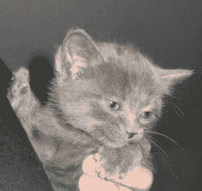

# 如何解决图像重叠问题

> 原文：<https://levelup.gitconnected.com/how-to-approach-image-overlay-problems-ad2d4a8e22bc>

每个图像都有三个通道:R、G、B，即红色、绿色和蓝色，用于定义图像中任意点的像素值，其中红色、绿色或蓝色的值介于 0-255 之间。

例如:`[255, 0, 0]`的像素值将全部是红色，而`[255, 255, 0]`将是红色和绿色的混合，这给出了黄色。

但是，如果使用 OpenCV 读取图像，它会生成 BGR 格式的图像，也就是说，`[255, 0, 0]`会是蓝色等等。

# **安装 OpenCV**

OpenCV 是一个用于 Python 或 C 语言图像操作的开源库。

对于 Python OpenCV 可以使用`pip install opencv-python`下载。

# **在 OpenCV 中读取图像**

使用`cv2.imread()`命令可以在 opencv 中读取任何图像。不过 OpenCV 还不支持 HEIC 图片，你可能要用 Pillow 之类的另一个库来读取 HEIC 图片(或者转换成。JPEG 优先)。

```
import cv2image = cv2.imread(‘image.jpg’)
```

读取图像后，如果需要，可以使用`cv2.cvtColor()`命令将其从 BGR 转换为 RGB 格式。

```
image_rgb = cv2.cvtColor(image, cv2.COLOR_BGR2RGB)image_gray = cv2.cvtColor(image, cv2.COLOR_BGR2GRAY)
```

# **覆盖图**

图像只不过是以类似矩阵的格式存储的一堆像素值。任何像素的值都可以独立于其他像素而改变。

假设有一个图像



图片 _1

使用 opencv 读取图像:

```
image_1 = cv2.imread(‘image_1.jpg’)print(image_1)
```

这给出了矩阵形式的一堆像素值。

```
array([[[107, 108, 106],[107, 108, 106],[107, 108, 106],…,[ 77, 78, 76],[ 77, 78, 76],[ 76, 77, 75]],…,[[ 93, 88, 87],[ 93, 88, 87],[ 92, 87, 86],…,[ 52, 62, 62],[ 52, 62, 62],[ 52, 62, 62]]], dtype=uint8)
```

如果你只是改变图像的某个区域的像素值，比如说`[0, 0, 0]`，图像的那个区域就会变成黑色，因为那是黑色的像素值。类似地，如果您将像素值更改为`[255, 0, 0]`，该区域将变成蓝色(OpenCV 读取 BGR 格式的图像)。

```
image_1[50: 100, 50:100] = [255, 0, 0]
```


类似地，这些像素值可以被另一个图像替换，只需使用该图像的像素值。

为此，您必须将叠加图像的形状调整为您想要替换其像素值的大小。

这可以通过使用`cv2.resize()`功能来完成。

```
image_2 = cv2.imread(‘image_2.jpg’)resized_image_2 = cv2.resize(image_2, dsize=(100, 100))
```

这里，`dsize`接受图像要调整的尺寸

现在，第二个图像可以覆盖在第一个图像的顶部。

```
image_1[50:150, 50:150] = resized_image_2
```


# **叠加 PNG 图像**

与 JPEG 图像不同，PNG(便携式网络图形)图像中也可以有第四个通道，它定义给定像素的 ALPHA(不透明度)。

除非另有说明，OpenCV 读取 png 的方式与读取 JPEGs 的方式相同(即有 3 个通道)。

要读取带有 Alpha 值的 PNG 图像，我们需要在读取图像时指定标志`cv2.IMREAD_UNCHANGED` 。

现在，图像阅读器有 4 个频道:BGRA。

```
image_3 = cv2.imread(‘image_3.png’, cv2.IMREAD_UNCHANGED)print(image_3)array([[[0 0 0 0][0 0 0 0][0 0 0 0]…[0 0 0 0][0 0 0 0][0 0 0 0]]…[[0 0 0 0][0 0 0 0][0 0 0 0]…[0 0 0 0][0 0 0 0][0 0 0 0]]], dtype=uint8)
```

(*** *注:*** 打印的值都是 0，因为图像的开始和结束都是空白的)


然而，这个图像有 4 个通道，但我们的 JPEG 图像只有 3 个通道，所以这些值不能简单地被替换。

我们需要在我们的 JPEG 图像中添加一个虚拟通道。

为此，我们将使用一个`numpy`。可以使用`pip install numpy`安装。

numpy 提供了一个函数`numpy.dstack()`来沿着深度方向堆叠值。

首先，我们需要一个与图像大小相同的虚拟数组。

为了创建一个虚拟通道，我们可以使用`numpy.ones()`函数来创建一个数组。

```
import numpy as npones = np.ones((image_1.shape[0], image_1.shape[1]))*255image_1 = np.dstack([image_1, ones])
```

我们将 1 的数组乘以 255，因为 alpha 通道的值也存在于 0-255 之间。

现在，您可以用 PNG 图像替换图像的像素值。

```
image_1[150:250, 150:250] = image_3
```

然而，它不会给出想要的结果，因为我们也改变了阿尔法通道的值为零。


我们只需要替换那些具有非零值的像素值。

要做到这一点，你总是可以通过检查每个像素值并替换非零值来强行完成，但这很耗时。

所以，有更好的办法。

您可以获取要覆盖的图像的 alpha 值。

```
alpha_image_3 = image_3[:, :, 3] / 255.0
```

我们将像素值除以 255.0，以便将值保持在 0-1 之间。

`image_1`和`image_3`的 alpha 之和需要等于 255。

因此，您可以创建另一个数组，其中包含所需的 alpha 值，以使总和等于 255。

`alpha_image = 1 — alpha_image_3`

现在，您可以简单地将每个图像的每个通道的 alpha 值和图像像素值按元素进行乘积，并对它们求和。

```
for c in range(0, 3): image_1[150:250, 150:250, c] = ((alpha_image*image_1[150:250,      150:250, c]) + (alpha_image_3*image_3[:, :, c]))
```


瞧啊。图像现在已经覆盖在另一个之上。ez pz:)

[](https://skilled.dev) [## 编写面试问题

### 一个完整的平台，在这里我会教你找到下一份工作所需的一切，以及…

技术开发](https://skilled.dev)