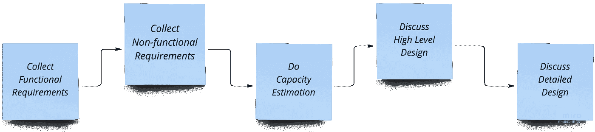

# 我是如何与亚马逊和微软进行系统设计面试的？

> 原文：<https://levelup.gitconnected.com/how-to-approach-system-design-interviews-c272996bdfaa>

> 当谈到设计软件系统时，有多种工具、技术和原则，但这里我们将只关注如何 ***接近*** 系统设计面试。考虑到一个人的经验和知识，有很多方法可以接近系统设计面试，下面是帮助我通过亚马逊和微软的 **SDE-2 和 L-61** 面试的步骤。

仔细听问题，有时它只是一句话，你需要弄清楚接下来的细节，从收集受访者的要求开始，不要在这里着急，在这里花大量的时间。

**系统设计步骤**

## **1。功能需求(系统是做什么的？)**

> 成为用户

尝试从用户的角度或者从将使用该系统的另一个技术团队的角度收集一组特性。在收集功能需求时，您可以询问/思考以下问题。

1.  我们将要支持的功能集是什么？
2.  用户将执行什么操作？
3.  对于每个用户交互，系统的输入和输出是什么？
4.  谁是数据的消费者？(用户/其他技术团队)

## **2。非功能性需求(系统质量？)**

> 获取一些统计数据

从技术角度看系统。

借助以下参数考虑系统的**规模:**

1.  许多主动/被动/主动用户。
2.  每秒的请求/查询数(RPS/QPS)。
3.  请求的增长率。

然后借助以下问题，尝试找出系统的**质量**。

1.我们需要一个一致的、高度可用的或分区容忍的系统吗？我们能妥协什么？可用性有多少个 9？(上限定理)

2.是实时系统还是异步系统？

3.预期的延迟/响应时间/吞吐量是多少？

## 3.容量估算(系统有多大？)

> 做一些基础数学

您可以对所需的系统资源进行粗略的计算

1.  什么是存储和内存要求？
2.  需要什么样的工程努力和资金？

通常，我不会在这上面花太多时间，但是一定要和你的受访者核实一下他想走多远。

## 4.高层设计(系统看起来怎么样？)

安德鲁·乔治在 [Unsplash](https://unsplash.com?utm_source=medium&utm_medium=referral) 上的照片

> 画一些菱形、正方形、圆形和箭头。
> 
> 讨论取舍和瓶颈，选择其中一个。

是时候从底层开始设计功能了，你可以开始讨论

1.  数据将如何进入系统，你将如何处理数据，你将在哪里存储数据？
2.  谈论数据将如何走出系统。
3.  使用哪个数据库？SQL/NoSQL，为什么？如果 NoSQL 是哪个 NoSQL？
4.  有什么数据热点吗？我们需要缓存数据吗？你的缓存策略是什么？
5.  排队能为你解决一些问题吗？
6.  需要限速吗？
7.  有哪些不同类型的负载平衡器(LB)和负载平衡策略？你会选择哪一个，为什么？
8.  谈论网络协议。

讨论您将如何**扩展您系统的每个组件:**

1.  如何在 SQL/NoSQL 上扩展读写？你的主键是什么？分区键？聚类键？复制策略？
2.  你将如何划分读写和处理分片？
3.  您将如何扩展分布式缓存中的读/写操作？
4.  谁是分布式队列的生产者和消费者？它是如何扩展的？

## 5.详细设计(什么是系统？)

> **拼出来**

您可能会被要求使用相应的查询来详细设计表和 API，请在以下问题的帮助下完成

1.  你的数据库表、列、文档结构、键和索引是什么？
2.  定义你的 API，请求-响应结构看起来像什么？
3.  你的类、对象和交互看起来如何，比如低层设计？

> 确保您的系统满足所有收集到的特性需求，并且您已经讨论了设计系统的权衡和瓶颈。

## 如果时间允许的话

您可以围绕以下问题展开讨论:

1.  认证和授权机制
2.  日志分析系统
3.  监控/绩效衡量
4.  分析和报告
5.  成本/开发时间/技术堆栈

> 练习是关键！

# 分级编码

感谢您成为我们社区的一员！在你离开之前:

*   👏为故事鼓掌，跟着作者走👉
*   📰查看更多内容请参见[升级编码刊物](https://levelup.gitconnected.com/?utm_source=pub&utm_medium=post)
*   🔔关注我们:[Twitter](https://twitter.com/gitconnected)|[LinkedIn](https://www.linkedin.com/company/gitconnected)|[时事通讯](https://newsletter.levelup.dev)

🚀👉 [**加入升级人才集体，找到一份神奇的工作**](https://jobs.levelup.dev/talent/welcome?referral=true)