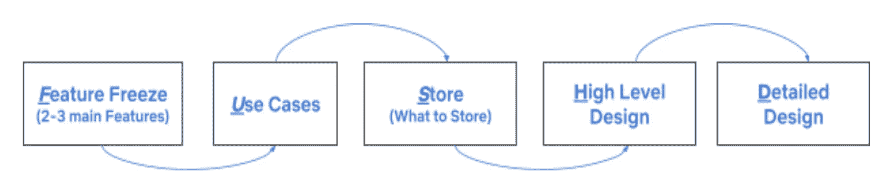

# 如何在 45 分钟内进行系统设计面试

> 原文：<https://levelup.gitconnected.com/how-to-approach-system-design-interviews-in-45-minutes-fdb0285f8185>

在深入挖掘之前，我想分享一下我为什么要写这篇文章..

我在网飞做高级软件工程师(后台)。在此之前，我在易贝、高盛和美洲银行担任后端系统的软件工程师。系统设计面试是每个面试周期的一部分，无论是初级职位、中介还是大公司或小公司的高级职位。我自己在设计面试中苦苦挣扎，觉得自己到处都是，无法在 45 分钟内拿出一个单一的流程设计，这是我开始与我周围的导师和朋友谈论如何在 45 分钟内解决一个需要 100 多名工程师几年才能解决的问题。在阅读了几篇设计访谈文章和书籍，并接受和接受了几次采访后，我想出了处理这个问题的策略，并开始与朋友和学员分享，他们也发现这很有用，因此写了这篇文章。我们大多数人都熟悉设计的技术方面，但缺乏在 45 分钟内构建或框定一个完整(非对错)解决方案的能力。我将专注于如何以最有效和高效的方式及时构建问题。出于显而易见的原因，我将主要关注后端设计😉

我会把我的帖子分成以下几个部分:

*   软技能技巧
*   如何划分 45 分钟

## **🤖软技能提示:**

*   ***仔细听，不要急于在脑海中设计:*** 通常当面试官还在解释问题时，我们就开始提前思考，并试图将它与你过去可能做过的事情联系起来——无论是在你的工作中还是在学校项目中，或者是在准备面试时阅读。虽然你已经有了一个好的开始，但往往会错过面试官在思考时给出的重要提示/指示。因此，*始终认真倾听，记下他/她/他们提到的所有关键特征*。
*   ***如果你不知道领域* :** 没有人能知道一切，这完全没问题。有一次，我被要求根据酒精和用户喜欢的口味设计一款鸡尾酒配方应用程序。我从未探索过这个地区，所以我完全迷路了。我内心很恐慌，但努力表现得像正常人一样。几分钟后，我告诉采访者我对鸡尾酒不太熟悉，我们都笑了。然而，我喜欢烹饪，我试着将它与我知道的东西相关联，即设计一个应用程序，根据可用的食材生成食谱。所以，如果你不知道这个领域，试着用你所知道的去联系，让面试官提前知道。通常面试官是有帮助的。
*   ***展示你所拥有的技能和知识，而不是弄清楚面试官在看你什么:*** 这些面试最棒的一点就是没有对错之分。这些面试是为了让面试官了解你对设计一个系统了解多少，你在理解模糊需求和找到出路方面有多努力，这在现实世界中经常发生。当你在高压环境下第一次与某人见面时，你很可能弄不清楚面试官想要什么。😊。但是，如果面试官在前面提到，例如他/她/他们有兴趣知道你将如何进行缓存/分布式缓存，那么你就有了关注点的线索。*所以，专注于展示你解决问题的知识，而不是弄清楚该关注什么，因为面试官可能在寻找 XYZ 技能。*
*   ***在上下文*** 中对琐碎的流程使用黑盒技术:一旦你对需求有了清晰的认识，并有了关注哪些服务的计划，就不要去设计可能需要交互的每个服务。只花时间设计主要服务。如果时间允许，稍后再回到琐碎的服务上来。例如，如果你正在设计一个家具店的买家体验，不要花时间设计一个支付处理器来完成结账过程。取而代之的是放一个盒子，贴上支付处理器的标签，它接收信用卡信息、客户详细信息来执行支付。支付处理平台本身可以是一个系统设计问题。同样，这并不意味着你把一堆盒子放在设计图中，然后就称之为完成..😉*因此，不要设计将成为交互一部分的每一个服务，使用黑盒来表示上下文中的琐碎服务。*
*   告诉面试官你的选择时，一定要权衡利弊:仅仅告诉面试官你的选择并不总是足够的。因此，在面试官进一步问你问题之前，提出权衡和任何其他让你选择 A 而不是 b 的背景是一个好的做法。这也显示了理解的深度，而不仅仅是侥幸或随机选择。所以，不要等着面试官质疑你的选择，解释原因，讨论你考虑过的其他方法的利弊。

## 🕒**如何划分 45 分钟..**

我们大多数人面临的主要挑战之一是如何有效地管理我们的时间，以便我们能够提出最有效的解决方案。以下是我通常如何分配我的时间。我使用 **FUSH'D** 技术(只是编出来的，不认为这种东西在任何地方存在😋).下图显示了它的含义。

FUSH 技术

让我们看看我通常在这些事情上花了多少时间。所有的时间都是大概的时间，在某些情况下可能会有所不同，但是，我发现这个分解非常有效。

**F** : *特征冻结* : 5 分钟(约。) :利用前 5 分钟时间提出澄清性问题，并尝试冻结 2-3 个(或更多，取决于上下文)您正在尝试设计的功能。例如:如果你正在设计一个在线家具店，你可以考虑以下功能:

*   购买/结账家具
*   根据不同类别和标签(颜色、材料、尺寸)搜索家具
*   愿望清单/保存以备后用
*   用户配置文件(通常这对于大多数应用程序来说是常见的)

对这些功能进行第一次测试，并建议更多的增强功能，如:定制、交付跟踪、使用 AR 的 3D 可视化等。请注意，这些东西可能需要更多的时间来钻研。面试官可能会要求选择一个听起来更有趣的增强功能。此外，如果你认为某件事与你过去的经历有关，或者你对某件事很有信心，现在是时候把它包括进来了。

**U** : *用例*:5-6 分钟(大约。) :对于您在上一步中锁定的每个功能，提出使用案例。一定要包括负面的用例，并强调你的系统不能明确解决的问题。您可以讨论选择特定用例的权衡/偏好。花些时间计算流量模式、每秒呼叫数、预期 SLA 等。

**S** : *存储* : 3 分钟(约。) :根据使用案例和场景，决定您将存储什么。与家具用例一样，您需要存储库存——商品 id、价格、数量。用户愿望列表中项目的状态、用户信息等。此外，根据目标受众检查您最终将存储的数据量，并对您的数据存储进行估计。为将来的扩展和成长敞开大门。

**H** : *高层系统设计* : 7 分钟(约。):这是问题的灵魂。提出各种组件/服务，并根据用例及特性定义它们之间的高级交互。还包括最终用户将如何与系统交互，是 api 端点、Web UI、移动应用程序等。弄清楚数据库交互会是什么样子，你会使用任何排队机制来排队任何请求。您可以从一个小系统开始，以后再进行扩展。这也是讨论如何高效快速地提供响应的恰当时机，您是否需要缓存，是浏览器缓存、memcached 等，以及它们之间的权衡(在详细设计部分深入讨论)。这些讨论将显示你对设计中所意识到和考虑的不同方面的理解深度。(PS:仅仅使用术语是不够的，您还应该有适当的理解..)

**D** : *详细设计* : 20 分钟(约。) :这是我大部分时间会呆的地方。我通常将这一部分进一步划分如下:

*   7 分钟:API 和交互:从为各种用例定义 API 开始，定义 POJOs。您可以使用微服务架构，并为某些功能定义特定的微服务。考虑如何提高 SLA 和响应时间。一些面试官可能会要求你定义类、关系，或者为某个用例编写一个小函数。接受它..
*   5 分钟:数据库设计、SQL/非 SQL 数据存储等。面试官可能会要求你在这里写一些 SQL 查询。准备好用可靠的理由来证明你的选择。CAP 理论在决定为哪种用例选择哪种数据库时经常会派上用场。
*   7 分钟:可扩展性。大多数面试官都想知道你的解决方案有多大的可扩展性。在这里，您将采取各种措施来调整和优化您的响应。您将如何进行负载平衡，以确保在其他服务器闲置时，一台服务器不会因大量请求而过载。您将如何分配请求和数据(数据分片)，是基于地理位置、基于关键字还是基于哈希等？你可以使用什么样的缓存解决方案。经常出现的一个重要问题是，当数据变得非常大时，你会怎么做？您将如何截断或归档可能不经常需要的数据，等等。您还可以了解缓存解决方案以及如何刷新缓存、确保缓存的一致性或可用性等。
    准备好大量的交叉提问，特别是在这一部分，因为面试官不仅想测试你在概念方面的知识，还想知道你对市场上现有解决方案的熟悉程度。这些讨论也是为了检验你的沟通能力、气质、说服力等。

这基本上概括了我将如何花掉面试的 40 分钟，留下 5 分钟做介绍/提问等。

这是我的第一篇博文，感谢我的朋友们审阅了这篇博文，增强了我发表这篇博文的信心！请随时通过 LinkedIn 与我联系。