# 如何在运行时将 Cinemachine 大脑分配给时间轴定向器？

> 原文：<https://levelup.gitconnected.com/how-to-assign-a-cinemachine-brain-to-timeline-director-at-runtime-bea882d1af6f>

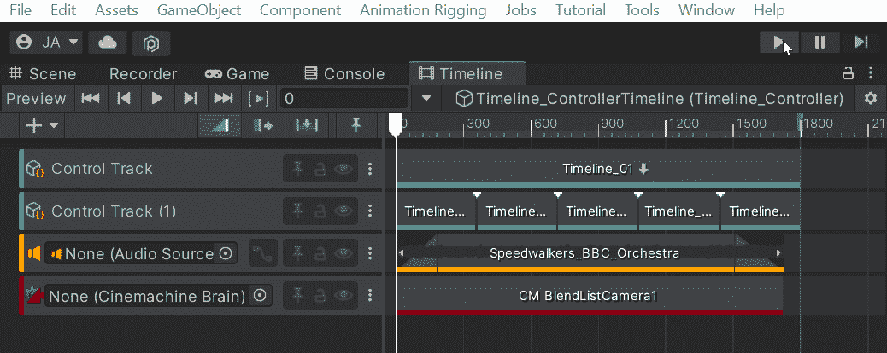

如果你是 *Unity* 的狂热 *Cinemachine* 用户，你就会知道这个工具对于相机系统来说是多么强大。这个相机系统的主要核心是 *Cinemachine Brain* 组件，它连接到场景中的*主相机*。*时间线*中的 *Cinemachine 轨道*需要*主摄像机*对象，以及附加的大脑*脚本*，被*分配*并绑定到它，以便*时间线*中的任何*虚拟摄像机*进行*控制*。虽然这很容易通过拖放分配来解决，但是您可能会遇到这样的情况:您希望在运行时*交换摄像机*或者在开始时*分配*它们，所以让我们开始编码吧！

我在一个叫做*时间轴控制器*的*游戏对象*上有一个*时间轴控制器*。

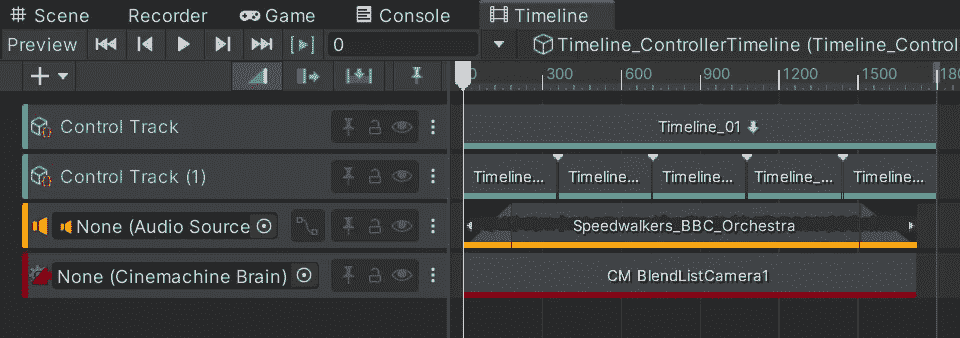

为了让这个*混合列表虚拟摄像机*在电影播放时接管*主摄像机*，这里的*电影轨道*需要作为*主摄像机*的*分配。它在寻找那个 *Cinemachine Brain* 脚本组件。*

虽然您可以将*主摄像机*对象拖放到这里，这里显示 *"None"* ，但我将在*脚本*中为*分配*对象。

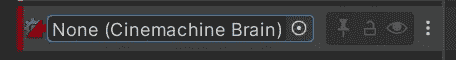

这里需要注意的一点是你的*相机*的*拼写*。在这个例子中，我正在搜索*字符串*主摄像机的名称，但是你的默认摄像机可能有一个空格*(主摄像机)*。

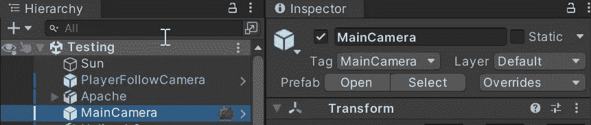

你的*主摄像头*也需要 *Cinemachine Brain* 组件。

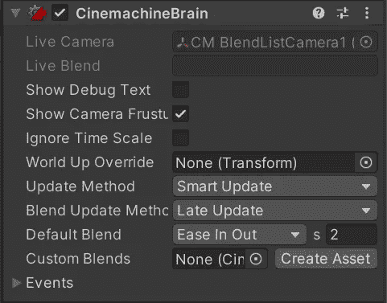

我创建了一个*脚本*来测试这个叫做 *AssignCam* 的脚本。

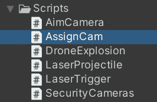

我将 *AssignCam* 脚本放在 *Timeline_Controller* 对象上。

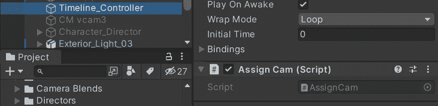

*AssignCam* 类将需要*名称空间*用于 *UnityEngine。可播放的*、*时间线*和 *Cinemachine* 。

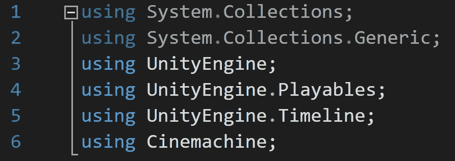

创建两个*变量*来存储你的*可玩导演*和 *Cinemachine 大脑*。

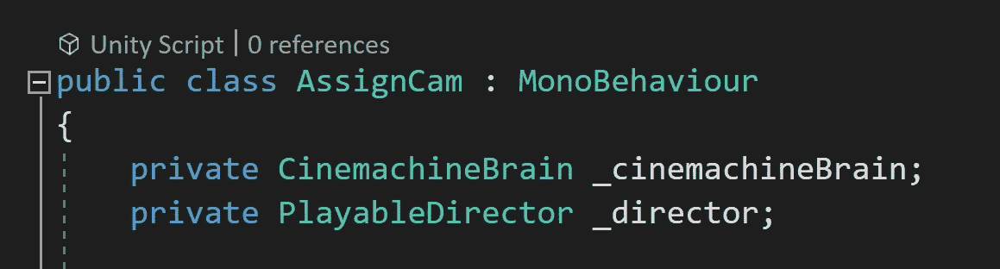

都使用 *GameObject。找到*通过*字符串名称*寻找各自的对象，得到需要的组件。然后调用*方法*将大脑绑定到时间轴。

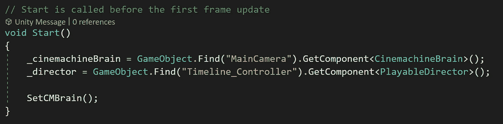

声明一个*局部变量*来存储一个*时间线集合*。它对我们的*可玩导演* *变量*进行*赋值*，然后使用*点符号*访问*可玩资产*。 *as* 关键字用于*将*可玩资产*转换为*时间线资产*。另一个本地*变量*用于存储上述*可播放资产*上的*输出轨迹*。因为我们使用了适当的*名称空间*，所以可以调用 *GetOutputTracks* 方法。 *foreach* 循环遍历*可播放控制器*上的所有*输出轨道*。如果通过字符串名称找到 *Cinemachine 轨道*，则声明 *director* 变量，并调用 *SetGenericBinding* 方法。这个方法需要一个*轨道*和一个*大脑*，所以这是我们传入之前找到的 *cinemachine brain* 变量的地方。*

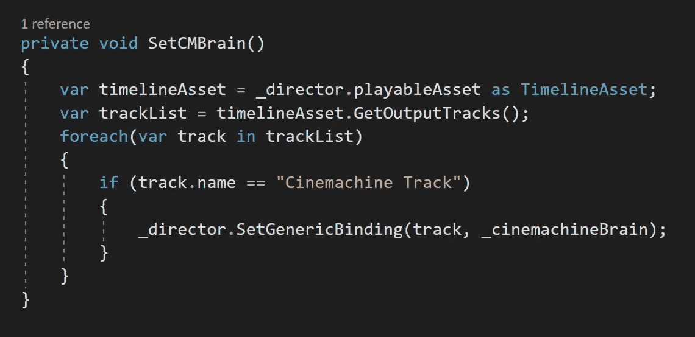

现在当我*开始*游戏时，*主摄像机*被*分配*到*时间线导演*中的适当位置。

感谢阅读！