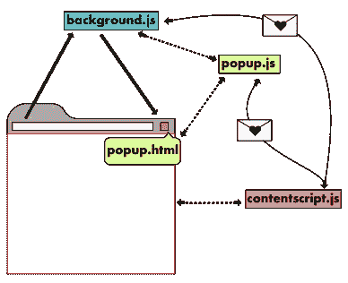

# 如何用 Chrome 扩展自动化枯燥的东西

> 原文：<https://levelup.gitconnected.com/how-to-automate-boring-stuff-with-chrome-extensions-9d2dc268bb9a>

照片由[米切尔罗](https://unsplash.com/@mitchel3uo?utm_source=medium&utm_medium=referral)在 [Unsplash](https://unsplash.com?utm_source=medium&utm_medium=referral)

复制...粘贴……复制……粘贴……浪费了几分钟，甚至几个小时在线比较报价。我们都经历过，对吗？我心想，如果有一些工具来比较另一个网站上的价格…我在这里，几天后与一个全新的 chrome 扩展！

我想描述一下我在这个项目中的经历，我对它的感受，以及我是否会创造另一个项目。希望在这篇文章之后，你会对 chrome 扩展有一个很好的了解。

# 非常简短的介绍

Chrome extension 是一个为您的浏览器提供附加功能的小程序。它是由 HTML、CSS 和 JavaScript 组成的。构建 chrome 扩展最重要的一步是创建 manifest.json，其中包含关于项目的所有信息，例如名称、描述、文件和权限。扩展能够操作 DOM、发送请求、收集数据、搜索互联网等等。令人难以置信的是，一个好的扩展会如此有用。看看最流行的例子，比如 [Adblock 加](https://chrome.google.com/webstore/detail/adblock-plus-free-ad-bloc/cfhdojbkjhnklbpkdaibdccddilifddb)、 [Honey](https://chrome.google.com/webstore/detail/honey/bmnlcjabgnpnenekpadlanbbkooimhnj) 或[语法上的](https://chrome.google.com/webstore/detail/grammarly-for-chrome/kbfnbcaeplbcioakkpcpgfkobkghlhen?hl=en)。

现在让我们来看看扩展的一般结构:

[https://developer.chrome.com/extensions/overview](https://developer.chrome.com/extensions/overview)

基本上，您的应用程序可以在 3 个“环境”中执行脚本。

*   popup.js 包含打开弹出窗口时将执行的脚本
*   js 负责所有应该在后台发生的事情(很明显)
*   contentscript.js 允许您与网站 DOM 交互

值得一提的是，contentscript.js 只能通过消息与 popup.js 和 background.js 进行通信。这就是为什么我们有上图中的那些字母。

现在让我们进入实际项目！

我们的目标是:创建一个 chrome 扩展，使在我国最大的电子网站上搜索产品的过程自动化，并呈现我当前正在查看的产品的结果。

我从建立一个简单的 manifest.json 开始，在这里我定义了所有需要的文件和权限。

我准备好了，整个结构都准备好了，几分钟后，我遇到了一个…问题…

如何在一个网站上找到产品名称？😧

幸运的是，我记得一个好的 SEO 实践是将最相关的信息放在 ***< h1 >*** 标签中，这正是我找到我的产品名称的地方！当然，它并不适用于每一个网站，但是，对于我的目的来说已经足够了。

好吧，下一步，在外部网站上搜索数据，然后发送到扩展。对于所有与谷歌浏览器的交互，我们将使用[浏览器 API](https://developer.chrome.com/extensions/api_index) 。在这个例子中，我跳过了获取数据的部分，因为这是不相关的(而且有点笨拙……)

现在让我们看一下 background.js，它所做的只是监听消息并将传入的数据保存在存储器中。

现在是最后一部分 popup.js 和 popup.js。最后一步是使用 chrome API 加载数据并填充弹出窗口。

完成了。

或者，是吗？

原来我搜索的一个网站是一个单页应用程序。因此，当我被重定向时，我的内容脚本没有再次运行...幸运的是，凭借 [StackOverflow](https://stackoverflow.com/) 向导的智慧，我通过查看 URL 的变化迅速处理了这个问题。我只需要添加这些行:

background.js 简单更改监听器

如果收到来自 background.js 的消息，则获取数据

现在已经完成了。😅

# 最后的想法

这个扩展为我节省了大量时间吗？没有…至少还没有，因为我花了一段时间来创作。

这值得吗？是啊！

我学到了新的东西，获得了新的知识。如果我不得不解决一些更耗时的问题，并且该解决方案可以被许多人使用，那将是非常有用的。

谁知道也许有一天你会将这些知识用于某个伟大的目的呢？