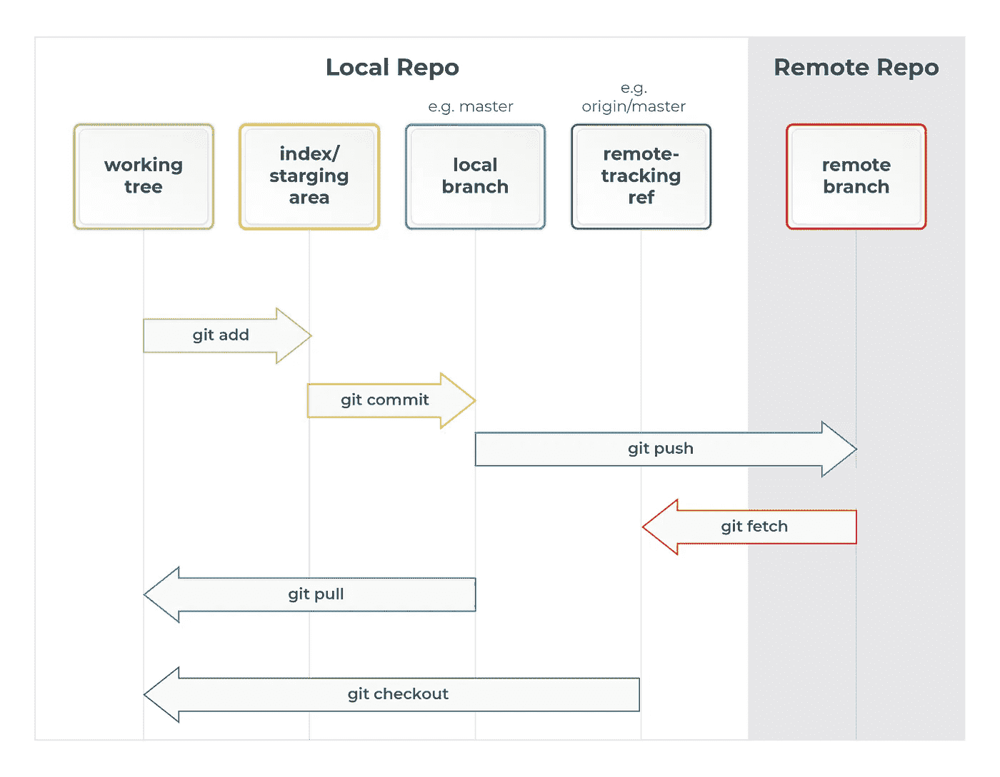
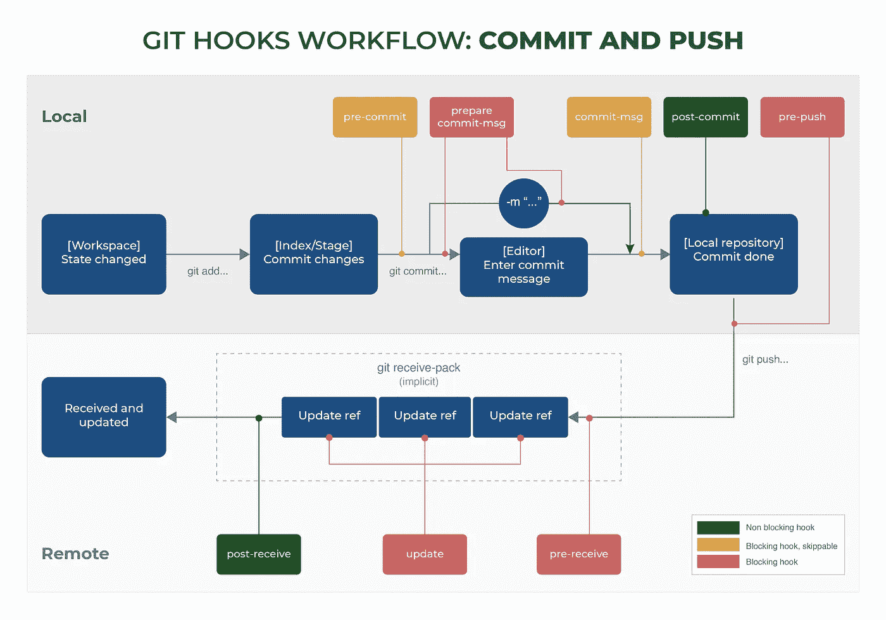
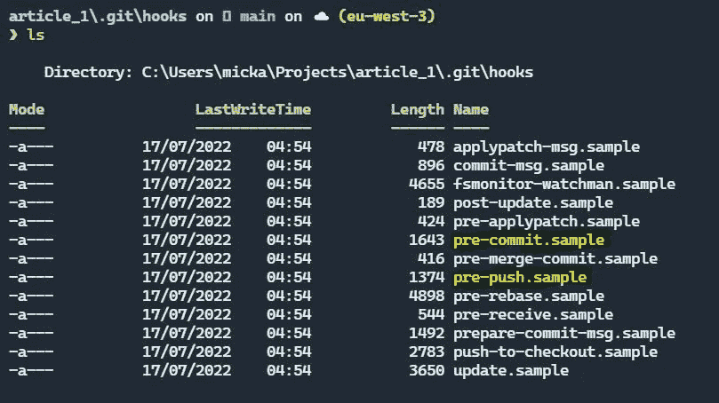
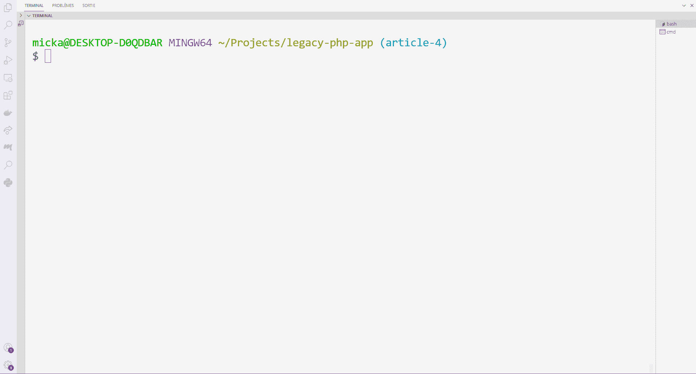

# 如何用 Git 管理代码质量

> 原文：<https://levelup.gitconnected.com/how-to-automate-code-quality-checks-with-git-hooks-8cf3e3ef383e>

## 在提交或推动工作之前，学习如何自动化工具的执行

> 在本文中，我假设您有一个用 Git 版本控制的项目。我将提醒你**提交**、**发布**和**拉动**一个分支的历史的概念。

为了控制软件项目的质量，您应该使用工具来检查语法或运行测试。

在 PHP 生态系统中，除了 [PHPUnit](https://phpunit.de/documentation.html) 之外，你还可以使用类似 [PHPStan](https://phpstan.org/user-guide/getting-started) 的工具来检查你的代码质量。和其他同等的工具。

通过**配置 Git** ，您将永远提高项目的质量。

您将学习如何**防止提交质量差的代码**。


Git 历史由 [Yancy Min](https://unsplash.com/@yancymin?utm_source=medium&utm_medium=referral)

## 两分钟后出发

Git 是一个允许将一组修改关联到消息的系统。Git 将所有这些操作——或者说**提交**——保存在历史中。我们可以把它想象成一本记录一个软件项目运作的账本。

然后，一个 git **分支**对应于主项目的一个替代版本。开发人员可以在不干扰其他团队成员工作的情况下开发新功能。

然后，他们将把项目的两个版本合并成一个。

然后，他们在 Git 服务器上部署(或**推送**)新的项目版本。此时，每个人都可以检索到最新的可用版本。

当您请求 Git 服务器上的最新更改时，您正在执行**拉**操作。

> 换句话说，您检索的是最新版本的图书帐户。



演职员表:[米凯尔·安德烈](https://medium.com/@mickael-andrieu/)

您可能不知道**可以在它们之间执行操作**。

> 您可以挂接到这些 Git 操作之一，并触发您的操作。

*   如果你在 Git 操作的之前挂接**，这是一个 **pre** 挂接。**
*   如果你在 Git 操作的之后挂钩**，这是一个 **post** 挂钩。**

## 什么是 Git Hook？

假设你来自 WordPress 或者 PrestaShop 生态系统。

在这种情况下，这个概念已经和你说话了。

> Git 挂钩**是贯穿每个可能的动作**的生命周期“传播”的事件。

如果您是前端开发人员，您的 web 页面的 DOM 中也有类似的事件系统！

考虑一个经典的操作:您想要进行更改并部署到 Git 服务器。下面是一个总结了可用挂钩的模式:



图式由[作者](https://medium.com/@mickael-andrieu/)创建

当您执行一条指令时，Git 将分派钩子并执行指令(如果有的话)。

**当你完成一个动作时，Git 分派钩子并执行指令。**

你感兴趣的是有钩子挡住了(黄色和红色)。如果指令返回错误代码:

*   **预提交**钩子将停止提交的创建；
*   **预推**钩子将阻止在 Git 服务器上部署分支；

> 这对你来说是个好消息！现在，如果您在项目中引入了一个 bug，就会有返回错误代码的指令！

最后，选择是否拒绝提交，在这种情况下，每次提交都是有质量的。

换句话说:

*   您应该在每次创建提交时测试质量吗？
*   或者当你推你的树枝的时候？

第一种解决方案有时**很痛苦，但会形成**，而第二种是**在你的日常事务中更加宽容**。如果您使用[原子提交](https://dev.to/cbillowes/why-i-create-atomic-commits-in-git-kfi)，我推荐第二种方法。

## 如何触发 Git 挂钩

您的项目包含一个名为**的文件夹。在你的代码编辑器或操作系统可能隐藏的根目录下。你会在**中找到。git/hooks** 子文件夹每个 git 挂钩的示例脚本列表:**



所有示例文件都有扩展名。样品

只需**删除文件扩展名**或复制文件并重命名即可:

该文件包含一个您可以删除的示例。

然后，您使用操作**修改创建的文件，以运行您的“测试套件”**。假设您正在使用 PHPUnit:

你可以用一个**钩子让反馈**结果更加明显和有用。

有关启用颜色的预提交操作，请参见以下脚本:

您需要 Bash 的基础知识来改进这个脚本。

你必须修改文件，添加修改，并提交一些东西来触发脚本。

这是我的一个项目的例子(gif 格式):



哎呀！我必须先解决这些问题，然后才能“提交”我的工作⛔

## 如果我需要提交怎么办？🤔

虽然我**劝阻**你不要违反你制定的规则，但你可以**阻止钩子的传播。**

您需要在 git 命令的参数列表中添加“ **no-verify** ”:

```
git commit . -m 'Will ignore pre-commit hook' --no-verify
```

这篇文章现在完成了！我希望它对你有帮助🙏

> 您可以重用我在文章中分享的脚本，并根据您的需要进行修改。

最后，如果你有任何问题或者改进的建议，不要犹豫，在评论区告诉我。

如果你喜欢这篇文章，[关注我](https://medium.com/@mickael-andrieu/)，我会在发布以后的文章时通知你！

[](https://medium.com/@mickael-andrieu/membership) [## 通过我的推荐链接加入 Medium-mickal Andrieu

### 作为一个媒体会员，你的会员费的一部分会给你阅读的作家，你可以完全接触到每一个故事…

medium.com](https://medium.com/@mickael-andrieu/membership)