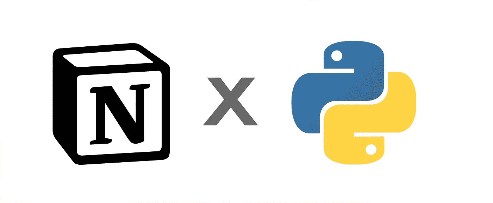
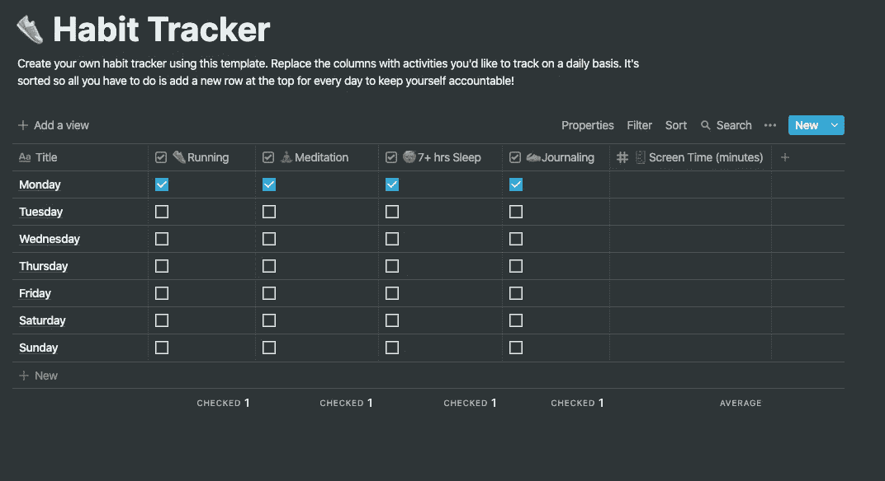
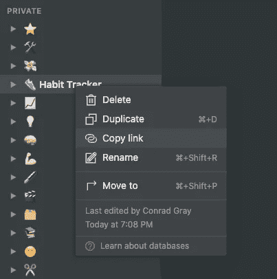

# 如何用 Python 自动化概念

> 原文：<https://levelup.gitconnected.com/how-to-automate-notion-with-python-6fa5288ad830>



我喜欢[概念](https://www.notion.so/)。

在我发现 ideas 之前，我所有的笔记、项目、进度跟踪和想法都分散在不同的地方。真是一团糟。

观念把一切都带到了一个地方。每个项目，每个想法，我所有的笔记现在都在一个地方。我可以看到所有应用程序—我不需要在多个应用程序之间切换。我可以互相链接和引用。观念简化了我的工作流程，并以一种我不知道的方式改进了它。

我也喜欢自动化。我是那种宁愿花一两个晚上写脚本来自动化枯燥的重复任务，也不愿一遍又一遍地做的人。

带着这种心态，我审视了我在 ideal 中创建的工作流，并试图找到一种自动化它们的方法。

截至 2020 年 11 月底，idea 没有任何可用的公共 API。[计费页面](https://www.notion.so/pricing)称内容 API 已在路线图中，将仅适用于付费账户。什么概念的团队没有说的是，我们什么时候可以期待官方 API 发布。

幸运的是，我们现在可以使用[概念-py](https://github.com/jamalex/notion-py) 包。

opinion-py 是 opinion 的非官方 Python 客户端。在幕后，它使用[请求](https://pypi.org/project/requests/)包以无头模式打开一个网页，并以这种方式获取数据。它也适用于免费和付费账户。

# 让我们自动化概念！

在本文中，我将向您展示一个示例 Python 脚本来自动化一个简单的工作流。我们将使用习惯跟踪器模板，并编写一个脚本来添加一个带有正确格式日期的新行。

在接触 Python 之前，我们先准备一下追踪器。点击左侧栏中的模板，选择[习惯跟踪器](https://www.notion.so/Habit-tracker-60bb4401179745288da937ee44c2e8d0)(可以在个人部分找到)。



这就是我们将要自动化的

我们现在准备好了！让我们安装 idea-py:

```
pip install notion
```

接下来，我们需要我们的认证令牌。它以 cookie 的形式存储在您的浏览器中，我们可以使用 DevTools 获取它。首先，在浏览器中打开你的概念空间——进入[概念. so](https://www.notion.so/) 并登录你的账户。

然后打开 DevTools(对于 Chrome，在 Mac 上按⌥ +⌘ +I 或者在 Windows 上按 Ctrl+Alt+I)，进入应用程序选项卡，从左侧栏选择 cookies，搜索`token_v2`。将这个 cookie 的值复制并保存到某个地方——idea-py 将使用它来访问我们的概念页面。

我们现在已经拥有了与观念相联系的一切。下面的代码创建了 idea-py 客户端，并连接到习惯跟踪器页面。



收藏网址是我们习惯追踪器的网址。你可以从地址栏得到它，或者在左边栏右击它，复制链接。

现在，我们可以开始做一些有趣的事情，比如添加一个新行。

运行完这段代码后，转到习惯跟踪页面，您应该会在那里看到新的一行。您还应该注意到，该行的冥想复选框被选中。以上代码片段中的第二行就是这么做的。创建了一个新行，并给了我们代表它的对象。

opinion-py 提供了对页面(在我们的例子中是行，因为行也是页面)的每个属性的访问。属性名是蛇形的，没有特殊字符。一旦你给这个属性分配了一个新值，idea-py 就会发送一个更新。您可以通过更改屏幕时间值来尝试一下——只要您执行这段代码，概念就会更新。

现在让我们通过在习惯跟踪器中自动格式化新条目的日期来完成我们的脚本:

就这样——我们刚刚创建了一个简单的机器人来自动化 idea 中的工作流！

这仅仅是一个简单的例子，说明了用概念和 Python 可以做些什么。我推荐去看看[idea-py 指南](https://github.com/jamalex/notion-py)——它列出了更多可能的例子。

试着想想你可以用 Python 和 idea-py 做什么——你可以自动化什么，你可以给计算机做哪些重复的任务，这样你就可以专注于对你来说重要的事情。

我希望这篇教程能启发你创建自己的概念机器人。让我知道你创造了什么！