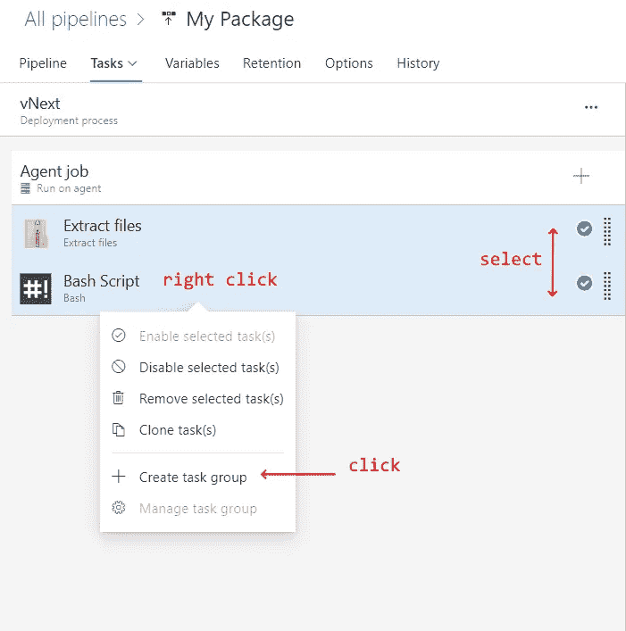

# 如何使用 Azure DevOps 自动发布 NPM 包

> 原文：<https://levelup.gitconnected.com/how-to-automate-npm-package-publishing-with-azure-devops-4919fe68cc96>

照片由 [Yusril Permana ali](https://unsplash.com/@yusrilali?utm_source=unsplash&utm_medium=referral&utm_content=creditCopyText) 在 [Unsplash](https://unsplash.com/s/photos/package-to?utm_source=unsplash&utm_medium=referral&utm_content=creditCopyText) 上拍摄

一步一步的教程。

> 在本教程结束时，您将拥有一个由**合并**到`release/1.0.1`分支触发的发布管道，并且在发布到 NPM 之前只需等待您的**批准**。

让我们假设你有一些托管在 GitHub 上的源代码，并且你想使用 Azure DevOps 将它们发布为 NPM 包。
*无论是*[*GitHub*](https://github.com/join?source_repo=gparlakov%2Fscuri)*还是*[*Azure devo PS*](https://azure.microsoft.com/en-us/services/devops/)*账号都是* ***免费*** *来报名并在开源项目上使用的！*

以下是本文涵盖的高级内容:

*   创建一个由合并到一个`release/*`分支触发的构建管道
*   创建在成功生成管道时触发的发布管道
*   建立一个手动的批准需求，这样您就只发布您批准的内容，也就是说，您可能有多个到您的`release/1.0.0-rc1`分支的合并，所有的合并都触发构建步骤，但是只批准和发布最后一个，其中所有的测试都是绿色的
*   建立预发布发布(vNext 或 beta 通道)和稳定发布发布(vLatest 通道)管道

在本教程结束时，您将拥有一个由**合并**到 release*分支触发的发布管道，并且在发布到 NPM 之前只等待您的**批准**。
* `release/1.0.1`或`release/1.0.1-rc.1`

> 如果您只想要最终的结果，这里的[是构建脚本文件`.yml`和最终](https://github.com/scuri-lib/automate-package-with-azure/blob/master/azure-pipelines.yml)[发布](https://github.com/scuri-lib/automate-package-with-azure/blob/master/My%20Package.json)管道的导出，您可以将其导入(在您已经将[发布任务](https://github.com/scuri-lib/automate-package-with-azure/blob/master/Publish%20to%20NPM_task_group.json)导入到您自己的项目中之后)并进行修改。

您可以看到一个管道[构建](https://dev.azure.com/gparlakov/Scuri/_build?definitionId=6&_a=summary)和[发布](https://dev.azure.com/gparlakov/Scuri/_release?_a=releases&view=mine&definitionId=1)的示例。

循序渐进:

## 步骤 1:授权 Azure 管道

将 Azure Pipelines 添加到 GitHub 应用程序中，这样每当启动 pull 请求和合并 commit(又名 webhooks)时，GitHub 就会告诉 Azure DevOps(又名 AzDO)。 *关于设置的更多细节，请参见* [*这篇文章*](https://itnext.io/are-you-doing-github-checks-9f8b3d6f41a5) 。

当您开始“配置您的管道”时，选择一个“初始管道”:

## 步骤 2:建立管道

在 Azure Dev Ops 中添加/编辑构建管道，如下所示:

这意味着:

1.  仅在合并到名称以`release/`开头的分支时触发此管道，而不是在 PR 上。
    **你可能也想跑公关。如果是这样就去掉* `*pr: none*` *线。我喜欢为拉取请求检查建立一个单独的版本。*
2.  构建使用什么虚拟机—在本例中为`ubuntu-latest`
3.  步骤:

*   安装 deps
*   将你的包打包成一个 npm 包`.tgz`文件
*   发布您的工件(在本例中是`.tgz`文件),以便它可以用于即将到来的发布管道

完成编辑后，选择“保存”(在“保存并运行”按钮下)并提交/打开采购申请:

在这一步之后，您的存储库中应该有一个包含上述内容的`azure-pipelines.yml`文件。它告诉阿兹多该做什么。在存储库中被检查给你控制和历史。对于酷小孩来说，Azure DevOps 显然太长了😁

## 步骤 3:释放管道

让我们创建一个。有多个按钮可以做到这一点:

选择空工单。

选择空工单

让我们将这个阶段命名为 vNext

选择了名字 **vNext** 作为说明:这是要部署预发布版本(即 beta 版本)。这个 vNext 将用标签`next`(或者`beta`、`rc`等发布你的包。)是预发布/beta/vNext 版本，默认情况下`npm install`不会**安装。稍后我们将创建 **vLatest** ，它将发布标签`latest`，这是`npm install`默认选择安装的。点击查看更多关于 NPM 标签[的信息。
示例:
如果您发布了标签为`latest`的`my-lib`版本`1.0.0`和标签为`next`的`1.0.1-rc1`，并且用户发布了`npm i my-lib`，他们将获得`1.0.0`而不是您想要的`1.0.1-rc1`。而`npm i my-lib@next`或`npm i my-lib@1.0.1-rc1`将安装该特定版本，假设用户知道他们在使用预发布版本时所冒的风险。](https://dev.to/andywer/how-to-use-npm-tags-4lla)**

发布是由构建和打包管道的成功触发的吗(即当一个新的工件可用时)
*你知道吗？我们可以手动触发发布，并使用较旧的工件，即一些以前版本的包。*

构建成功后启用释放 VNext 触发器。

确保命名并保存您的管道！

## 步骤 4:用令牌发布到 NPM

现在离开阿兹多，去 NPM 获得**阅读和发布**令牌。参见此处的说明[。](https://docs.npmjs.com/creating-and-viewing-authentication-tokens#creating-tokens-on-the-website)

我们需要令牌来发布我们的包。对于向我们的管道提供 NPM 用户名和密码进行身份验证，这是一个很好的替代方法。可以撤销！
您也可以使用 *CLI* 创建令牌[。这允许您指定允许使用此令牌的 IP 范围*。*](https://docs.npmjs.com/creating-and-viewing-authentication-tokens#creating-tokens-with-the-cli)

## 创建环境变量组

现在回到 AzDo，创建一个发布管道环境**变量**组，我们将在所有的发布阶段使用它——vNext 和 vLatest。

创建一个 release pipeline 环境变量，使其成为一个 **secret** 变量，并将令牌存储在其中:

粘贴您的令牌，并使其成为秘密。

将其设为秘密将使其不被输出，因此即使对于公共管道也是安全的。像[这个](https://dev.azure.com/gparlakov/Scuri/_releaseProgress?_a=release-environment-logs&releaseId=58&environmentId=87)就是。

将环境组链接到版本。否则，*令牌*变量将不可用(类似于失败释放[中的](https://dev.azure.com/scurilib/scurilib/_releaseProgress?_a=release-environment-logs&releaseId=2&environmentId=2)):

## 步骤 5:定制 vNext 发布管道

现在让我们的管道做一些真正有用的事情。

返回到版本，单击编辑

这个例子我们用 ubuntu-18.04。如果你还需要其他的东西——继续选择它——Linux、Windows 和 macOS 实例都受支持。您也可以自带，[现场主持](https://docs.microsoft.com/en-us/azure/devops/pipelines/agents/agents?view=azure-devops&tabs=browser#install)。

从工件中提取文件(来自`npm pack`的结果)是第一步。添加并配置提取文件步骤，将包提取到`./my-package`文件夹:

添加提取文件步骤

配置提取文件步骤

*注意:如果您使用当前文件夹作为目标文件夹* `*.*` *并勾选了✅* `*Clean destination …*` *选项，那么将* ***删除*** *您的工件作为清理的一部分:)*

为了使用我们的 NPM 令牌，我们需要将其提供给 NPM CLI。为此，我们将在`my-package/package`文件夹 *(* `*npm pack*` *中的`package.json`旁边添加一个`.npmrc`文件，将所有内容打包到一个* `*package*` *文件夹中，这样在* `*./my-package*` *中的* `*unpack my-package.tgz*` *之后，我们将得到一个嵌套的文件夹结构* `*./my-package/package*` *，其中包含我们的包内容，如 package.json、index.js 等。).*添加一个 Bash 步骤并进行配置:

您也可以存储在 repo 中的脚本内容(例如在`./deploy.sh`中)并使用文件路径选项:

*   将工作目录更改为我们的包被解压到的位置。我们需要这样做，因为每个命令(或任务)都是从代理的工作目录*开始的(在这个 Windows 代理* [*示例*](https://dev.azure.com/gparlakov/Scuri/_releaseProgress?_a=release-environment-logs&releaseId=58&environmentId=87) *或* `*/home/vsts/work/r1/a*` *在这个 Linux 代理* [*示例*](https://dev.azure.com/gparlakov/Scuri/_releaseProgress?_a=release-environment-logs&releaseId=56) *)。查找代理作业日志)。*
*   然后只需列出文件——这可以用作管道**调试**工具——因为您实际上没有任何其他方式可以访问构建代理机器。
*   然后在一个`.npmrc`文件中添加一行，NPM CLI 将会知道——好的，对于*这个*包回购使用*那个*令牌进行授权:echo `echo '//registry.npmjs.org/:_authToken=$(token)' > .npmrc`
*   最后，发布包——注意标签。

## 第六步:人工批准

现在，让我们确保我们的管道仅在向用户(或用户组)发送电子邮件并且他们实际上批准了该发布之后才发布！

在管道选项卡中(*编辑管道*时)，点击 vNext 阶段开始时的圆形物(2)。这是一个导火索，不要改变。启用预部署批准并选择需要批准的用户。他们会收到一封电子邮件:

并且能够从 AzDO UI 中批准或拒绝。

编辑部署队列设置，以便只尝试和发布最新的工件。这样，如果我们将多个更新推送到我们的`release/`分支，发布管道将取消除最后一次运行之外的所有更新——我们不想将半成品包推送到 NPM:

## 第 7 步:释放(vNext)

现在提交一个分支`release/1.0.1-rc.0`(或者创建它，如果缺少的话)来测试我们的 CI/CD 过程，包括两个 Azure 管道——一个构建和一个发布。确保`azure-pipelines.yml`文件在里面！

我在这里专门为这篇文章创建了一个回购协议[https://github.com/scuri-lib/automate-package-with-azure](https://github.com/scuri-lib/automate-package-with-azure)以及[发布候选](https://github.com/scuri-lib/automate-package-with-azure/tree/release/1.0.1-rc.0)和[最终发布](https://github.com/scuri-lib/automate-package-with-azure/tree/release/1.0.1)分支。

您应该得到一个构建运行:

这又会触发一次发布运行:

请注意，它正在等待批准。如果不批准，它将超时。也可以从“预部署条件”面板中编辑超时。

## 第八步:发布(vLatest)

首先，让我们用 vNext 中的任务创建一个任务组。

用`$(token)`填写`token`参数值并保存。现在这是一个任务组参数，我们将把环境变量`$(token)`赋予它。

点击任务组创建信息消息。或者，在“任务组”菜单项中找到它。

编辑其中的 Bash 脚本部分。使发布使用标签的环境变量。然后将其添加到下面的“环境变量”部分。这将参数化任务组，并允许我们在我们的 vLatest 版本中重用它。

现在回到我们的发布管道编辑。

将标签填写为`next`记住，这是我们的预发布部署。保存并返回主发布页面，添加新阶段。确保您没有选择当前阶段，因为这将为其添加后续阶段。我们想要一个平行的阶段 **:**

再次使用空模板，并将其重命名:

添加刚刚创建的任务组

并填入参数 token `$(token)`和 tag `latest`

保存。

在主页的侧面板中重复预部署批准设置和部署队列设置

选择可以批准的用户:

完成—测试部署。致力于你的`release/1.0.0`分支，你应该得到

批准 vLatest 并查看验证包发布是否成功。

你有没有注意到我不得不发布 1.0.2，因为 1.0.1 是和下一个标签一起发布的，而不是 1.0.1-rc.0。

上图—显示了 vLatest 批准和成功发布以及仍在等待中的 vNext。另外，请注意被跳过的 Release-6 部署阶段，我们使用“部署队列”设置对其进行了配置。

## 完成的

恭喜你。您现在有了一个工作的 NPM 发布管道，它由一个带有`release/`前缀的分支的提交触发，然后批准您想要的任何发布。

## 如何找到日志？

有多种方法可以获取日志:

## 如何调试管道？

事情往往不会像我们期望的那样发展[，就像这次发布的](https://dev.azure.com/scurilib/scurilib/_releaseProgress?_a=release-environment-logs&releaseId=5&environmentId=6)。首先要做的是查看错误。在这种情况下，版本 1.0.1 已经发布。

另一件事是登录到控制台，像`ls`查看工作文件夹中的所有文件，`pwd`查看工作目录的绝对路径，`echo`查看 env 变量，等等。使用控制台，它是您了解代理的机器和环境的窗口。

## 如果我不小心记录了我的秘密怎么办？

控制台足够智能，能够**清除**秘密**。如果您或您使用的某些工具试图打印出一个秘密，您将在控制台中看到以下内容:**

****

**从[发出一个(失败的)释放信号](https://dev.azure.com/scurilib/scurilib/_releaseProgress?_a=release-environment-logs&releaseId=5&environmentId=6)。**

## **我可以在哪里了解更多信息？**

**我学习的主要地方是 docs 网站。是我会推荐的— [链接](https://docs.microsoft.com/en-us/azure/devops/pipelines/?view=azure-devops)。**

****感谢阅读！****

**我正在做几个开源的 Angular 开发工具项目::
[SCuri](https://www.npmjs.com/package/scuri) —单元测试样板自动化(也有[企业支持](https://www.npmjs.com/package/scuri#scuri-for-enterprise)选项)
[ngx-forms-typed](https://www.npmjs.com/package/ngx-forms-typed)—Angular forms，只有强类型！
[ngx-show-form-control](https://www.npmjs.com/package/ngx-show-form-control)—可视化/编辑任何表单控件/组**