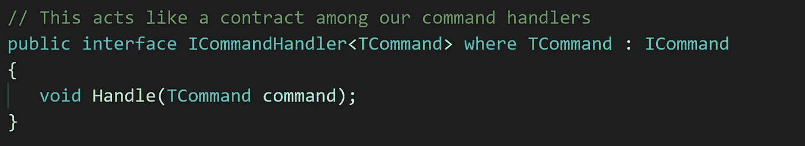

# 如何避免 ASP.NET Web API 中的胖控制器(。net 框架)

> 原文：<https://levelup.gitconnected.com/how-to-avoid-fat-controllers-in-asp-net-web-api-net-framework-45acb45ba6f0>

*这里假设您已经掌握了 ASP.NET WEB API、C#和基本原理的一些基本知识和经验，因为本文不会关注这些，而是关注一个避免编写大型控制器的解决方案。*

# 背景

使用 ASP.NET web API 的[构建基于 WEB 的丰富应用程序已经不是什么新鲜事了，它已经可靠地存在了很多年了。实现](https://www.asp.net/web-api)[RESTful API](https://restfulapi.net/)并构建强大的服务，通过 [HTTP](https://developer.mozilla.org/en-US/docs/Web/HTTP/Basics_of_HTTP) 进行通信并在 [SOAP](https://en.wikipedia.org/wiki/SOAP) 或 [JSON](https://www.json.org/) 中进行交换，配置自定义 API 路由，针对控制器和动作应用自定义过滤器，所有这些都只是这个框架的主要部分，它已经在整个市场中获得了巨大的人气。

但是，当涉及到对逻辑进行编码和编写脚本时，那就是另一回事了，不管目标框架有多强大，写出适当的、内聚的和干净的代码更多的是技术、知识，当然还有经验。

# 挑战

可能使我们的 Web API 控制器变得不必要的大的挑战之一是每个控制器需要包含的对象的数量，以便它的操作可以利用它们来调用通过这些特定对象公开的目标操作。基本上，我们的控制器依赖的对象越多，它就可能变得越大越乱。

人们可能会立即想到 IoC 和应用 DI 模式来解决这个问题。但是，不幸的是，这完全涉及另一个概念(我们可能都知道)，即通过另一个负责任的组件实例化对象，以便在应用程序中发生更多的解耦，这是非常受欢迎的。但是，这些对象应该以某种方式注入到消费者中，或者通过构造函数或属性，或者甚至是基于程序需求的方法，当然还有手头的 IoC 库。这是控制器发出噪音的时候。

在整篇文章中，我们试图通过一些代码片段来演示这个问题，然后考虑一种解决方案驱动的方法来解决这个问题，并实际抽象出我们的 Web API 控制器所依赖的所有对象。

# 场景

这里的实践场景是使用 ASP.NET 和 C#实现创建、删除和更新 API。为了只关注文章的目的，存储库数据库组件没有实现，它们只公开了接口和操作，通过这些接口和操作可以实现创建、更新和删除功能。

在这个例子中，我们被要求对一个学生对象应用上述操作。下面将通过代码片段逐一展示该场景的主要参与者，然后将更详细地介绍问题和解决方案。

# 参与者

首先，我们需要有一个学生示范班。

*学生实体模型*

图 1——学生实体模型

*存储库类(每一个都作为一个单独的类文件)*

图 2 —学生存储库

现在，有些人可能会问，为什么要分别拥有这么多的类和接口，而不把它们都包装在一个 StudentRepository 类中，这个类甚至可以实现为一个泛型类，这样它就可以覆盖应用程序中任何其他可能的实体类。嗯，这听起来是一个好问题，但实际上不是一个好的实践，特别是当它进入实际的生产水平时。虽然这个讨论超出了本文的范围，但是可以很快指出一些原因。首先也是最重要的，将所有操作放在一个单一的存储库类中可能会违反 [SRP](https://en.wikipedia.org/wiki/Single_responsibility_principle) 。此外，如果我们的应用程序不仅仅需要创建、删除和更新，会发生什么呢？然后，我们将不得不在我们非常长的仓库类中实现每一个新的操作，这当然会带来各种各样的问题；从单元测试中的困难到维护和反模式问题。

抛开上面的讨论，我们现在需要一个 Web API 控制器，我们可以在其中编写创建、更新和删除操作，这些操作将针对我们的数据库执行所需的功能。为了在我们的程序中实践 IoC，我们将使用 Autofac for Web API。更多信息，请通读[本网站](https://autofaccn.readthedocs.io/en/latest/integration/webapi.html)。

所以，让我们快速看看如何使用这个 IoC 框架注册我们的类型。

图 3 — Global.asax.cs

既然已经注册了带有接口的类，我们只需要通过控制器构造函数注入它们，并在需要时使用它们。控制器类如下所示。

图 4——构造函数中注入了三个对象的学生控制器

仅此而已。这些都是这个场景中的基本参与者。

# 问题是

但是，你注意到已经存在的问题了吗？是的，没错——我们的控制器现在很可能会扩展并变得更大，因为它可能需要向其构造函数中注入更多的依赖项(如果还不够的话)。在实际应用中，这很容易发生，并使每个控制器变得更加混乱和冗长。这里的另一个问题是，我们的控制器与之通信的第一个组件是我们的存储库类，从设计的角度来看，这不是最佳实践。事实上，我们最好有一些处理程序来处理我们传入的请求，并将它们传递给任何后继者，在我们的例子中，假设是存储库类。

所以问题是，有什么方法可以避免这样的问题，并始终保持我们的控制器尽可能的性感和轻薄？

# 解决方案

我们将在本文中讨论的一种方法是将处理 API 请求的责任委托给另一个组件(或参与者),并尝试训练该组件根据来自 API 的传入请求来解析所需的处理程序。这样，我们的学生控制器(或程序中的任何其他控制器)可能只依赖于这个新加入的组件(处理器),并且控制器只需要向这个处理器发出请求，以便它自己处理其余的部分。这听起来很酷，让我们看看如何实现它。

为了进入解决方案，我们可能需要首先对代表命令查询责任分离的 [CQRS 模式有一个非常基本的理解。马丁·福勒在他的网站](https://docs.microsoft.com/en-us/azure/architecture/patterns/cqrs)[上对此做了很好的解释，这里是](https://martinfowler.com/bliki/CQRS.html)，但只是提出一个初步的想法，CQRS 认为请求要么是命令，要么是查询。在我们的简单场景中，我们可以得出结论，删除、更新和创建基本上是用户可以执行的命令，从数据库中检索数据将是我们的查询(如果有的话)。

但是，这将如何帮助我们使我们的控制器的形状？让我们从弄清楚我们的命令类开始。

*命令*

现在我们有了命令的概念，我们也需要在我们的代码库中反映出来。根据上面简要提到的内容，我们将在应用程序中使用以下命令。

图 ICommand 界面

图 6 —注册新学生命令

图 7 —更新学生信息命令

图 8-删除学生命令

到目前为止一切顺利！我们现在有一些命令是来自用户的实际请求。但是为什么不使用通常的 get 和 set 来拥有公共属性呢？答案命令本质上是不可变的消息。不幸的是，讨论这个会脱离上下文，这就是为什么我们最好在这里结束它。但是，[这个链接](http://www.cqrs.nu/Faq/commands-and-events)可能有助于找到更多关于这个原因的信息。

这些命令类实际上是我们前面提到的组件用来解析目标处理程序的因素之一，然后，目标处理程序将调用所需的存储库来对数据库应用命令。那么，让我们看看我们的命令处理程序，以及它们应该如何实现。

*命令处理程序*

图 9 —命令处理程序界面

图 10 —注册新的学生命令处理程序

图 11 —更新学生信息命令处理程序

图 12 —删除学生命令处理程序

至此，我们有了一组新的类来公开我们的命令和命令处理程序。这些确实应该放在存储库和控制器类之间。但是，如果我们只是试图取代他们，我们仍然会有脂肪控制器的问题。这时，另一个组件开始发挥作用，它将负责坐在我们的学生控制器和实际的命令处理程序之间，这样我们的控制器就不需要注入所有的处理程序。

事实上，基本思想是控制器向该处理器发送命令对象，以便它能够根据约定(命令处理程序接口)解析或找到相关的处理程序，并最终要求处理程序从该点开始处理请求。

现在，让我们看看这个命令解析器是什么样子的，我们如何实现它一次，以便它也可以处理将来添加的处理程序。

*命令处理器*

图 13 —负责在运行时解析处理程序的命令处理器

可爱！

我们现在有了一个处理器，它是控制器和处理程序之间的中间件，能够使用的强大功能解析处理程序(当然，所有处理程序都遵循命令处理程序协定)。净， [*倒影*](https://docs.microsoft.com/en-us/dotnet/framework/reflection-and-codedom/reflection) 。

下一步是首先从 Global.asax 文件中注册我们的命令处理程序和处理器，然后将它们直接注入学生控制器以供进一步使用。我们只需要更新以下格式的文件。

*The Global.asax*

图 14 —在 Global.asax 中注册处理程序

现在，让我们看看使用这种解决方案，我们的控制器会有什么不同。

图 15——只注入了一个依赖项的控制器，不管它公开了多少不同的动作

很漂亮不是吗？！我们现在可以向程序中添加尽可能多的命令和命令处理程序，我们的新控制器不需要知道它们，也不需要将它们注入到构造函数中。这种解决方案在某种程度上也是尊重[开闭原则](https://code.tutsplus.com/tutorials/solid-part-2-the-openclosed-principle--net-36600)的，即一个类应该对扩展开放，但对修改关闭。

仅此而已！