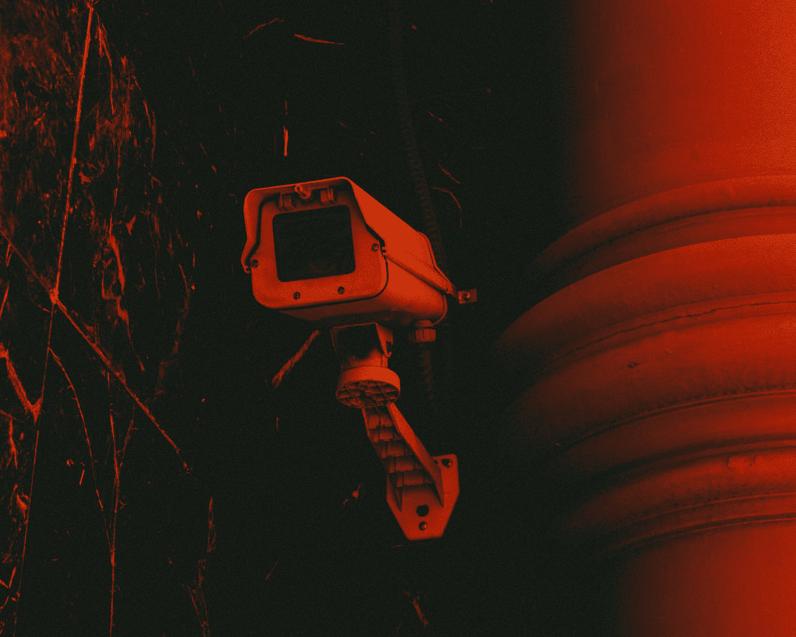

# 如何避免间谍软件

> 原文：<https://levelup.gitconnected.com/how-to-avoid-spyware-6f208c624916>

间谍软件是一种偷偷安装在计算机上并向其创建者发送信息的软件，顾名思义，它充当间谍。这些信息可以是任何东西，从你的浏览历史到系统细节，甚至是带密码的登录信息。这就是为什么间谍软件真的很危险，应该避免，特别是如果你用你的电脑在网上购物。

帕克·科夫曼在 [Unsplash](https://unsplash.com?utm_source=medium&utm_medium=referral) 上的照片

这些间谍软件程序通常与免费应用程序捆绑在一起，你并不知道你正在安装它们。所以这就是为什么它们仍然存在，人们安装它们。然而，许多这些间谍软件只收集信息，如您的电子邮件地址，偶尔会显示一个弹出窗口。然而，在许多情况下，它们的用法在 EULA 或最终用户许可协议中有简要描述，这样您就不会起诉开发人员。但是我们都知道，我们不读那个许可证，让我们在这里诚实地说，像这样的事情一直在溜走。

# 其他类型的恶意软件

让我们来回顾一下你可以从互联网上获得的其他类型的恶意软件，以及它们对你的计算机的影响。这是一个有趣的琐事，我希望你喜欢阅读这些，就像我写它们一样。

**恶意软件**:这是一个广义的术语，指在用户不知情的情况下安装在用户电脑上的程序，其目的是伤害用户。在这种情况下，间谍软件可以被视为恶意软件，这是恶意软件的简称。

广告软件:这和间谍软件是一样的，但是这种恶意软件不是从用户那里获取信息，而是显示不同的网站。一般来说，网站充满了其他类型的恶意软件。他们还会不时显示弹出窗口。

**病毒**:顾名思义，病毒是一种程序，它被设计成在网络上的一台或多台计算机的文件间传播。它们会对处理和网络运行造成严重损害。

**蠕虫**:就像病毒一样，蠕虫会在网络中传播。然而，蠕虫是通过在传播时复制自己来做到这一点的。他们还可能改变自己的形象，以避免检测。

**木马:**就像希腊神话中臭名昭著的马一样，计算机版本呈现出无害的外观，比如实际程序的更新或附加程序。一旦进入您的计算机，它可能会执行有害的功能，如擦除您的硬盘或删除您的所有文件。像间谍软件一样，特洛伊木马也可以收集信息并发送给开发人员。

# 如何避免间谍软件？

嗯，间谍软件就像任何其他恶意软件一样，如果你知道如何避免它们，你会做得很好，但如果你是一个没有经验的用户，这里有一些提示给你。

*   ***不下载共享软件*** 。或者至少从可靠和知名的经销商那里购买。
*   ***保持 Windows*** ***最新*** 。为你的系统设置自动更新是防止恶意软件入侵的最好方法之一。
*   ***读 EULA 的*** 。这些恶意软件被要求说明他们做了什么，否则他们将面临严重的法律诉讼。
*   ***避开有问题的网站*** 。如果一个网站没有起码的 SSL 证书或者只是觉得奇怪，那就尽快离开。
*   ***改变安全等级*** 。通过设置中或高安全性级别，您将得到一个应用程序安装的弹出窗口，这样您就可以随时知道发生了什么。
*   ***避免点击弹出*** 。如果一个反病毒弹出窗口显示在一个粗略的页面上，甚至不要点击 X 按钮，因为这是一个陷阱，只要完全删除该网站。

# 结束语

这些只是我在互联网上的一些经验和建议，所以我希望这些能帮助你。对付恶意软件并不好玩，而且清除它们真的会令人沮丧。所以对付恶意软件的最好方法是根本不要得到它们。