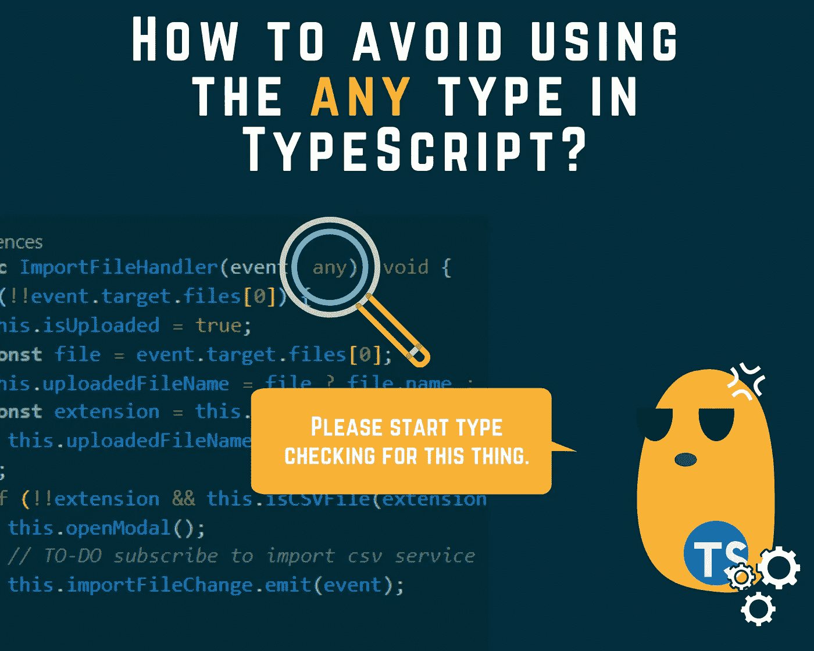

# 如何避免在 TypeScript 中使用 any 类型？

> 原文：<https://levelup.gitconnected.com/how-to-avoid-using-the-any-type-in-typescript-14c0a0805473>

## 避免在代码中键入 any 的 3 个技巧



谁没用过`any`型至少一次？我有。这很简单，您不必费心在测试文件中查找事件类型或创建模拟对象。`any`为您节省时间和精力。但是，不幸的是，并不是每一个简单的解决方案都是好的选择。

键入是检查代码中错误的最便宜、最快速的方法。对于`any`型，很难看出哪里出了问题，而且在性能方面，它会让你付出很大代价。

有时候，不用`any`型真的很难。幸运的是，TypeScript 编译器确实为我们提供了避免不输入所需的一切。我们所需要的是了解和学习这些能把我们从尴尬境地中拯救出来的技巧。

这个问题在我的团队中频繁出现。也许对你来说也是如此。在这篇文章中，我将分享我所学到的和用来在没有`any`的情况下写代码的东西。

我将报道:

*   **增加接口**
*   **类型交集**
*   **高级仿制药**
*   **最终想法**

所以，如果你兴奋并且准备好了，让我们开始吧

# 扩充类型脚本接口

你是否面临需要一个额外的变量给一个外部对象？比如，我们需要在窗口对象中保存一个自定义链接。当然，窗口对象中没有 customLink 属性。做什么？

*   **第一解:**

当然，由于我们使用了`any`，这个解决方案并不是完美的解决方案。在这种情况下，最好向外部对象窗口添加一个自定义属性。我们怎么能用一个不属于我们的外部物体做到这一点呢？这可能吗？你猜怎么着？这是完全可能和可行的。

如果我们看看窗户的定义。我们发现它是一个在 dom lib 中定义的接口。因此，我们在这里需要做的是将我们的自定义属性添加到窗口接口。

为此，我们需要在应用程序的根目录下创建一个`app.d.ts`文件。`.d.ts`是一个包含 TypeScript 类型定义的文件。因此，我们需要在我们的定义类型文件中创建一个`Window`接口，它具有我们需要的额外属性。这个文件将增加我们添加到其中的`Window`对象的定义。这里有一个例子:

魔法出现了，不再需要`any`型了。

既然我们追上了`any`型，我们就好了😉

# 交叉点类型

我的第一个技巧非常简单，有助于避免使用`any`类型。但是，它仍然有其局限性。如果外部对象没有定义类型文件(即`.d.ts`)我们不能再扩充它的接口，我们该怎么办。有问题，不是吗？

我通常在第三方库中遇到这个问题。另一个用例是拥有定义类型文件，但是自定义属性是可选的。我们该怎么办？每次检查我们是否有多余的财产？我不知道你怎么样，但我懒得做这个😝。在这种情况下，对我来说最好的方法是仅在需要时将第三方库类型与我的自定义属性交叉。很好，对吧？

让我们以一个我们想要定制的触发事件为例。我想只在特定事件被触发时添加额外的属性。这可以通过使用`&`来完成，它将交叉两种类型，如下所示:

我将利用我的`app.d.ts`来添加我的 CustomActionEvent 的定义，这样我就可以在应用程序的任何地方使用它。

我们也可以想象一下:

现在，当我们需要向事件添加额外的属性时，我们可以在组件中使用 ActionStartEvent 或 ActionStopEvent，否则，我们将只使用 Event。

# 充分利用泛型

最后一个技巧是关于大多数泛型类型的。通常，数组用于存储数据并对这些数据进行一些操作，如排序、过滤、搜索...等等。

对于大数组，肯定会从后面获取数据，让他过滤，或者排序什么的，让前面尽可能的轻。但是，在某些情况下，我们在前端进行过滤或排序。我们应该做什么，为每个属性创建一个过滤器或排序器？对于每个数组？相同的功能有太多的代码，不是一个真正好的解决方案。

如果我们能做一些像这样的事情，那就太好了:

```
myArray.sortWith('property1', 'asc');
```

同样，我们可以使用接口扩充来扩充标准阵列的接口。但是，这并不能解决所有问题。我们仍然需要一个通用的 *sortWith，filterWith* ，它可以应用于所有数组的列类型。

为了解决这个问题，我们需要更深入地研究泛型类型。让我们首先在`app.d.ts`中创建自定义数组的接口，对于这个实例，我们将只添加 filterWith 作为示例:

现在，我们可以在阵列上实现和使用 filterWith:

# 最终想法:

*   `any`类型是吃 app 的性能
*   使用更先进的技术，如接口扩充、类型交叉和使用泛型，可以避免使用类型。
*   我们使用`keyof`关键字来确定传递给添加到标准数组对象的 *filterWith* 函数的属性。
*   要在组件类中增加接口，我们需要在一个全局块中声明自定义接口，如下所示:

*   这些提示将帮助你避免使用`any`类型。他们是可用的。TypeScript 编译器如此强大。我们可以用它做很多事情。那么，为什么不贪婪地得到编译器得到的所有东西呢？如果您有兴趣了解更多关于 TypeScript 编译器的功能，本文可能会为您提供一些令人惊讶的提示:

[](/how-to-get-the-most-from-the-typescript-compiler-angular-aae7fb53e0cf) [## 如何充分利用 TypeScript 编译器— Angular

### 让 TypeScript 编译器为您服务

levelup.gitconnected.com](/how-to-get-the-most-from-the-typescript-compiler-angular-aae7fb53e0cf) 

亲爱的读者朋友们，非常感谢你们的支持和宝贵的时间。我希望这对你有用和有帮助。

**关注我上** [**中**](https://medium.com/@famzil/) **、**[**Linkedin**](https://www.linkedin.com/in/fatima-amzil-9031ba95/)**、**[**Twitter**](https://twitter.com/FatimaAMZIL9)**了解更多文章。**

不久后见(ﾉ◕ヮ◕)ﾉ*:･ﾟ✧)

**FAM**