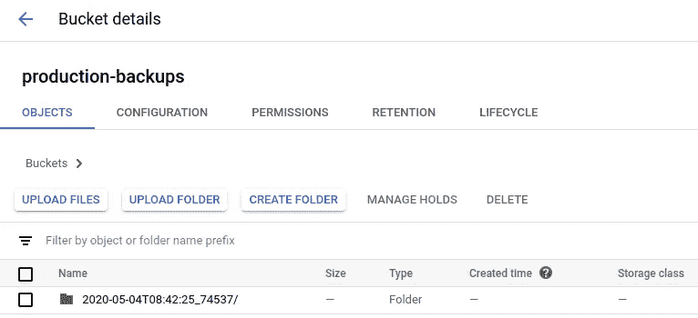

# 如何轻松自动地备份 Firestore

> 原文：<https://levelup.gitconnected.com/how-to-back-up-firestore-easily-and-automatically-eab6bf0d7e1f>


Firebase 和 Firestore 为开发人员提供了一个很好的、完全托管的平台，可以快速开发和发布他们的产品。不幸的是，备份似乎是平台中被忽视的部分，没有易于使用的控件来捕获数据库的定期快照。虽然您不太可能因为硬件故障而丢失任何数据，但备份仍然至关重要，因为故障的另一个来源是开发人员。

迁移出错，代码有缺陷。即使你努力追求完美(并实现它！)，下一个做它的人会这么敬业吗？你需要备份，由于 Firestore 中没有这样做的按钮，我们只能自己做。幸运的是，现在可以通过使用 Firebase 功能(启动和自动化备份)和 Google 云存储(存储备份)的组合来非常简单地实现。

## 步骤 1:规划您的备份策略

在进行任何配置之前，您需要考虑以下几点:

*   您希望多久进行一次备份？越频繁=读取次数越多，存储的数据越多=成本越高。频率越低=潜在的数据丢失率越高。
*   你能按需运行它们吗？鉴于我们的主要故障模式是开发人员故障，备份作为部署前步骤可能是合理的。
*   您希望多久删除一次备份？对于某些行业，您将需要有特定的时间窗口来保留数据，包括备份。该窗口结束后，您可能也不允许保留数据，这也包括备份。所以也需要一种自动删除它们的方法。
*   GDPR 适用吗？被遗忘的权利可能也适用于备份，这就是为什么当它首次宣布时，我(和许多开发人员一样)采取了双重措施，并在心里将欧盟从我未来的目标市场中划掉。我在这个问题上的立场已经成熟，但如果你想符合 GDPR 标准，你可能无法长期存储包含识别信息的备份，除非你有办法忘记旧备份中的个人数据，例如将所有个人信息保存在不同配置备份周期的单独数据库/服务中。


真是让人头疼……(图片由 [Unsplash](https://unsplash.com/photos/sxQz2VfoFBE) 提供)

考虑到这一点，你现在应该有一个保留时间和调节诱导头痛。让我们开始实际实施备份。

## 第二步:备份的去处

在谷歌云存储中创建一个桶。**请注意，该存储桶必须与您的 Firestore 数据库位于同一地区或多地区。**

*   前往[谷歌云存储](https://console.cloud.google.com/storage/browser)
*   确保你在顶栏中选择了正确的项目！
*   点击“创建存储桶”
*   给它一个名字——我喜欢混合使用一个明显的描述和一个不明显的后缀，通过模糊来增加安全性
*   选择与您的 Firestore 数据库相同的区域或多区域。比如美国多地区。
*   选择存储类别。如果您只打算一次保留几个月的备份，近线是理想的选择，因为它的最短保留期只有 30 天。否则，Coldline 将保留 90 天，并进一步节省成本。
*   对于访问控制，由于此存储桶将只存储备份，因此“统一”访问控制最有意义，也最容易维护。我们不希望我们的备份被除我们之外的任何人访问，这使得实施起来很容易。
*   最后是高级设置。这是我们设置保留期的地方—勾选“设置保留策略”并添加您想要的配置。
*   点击“创建”。

假设您的 bucket 与您的 Firebase 应用程序位于同一个项目中，那么您的应用程序的服务帐户应该自动拥有对您的 bucket 进行读写的权限。您可以通过在控制台中打开您的 bucket，转到“Permissions”选项卡并查找`yourproject@appspot.gserviceaccount.com`来仔细检查这一点。它应该具有“存储管理员”角色。

## 步骤 3:编写我们的自动化备份

是时候写一些代码来触发备份了。实现这一点最简单的方法是实现一个 [Firebase 函数](https://firebase.google.com/docs/functions/)——特别是一个[预定函数](https://firebase.google.com/docs/functions/schedule-functions)。我假设您以前已经使用过 Firebase 函数，并在您的项目中设置了它。如果没有，[执行第一个](https://firebase.google.com/docs/functions/get-started)。

我们需要确保我们的新功能可以通过授予我们的服务帐户`yourproject@appspot.gserviceaccount.com`“云数据存储导入导出管理员”角色来运行数据导出。你可以通过谷歌云控制台的 IAM 界面或者从命令行(替换掉两个`yourproject`的实例)来实现:

```
gcloud projects add-iam-policy-binding yourproject \
  --member serviceAccount:yourproject@appspot.gserviceaccount.com \
  --role roles/datastore.importExportAdmin
```

在我们实现的函数中，我们将使用 Firebase Admin SDK ( `yarn add @google-cloud/firestore`将其添加到 functions 项目中)来触发备份作业的创建。由于我们是从 Firebase 函数内部运行的，所以我们可以从环境中获得所需的大部分项目配置。只要确保将`gs://your-bucket-name`替换为您实际的桶名即可！您还可以根据自己的需求更改时间表，在本例中，我将其设置为每日:

一旦我们做好准备，我们的计划备份功能现在将通过一个简单的`firebase deploy`与应用程序的其余部分一起部署。然后，它应该会按照您设定的时间表愉快地运行。要手动调用它，我们可以使用 web UI:

*   转到项目的 Firebase 控制台，然后从侧栏中选择 Functions
*   找到您的函数，然后单击该行右侧的三个点，并选择“在云调度程序中查看”
*   找到您的时间表并点击“立即运行”

或者，我们可以使用`gcloud` CLI(例如，作为您的 CI/CD 流程的一部分):

*   获取您的预定功能列表:`gcloud scheduler jobs list`
*   运行一个:`gcloud scheduler jobs run your-scheduler-name`

一旦您的函数运行完毕，查看一下您之前创建的 bucket。您可能需要等待备份完成(`gcloud firestore operations list`来检查最近的操作)，但最终您应该会看到一个包含备份的带时间戳的文件夹:



成功备份！

## 先说成本

Firestore 本身有一个有趣的定价模式。它根据读取和写入、总存储和总传输量计费。但是真正昂贵的部分呢？读和写。他们最近在他们的文档中添加了一个警告，澄清了导出数据(即备份)时读取肯定是要收费的，但这是我不得不通过艰苦的方式发现的事情。

根据您存储的数据量和备份的频率，备份的成本可能会比应用程序的实际运行成本高出几个数量级。在我目前的项目中，我需要存储大量不常访问的货币兑换率数据，这意味着极其昂贵的备份。

不幸的是，现阶段唯一的解决方法是少备份一些数据，或者只选择性地备份数据。通过修改`collectionIds`参数，您可以在备份代码中明确声明您想要包含哪些集合。因此，如果你只想备份你的`users`和`restaurants`集合，你可以指定`collectionIds: ['users', 'restaurants']`。

一个大问题是嵌套集合(例如`users/{userId}/posts`)也需要被添加，否则**它们将不会被备份。**这没有很好的记录，但是为了避免一些试验性的&错误**这是您备份子集合的方式**:

```
collectionIds: [
  // This will back up users/{userId}
  'users',
  // This will back up users/{userId}/posts/{postId}
  'posts'
]
```

对于您认为备份成本太高的数据，请确保您有一个灾难恢复计划，以便在出现问题时能够恢复这些数据。

## 事后思考

我希望在某个阶段 Firebase 可以改进他们的备份工具。目前，对于一些常见的工作负载来说，它非常昂贵，而且对用户或开发人员来说也不友好。我会说这是一个很好的开发者体验中较弱的部分。备份是您需要从第一天开始就为您的服务实施的东西，因此我认为每个负责任的托管数据库服务都应该包括用于备份和恢复的突出工具，并且至少提供一个简单的基本设置自动化备份解决方案。备份数据成本过高或技术难度太大可能会导致许多客户搬起石头砸自己的脚，或者决定冒这个险，我担心 Firestore 就是这么做的。

无论这是否适用于您或者您刚刚开始，希望本文已经向您展示了如何为您自己的 Firebase 应用程序构建一个健壮的备份系统。不要忘记测试你的备份是否经常工作。有太多这样的恐怖故事:项目人员组装了一个备份系统，但在灾难发生之前，他们从未真正尝试过从备份系统中恢复数据…