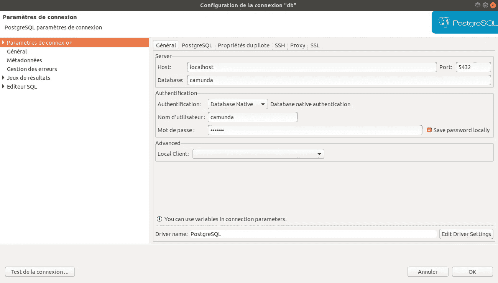
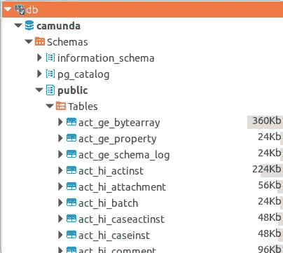

# 如何备份和恢复您的 Dockerized Postgres 数据库

> 原文：<https://levelup.gitconnected.com/how-to-backup-and-restore-your-dockerized-postgres-database-a76a11ccf53e>


照片通过[像素](https://www.pexels.com)

# 介绍

随着公司数据量的不断增加，保护数据的任务变得越来越具有挑战性，尤其是在云中。因此，对可靠的备份和恢复解决方案的需求从未像现在这样大。

据 IBM 的[，](https://www.ibm.com/cloud/learn/backup-and-restore)称，备份和恢复指的是将数据定期复制到单独的辅助设备上，然后在数据由于断电、网络攻击、人为错误或灾难等不同事件而丢失或损坏的情况下，使用这些副本来恢复公司的关键数据的技术和实践。

本文的目的是解释如何使用由 Postgres wiki 和 s3fs-fuse 项目提供的备份脚本将 Postgres 数据库备份到 S3 对象存储，我在之前的文章中已经解释过了。它还解释了如何在备份完后恢复数据库。

# 使用 Docker 的 Postgres 数据库

基于 [Docker 的官方文件](https://docs.docker.com/get-started/overview/)。Docker 被定义为一个开发、发布和运行应用程序的开放平台。它提供了在称为容器的隔离环境中打包和运行应用程序的能力。

一个[容器](https://www.docker.com/resources/what-container)是一个标准的软件单元，它封装了代码及其所有的依赖项，因此应用程序可以快速可靠地从一个计算环境运行到另一个计算环境。Docker 容器映像是一个轻量级的、独立的、可执行的软件包，包括运行应用程序所需的一切。

要安装 Docker，请按照以下步骤操作 Ubuntu:

1.  [安装 Docker 引擎](https://docs.docker.com/engine/install/ubuntu/#prerequisites)
2.  [安装对接器构成](https://docs.docker.com/compose/install/)
3.  [安装后的设置步骤](https://docs.docker.com/engine/install/linux-postinstall/)

一旦完成，您就可以创建`sudo mkdir /opt/docker-compose/;` 目录并创建`docker-compose.yml`文件。在该文件中放入以下内容:

在这里，我决定定义一个与 Camunda 平台相关的 postgres 数据库映像，这样，camunda 平台中所有可用的演示数据都将存储在我们的 postgres 数据库中。在这种情况下，我们的初始数据库不会是空的，所以我们可以直接开始使用它。

然后，在同一个`/opt/docker-compose` 目录中运行以下命令来创建并运行您的容器:

为了查看存储在数据库中的数据，可以使用 CLI 或 DBeaver。

## 选项 1 : DBeaver

按如下方式安装 DBeaver:

DBeaver 安装

然后将其配置为访问本地 postgres 数据库。



DBeaver。

最后，您可以访问您的表格并查看 camunda 的数据。



## 选项 2 : CLI

使用以下命令访问 postgres 数据库:

```
docker exec -it postgres psql -U camunda
```

然后运行`\dt`命令来显示所有可用的表。

# Postgres 备份脚本

如[官方 postgres wiki](https://wiki.postgresql.org/wiki/Automated_Backup_on_Linux) 中所定义。我将定义两个主文件:`pg_backup.config` 和`pg_backup_rotated.sh`。

pg_backup.config

确保正确指定:

`BACKUP_DIR:`您的备份将存储在哪里

`USERNAME:`您数据库的用户名(即 camunda)

pg _ 备份 _ 旋转. sh

为了执行上述备份脚本，请运行以下命令:

```
./opt/docker-compose/pg_backup_rotated.sh
```

完成后，您可以访问您的备份目录来查看您的 postgres 备份。

> 如果您希望您的备份存储在云上，在 S3 对象存储上，您可以查看我的文章[将您的对象存储桶作为文件系统挂载到您的 ECS 实例上](https://medium.com/swlh/mounting-your-object-storage-bucket-as-a-file-system-on-your-ecs-instance-a878380a3c21)。然后，您需要修改`pg_backup.config`文件，将`BACKUP_DIR`目录设置为您安装的 S3 存储桶。

为了对每天特定时间执行的备份进行编程，您可以使用`crontab -e` 并添加以下行:

```
00 00 * * 1 cd /opt/docker-compose; /opt/docker-compose/pg_backup_rotated.sh -c /opt/docker-compose/pg_backup.config
```

沿着这条线，我们的数据库将在每周一的午夜被提升。

# 恢复您的 Postgres 数据库

我们的数据库备份将作为`camunda.sql.gz`存储在`/backup/`中。首先，你需要解压它，这将会给你`camunda.sql`。

```
gzip -d camunda.sql.gz
```

然后在`/opt/docker-compose/`下创建`initdb.d`目录并将`camunda.sql`放入其中。然后，创建一个新的 postgres 数据库

确保在之前的`docker-compose.yml`中创建的旧 postgres 和 camunda 已关闭或关闭并删除。

```
# If you want to stop and remove your stopped containers: 
docker stop $(docker ps -a -q) && docker rm $(docker ps -a -q)
```

启动新的 postgres 容器

```
docker-compose up -d 
```

在 postgres 容器的创建过程中，将执行`docker-entrypoint-initdb.d`来填充数据库，它包含已挂载的`camunda.sql`。

访问您的 postgres 数据库:

```
docker exec -it postgres psql -U camunda
```

运行`\dt`来验证您已经备份了所有丢失的表。

最后，对于本教程，您可以运行以下命令来停止和删除 docker 容器:

```
docker stop $(docker ps -a -q) && docker rm $(docker ps -a -q) && docker ps 
```

# 参考资料:

[Linux 上的自动备份](https://wiki.postgresql.org/wiki/Automated_Backup_on_Linux)

[如何使用 pg_dump 和 pg_restore 备份和恢复 PostgreSQL 数据库](https://medium.com/@mohammedhammoud/how-to-backup-and-restore-postgresql-database-using-pg-dump-and-pg-restore-c340427e46e2)

[备份、恢复 docker 容器中的 postgres](https://gist.github.com/gilyes/525cc0f471aafae18c3857c27519fc4b)

[Docker 容器中的数据库——如何启动以及它有什么作用](https://medium.com/@wkrzywiec/database-in-a-docker-container-how-to-start-and-whats-it-about-5e3ceea77e50)