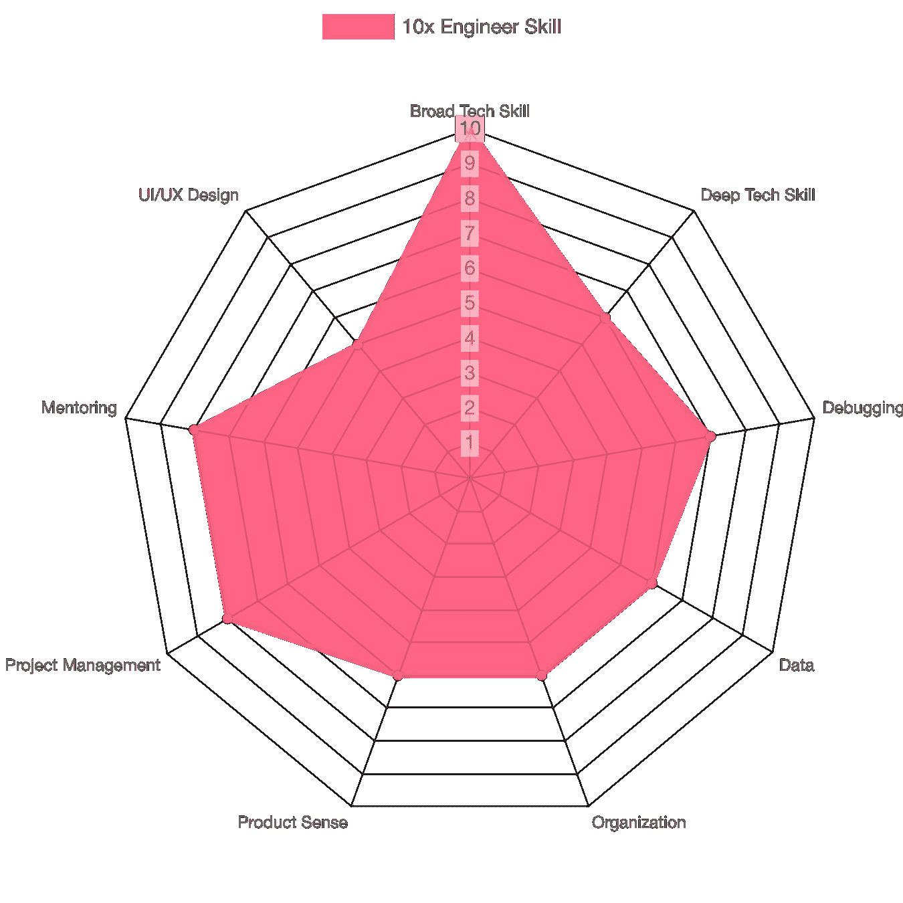
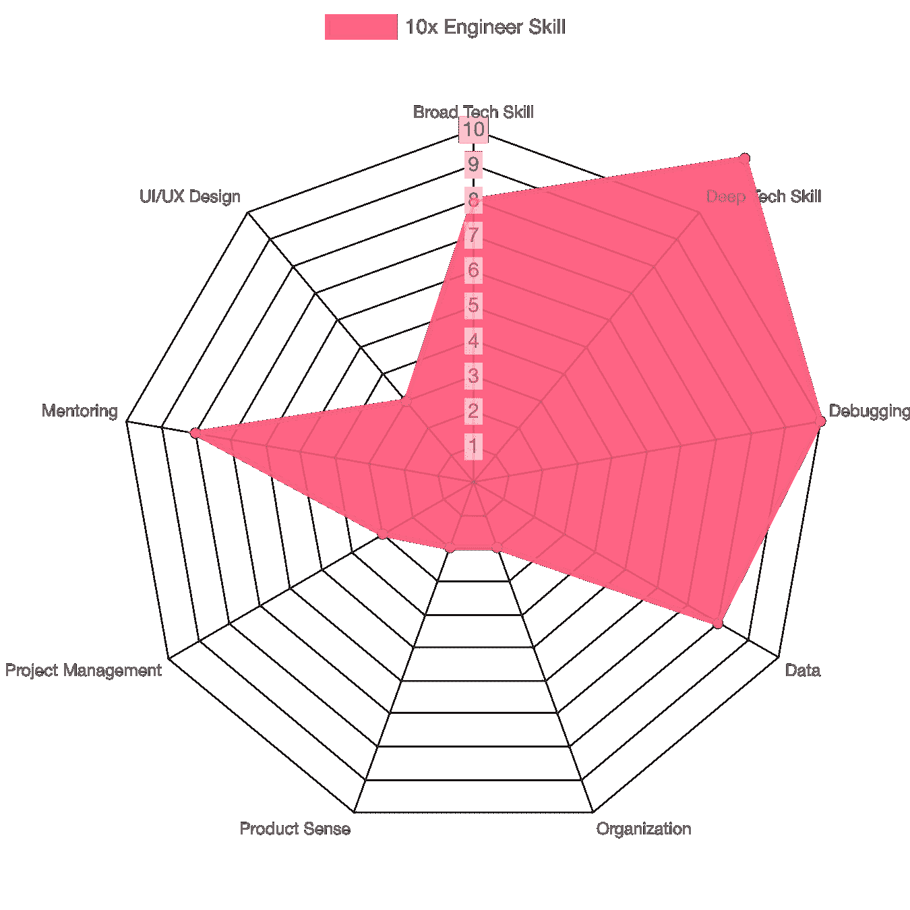
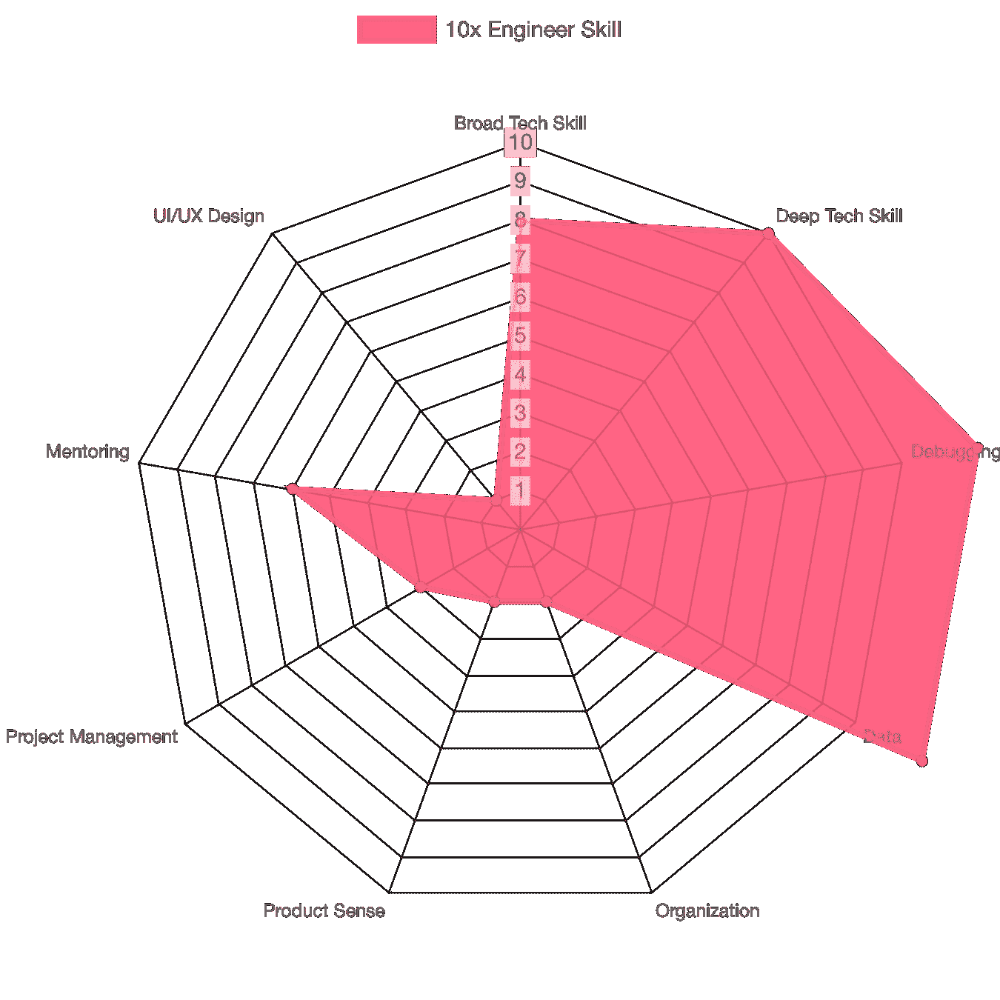
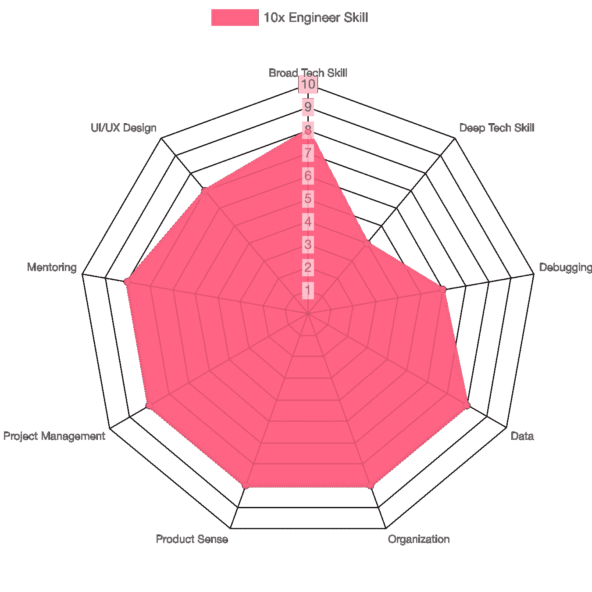
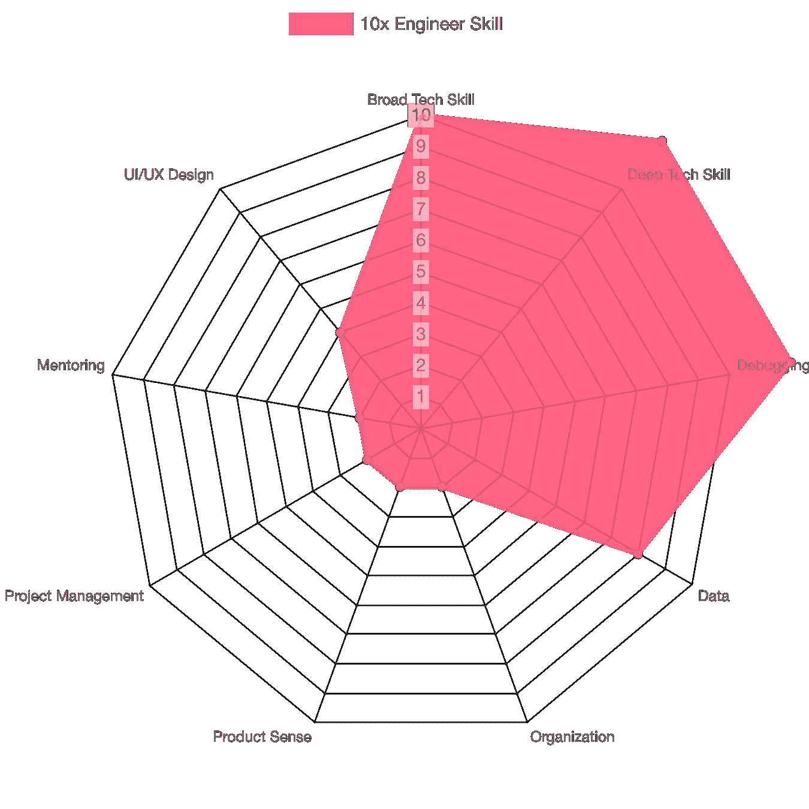

# 如何成为 10%的工程师:首先成为 10 倍的工程师

> 原文：<https://levelup.gitconnected.com/how-to-be-a-10-engineer-be-a-10x-engineer-first-f670a9bca968>

我们可能永远不会知道是谁首先创造了 10x 工程师这个术语。但是我们确实知道围绕它们有许多定义和迷因。例如，关于 10x 工程师的最受欢迎的讨论之一是由 Shekhar Kirani 在 2019 年 7 月发起的。

你会看到我同意的几点…

1.  10x 工程师可以在头脑中将“思想”转化为“代码”，并以迭代的方式编写。

…我**不同意**的观点…

1.  10 倍工程师讨厌开会。
2.  10x 工程师知道已经投入生产的每一行代码。
3.  10x 工程师大多是全栈工程师。
4.  10x 工程师很少看类或方法的帮助文档。
5.  10 倍的工程师是糟糕的导师，因为他们不能教别人做什么或包工作。
6.  10x 工程师不黑东西。

…这意味着根据行业内不同的专业人士，10 倍工程师的素质、活动和特征有多少种排列。这个博客关注的是 10%工程师，所以我只讨论与成为 10%工程师相关的 10 倍工程师的定义(以及你应该考虑成为 10%工程师的最好的 10 倍工程师)。

与其解释什么是 10x 工程师，不如让我举例说明一个团队**没有**10x 工程师是什么样子，以及有 10x 工程师会发生什么。

# 没有 10 倍工程师的团队

一个由 3 名工程师(2 名前端工程师和 1 名后端工程师)、1 名产品经理和 1 名设计师组成的团队在一个汽车租赁市场工作。业务前提是个人能够列出他们要出租的汽车，而其他人可以搜索、浏览、发现、租赁和支付汽车费用。

项目经理开始要求工程团队在 2 个月内用他们的地图和汽车的现场位置建立一个列表网站。工程师说制作他们的地图是不合理的，并推迟了要求，并要求 6 个月。首相勉强同意使用谷歌地图，但推后，一切都需要在 4 个月内完成。然后团队投入了所有 3 名工程师来建造这个。

两个月过去了，工程师们似乎认为我们无法及时完成这项工作。总理没有征求工程师的意见就要求领导层提供更多的资源。最初的团队不知何故得到了另外一名后端和一名前端工程师的帮助，但也想知道谁会有时间让这两名新工程师加入进来。但至少现在他们有更多的人可以在欢乐时光里一起喝酒了。

最直言不讳的工程师说，四个月过去了，项目“几乎准备就绪”。在用户接受测试后，看起来地图集成不稳定，用户界面有一些闪烁的问题，后端团队坚持他们想在他们的代码中增加 100%的测试覆盖率。该团队同意再增加 2 个月的时间来启动和运行这个项目。

七个月过去了，在经历了一些小的延迟后，这个项目终于准备好启动了。营销团队已经准备好开始发送促销信息，管理团队对发布感到非常兴奋。“7 月 4 日，那是最好的时机，”大家都同意。

七月四号。该网站是公开的。营销是巨大的。由于流量问题，网站关闭了一段时间。该团队不知道有多少人访问了这个网站，但它是巨大的。后端工程师将他们的 EC2 实例从`small`增加到`large`来帮助加载。该团队最终有 100 个注册，0 笔交易成交。

七月七日。网站不再崩溃了。但是总理一直想知道为什么仍然有 0 笔交易。项目经理要求团队进行调试。显然，他们的支付集成工作得并不好，这是以前从未测试过的，因为没有一个工程师想用他们的信用卡进行测试。团队很快用 PM 的信用卡解决了这个问题，他们收到了 2 笔交易(其中一笔是测试交易)。

7 月 20 日。似乎现在网站运行良好。但迄今只有 10 笔交易成交。人们似乎在使用网站，需求是存在的，但他们无法完成交易。假设是网站太复杂，无法导航(一名前端工程师咕哝道，“客户太笨了”)。可悲的是，团队不知道客户被卡在了哪里。其中一名工程师建议我们在网站中加入一些跟踪和记录功能。他提议使用 [Firebase](https://firebase.google.com/) 和 [Metabase](https://www.metabase.com/) 来记录和存储事件(他听说这是行业标准，并且高度可扩展)。由于团队需要研究这些新工具，他们还需要 2 个月的时间，并将团队缩减到只有 1 名后端和 1 名前端工程师(之前有 5 名工程师)。

九月一号。不知何故，团队实现日志记录的速度比预期的要快(干得好，团队！).现在，团队明白了结帐页面存在问题，原因是基于日志记录的投递数量。这是一个简单的三行代码修复。团队推着代码，急切地看着交易号。虽然现在，营销团队用完了这个项目的预算，所以他们没有足够的流量来测试交易。他们必须等待 1 个月，看看他们的修复是否真的改善了业务指标。

十月一日。该网站开始持续关闭 10 笔交易/天。但是管理团队认为这个产品不值得投资，因为在这上面浪费了大量的时间(10 个月)和人力(7 个人)。他们希望公司专注于即将到来的感恩节和圣诞节相关产品。总理恳求管理团队，并承诺该团队将把感恩节相关工作纳入项目。最后，他给了 2 个月的时间和 2 名工程师来证明这可以增加到 30 个事务/天。

Turo 可能不是这样被创造出来的

# 拥有 10 名工程师的团队

10x 工程师得到了与上面相同的要求。她想知道为什么现场位置很重要，因为汽车会在同一个地方停很长时间，强调他们与优步/Lyft 的业务不同。她还与总理达成共识，他们正在开发一种市场产品——这意味着有一个供需问题需要解决，可能需要单独解决。项目经理和 10x 工程师一致认为，解决需求方面的问题比解决供应方面的问题更重要。他们需要设计一个尽可能顺畅的网站，并测试需求。

然后，项目经理询问所有团队成员谁想租他们的车，因为他们一致认为，他们还不想解决市场的供应问题，因此需要一些库存来解决先有鸡还是先有蛋的问题(没有汽车库存就意味着没有客户。没有客户意味着没有人愿意租他们的车)。同时，10x 工程师向法律团队咨询是否可以使用第三方工具来构建网站。获得批准后，她召集了一个由 1 名工程师组成的团队，开始使用像 [Bubble.io](https://bubble.io/) 这样的无代码工具来构建网站。设计完数据库后，她的团队继续花了 2 个小时手动将待租赁的汽车插入数据库

项目进行到第十天，网站就完成了。根据营销团队的估计，通过将订阅计划从每月 25 美元升级到每月 100 美元，10 倍设计使网站能够处理 1，000 次流量。她还将 Google Analytics 整合到了网站中，尽管她不知道他们将使用跟踪做什么(她只是根据自己的经验预感到团队会需要它)。虽然管理团队对网站仅包含汽车列表(无法通过网站系统地供应新车)感到失望，但他们对向公众推出这一产品感到兴奋。

上线第一天，一切都很好。营销是成功的，很明显，该网站的需求超过了目前的供应。他们在第一天收到了 80 个注册，完成了 40 笔交易，第二天完成了 20 笔交易，第三天完成了 30 笔交易。10x 工程师和 PM 立即计划下一次迭代:如何通过允许人们上传和列出他们的汽车以供租赁来解决供应方面的问题。

# 软件工程师不是编码员/程序员

在我们讨论 10 倍工程师之前，我们必须达成共识:软件工程师不是编码员/程序员。

我能想到的对软件工程师和程序员最接近的类比是比较医生和护士。

照片由 [iStock](https://www.istockphoto.com/) 上的[纳米 Stockk](https://www.istockphoto.com/id/portfolio/NanoStockk?mediatype=photography) 拍摄

医生可以测血压吗？他们当然可以！

医生可以输液吗？他们当然可以！

医生能每天跟进以确保病人按时服药吗？他们当然可以！

但是为什么很少看到医生做上面提到的事情呢？因为以下原因:

1.  有些事情**只能由他们**做，护士做不了。比如:拇指接回去，LASIK 手术。
2.  为了确保病人健康，还有更重要的事情要做。例如:弄清楚大脑动脉的哪个部分需要疏通，如何在防止未来副作用的同时做到这一点，以及弄清楚正确的药物治疗。
3.  有相当多的事情需要做，医生不得不尽可能有效地将一些工作委派给其他人。理论上，一个医生可以将工作委托给另一个医生，但这不会有效利用他们两人的时间。

类似地，并不是所有的软件工程师都需要每天编码(或者根本不编码)来完成对他们的期望，并为公司交付价值。你可能听说过一些主要级别的工程师完全停止编码，主要致力于软件架构和他们的权衡。

大多数软件工程师都是从编写代码开始他们的职业生涯的。但是有足够资历的工程师知道一个成功的项目需要的不仅仅是代码。举几个例子，你需要监控、项目管理、跨职能协调、有效的设计、项目动力和优先级。在他们职业生涯的后期，软件工程师被期望交付一个好的产品，而不仅仅是交付一个根据产品经理的规范工作的功能代码。

由于一个(大)项目顺利运行需要发生大量的事情(和涉及的人员), 10x 工程师将在项目中扮演适合他们优势的角色，并帮助推动项目尽可能有效和高效地取得成功。这些角色因 10 倍工程师而异，因此，讨论 10 倍工程师的原型可能会很有趣。

# 10x 工程师的原型

描述一个 10 倍的工程师是困难的，因为他们每天做的事情并不是万能的。他们的品质在他们所在的个人和团队之间有着不同的表现(或者在没有他们的团队中被发现，如上所述)。根据我多年的观察，以下是 10 倍工程师的典型:

多面手是一名 10 倍的工程师，他将复杂和模糊的问题分解成容易被同事理解的问题。然后，他们通常会从事最困难或最危险的工作(但不总是最有影响力的)。他们精通多种技术，因此可以根据需要将自己应用到正确的地方。

通才

**专家**是 10 倍的工程师，专注于一个平台或一项产生巨大影响的技术。他们通常是业内知名的参与者，无论是广泛使用的开源项目(如 React Native)的创造者/大贡献者，还是平台(如 Android、Git)的创造者。人们加入公司是为了能够和他们一起工作。

专家

**Fixer** 是一名 10 倍的工程师，拥有发现问题(不一定复杂)并产生巨大影响的特殊能力。他们通常非常了解(或者知道如何快速了解)一个领域(源代码、垂直业务、平台)，因此知道事情应该如何工作，以及当前情况与其最佳版本之间的差异。

固定器

**PM Hybrid** 是一名 10 倍的工程师，他有很强的产品意识，与产品负责人/PM 密切合作，共同制定产品战略。在他们不在的时候，PM 混合人员通常可以扮演临时产品经理的角色。他们的技能也比多面手更广泛(但更肤浅)，在数据分析和设计方面更精通。

PM 混合动力

**编码机**是一个不言自明的原型。他们输出的代码比其他任何工程师都多。一个典型的工程师每 6 个月会输出 100 到 200 个拉动请求(或者平均每天 1 到 2 个)。此人将每 6 个月输出 1500–3000 个拉动请求(或平均每天 10–20 个 PR)。可悲的是，我经常看到他们不是最好的老师，所以这种技能似乎不可复制。

编码机

# 后勤成为 10 倍工程师

那如何实际成为 10x 工程师呢？当然，我可以给你一些“继续编码”、“继续努力”和“超越你的舒适区”的建议。但是让我给你一些实际的例子:

**选择公司**。如果你真的想成为 10 倍工程师，就不要跳槽。目标是学习然后赚钱(最好是两者同时进行)。除非公司没有好的路径去**学**(绩效考核、导师、挑战性项目、曝光度)也没有**赚**(升职、信誉、奖金)，留下来。

**成为高级工程师**。这通常非常简单。大多数像样的公司都会有成为高级工程师的途径(如果没有，见上面几点)。如果你是公司的创始人，那么这是自动实现的。成为一名高级工程师的重要性不仅在于积累技能，还在于公司内部的社会资本、声誉以及让你获得更多员工级别的项目机会(是的，头衔在这里很重要)。

**发现并执行员工级项目**。根据 staffeng.com 的说法，并不是所有的员工工程师都需要执行员工级项目。但要成为 10x 工程师，你需要执行职员级别的项目。确实没有好的方法来发现员工级别的项目(很多时候，您可能需要发现项目的潜力，而不仅仅是项目现在的状况)。但通常，它有三个要素:复杂和模糊，多个分裂的利益相关者，以及对公司战略/指标至关重要。

**挑选一个原型**。尝试每一个原型都很诱人。但是通常，你会从擅长其中一项开始(因为一个人一天的工作时间是有限的)。这不仅会更有效率，而且你还会在另一个原型中擅长“我如何变得优秀”。在你的日常工作中运用多种原型是完全可能的(事实上，一个 100 倍的工程师会知道他现在在一个给定的项目中需要运用什么样的原型)，所以也要灵活，发现机会。

# 推荐阅读

如果你想了解更多关于如何成为一名更好的工程师/专业人士的深入/案例研究，这里有几本推荐读物，它们将使你更接近成为 10 倍工程师:

1.  [有效的工程师](https://amzn.to/2Q27F56)
2.  [解决问题 101](https://amzn.to/3urln05)
3.  [如何赢得朋友并影响他人](https://amzn.to/2SsPLJn)
4.  [员工英语博客](https://staffeng.com/)
5.  [如何成为 10%工程师](https://10percentengineer.substack.com/)