# 如何成为一个更好的开发者！编写更好代码的技巧。

> 原文：<https://levelup.gitconnected.com/how-to-be-a-better-developer-717a2f9bd68e>

## 提高代码质量的 5 堂课

写这篇文章的想法是在我阅读《T2 清洁代码》和《T4 清洁代码》这两本书时开始形成的。

在阅读这些书之前，我认为如果你想成为一名优秀的开发人员，你需要了解关于编码的一切——许多编码语言、框架、库等等。

但读完这些书后，我意识到:

> 如果你想成为一名专业的开发人员，除了学习新的东西，你应该知道如何编写简单和结构化的代码。

我觉得这个能力是中级开发者和高级开发者不一样的。

现在我想通过几个超级简单的例子向你展示我的关于如何编写简单干净的代码的指南。

当你开始遵循这些“规则”时，我想你会注意到在回到你以前的项目后写干净代码的重要性。

# **1。变量名**

命名应尽可能简短，同时具有描述性。

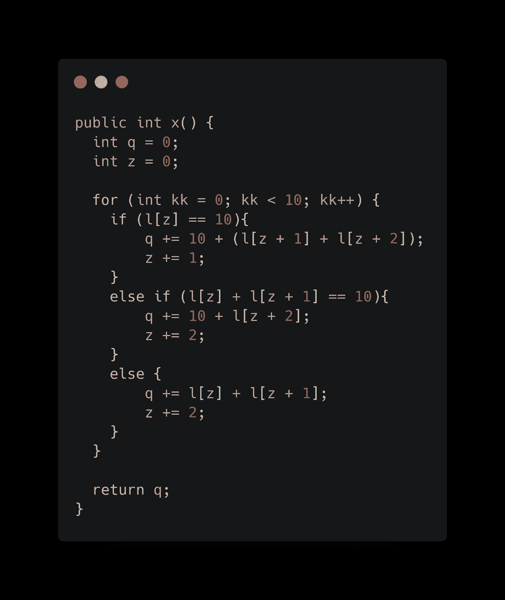

这段代码对名称的表示非常糟糕。名字很短，但一点也不具描述性。

*我相信你的代码里没有这种乱七八糟的东西*😃*。*

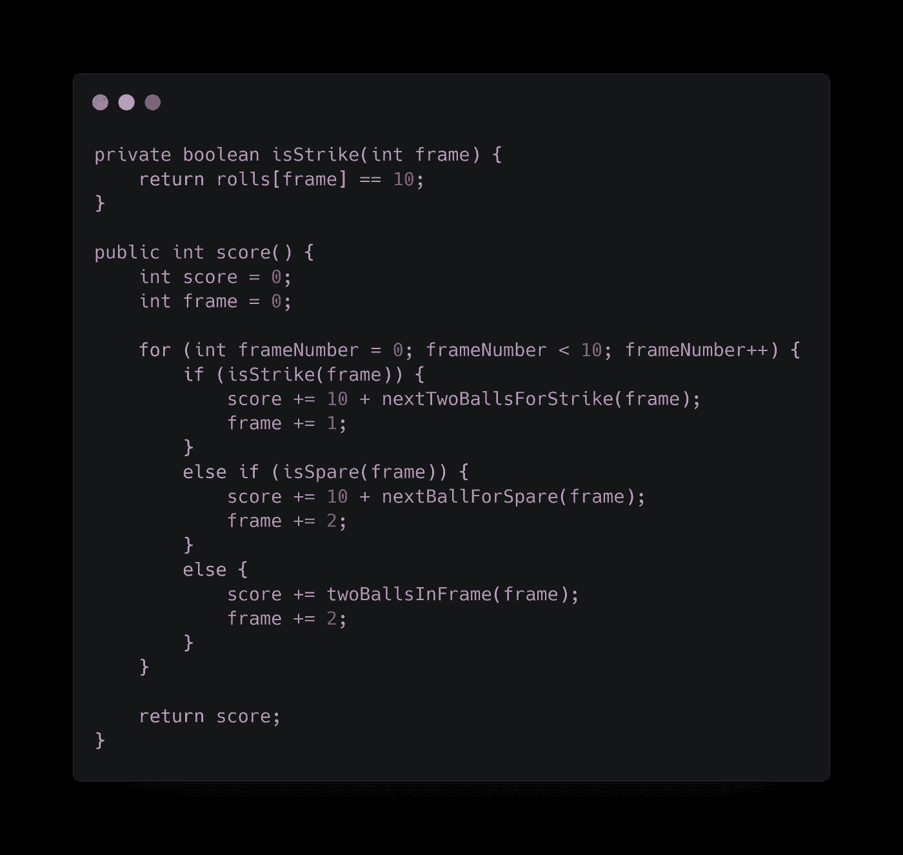

这样好多了。当你读到这里时，至少你能明白发生了什么。

***用命名常数*** 替换幻数

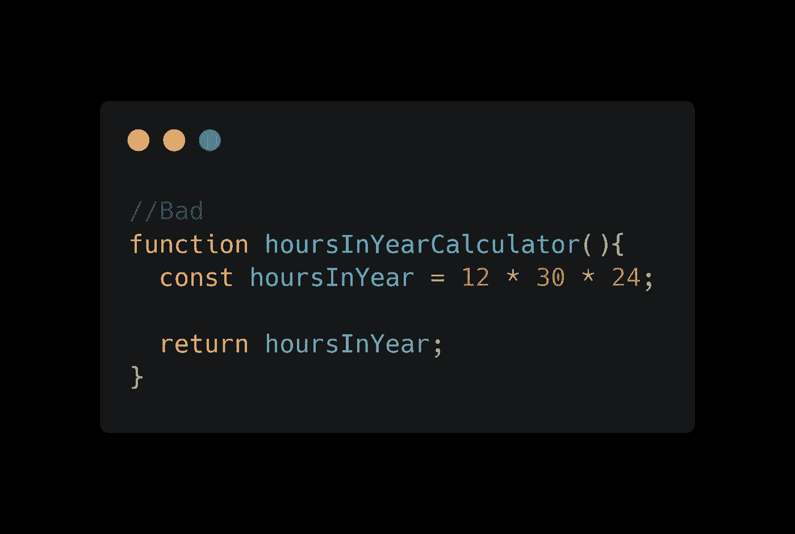

大多数人乍一看无法理解 12、30 和 24 代表什么。

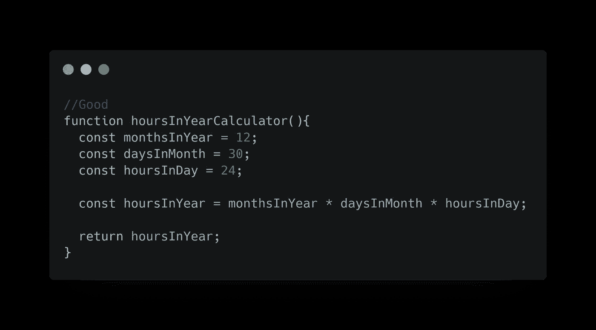

这段代码有更多的行，但是对开发者来说更容易理解。

***对同一类型的变量使用相同的词汇***

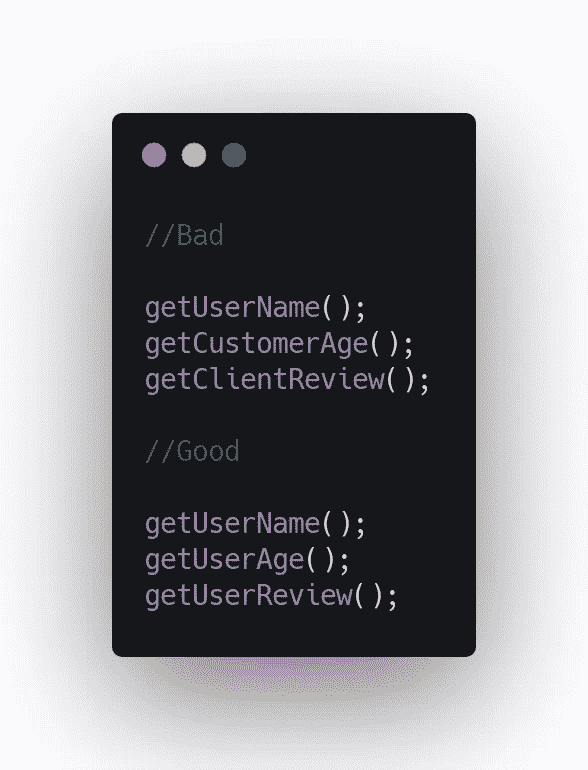

# 2.**代码重复**

当我开始写我的第一个小项目时，这是一个常见的错误。

但是在编写干净的代码时，这是一件重要的事情。尽可能避免代码中的重复。

例如:

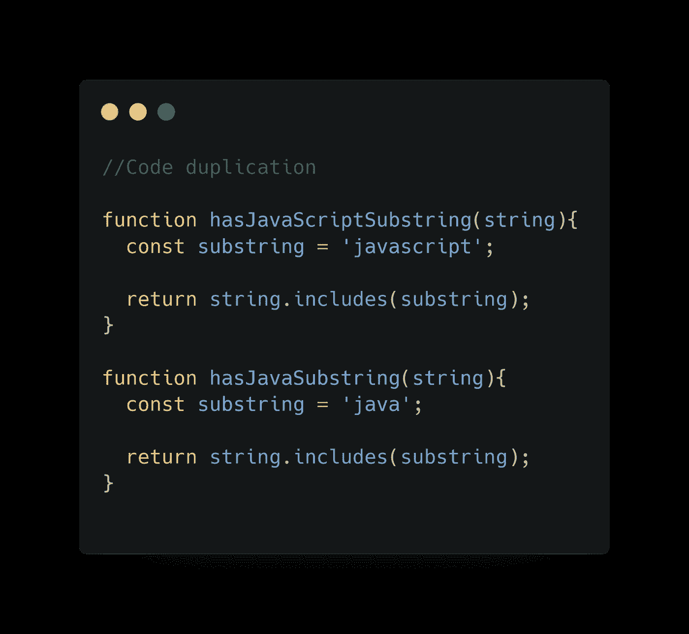

上面的代码可以转换成下面的代码，只需在函数中增加一个参数。

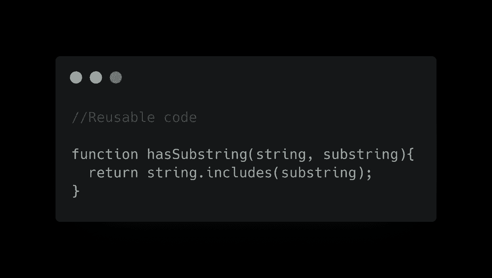

代码的这种改进可以使它更加灵活和轻量级。

# **3。*避免否定条件句***

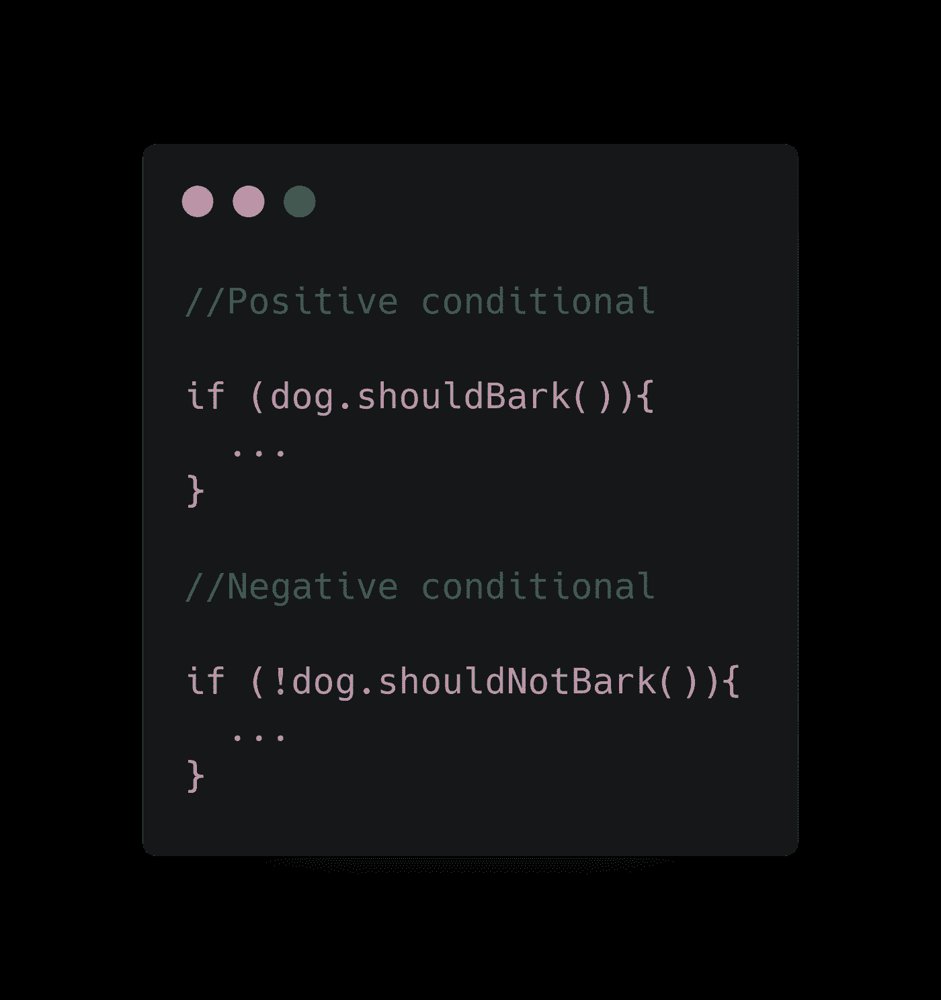

那些条件句检查同样的事情，但是以不同的方式。条件句怎么写由你自己决定，但是我觉得我们大多数人理解积极条件句的速度要比消极条件句快。

# ***4。功能应该做一件事***

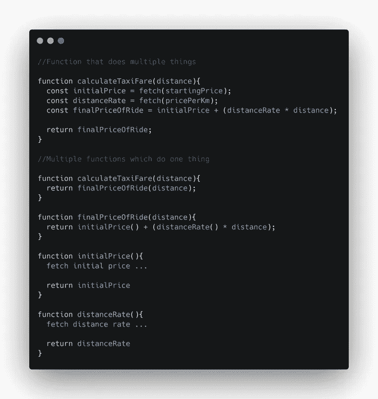

这个“规则”非常流行，我想我们很多人都听说过。

我知道不把你的函数分割成更小的部分会更快，但是相信我，最好多花一点时间去做。在这种分离之后，你可以很容易地在你的函数中导航，即使你很久以前就编写了这个函数。

还有一个好处是你可以有小的可重用功能。

# 5.**避免副作用**

不要覆盖变量。

如果你用 JavaScript 编码，那么尽可能使用`const`而不是`let`。如果你想改变一个变量的值，就对它进行变异，然后考虑这个变量的未来用途。最好再创建一个变量，并赋予它新的值。

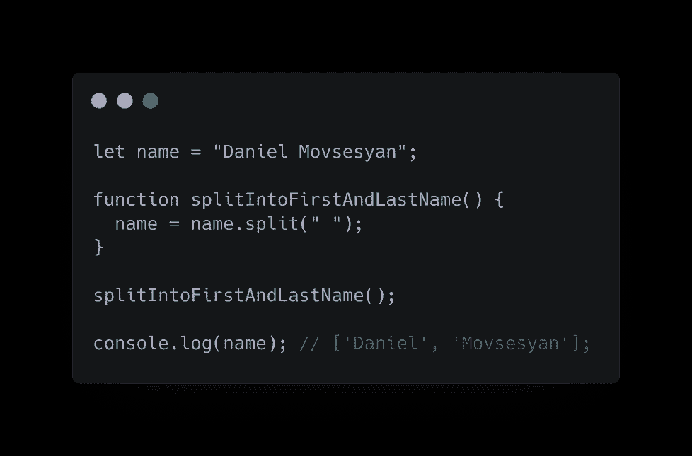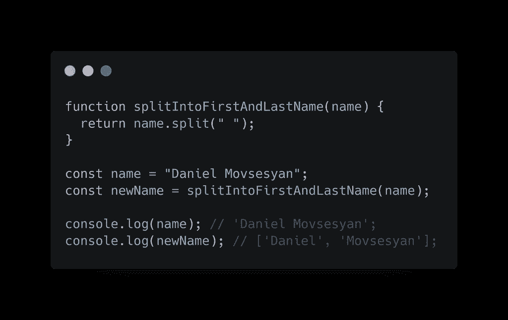

在左侧，我们有一个覆盖问题。我们正在改变名称字符串变量，并给它分配一个数组。

如果我们在其他地方把它当作一个字符串使用呢？我们会得到一个错误，或者更糟，它会正常工作，我们不明白为什么我们的程序不能正常工作。

然而在右边，我们有独立的变量，不会出错。

使用`const` Javascript 会提醒你这种错误。

就是这样。

我建议你阅读**的《干净的编码者**和**的《干净的编码者**的书，希望我的文章能给你写出更好代码的欲望。😉

你可以在下面找到这篇文章的链接:

> [**清理代码**](https://amzn.to/2GSeP3p)
> 
> [**干净的编码器**](https://amzn.to/3b7vpKR)
> 
> [**碳**](https://carbon.now.sh/) **代码演示编辑**