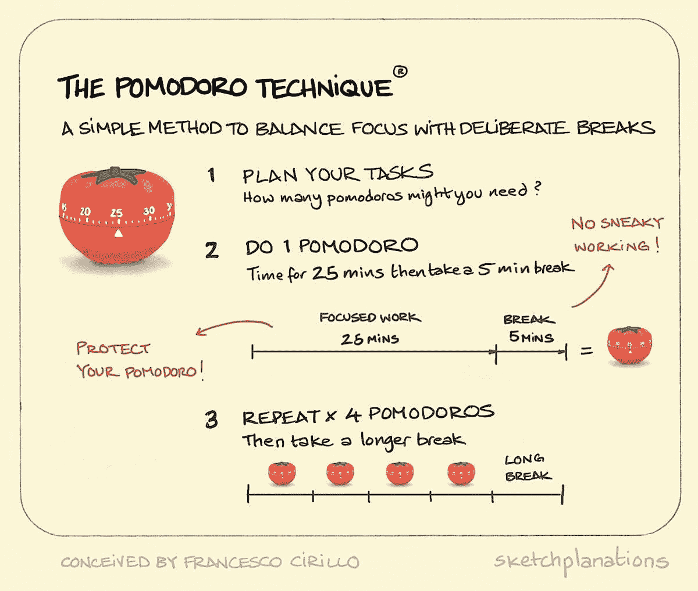

# 如何成为一名更好的软件工程师:一致性(Pt。1)

> 原文：<https://levelup.gitconnected.com/how-to-be-a-better-software-engineer-consistency-pt-1-68506241c66e>

坚持不懈是在生活中取得任何成就的关键……如果做得正确的话。那么，让我们讨论一下一致性的其他组成部分。

照片由[奥斯丁·潘](https://unsplash.com/@austinpoon?utm_source=unsplash&utm_medium=referral&utm_content=creditCopyText)在 [Unsplash](https://unsplash.com/s/photos/laptop?utm_source=unsplash&utm_medium=referral&utm_content=creditCopyText) 上拍摄

有了坚持，你几乎可以实现生活中的任何事情。

从构建你的梦想身体到学习编程，持续的努力是你成功的重要因素。

> *但是，还有* ***两种类型的一致性*** *以及其他高效达成成功所需的支撑组件。*

在本文中，让我们关注编码。

这篇文章是集中讨论两个主题的两篇文章中的第一篇:**一致性和焦点**

一致性是引擎，专注是方向盘。

所以说一致性吧！

## 一致性的两种类型

明确一点:当要实现任何有价值的事情时，一致性是一个必要条件。

问题是，你可能要比正确使用一致性的人多花 10 倍的时间。

一致性的两种类型:灵感一致性和枯燥一致性

*   激发一致性——不仅仅是稳定地出现在代码中，而且推动你自己在当前的编码会话中尽可能地学习和成长。
*   沉闷的一致性——表现出来，但缺乏热情的努力。对充分利用编码时间的信念不冷不热。

再说一次，我会提到锻炼。在成套动作之间休息 5 分钟，或者举重，这些都不会对你构成挑战，这种半心半意的锻炼是可能的。

还有就是找出你积极推动自己达到身体极限并寻求挑战的地方。

将呈现(双关语)最佳结果的方法是清楚的。

> 注意:显然，有平淡的一致性总比没有一致性好。与没有一致性相比，单调的一致性仍然是一种成就。如果你有几天在有灵感的一致性和枯燥的一致性之间徘徊，那是正常的。尽你最大的努力…始终如一。

## 编码时一致性是什么样的？

*   每天编码——你没看错。每一天。即使只是解决一个简单的算法。每天写一些代码。
*   每周解决/学习三次你觉得特别有挑战性的事情——在每周开始时列出三件以上你想做或已经做过但你还没有完全掌握的事情，让你的任务是找出至少三件。
*   每天都想代码——是的，这是我从高中就有的一个秘密。在你空闲的时候，思考一个你过去用过的概念。考虑如何以不同的方式实现它。考虑你不太明白的事情。思考解决项目中问题的不同方法，或者是否可以在 React 返回表达式中使用三元运算符来代替 if 语句。

## 有灵感的一致性和枯燥的一致性在实践中有什么区别？

沉闷的一致性确实每天都在出现，但它并不集中。你的学习是次优的，低效的。

激励一致性要求你首先了解你自己和你最好的工作方式。它关注关于你自己的小细节，管理你的工作流程以满足你独特的需求。

你需要找到一种方法，在每次通过常规或学习方法开始工作时，人为地创造最佳体验。

# 提高持续工作质量的技巧

[由 Sketchplanations 拍摄的照片](https://sketchplanations.com/the-pomodoro-technique)

## 番茄工作法

**番茄工作法**是一种针对学生、完美主义者和各种拖延者的时间管理方法。集中精力，每隔 25 分钟工作一次(Todoist)。

这个想法是，在 25 分钟内，极度集中精力，尽可能努力地完成你的任务；然后你有 5 分钟的休息时间。

一旦你完成了 4 次 25 分钟的深思熟虑的工作，你可以休息 30 分钟。

如果您能够:

*   微小的分心会打乱你的工作流程
*   倾向于连续工作超过最佳生产率点
*   处理大量没有明确停止点的开放式工作(如编码)
*   倾向于对自己在 x 时间内能完成多少事过于自信。

## 基于奖励的技术

基于奖励的技术听起来一模一样。

你设定一个要达到的短期目标，如果你达到了，你会奖励自己。

此外，短期检查点应该为更大的目标服务。

不用说，短期目标会带来较小的回报，而如果实现了更大的目标，你会得到更大的回报。

当使用这种结构时，基于奖励的技术效果最好:

*   做一个包含你自己的宣言
*   清楚地定义你想要完成的短期目标
*   确保短期目标有正确的方向，并能帮助你实现更大的目标。
*   为你的短期目标设定一个时间限制
*   不要欺骗自己。如果你没有在规定的时间内完全完成目标，不要奖励自己。祝下次好运。

## 结论

一致性是一件好事，不管你在给定的编码会话中有多有效，但生活中最美好的部分通常是在额外的一英里中发现的。

这就是激励一致性的意义所在，这额外的一英里将在最好的学习环境中完成你的代码会话，成为你能成为的最好的软件工程师。

可以使用不同的技术来最大限度地利用你的持续努力，为推动进步的“引擎”增压。

每天出现是达成目标的主要功能，而你出现的每一天都是成长或停滞的另一个机会。

> 重新开始每一天。
> 
> 这样，你就不能停留在你的成功上，也不能停留在昨天的失败上。

保重。

第二部分:

 [## 如何成为一名更好的软件工程师:时间管理

### 你已经学会了持之以恒，并采取后续行动，但现在你在玩杂耍 5…

levelup.gitconnected.com](/how-to-be-a-better-software-engineer-time-management-3741df1537c3) 

这里有一篇关于如何用你的一致性建立项目的文章。

[这里有一篇关于软件工程师秘密武器的文章。](/the-secret-weapon-of-great-software-engineers-22d57f427937)

[**通过电子邮件获取我的文章**](https://anthonycg_.medium.com/subscribe) **|** [**购买 5 美元中等会员**](https://medium.com/@anthonycg_/membership)

*大家好，我是安东尼！我当然希望你喜欢这个故事，更重要的是，我希望它能让你思考，这一直是我的目标。我目前正在进行成为一名熟练软件工程师的个人旅程，我希望你能加入我的行列。给我一个关注(和一两个掌声)，我们下次再见！*