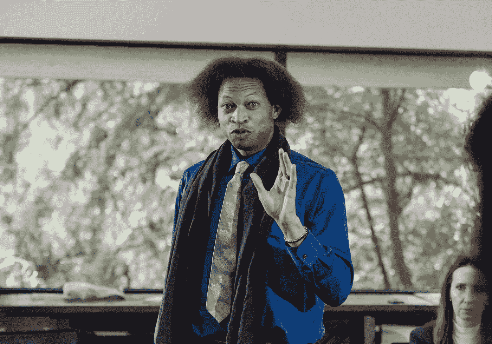

# 如何比下一任硅谷 CEO 更聪明

> 原文：<https://levelup.gitconnected.com/how-to-be-smarter-than-the-next-silicon-valley-ceo-8f7dde712d44>

## 确保你不会被耍的指南

作者:[罗德尼制片公司](https://www.pexels.com/sk-sk/photo/teambuilding-odbornik-profesional-reproduktor-7647993/)

硅谷是一个邪教。

[他们崇拜科技](https://www.theceomagazine.com/business/management-leadership/tech-ceos/)。他们崇拜创新。他们崇拜下一个独角兽创业公司。他们变得沉迷于赚钱。

他们经常不考虑他们行为的人类代价。

在硅谷，技术人员被教导如何成为下一任首席执行官。他们学会了如何让著名的风投投资他们的初创公司。他们被教导如何吸引最优秀的人才。

我研究了很多硅谷的 CEO。现在，我可以教你打败他们。

# 像科学家一样思考

科学方法允许我们有证据支持的观点。

[最好的科技公司首席执行官](https://www.barrons.com/articles/best-tech-ceos-51658528872)知道这一点。他们不争论观点。他们出示证据。

他们愿意听取其他人的证据，然后讨论最好的证据，而不是争论观点。

> 没人在乎你的看法。他们在乎证据。

自信的科学也是如此。科学家说自信是成功的敌人。他们是对的。

当我对自己赚钱的能力过于自信时，它影响了我财务增长的能力。我的信心是一个自我实现的预言。我是从未来的自己那里偷的。

过度自信是谎言。自信也是。

## 埃隆·马斯克是一个谨慎的思想家。

他的座右铭是“不要告诉我想听的，而要告诉我不想听的。”这背后的概念是质疑你认为你知道的一切。

创建一个现实的心理模型让你做出假设是很有诱惑力的——因为这就是大脑的工作。

现实的模型是有帮助的。但是当你开始依赖那些模型，认为它们是真实的时候，就很危险了。

我不希望你像埃隆·马斯克那样思考。我只是希望你能像他一样思考一点。这样，你就知道如何质疑每一个假设。

# 像战士一样思考

你必须在行动和耐心之间找到恰当的平衡。

> 动作太多导致错误。太多的耐心导致不作为。

作为一名企业家，没有不作为的空间。如果你只迈出一小步，就不会有结果。尽管如此，承担合理的风险比做出愚蠢的举动更值得。

这取决于你的观点。

[勇士们处处看到机会](https://www.playwarestudios.com/2018/04/5-warrior-strategies-for-modern-ceos/)。战士们看到了巨大胜利的可能性，即使社会告诉他们他们的想法是错误的。战士是那些眼睛看着地平线，手握世界脉搏的人。

战士是最好的领导者。

# 像艺术家一样思考

CEO 的心态是坐下来写计划。之后，你在上面添加一些结构和领导。

问题是，计划很无聊。大多数人讨厌跟随他们。那么为什么不用一种更艺术的心态呢？

在艺术界，计划被扔出窗外。

> 艺术是人类情感最人性化的表达。

你开始一项新的工作，它就有了自己的生命。你探索。你玩。你改变方向。你会犯错。你爱上了一个项目，但当你厌倦了它，你就让它死去。

然后你继续下一个想法。

秘诀就是拓展和探索。有些事情会失败。有些事情需要大量的工作。但有些东西会是一件天才的艺术品。

# 像工程师一样思考

埃隆·马斯克是一名软件工程师。他制造火箭是因为他想殖民火星。

[埃隆是个糟糕的工程师](https://www.analyticsinsight.net/how-good-is-the-ultra-legend-elon-musk-at-coding/)。众所周知，他不擅长估计时间表。他不擅长估算成本。他不擅长估计如何将埃隆的愿景变为现实。

他做不好是因为他想做。

这是他说“我们以后会修好它”的方式

这就是软件工程师的态度。他们知道如何解决还没有明确解决方案的问题。

[软件工程师被教导要乐观。他们被教导要学会更快地失败。他们被教导要接受这样一个事实:这个世界是不可预测的，软件的蹩脚部分可能永远也不会被构建出来。](https://www.sciencedirect.com/science/article/abs/pii/S0164121206002986)

成功的软件开发人员使用“有抱负的”时间表。他们赌自己。他们不怕在公共场合失败。他们想更快失败。

软件开发者被教育成美丽的失败者。这是他们成为优秀领导者的原因。

# 像政治家一样思考

政客们可以说任何话，然后逍遥法外。他们的工作是说服大众，并用语言来做到这一点。

政客们拿着高薪，因为他们可以面对镜头说“我们要在美国周围建一堵墙，让墨西哥为此付出代价。”很多人认为这是一个很棒的想法，即使这是一个谎言。

在 [Unsplash](https://unsplash.com?utm_source=medium&utm_medium=referral) 上[Natilyn Hicks](https://unsplash.com/@maga_girl?utm_source=medium&utm_medium=referral)拍摄的照片

语言是一种武器。政治家们知道如何把它作为一种武器。向他们学习。

使用让你听起来聪明的语言。使用与人类经历相关的词语。

# 像经济学家一样思考

经济学是对稀缺性的研究。如果你能理解稀缺，你就能更好地理解未来。

> 未来掌握在经济学家的手中

但是用金钱来思考这个世界是错误的。

金钱是一个糟糕的起点，因为它不是目标。目标是创造比消费更多的价值，这样你才能生存、发展并帮助他人。

# 像顾客一样思考

客户体验是做生意的新方式。

你有没有用过一个产品，然后想“哇，这个太蠢了”？

我第一次用优步的时候是这样的。为什么我会想和家人坐在陌生人的车里，和他们一起开车兜风？我为什么要付钱给一个陌生人去做呢？听起来很傻。

作为客户，你不知道制造产品的人有什么计划。他们知道这个计划。你只需要知道它应该如何工作，以及它是否符合你的生活方式。

下一个大的技术领导者将会像顾客一样思考。这是他们如何重建科技和公众之间破碎的信任。

# 这一切都归结为这一点

比硅谷 CEO 更聪明的方法是为自己争取时间。

如果你能买到时间，你可以阅读，研究，学习，变得更聪明，并建立你的技能水平。如果你为自己争取时间，你每次都能打败硅谷的 CEO。

[***加入我的迅***](https://founderstools.substack.com/) ***得病创业点子。***

# 分级编码

感谢您成为我们社区的一员！在你离开之前:

*   👏为故事鼓掌，跟着作者走👉
*   📰查看[升级编码出版物](https://levelup.gitconnected.com/?utm_source=pub&utm_medium=post)中的更多内容
*   🔔关注我们:[Twitter](https://twitter.com/gitconnected)|[LinkedIn](https://www.linkedin.com/company/gitconnected)|[时事通讯](https://newsletter.levelup.dev)

🚀👉 [**将像你这样的开发人员安置在顶级创业公司和科技公司**](https://jobs.levelup.dev/talent/welcome?referral=true)