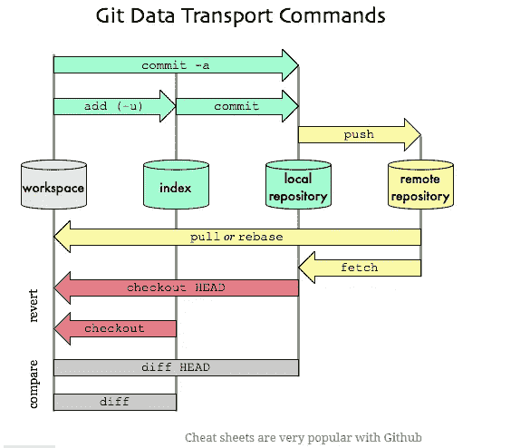
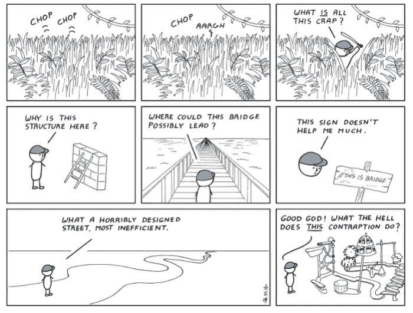
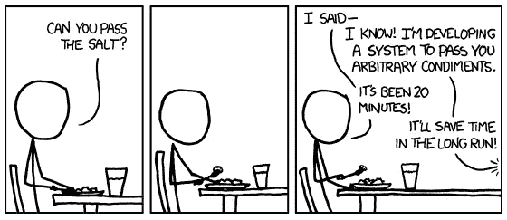
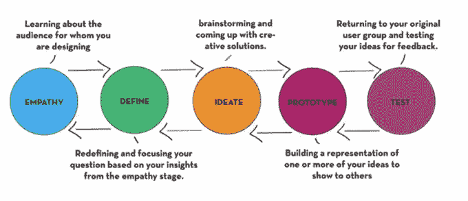

# 如何成为更好的开发者

> 原文：<https://levelup.gitconnected.com/how-to-become-a-better-developer-ae16f4e1e448>

软件工程师花费大量时间来获得技能和学习他们最终可能不需要的东西。这是因为我们喜欢尽可能多的报道，并为任何事情做好“准备”。只有在一家公司开始工作后，我们才发现我们用来获得工作的技能与日常工作所需的技能不匹配。

这里有一些建议、技巧和应用程序，一个有效的程序员应该将它们融入他们的职业生活。

# 1.开源代码库

如果你是一名软件开发人员，理解 [Github](http://github.com/) 至关重要。这是项目中最流行的工具之一，它被广泛使用。然而，它的可用性有点令人困惑，并且有许多命令需要记忆，但是一旦你掌握了它的窍门，高效地使用它会有一种神圣的感觉。

无论你的公司使用什么样的存储系统，如果你使用正确，这个系统既有帮助，如果使用不当，它又是一个障碍。一个简单的推动或提交并不需要太多时间，就可以让你花上几个小时试图理清一些多分支和分叉的大杂烩。此外，如果您经常忘记获取最新版本的存储库，那么您还将面临合并冲突，这一点都不好玩。

# 2.学习如何破译别人的代码

我们都知道你是唯一一个比任何人都写得更好的人，但是能够理解别人的代码是一项很好的工作技能。不管以前的工程师的代码是多么的混乱或者考虑不周，你仍然需要能够涉水而过。毕竟这是你的工作。即使一年前那个工程师是你。

这项技能对你有两方面的好处。第一，能够阅读别人的代码是了解什么是糟糕设计的好机会。当你浏览其他人的代码时，你会知道什么有用，什么没用。更重要的是，你学习了什么类型的代码对另一个工程师来说容易理解，什么类型的代码很难理解。

# 3.管理“时间和会议”

无论你参加的是哪一个编程行业的会议，都是不可避免的，有时也不会有所收获。这里的技巧是当你在一个糟糕的会议中，你没有把事情做好，你需要退出时，学会管理。我们的意思不是直接挂掉电话，不再说话，而是让你自己花时间去处理事情。与其被别人拖累，不如按照自己的速度前进，而不是和你保持同样的速度。

# 4.编写“简单代码”

年轻工程师可能会有一种倾向，就是试图将他们所知道的一切都实现到一个解决方案中。有这样一种愿望:将你对面向对象编程、数据结构、设计模式和新技术的理解运用到你编写的每一点代码中。你创造了不必要的复杂性，因为你很容易过分依赖于你过去使用的解决方案或设计模式。

复杂的设计概念和简单的代码之间有一个平衡。设计模式和面向对象设计被认为是为了简化代码。所以，一定要包含项目所必需的东西，而不是多余的代码。

# 5.操作设计思维

一个难以想象的技能是找到用户滥用我们程序的方法。这是被称为运营设计思维的组织设置，这意味着在设计程序时要考虑到最终用户的使用——如何使用我们的程序，他们可能会发现什么缺陷，以及使用我们的程序会出现什么问题。

例如，由于大部分编程都是维护，这通常意味着更改与其他代码高度纠缠在一起的代码。即使是简单的改变也需要跟踪对象、方法和/或 API 的每一个可能的引用。否则，很容易意外破坏您没有意识到附加的模块。即使您只是更改数据库中的数据类型。