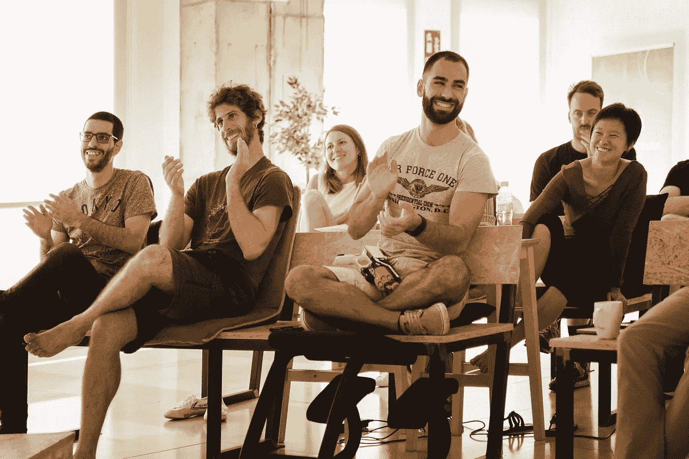

# 如何成为一名更好的软件工程师

> 原文：<https://levelup.gitconnected.com/how-to-become-a-better-software-engineer-3805fdb91407>

## 改变你的习惯是成长为一名专业开发人员的必要条件

凯勒·琼斯在 [Unsplash](https://unsplash.com?utm_source=medium&utm_medium=referral) 上拍摄的照片

回到过去，我从来没有想象过有一份开发人员的工作，每天挑战自己成为一名更好的员工，并提高我的个人技能。我知道这听起来有点显而易见，但并不是每个人都对自己的工作充满热情，在软件开发中，这可能会导致发展过程中的僵局。

在一个像我们这样快速发展的世界中，我觉得有必要每天都成为一名更好的软件工程师，因为我喜欢面对挑战性的问题，为了解决这些问题，我意识到有必要每天都学习新的东西。

这让我开始寻找每天都做这一步的方法、途径和最佳实践。我阅读和观察比我聪明得多的人，我找到了不断提高自己技能的方法。我想分享我是如何处理这个过程的，当然，也想听听你的任何改进建议。

# 开始时集中你的时间

我认为，花一段时间来学习和关注好的实践和新技术是在这个学习过程中迈出第一大步的关键。在意大利毕业成为一名软件工程师后，这次是通过[**Codeworks**](http://codeworks.me/?cw_source=Marco%20Ghiani&cw_medium=Blog%20%7C%20Medium%20%20%7C%20Organic%20%7C%20Post&cw_campaign=The%20Roadmap%20to%20Become%20a%20Better%20Software%20Engineer)**来找我的，这是一个为期三个月的沉浸式编码训练营，在那里我有时间专注于自己。**

**我每天努力向比我更有经验的开发人员学习好的编码技术。那几个月不仅给了我机会去重新组织我对未来的想法，也给了我学习的能力，这将伴随我的余生。**

> **关键不在于花费时间，而在于投资时间。**
> 
> **斯蒂芬·R·科维。**

# **学会教学**

**在 Codeworks 完成学业后，我从未想过的另一件事是，我可以选择继续当一名教师。简单地说，我认为我没有合适的英语水平来教其他人，并且我强烈怀疑我的技能(有点冒名顶替综合症，这是开发人员的普遍感觉)。**

**但是有了那次经历，在提高英语水平的同时(还在努力)，我很快意识到我在教学活动中学到了多少，重复概念，每次都深入挖掘。这是我明确推荐给每一个开发者的东西，它将帮助你更加意识到你真正的编程技巧。如果你没有能力亲自授课，写一些关于你所学内容的博客帖子——这将对提高你的知识有类似的效果。**

****

**Codeworks 中的论文项目演示。**

# **每天至少阅读一篇科技文章**

**我知道*“我没有足够的时间”*答案是对我们天生懒惰的良好保护，但如果我们不强迫自己每天学习新的东西，作为工程师变得更好就成为一条艰难的道路！阅读那些写我们感兴趣的编程语言或模式的人的文章是每天学习新东西的最好方法。**

> ****每天只需 10 分钟，你就可以做到。****

# **开始搜索最佳实践**

**当我们遇到问题时，我们自然会开始寻找解决方案。通常，我们很容易在网上找到它们，但是我们确定这是最好的方法吗？我们是在寻找能让我成为更好的开发人员的最佳实践，还是只寻找能快速解决问题的方法？**

**简单的回答，每当我们面临一个新问题，我们的搜索查询应该从“最佳实践到…”或“高级模式到…”开始。这就是我向顶级开发人员学习并将我的代码转化为专业质量的方法。**

# **努力实现你的想法和激情**

**参与并创造伟大事物的最佳方式是当我们有自己的想法时。当我们的工作是我们喜欢的，是由我们的激情或兴趣产生的，我们会 100%专注于把它做好。每周花一个小时做你喜欢的事情，你会发现投入的时间比浪费在与我们兴趣无关的事情上更有收益。**

****

**伊恩·施耐德在 [Unsplash](https://unsplash.com?utm_source=medium&utm_medium=referral) 上的照片**

# **有时候你必须冒一次险**

> **"任何伟大的成就都离不开危险。"—**
> 
> **尼依格罗酒店·马基雅维利**

**呆在你所了解的技术的安全地带可以让你暂时渡过难关，但是通常有必要冒一次险，浪费一部分时间去研究不同的方法。有时你会意识到你只是在一些永远不会工作的东西上浪费了一整天，其他时候你会用高级模式创建定性代码，值得一个高级开发人员使用。那是你真正学到东西的一天。**

# **包扎**

**成为伟大软件工程师的完美策略？他们不存在。这是一件非常私人的事情，我们每个人都应该找到自己的方式变得更好，成为一名真正的职业球员。我展示了我是如何工作的，我很想听听你们是如何成为更好的工程师的！**

**关于这个话题的评论、分享和讨论总是很受欢迎，我很乐意回答你的任何问题！**

> ****随时联系我** [**Linkedin**](https://www.linkedin.com/in/marcoantonioghiani/)**

** [## 4 个定制挂钩来提升您的 React 应用程序

### 使用定制的 react 钩子使你的代码更整洁，更可重用。自第一个稳定版本发布 9 个月后，反应…

marcoghiani.com](https://marcoghiani.com/blog/4-custom-hooks-to-boost-your-react-app)  [## 重构一个反应组件

### 使用最佳实践编写高效可读的 React 组件的 5 条规则 React.js 已经成为最流行的观点…

marcoghiani.com](https://marcoghiani.com/blog/refactoring-a-react-component)  [## 如何在 React 中使用组件组合

### 按照组合模式创建坚固而灵活的 react 组件。当我开始使用 React 时，我…

marcoghiani.com](https://marcoghiani.com/blog/how-to-use-component-composition-in-react)  [## 我是如何通过改变习惯快速学习的。

### 9 个有效的习惯可以让你学得更快，提高工作效率。一年多前，在我 25 岁的时候，我离开了我的…

marcoghiani.com](https://marcoghiani.com/blog/how-i-became-a-fast-learner-changing-my-habits)**