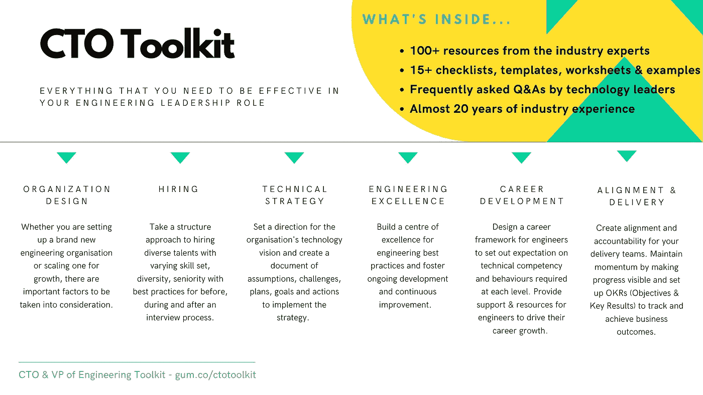

# 如何成为首席技术官(CTO)？

> 原文：<https://levelup.gitconnected.com/how-to-become-a-chief-technology-officer-cto-b7c2f0fdba26>

## 首先，你需要知道:一个 CTO 是做什么的？

布鲁克·拉克在 [Unsplash](https://unsplash.com?utm_source=medium&utm_medium=referral) 拍摄的照片

首席技术官(CTO)的角色似乎很神秘。这是有抱负的技术领导者最常问的问题之一。许多人想了解这个角色的事实很能说明问题——这个角色本身就很有声望，也很神秘。事实上，这是许多科技专业人士梦寐以求的工作。

然而，不要被首席技术官的角色能给你带来什么——名声、自由、经济利益——的想法所迷惑，认为这是不可企及的。它们是外部因素，与角色本身没有任何关系。如果你真的想得到这个角色，你完全可以做到，这是可以实现的。你需要努力工作。你可能需要测试水，以了解它是否是你想要的东西。你需要现实一点。最后但同样重要的是，你肯定需要采取行动。

但是，如果你的目标是有一天成为 CTO，你应该采取什么样的行动呢？

在这篇文章中，我将分享一个 CTO 做什么，以及对这个角色的期望。

# 首席技术官的角色和职责

首席技术官工具包

在我为[首席技术官工具包](https://gum.co/ctotoolkit)所做的研究中，我发现以下是高级技术领导者的职责范围:

📝技术战略
💡卓越工程
⛳️组织设计
👍招聘
☑️职业发展
🚀对准&交付

## 初创公司首席技术官和大公司首席技术官的区别

在首席架构师和工程主管缺席的情况下，CTO 将扮演所有角色。

当有首席架构师时，他们将负责技术战略，尤其是围绕系统架构、特定技术支柱(如机器学习、自动化、数据、安全等)的愿景。

当有工程主管时，他们将负责组织的运营方面，如组织设计、招聘、职业发展以及调整和交付。

大公司往往需要这三个角色，因为每个领域的范围都很大。

当公司还很小，还没有很多工程师为公司工作时(想想小型创业公司)，CTO 通常被期望在以下方面表现出色:

*   卓越的工程设计(包括亲自动手编码和提供必要的代码审查)
*   协调和交付(快速、迭代地交付价值)

随着公司的逐渐成熟，首席技术官的角色也会发生变化——公司可能会有一名首席技术官、一名架构师和一名工程主管/工程副总裁。

首席技术官的角色则更倾向于面向公众，有长期的思考和愿景，然后确保架构师和工程主管努力支持这一愿景。

# 首席技术官职位描述

杰西卡·路易斯在 [Unsplash](https://unsplash.com?utm_source=medium&utm_medium=referral) 上的照片

以下是大大小小的科技公司对首席技术官(CTO)职位的描述。

## 技术战略

*   评估当前的技术状况(技术堆栈、资源、能力等)。)并推荐一个前瞻性的、短期和长期的技术战略愿景和计划。
*   识别、评估和选择能够被公司吸收并显著提高公司短期和长期竞争力的新兴技术。
*   有效地识别流程和技术差距，并将其传达给业务部门。
*   发展公司战略的技术方面，以确保与其业务目标一致。
*   发现并实施能产生竞争优势的新技术。
*   向内部利益相关者、合作伙伴、第三方供应商和投资者传达和管理技术战略。
*   定义公司技术产品的长期愿景和支持战略，包括不断扩展产品以反映公司的发展，并接触更广泛的受众。
*   与业务领导一起开发和领导技术路线图，将关键市场机会与开发工作联系起来。
*   成功地将技术能力转化为战略业务决策，并随着市场的变化或发展识别我们路线图的任何风险。

## 卓越工程

*   制定战略以确保长期平台稳定性和尖端架构。
*   打造世界一流的 R&D 实践和卓越执行。
*   细化和记录开发过程，帮助提高效率和开发人员的体验。
*   细化并记录发布流程和升级程序及处理。
*   建立质量保证和数据保护流程。
*   掌控内部和外部系统及安全基础设施，以确保效率、稳健性、性能和可用性。
*   提供运营方向和持续的流程改进，以满足不断变化的业务需求和市场动态。
*   建立强有力的指标、流程和路线图管理，营造敏捷、精益的工作环境。
*   在你的技术领域内，负责处理突发事件，并倡导整个企业的客户需求。

## 组织设计

*   分析技术、资源需求和工程技能组合，以满足公司的长期需求。
*   与工程团队合作定义技术路线图。
*   推动整个公司的技术部门拥抱创新和效率。
*   监督技术团队，确保技术计划和创新的实施，以及日常支持职能的顺利运行。
*   为可扩展增长定位和准备技术组织。
*   监控工程团队的绩效，了解技能差距和高绩效团队指标。

## 招聘和职业发展

*   通过提供工具、教育和资源，领导面向客户和员工的转型计划。
*   监督工程的所有方面，例如雇用和留住人才、定义最佳实践以及辅导和指导
*   管理工程人员，包括招聘候选人，定期与工程师会面以设定目标和衡量进度，以及管理表现不佳者。
*   在时间管理、开发过程、问题解决和功能设计方面指导工程团队人员。
*   管理一个现有的团队，立即计划发展和招聘更多的软件工程师。

## 调整和交付

*   与执行团队紧密合作，设定业务目标，并将其转化为工程团队的可执行计划。
*   确保工程团队及时介绍并正确理解产品要求。
*   与产品管理和项目领导讨论项目需求。
*   确保需求规格得到记录、审查和批准。
*   协调和指导工程部门多个团队的项目。
*   利用利益相关者的反馈，对技术进行必要的改进和调整。
*   作为技术代表，创建和实施产品开发愿景和战略。
*   成为管理团队的一员，为企业的整体发展和发展方向提供意见。

# 首席技术官的主要优先事项

瓦列里·费多托夫在 [Unsplash](https://unsplash.com?utm_source=medium&utm_medium=referral) 上的照片

作为一名首席技术官，您的主要职责是战略思考、规划、持续改进以及协调和交付，以计划、执行、跟踪和实现业务成果。与其他业务部门合作也很重要，以确保技术是业务成果的推动者，并通过让各方都能看到进展来保持发展势头。

## 成为一名有效的首席技术官

重要的是，不要只看到一张有效的首席技术官的图片，就推断出成为一名有效的首席技术官是怎么一回事。这是因为有效的首席技术官可能会利用自己的优势，做得很好。你应该首先了解一个 CTO 的角色和职责，并利用自己的优势成为一名有效的 CTO，而不是试图像他们一样。例如，如果你的优势在于沟通和影响，实现一致的一个方法是反复沟通目标和承诺。使用 OKRs 仪表板使进度可见，并定期检查它们，以确保您的团队正在处理重要的计划。

无论是小型电子商务初创公司还是财富 500 强科技公司，随着技术成为日常业务的中心，CTO 在当今组织的成功中发挥着关键作用。

如果你的职业抱负是有一天成为首席技术官，你可能会怀疑自己，认为现在这个抱负太大了。但是，当您对 CTO 的工作职责、CTO 角色的主要预期成果以及所需的技能和品质有了清晰的了解后，您就可以从这一刻开始规划并朝着您的目标努力。一个没有计划的目标只是一个愿望，所以确保你优先，行动，反思和纠正以实现你的目标。你可能想看看这个[领导力规划师](https://gum.co/leadershipplanner),它旨在让你专注于对现代劳动力的领导者来说重要的事情！

让我给你留下世界上有史以来最伟大的梦想家华特·迪士尼的智慧之言。

> *如果我们有勇气去追求，我们所有的梦想都能实现。
> ――华特·迪士尼*