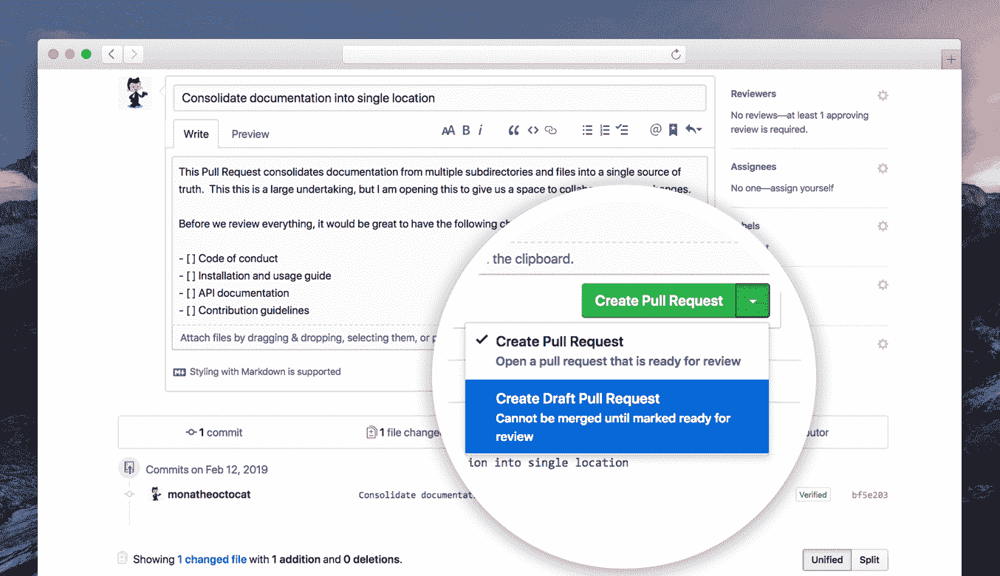
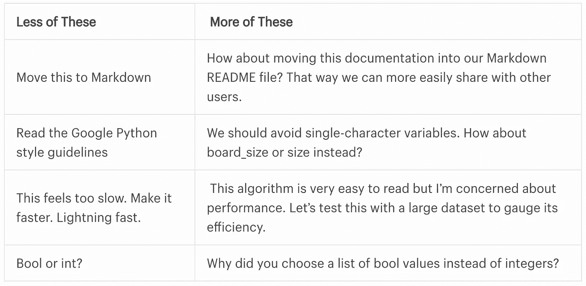

# 如何成为一名高质量的代码评审员

> 原文：<https://levelup.gitconnected.com/how-to-become-a-high-quality-code-reviewer-230b007ea339>

## 下面是您应该为质量代码审查做的事情

照片由来自[佩克斯](https://www.pexels.com/photo/woman-wearing-red-and-black-checkered-blouse-using-macbook-1181472/?utm_content=attributionCopyText&utm_medium=referral&utm_source=pexels)的[克里斯蒂娜·莫里洛](https://www.pexels.com/@divinetechygirl?utm_content=attributionCopyText&utm_medium=referral&utm_source=pexels)拍摄

代码审查阻止错误。尽早阻止他们。在生产前阻止他们。

正式的代码评审是亲自动手的。你知道正式的。你拉了一把椅子。开始和团队成员一起回顾你的学校项目。一切都在现场沟通。

如今，我们使用轻量级的、非正式的代码审查过程，这并没有同样的效果。代码审查的质量降低了。

代码评审参与和发布后的 bug 之间是有关系的。代码审查者的专业知识和参与在这个过程中发挥了作用。

有了这些，很明显我们需要高质量的代码评审。你能做些什么来改进你的代码审查过程？

# 早点提高公关

> 程序中返工的错误越晚，返工的成本就越高，所以应该尽可能在过程的早期找到并修复错误。—法甘

尽快获得反馈。这会带来新的想法。揭示代码中的瓶颈。人们可以提出新的方法或现有的解决方案。

接受批评。有价值的批评，目标代码，应该被接受。接受反馈，更多地了解背景，并进行改进。

你应该调查一下你自己的公关。深入地看代码，即使你已经提出了公关。您错过了恢复某些内容，或者某些内容不太合适。

代码中的秘密，不应该在那里。这很常见。看看 https://www.shhgit.com/的。你可以看到统计数据，这么多的秘密被推到公共回购。

你应该给你的公关贴上标签。将其标记为 WIP。这意味着代码是新的，正在向最终版本靠拢。

在 Bitbucket 中工作，我们[将任务](https://confluence.atlassian.com/bitbucketserver0610/review-and-discuss-a-pull-request-989761348.html#Reviewanddiscussapullrequest-tasks)留给 WIP。“不合并”才是任务。Github 有 PRs 草案，可以的话就用吧。

[https://github . blog/2019-02-14-introducing-draft-pull-requests/](https://github.blog/2019-02-14-introducing-draft-pull-requests/)

# 提出简单的 PRs

开发人员每小时审查超过 200 行代码，导致源代码质量下降。这导致了代码审查中的人为因素。

你应该降低每个 PR 的代码行数。你会得到更多的反馈。依我拙见，没人喜欢大公关。

一旦公关规模下降，评论的质量就会上升。较小的 PRs 很容易处理并放入您的头脑中。较大的代码很难审查，而且糟糕的代码确实会漏过。

[堆叠的钻杆排放系统](https://www.michaelagreiler.com/stacked-pull-requests/)使钻杆排放系统变小。把它们串联起来，你就会得到一个公关——一个令人担忧的场景。

您可以将 [git 子模块](https://betterprogramming.pub/3-tips-to-improve-your-git-submodule-knowledge-171b10481a5a?source=your_stories_page-------------------------------------)合并到您的项目中。其中每个回购处理不同的代码区域。

例如，处理产品可能存在于产品回购中。这样你就有了多个 PRs 和一个同步模块的根。你提高了每个子模块的 PR，从而把 PR 分成了几个部分。

# 评论代码

*关注代码，而不是人*。评论代码，并融入这种心态。

培养我们代码的意识。毕竟，整个团队对软件产品负责。

添加方向，不仅仅是评论。拉动分支，浏览代码。学长就应该这样。您可以看到改进或可能的可重用代码。

[代码评审评论实践](https://medium.com/data-shopify/great-code-reviews-the-superpower-your-team-needs-933bcb84f5e)

# 让专家参与

> 缺乏对代码评审的参与对软件质量有负面影响。

让专家参与您的代码评审。如果他们真的关心，请按要求标记长辈的认可。

> 没有充分讨论的评审的频繁出现与更高的发布后缺陷计数相关。

让你的团队成员参与对话。讨论每一个变化，提出问题，揭示背景。

> 在更大的研究发布中，评审专家的专业知识对发布后的缺陷数量有着可测量的影响。

在不明确的地方评论你自己的公关。联系该领域的专家来审查你的公关。

# 结论

有了所有科学支持的代码评审，我们应该只改进它们。看看别人的代码，留心，留下建设性的评论。其他人也会这么做。

让专家参与代码评审过程，留下不感兴趣的同事。不感兴趣会影响代码评审质量。专业知识在产生高质量的代码评审中起着关键的作用。

# 今天就加入 Medium！

*为什么要* [*订阅*](https://zivce.medium.com/membership) *？*率先抛弃微服 Chrome 模式。其次，你会接触到很多精彩的故事。你可以从[务实程序员的书架](https://medium.com/pragmatic-programmers/directory-of-pragmatic-programmer-books-on-medium-6a5cbadbd4b4)上读到 100 本左右的书。你可以看到来自 Pinterest 团队的障碍、非常有用的提示和伟大的建议。你可以阅读[谷歌云的](https://medium.com/google-cloud)最新进展。

这就是你每月花 5 美元(两杯咖啡)所得到的。你花 5 美元就可以阅读整个实用程序员图书馆。

*免责声明:5 美元中的 2 美元将直接支持我，并为您提供精彩话题。*

# 资源

[1][https://medium . com/data-shopify/great-code-reviews-the-super power-your-team-needs-933 BCB 84 f5e](https://medium.com/data-shopify/great-code-reviews-the-superpower-your-team-needs-933bcb84f5e)

[2] [代码评审研究](https://sail.cs.queensu.ca/Downloads/EMSE_AnEmpiricalStudyOfTheImpactOfModernCodeReviewPracticesOnSoftwareQuality.pdf)

[http://citeseerx.ist.psu.edu/viewdoc/download?[3]doi = 10 . 1 . 1 . 442 . 9057&rep = re P1&type = pdf](http://citeseerx.ist.psu.edu/viewdoc/download?doi=10.1.1.442.9057&rep=rep1&type=pdf)