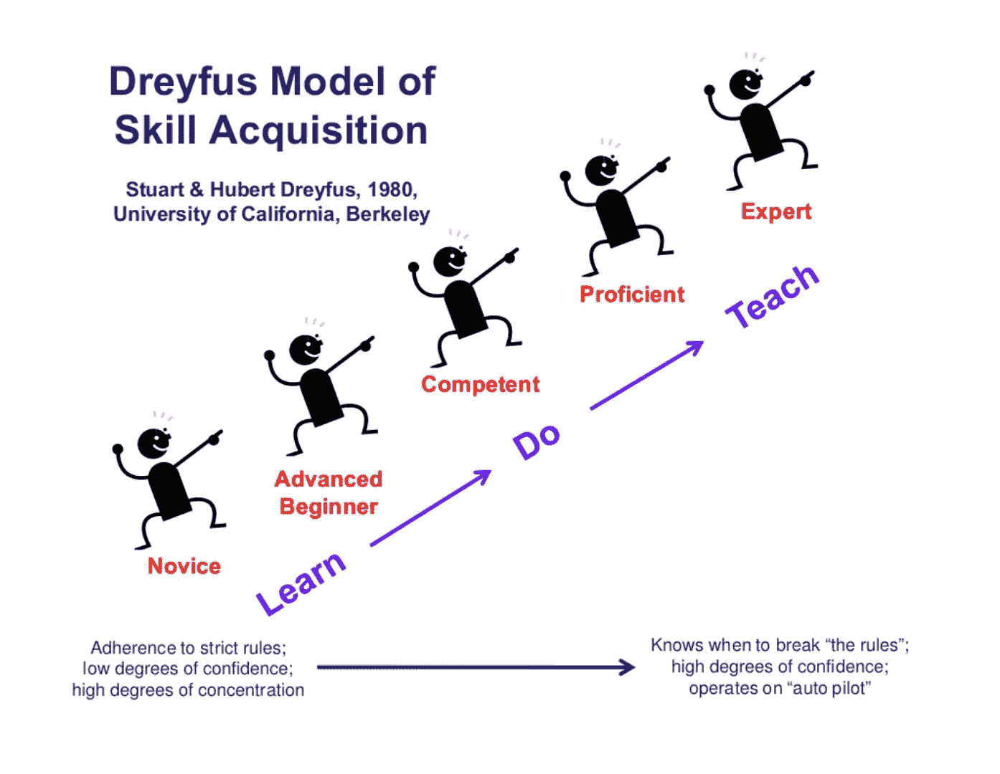

# 如何从一个代码猴子变成一个合法的系统架构师

> 原文：<https://levelup.gitconnected.com/how-to-become-a-legitimate-system-architect-3ccf686e9712>

## [软件工程](https://rakiabensassi.medium.com/list/software-engineering-7a179a23ebfd)

## 如何进入软件工程师的下一阶段的 6 个技巧

[KOBU 社](https://unsplash.com/@kobuagency?utm_source=medium&utm_medium=referral)在 [Unsplash](https://unsplash.com?utm_source=medium&utm_medium=referral) 上拍摄的照片

2006 年夏天，我开始着手我的第一个大型个人项目。这是一个 web 应用程序，它应该为最终用户提供构建他们自己的网站的可能性，而不需要编码。

当时，我使用 Java、JSP 和 Adobe Fireworks(以前的 Macromedia Fireworks)进行 UX 设计。正式来说，我是一名软件工程师。但事实上，我只是一只代码猴子。

一年后，我发现自己在一家更大的公司中使用 Java、Struts、 [JavaScript](https://betterprogramming.pub/javascript-history-and-future-71b0ceb737aa) 和 Delphi 来实现和维护三个 [ERP](/top-erp-and-technology-trends-60b3f67d7e26) 系统。我有机会和一位 Java 认证的软件工程师一起工作，他同时也是我们的项目经理和导师。我记得我和另一个队友曾经问他，我们怎样才能像他一样成为我们领域的专家，他的回答是这样的:

> “你需要克服很多挫折。”

十多年后的今天，我可以自信地说，我在之前的编程和工程生涯中所面临的挑战让我变得成熟。事实上，我职业生涯的大部分时间都是作为一名自由职业者，为 20 多个客户工作——包括不同领域的知名国际公司——这让我看到了全局。我从一个新手变成了懂得如何设计一个系统和领导人们。

下面，我将分享我学到的如何成长为一名软件工程师的六个技巧。

# 1.学会解决客户的问题

有一句老话叫做“*如果你不了解你的客户，你就不了解你的业务*”我完全同意。

系统架构师处于解决客户问题的独特位置。他们了解推动业务的实际需求、优先级和目标。他们了解整个系统是如何运作的，并有能力与所有利益相关者合作，使事情发生。

编码不是系统架构师的技能——它只是他们工具箱中的技能之一。你有责任了解客户是如何工作和思考的。

# 2.建立你的关系网

为了把项目做好，系统架构师需要一个强大的人际网络:

*   他们需要了解哪些需求没有得到满足，以及这些漏洞如何影响收入增长目标的销售人员。
*   他们需要支持那些想解决问题的人，成为公司内部客户的代言人。
*   他们需要[开发者](/a-day-in-the-life-of-a-software-engineer-cb817cf13d0)来创造伟大的产品。
*   他们需要在生产前发现坏的[设计](https://betterprogramming.pub/angular-dynamic-layout-with-ngtemplate-8b6faa995a8f)和[缺陷](https://betterprogramming.pub/build-me-an-angular-app-with-memory-leaks-please-36302184e658)的 QA 人员。
*   他们还需要网络中的其他系统架构师，包括公司内部和外部的。

# 3.学会如何学习

学习是一个不断进步的过程。既是私人的也是职业的。

达到精通的道路有三个阶段:

1.  你需要知道自己不知道什么，并愿意主动教育自己，为自己选择正确的道路:阅读书籍、文章、网络研讨会、与同龄人交谈等。
2.  你需要能够理解复杂的概念，看到不同的部分是如何组合在一起的，并找出模式和陷阱。
3.  你需要一个例行程序来传播你所学到的东西:向他人解释，向你的团队展示，写博客等等。

德莱弗斯技能习得模型([图片来源](https://www.slideshare.net/KarenMartinGroup/the-improvement-professionals-evolving-role-from-practitioner-to-facilitator-oto-coac/13-Dreyfus_Model_ofSkill_AcquisitionStuart_Hubert))

> “如果你不能向一年级学生解释一些事情，那么你就没有真正理解。”—理查德·费曼

# 4.从开发人员或以技术为中心的角色转变

对于软件工程师来说，只写代码而不担心系统如何工作或者市场上的技术真正解决了什么问题并不是成功职业生涯的关键。这就是为什么转变为架构师角色是一个人职业生涯的自然演变。该角色要求您:

*   养成[系统的思维定势](https://betterprogramming.pub/system-thinking-in-software-development-9a7828303e95)。
*   要意识到你无法独自构建伟大的解决方案。相反，你需要一个伟大的[团队](https://medium.com/swlh/characteristics-of-successful-team-60272e59a2c6)，拥有能够解决问题的人。
*   作为团队的领导者，确保每个人都理解系统的目的，并分享你的[愿景](https://medium.com/change-your-mind/how-to-become-a-transformational-coach-d95bc19f9e11)。

开发人员中一个常见的误解是允许他们自己被产品营销或销售人员严格“管理”或控制。对于那些试图成为建筑师的人来说，这是一个错误。

 [## 为什么软件开发人员需要采用系统思考者的思维方式

### 放下原始的编码技能去理解更大的图景

better 编程. pub](https://betterprogramming.pub/system-thinking-in-software-development-9a7828303e95) 

# 5.找一个导师

改善你的系统思维模式的一个很好的方法是向另一个架构师或有经验的工程师学习。

我工作多年，看到很多人在编程和系统架构领域教别人。然而，注意不要仅仅因为他或她已经在那里工作了 10 年或 20 年甚至更长时间就选择一个导师——你应该首先找到一个能与你的个人目标和期望相关的人。

如果你在公司里找不到这样的人，就在网上找一个可以指导你的人。

# 6.培养个人领导技能

许多[开发人员](https://betterprogramming.pub/experience-and-confidence-128a6a4812cd)认为他们无法领导，因为缺乏社交或其他软技能。一旦你成为一名架构师，管理人员的需求就会增加，你必须能够有效地与你每天接触的人沟通并建立关系。

领导力是一种可以[学到](https://medium.com/change-your-mind/5-perseverance-lessons-ef78eca2f8c7)的技能。专注于改善[沟通](https://medium.com/change-your-mind/binary-vs-spectrum-thinking-f9b8226d922)、倾听和信任问题。通过倾听他们的需求并帮助他们实现目标来建立对团队的信任——他们会感谢你的努力并支持你作为回报。

请记住，领导力是一个过程，而不是单一事件。为了评估你是否为一个新的职位或项目做好了准备，你应该慢慢地走完这个过程的每一步。

> “当我们敢于领导时，我们不会假装有正确的答案；我们保持好奇，问正确的问题。”— [敢于领导](https://www.amazon.de/gp/product/1785042149?ie=UTF8&tag=webenius-21&camp=1638&linkCode=xm2&creativeASIN=1785042149)，布琳·布朗

# 最终想法

作为系统架构师，您需要理解所有的事情，并理解不同的部分如何融入整体。你需要有一个[心智模型](https://betterprogramming.pub/ux-mental-models-34b8ede1d42b)，来说明许多[技术](https://betterprogramming.pub/programming-buzzwords-9e94a3544eed)和[范例](https://betterprogramming.pub/serverless-bcc0d2b65b41)之间的关系。

要想在这个职位上取得成功，你应该对学习有一种与生俱来的热爱，并且对软件开发的商业方面感兴趣。你的重点应该从仅仅写代码转移到支持一个团队去创造[伟大的产品](https://betterprogramming.pub/angular-custom-autocomplete-7ffb479477e7)和解决问题。

感谢阅读！

在你的职业生涯中，关于如何成为一名系统架构师，你经历过其他的事情吗？请在评论中告诉我们。

# 想要更多吗？

我为一群聪明、好奇的🧠人写关于工程、技术和领导力的文章💡。 [**加入我的免费电子邮件简讯，独家获取**](https://rakiabensassi.substack.com/) 或在此注册 Medium [。](https://rakiabensassi.medium.com/membership)

*你可以在 Udemy 上查看我的* ***视频课程****:*[*如何识别、诊断、修复 Web Apps 中的内存泄漏*](https://www.udemy.com/course/identify-and-fix-javascript-memory-leaks/) *。*

 [## 作为软件开发人员，构建更好产品的 5 个心智模型

### 为了打造更好的产品，请站在最终用户的角度考虑问题

better 编程. pub](https://betterprogramming.pub/ux-mental-models-34b8ede1d42b)  [## 构建由机器学习驱动的手部姿势检测器 Web 应用程序

### 结合机器学习和网络开发

better 编程. pub](https://betterprogramming.pub/build-a-hand-pose-detector-web-app-powered-by-machine-learning-62131ec43db5)