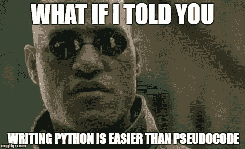

# 如何成为一名通晓多种语言的程序员

> 原文：<https://levelup.gitconnected.com/how-to-become-a-polyglot-programmer-fff48562e708>


[胡安·戈麦斯](https://unsplash.com/@nosoylasonia?utm_source=medium&utm_medium=referral)在 [Unsplash](https://unsplash.com?utm_source=medium&utm_medium=referral) 上拍照

维基词典将[多语种](https://en.wiktionary.org/wiki/polyglot)定义为:(注意#4？)

> 掌握，特别是说几种语言的人。包含同一文本或同一主题的多种语言版本的出版物；尤其是几种语言的圣经。语言或术语的混合。
> 4:(编程)用多种编程语言编写的程序。
> 5:(计算)可以有效解释为多种格式的文件。

艾伦·凯(Alan Kay)是面向对象编程的先驱之一，也是 Windows GUI 的设计者，他说:

“一旦我们开始学习一些东西，我们就很难看到其他东西正在发生……可能你能学到的最灾难性的东西就是你的第一门编程语言，即使它是一门好的编程语言。原因是它趋向于计算。因此，同时学习两三种编程语言可能是一个更好的主意，尽管这是一种不同的斗争，但它至少会使人们对计算的看法相对化。”

在编程生涯中，初级开发人员经常被告知:一个真正的程序员是独立于编程语言的。

这实际上意味着:任何称职的程序员都能够以同等的能力和速度将现实世界的问题翻译成任何编程语言。

> 编程语言是一种对我们的思维习惯有深远影响的工具。
> 
> *- E. Dijkstra*


照片由[🇨🇭·克劳迪奥·施瓦茨| @purzlbaum](https://unsplash.com/@purzlbaum?utm_source=medium&utm_medium=referral) 在 [Unsplash](https://unsplash.com?utm_source=medium&utm_medium=referral) 上拍摄

还有一些行业领袖激烈地提出需要 T 型开发人员，这种人是万能的，也是万能的。

没错，你没看错:全栈杰克，后端高手。再举一个:跨平台移动开发的 jack，安卓大师。

# 为什么一个人需要知道更多的编程语言？

除了行业观点之外，一些实用的观点也促使许多开发人员需要学习一种以上的编程语言:

*   在市场中保持“当前”状态(也就是在裁员中幸存)
*   职位和薪酬规模的增长
*   通过创业开拓自己的职业道路

在我职业生涯开始的很长一段时间里，我把自己归类为只懂一种编程语言。在那个时候，没有人想成为一门手艺的主人。

唯一限制我学习新编程语言的是我不能(或失败)看到任何补充我技能的需要。

我仍然局限于 Visual C++，这使我能够开发 windows 桌面应用程序。哎呀，那是 C++内部的一个框架，甚至不是一个完全成熟的语言！然而，在那个时候，我能够在就业市场上以 C++开发人员的身份展示自己，对此我很满意。

直到职业危机爆发，我无法控制。我被投入到自动化测试中，这是一项我从内心深处讨厌的任务。我艰难地认识到，作为一名开发人员，要在这个行业中生存下来，必须拥有有效和完整的武器。

武器是由编程语言组成的。

至此，不难理解为什么要学习多种编程语言。然而，人们发现很难找到动力。动机:

*   开始学习(也就是跟随一堆视频教程)
*   解决现实世界的问题(任务，Github 项目)
*   展示自己是一个多才多艺的开发人员(在简历中加入新的语言，并在职业生涯中获利)。

# 为什么学习多种编程语言被认为是困难的(为什么不是):

> 毕竟，编程也是一门观察世界模式的艺术，通过在模式中寻找模式，可以更好地理解编程。

本文的目的不是分享学习 Python 或 Flutter 的技巧。有数百万的 Youtube 视频和 Udemy 课程是关于这个的。

这些资源使得获取学习材料变得很容易。视频让学习曲线看起来很平滑，因为人们(包括新手程序员)天生就懒得阅读文档。然而，很快，一个新手开发人员意识到打破被称为编程习惯的链条，学习一门新的编程语言是相当困难的。

通过淹没简历将自己推销为通晓多种编程语言是一回事，用每种语言编写可接受的(如果不流利的话)代码是另一回事。

为什么很难？

这很难，因为每种编程语言都遵循某种共同的结构、共同的语义规则和共同的基本构件来与硬件交互。编译器开发人员很容易理解这个概念。

不了解这个结构，你只是在用你的头撞一堵看不见的铜墙铁壁。

不像英语、西班牙语或意大利语。所有人类语言都有一个被称为语法的结构——它们都有名词和动词以及有意义地将它们联系在一起的东西。

然后就是词汇。

如果你试图学习词汇而不学习语法，你注定会犯严重的语言错误。(**读作:** 10000 LOC +编译失败)

另一方面，如果你精通语法但词汇贫乏，你最终会变得沉默或口吃。(**读:**空空的类文件和塞得满满的流程图)

本文的目的是概述一些定义、关联和区分编程语言的模式。

一旦你看穿了它，你就无法视而不见。学习任何新的编程语言并掌握它是相当容易的，不会失去周末或通宵作业。

毕竟，编程也是一门观察世界模式的艺术，通过在模式中寻找模式，可以更好地理解编程。

# #1:一切都是对象:

函数式编程的支持者可能会反对 OOP 直到最后一口气。当他们指出 OOP 的荒谬之处时，他们并没有错。

但是对于编程来说，一切都是真正的对象。这不可能是任何其他方式。

即使它是谬论，一个人必须相信它是预言来开始编程。

> 所有的语言都把你的代码看作是一堆不同层次的对象——你能否看到它取决于你看得有多深。

对象绑定数据。他们还对数据进行抽象，从而向客户公开接口并隐藏实现的荒谬性。它们为程序员提供了最重要的能力:通过人类可理解的语义将现实世界的问题转化为机器可读的代码。

函数是对象做的事情。即使在函数式编程语言中，函数也是第一类对象。它们必须根据对象来定义，而不是反过来。

对象是绑定代码的原子。(当然也有比特和字节，但我们讨论的是人类理解的方面。)

所有的语言都把你的代码看作是一堆不同层次的对象——你能否看到它取决于你看得有多深。你越早理解这个概念越好。

# #2:事半功倍:

如果你想用 Java 反转一个字符串，你可以这样写:

```
//This will convert **“hello”** into **“olleh”**.new StringBuilder(myString).reverse().toString()
```

如果你想用 C++实现它，下面是这段代码:

```
void reverseString(char *inputString)
{
  char *p = inputString, *s = inputString + strlen(inputString) - 1;
  while (p < s) {
      char tmp = *p;
      *p++ = *s;
      *s-- = tmp;
  }
}
```

C++中的代码运行得更快，因为 Java 是解释语言，而 C 产生特定于平台的机器代码。

但是如果你注意到，这里显示的代码片段是一个 C 实现。C++实现仍然可以在一行代码中使用`std::reverse.`完成相同的任务使用更多的代码行更快并不是我们在这里得出的结论。

同样，Java 版本没有理由不做与 C++版本相同的事情:迭代内存地址以反转字符序列。

区别在于默认的做事方式。由于 Java 的语言能力，您很容易倾向于选择一行搞定一切的方法。

在 C++中，你可以对每个内存地址进行细粒度的控制。

当你想把" **Hello World** "改成" **olleH World** "时，熟悉 C++版本会让你像喷气式飞机一样起飞。但是作为一名 java 程序员，您将会摸索文档，看看是否有任何相反的()来满足您的定制需求。

事情就是这样:**高级语言很强大。但是低级语言给你带来更多的力量。**

这不仅适用于 Java，也适用于任何高级语言，如 C#、Javascript 或 Python。

低级编程语言只不过是机器代码。这与用一系列开关使一台复杂的机器工作没有什么不同。

> 低级语言是工具箱，超集，像水轮机一样利用计算能力。

历史上，所有汇编后的编程语言，包括 C++，都被称为高级语言。任何将程序员从编写机器代码中抽象出来的东西都是高级语言。

然而，丰富的功能允许你定义对象，编写人类可读的函数来处理内存和线程，这使得 C++(及其前身 C)成为一种高级低级语言。这是性能和可读性之间的最佳平衡点。

20 世纪 60 年代后，由于高级语言的兴起，低级语言几乎已经过时，高级语言是用更少的代码做更多的事情。但是由于它们抽象了很多东西，最终会消耗更多的机器资源。

例如，在 20 世纪 90 年代，Java 的兴起几乎消除了内存管理的需求。这导致了低性能的 web 小程序，由于硬件能力和互联网带宽的平行增长而受到抑制。

然而，由于它们更简单的语义，高级语言吸引了数百万程序员。结果，软件开发在 90 年代变得非常便宜。

计算机科学中有一句谚语是这样说的:

> 出售的程序:快速、可靠、便宜:选择两个。

今天，互联网实现了无限协作。高级语言能够无限制地扩展自己。因此，人们可以使用单行代码编写整个网络操作。

Python，一种诞生于 1991 年的解释性语言，以其简洁著称，以至于关于它的模因遍布互联网:



来源: [Imgflip](https://imgflip.com/tag/python?sort=top-2018)

它为一些最著名的软件服务提供支持，包括 Dropbox、Youtube、BitTorrent、Spotify 和 Reddit。当然，数据科学运行在 Python 上。

然而，这些是高度定制的**一种最适合但不是全部的**解决方案。如果您想要满足您独特的性能需求的功能，您应该选择相当低级的语言，对每个机器交互进行细粒度的控制。这就是为什么大型科技公司的核心业务都是用 C 或 C++编写的。

谷歌的 PageRank 本质上是一个 [MapReduce，用 C++](https://en.wikipedia.org/wiki/MapReduce) 编写。几乎所有流行的操作系统和编译器都使用 C 或它的变体。 [AWS 后端](http://highscalability.com/amazon-architecture)，一个为[几乎一半的世界云](https://www.ciodive.com/news/iaas-Azure-AWS-Google-Cloud-Alibaba/559716/)提供动力的实体，是用 C++编写的。Git 也有一部分是用 c 语言编写的。脸书是超级流行的移动开发框架 React Native 的创始人。然而，它使用 Objective C 和 C++编写其 iOS 新闻提要屏幕，以获得最终的性能+定制优势。

那么，外卖是什么？只要遵循低级语言的工作方式:

> 多做少得，这样当你少做多得时，你就明白自己在做什么。

简而言之，除非你理解操作系统、硬件和编程命令如何相互作用的关键基础，否则你无法开发出一个健壮的、可行的软件。低级语言是实现它的唯一途径。

从 C/C++双头垄断中学习至少一种语言。低级语言是工具箱，是像水轮机一样利用计算能力的超集。每一种其他语言都将是其复杂性的简化版本，随着年龄的增长，编程对你来说将变得轻而易举。

你会惊奇地发现学习更高级语言的速度和效率，你只需写更少的代码就能以最高效的方式获得更多的结果。

谁知道呢，也许有一天你会推出自己的产品呢？

# #3:只有 3 种收藏类型:

对所有语言来说，是的。它们是:

**数组(列表)、映射(字典)和集合。**

数组提供索引访问。

地图提供键值访问。

集合提供了一种存储唯一事物的机制，尤其是当集合中只有成员关系时。

它们通常都能够迭代，这意味着可以使用 for / while 循环像序列一样遍历它们。然而，这种能力依赖于特定的语言。

我们不是在讨论它们的底层数据结构，只是它们的实用程序。可以使用堆栈来实现数组。地图可以用树来实现。可能性是巨大的。

除非你准备进入大型科技公司(FAAMG 及其同类公司)或关键任务软件生产商，否则对于大多数编程任务，你只需要处理集合，而不是底层数据结构。这是因为每种编程语言都提供了集合，这些集合以最可能有效的方式实现，用于一般目的。

如果您需要高性能(每天有数十亿人访问网站)，定制设备限制(更少的内存/处理能力)，或者两者兼而有之，您只需要调整数据结构。

一旦您理解了这个概念，跨任何语言处理大多数数据密集型任务将变得相当容易。

**专业提示:**除了集合，还要学习那些集合附带的功能操作:映射、过滤和归约。这些是任何数据密集型操作的基本要素。只要浏览他们的文档页面，你就不需要任何在线教程来掌握这门新语言。

# #4:风格是一个(非常短的)时间问题(& IDE):

许多开发人员喜欢 Python 的一个(愚蠢的)原因是它不需要分号，并且不区分“”和“”。

这也是一些[伟大的开发者讨厌它](http://www.hackerfactor.com/blog/index.php?/archives/825-8-Reasons-Python-Sucks.html)的原因之一。

这样对整容元素的爱恨是主观的，我们都知道。然而，我们抵制自己屈服于这种基本原理，并无限期地拖延学习一种新的、有用的编程语言。

很多时候，这种风格偏好是使用 IDE/插件自动执行的，现在的 VSCode 非常丰富。要么你把它们用在你自己的优势上，要么让自己适应新的、但不舒服的编码风格——选择权在你。

没有人会因为这个来看你和评价你:

```
void myfunction(int s)
{
   //3 tabs
}
```

或者:

```
void myfunction(int s) {
     //5 tabs
}
```

相反，myfunction()的输出会呈现在世界各地的计算机屏幕上，让你成为历史的一部分。

作为一名程序员，你从工作中获得的最大满足是:睡觉时知道在你编程的一天里完成了一些事情。无论如何，任何一天，其他的都不重要。

# 结论:

> 一个好的开发人员将他的技能分散到均匀分布的多个散列表桶中，而不是将他所有的技能放在一个桶中。

一代程序员认为英雄开发人员是通晓多种语言的程序员——他们精通多种甚至不相关的编程语言。

虽然追求如此宏伟的职业目标有时会导致抑郁，但了解更多的编程语言利大于弊。

你只需要确保它们互相补充，让你在你的领域成为一个完整的程序员。一个好的开发人员将他的技能分散到均匀分布的多个散列表桶中，而不是将他所有的技能放在一个桶中。

懂 C 和汇编都可以让你成为一名优秀的嵌入式系统程序员，但你会成为一名高度专业化的程序员。将 Java/C#或 Javascript 添加到你的技能组合中，将会极大地扩展你的网络+移动开发技能组合。你可以通过在线销售一些嵌入式服务赚取数百万美元。

随着开发人员的工作[变得越来越具有挑战性，以维持](https://medium.com/@tipsnguts/competent-developers-are-underpaid-here-is-how-to-fix-it-95dea3c19b55)一生，未来属于多面手，而不是专家。