# 如何成为一名职业邮递员

> 原文：<https://levelup.gitconnected.com/how-to-become-a-postman-pro-bc2daa6caaaa>

多年来，Postman 一直是改善许多开发人员软件开发体验的重要工具。如果你正在寻找一种方便简单的方法来使用 API，Postman 就是你的解决方案。

# 邮递员是什么？

您可以阅读 Postman 的网站来获得这些信息，但是让我们保持它简单和容易:它是一个用于测试、开发和集成 API 的工具。

你可以测试和开发你自己的 API，或者将第三方 API 集成到你正在开发的应用中。无论如何，Postman 几乎肯定会是一个有用的工具。

# 为什么用邮递员？

第一个原因是 Postman 是免费的(除了一些你可能不需要的高级功能)，第二个原因是它开箱即用，功能齐全。以下是使 Postman 成为您的武器库中一个极其有用和强大的工具的主要特性:

## 变量

这是使用 Postman 的一大亮点。例如，您现在可能正在向一台服务器发出简单的请求，但是您可能需要向多台服务器发出请求，例如开发、测试或生产环境。在这种情况下，Postman 的环境变量非常有用。

## 预先请求脚本

这些都是不言自明的。在请求开始并被发送到服务器之前，您运行一段 JavaScript 代码*。一个简单的例子是根据您使用的环境变量来格式化您的请求体。另一个例子是我个人最喜欢的一个例子，如果请求被发送到一个生产环境，这个环境可能是由于选择了错误的环境而导致的事故，那么让 Postman 抛出一个错误。*

## 试验

测试是在一个请求被发送到服务器后运行*的脚本。您可以编写测试来验证 HTTP 代码是否为 200，甚至验证响应正文是否包含您所期望的一些文本。这些测试使用 [Chai 断言库](https://www.chaijs.com)。*

# 获取设置

你要做的第一件事是去 Postman 那里[下载](https://www.postman.com/downloads/)并安装应用程序，如果你还没有安装的话。

完成安装过程后，你将看到的第一页应该是这样的。

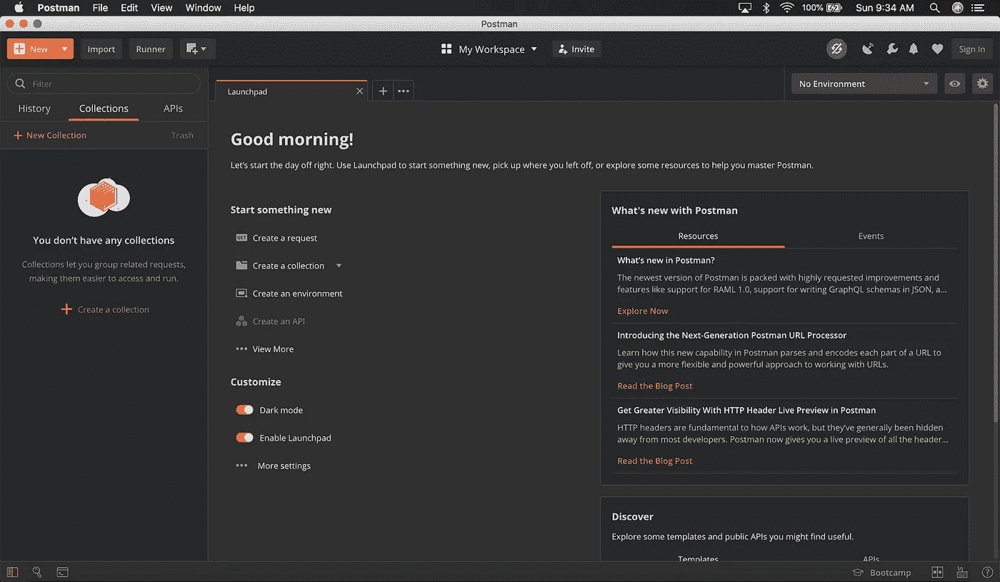

仅仅是邮递员的第一批货，这里就有很多东西要接收。

首先要做的一个步骤是导航到设置并将`SSL certificate verification`设置为**关闭**。

此设置将为您的请求提供最佳机会，使其不会遇到某种类型的 SSL 网络问题。

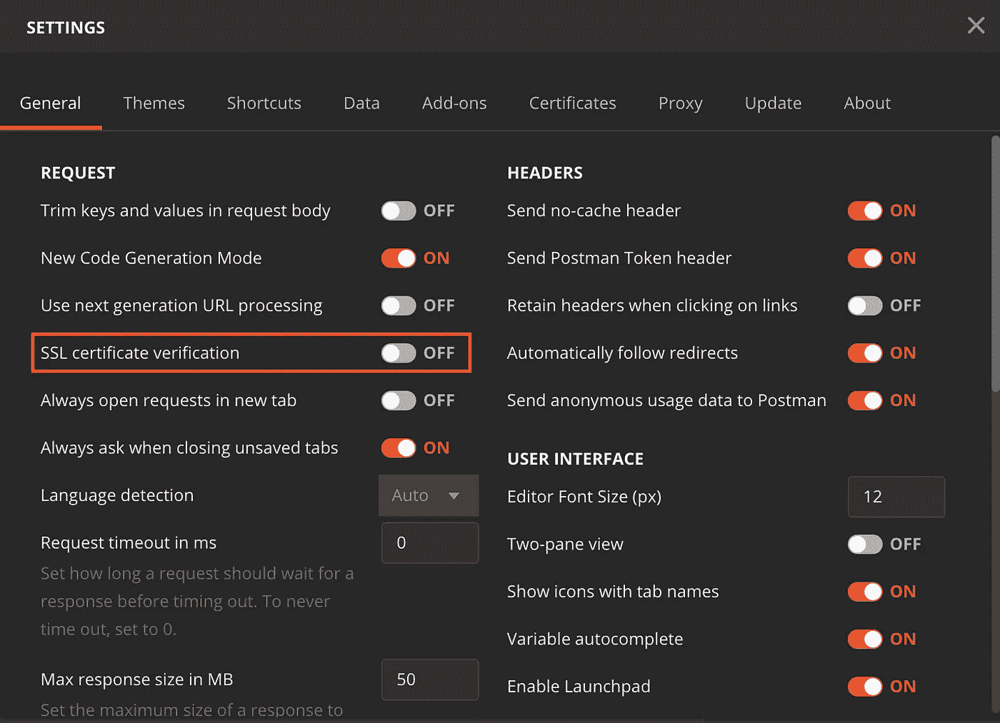

# 第一次收集和第一次请求

现在我们准备开始提交请求。在这些例子中，我将使用方便的 JSONPlaceholder REST APIs，它将允许您跟随，因为这些 API 易于使用，是免费的，并且是测试用的公共 API。

你要做的第一件事是展开`New`按钮。在本文中，我们将只熟悉前三个或“构建模块”。

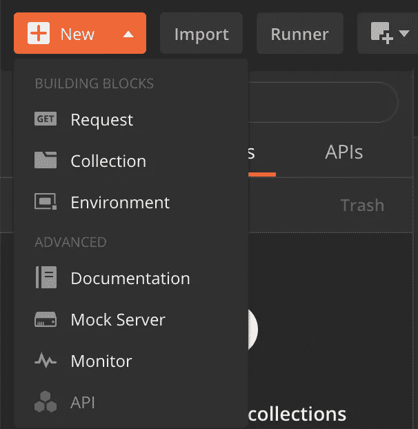

点击`Collection`将弹出下面的模式，您可以根据需要提供收藏名称和描述。其他选项稍微高级一点，我们稍后将回到其中的几个选项。

集合是属于单个应用程序的请求的容器。因此，在我们的实例中，所有与 JSONPlaceholder 相关的请求都将放在我们刚刚创建的集合中。如果我们以后要向 Spotify API 发出 API 请求，我们将创建一个 Spotify 集合，并将请求作为该集合的一部分。

Postman 还支持对描述进行降价。如果你不熟悉 Markdown，你也可以提供简单的纯文本。

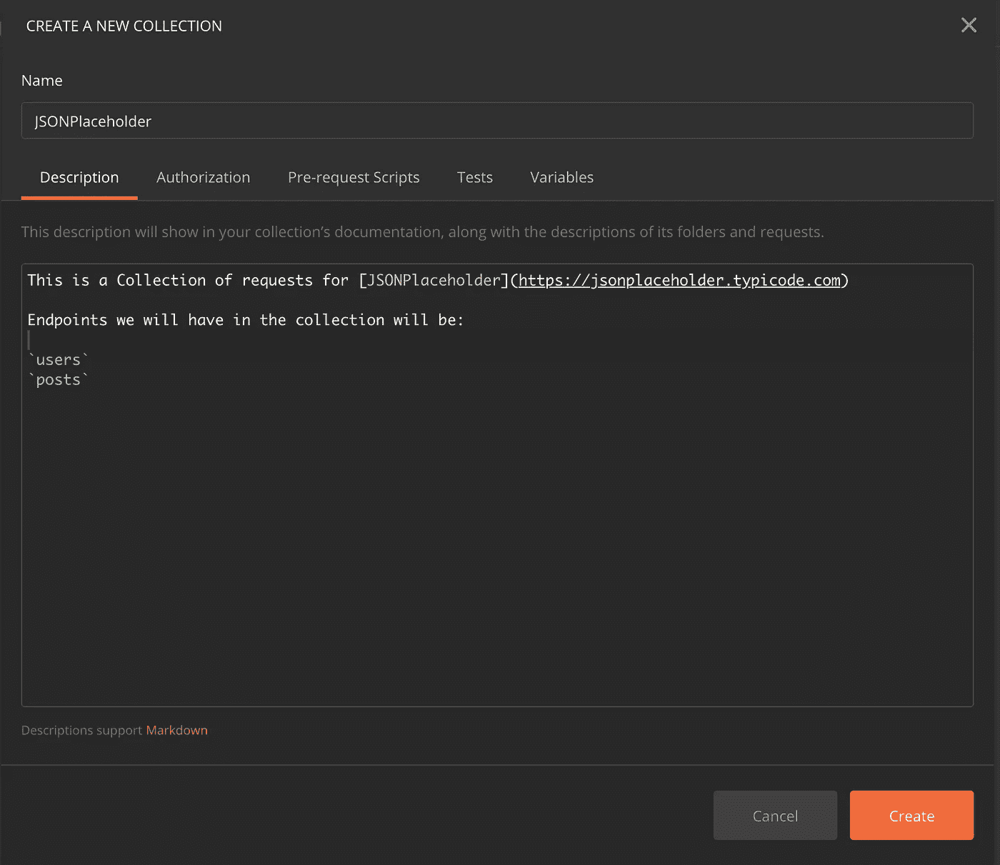

你现在应该可以看到你的收藏和漂亮的文档了。

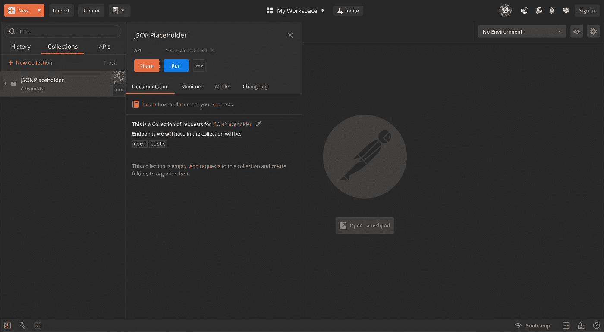

您可以点击`Add requests`或转到`New` - > `Requests`，它们都将为您提供相同的模式，您可以在其中提供请求名称、描述(如果您愿意)并选择集合。

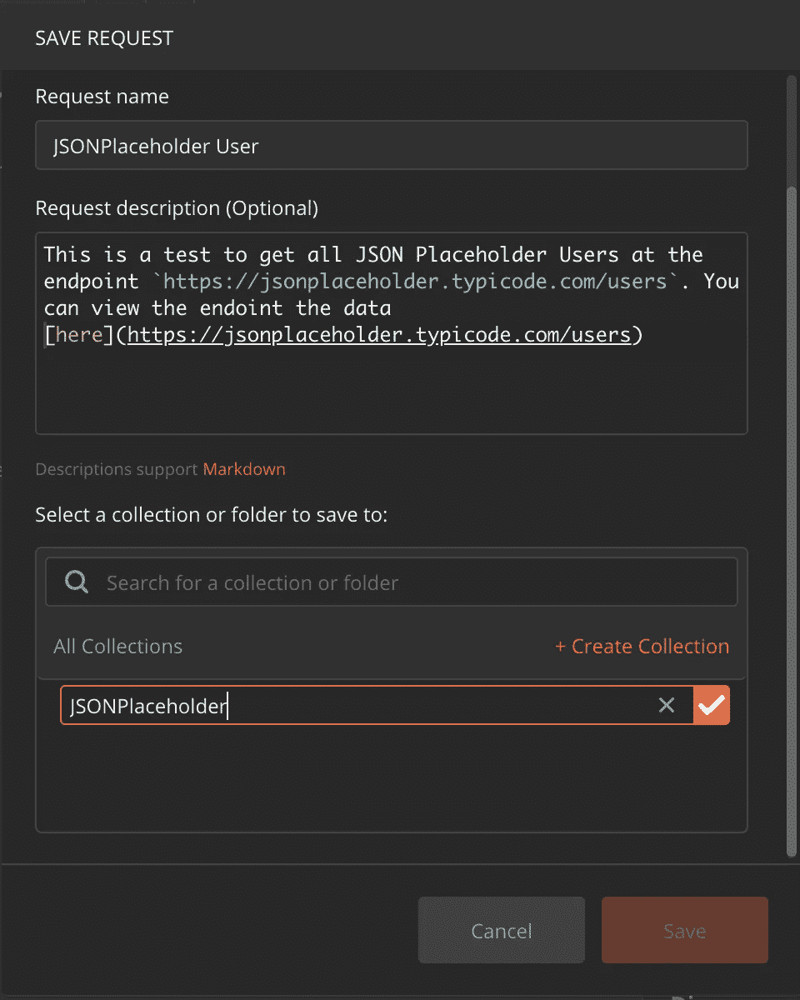

现在您将看到一个空请求，您可以在其中提供`[https://jsonplaceholder.typicode.com/users](https://jsonplaceholder.typicode.com/users%60)`的 url，然后单击`Send`。

点击 Send 按钮后不久，您应该会在窗口底部的 Body 部分看到 JSON 数据。

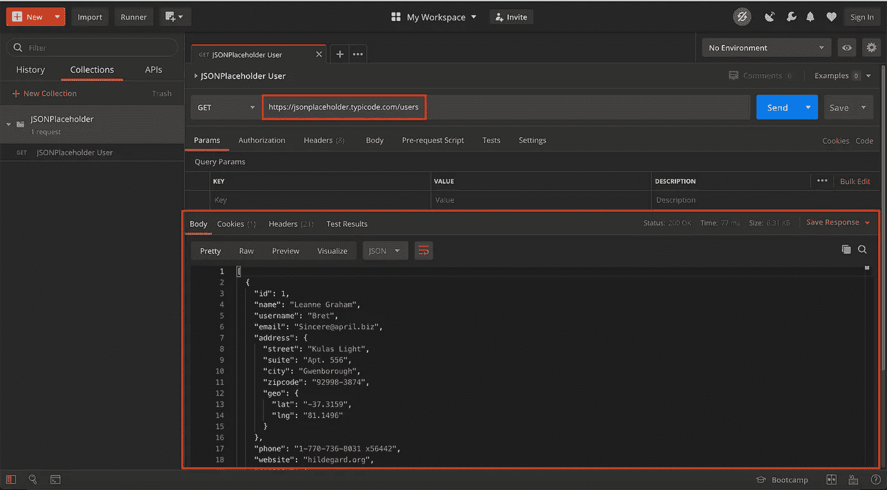

恭喜你。您只需成功请求从 JSONPlaceholder 获取用户数据。

# 变量

现在是开始使用一些变量的时候了。首先有几种不同类型的变量。我们将从一个环境变量开始。

点击`No Environment`右侧的眼睛图标

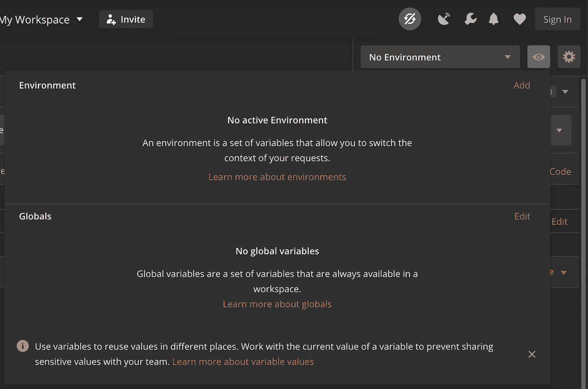

点击`Add`将提供以下模式。

环境变量基本上有三个部分

## 1.)环境名称

通常，您的环境名称将包含应用程序环境，如开发、测试、生产等。

## 2.)变量名

变量名通常在每个应用程序的环境中共享。

## 3.)该变量的初始值和当前值

每次选择新的环境变量时，初始值和当前值都会改变。

举几个例子来说明这个特性的价值。下面是带有“PROD”环境的 JSONPlaceholder 的可能示例。

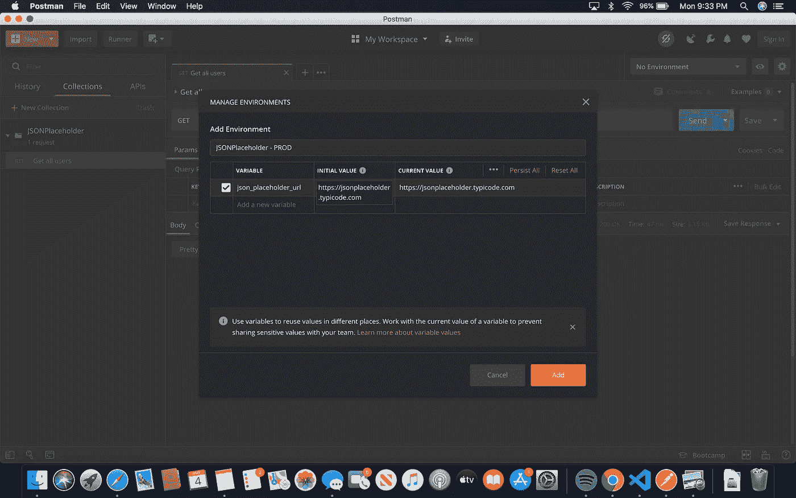

下面是一个开发环境的例子

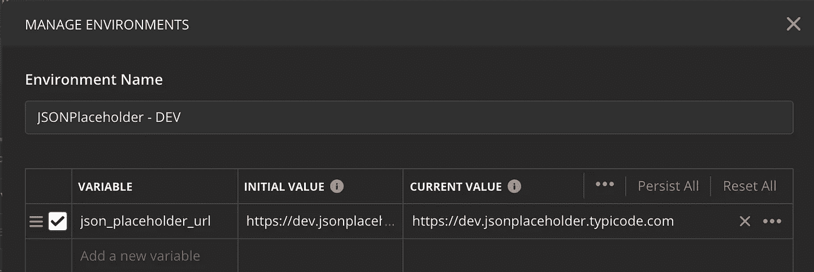

现在是时候通过在地址栏中放置`json_placeholder_url`变量来使用环境变量了。这和 prod 之间的细微差别是`[https://dev.jsonplaceholder.typicode.co](https://dev.jsonplaceholder.typicode.com)m`而不是“PROD”URL`[https://jsonplaceholder.typicode.co](https://dev.jsonplaceholder.typicode.com)m`。

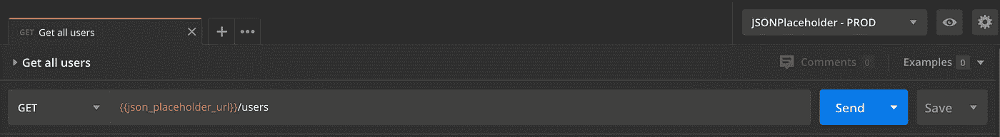

如果您有多个环境，您可以根据需要在右上角选择它们，切换到您想要的环境并发送您的请求。

# 请求前脚本

所以首先要引起你注意的是，邮差有着出色的智能感知。看一下这些函数和属性可能是值得的。您最常用的可能是:

`environment` —环境变量有一个`get`和`set`

`globals` —有一个`get`和`set`用于全局变量

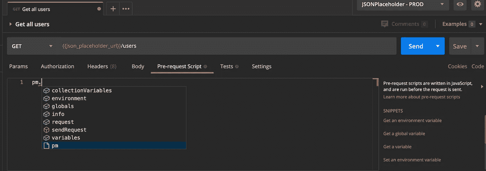

下面你会看到一个读取环境变量值的例子。

注意控制台有三条线。前两个是我们的`console.log`语句。最后一个是实际要求。

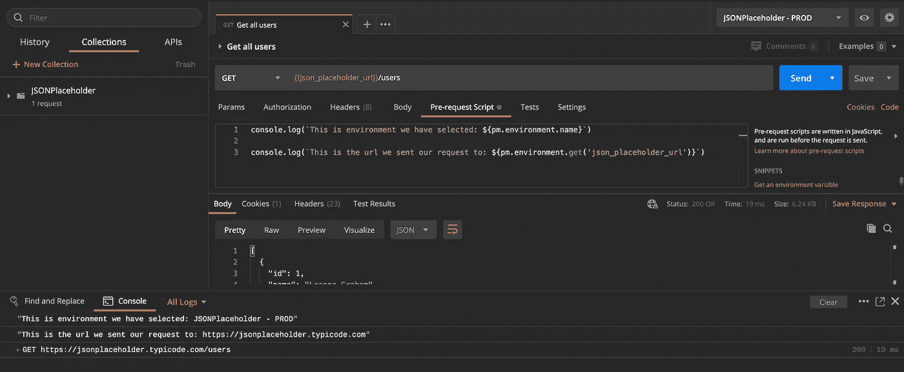

这是对前一个例子的一个小改动。该示例添加了几行代码，用于检查您是否针对生产环境发出请求，如果是，则抛出一个错误。

您将再次注意到控制台中的三行代码，但是请求***没有被*** 发送到服务器。

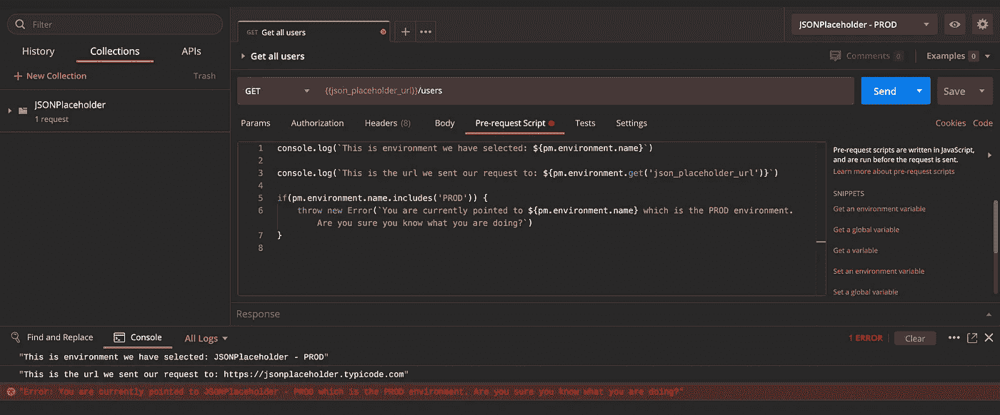

# 试验

在 Postman same 的 tests 选项卡中，您会注意到一些与预请求脚本中相同的功能，但是这里有更多的选项。另外两个有趣的是:

`test` —用于表示将在下面 Postman 的`Test Results`选项卡中验证的测试用例

`expect` —这是 Chai 断言库的扩展

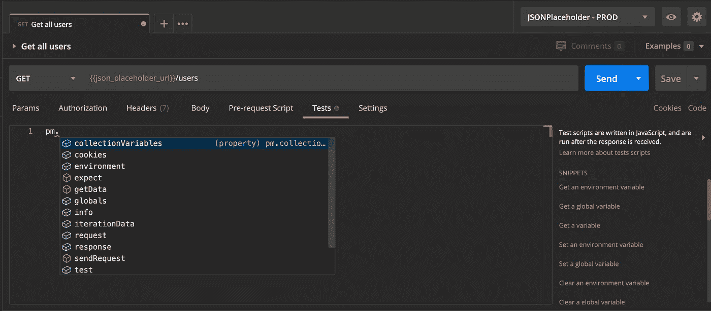

下面是如何在 Postman 中使用`test`和`expect`的一个相当高级的测试例子。

这是从检索响应开始的。我们的第一个测试只是验证来自服务器的响应是否成功(HTTP 代码为 200)。然后，对于从服务器返回的每个响应，我们验证每个响应都有一个名称。

在窗口底部，您可以看到`Test Results`选项卡，所有 11/11 测试案例都已通过，并且有一个漂亮的用户名打印。

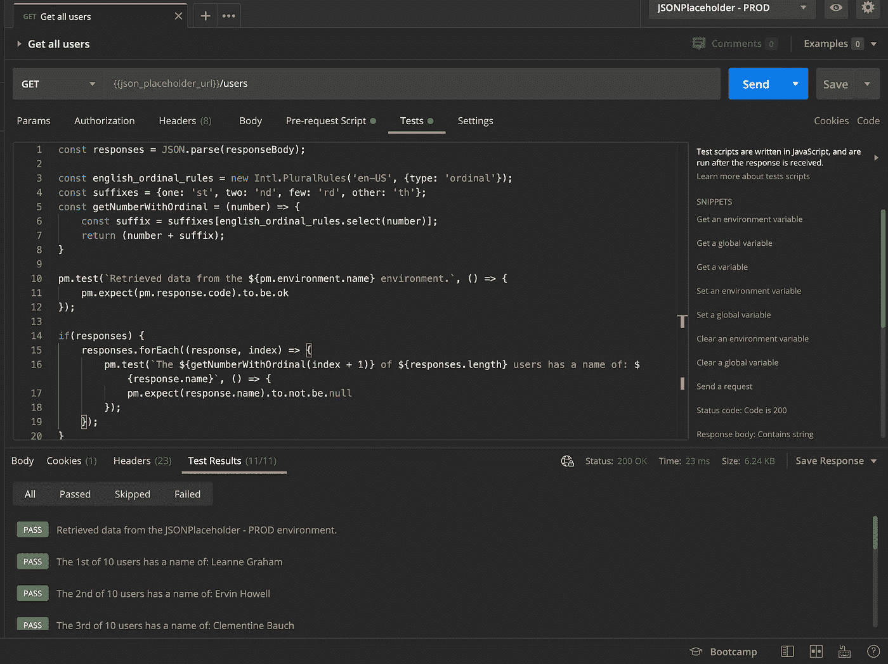

仅仅为了给出一个失败的测试用例的概念，这里是对第一个响应名为 null 的模拟。您将会看到只有 10/11 个测试用例通过，并且第一个响应有一个`AssertionError`,表明用户名值不应该为 null。

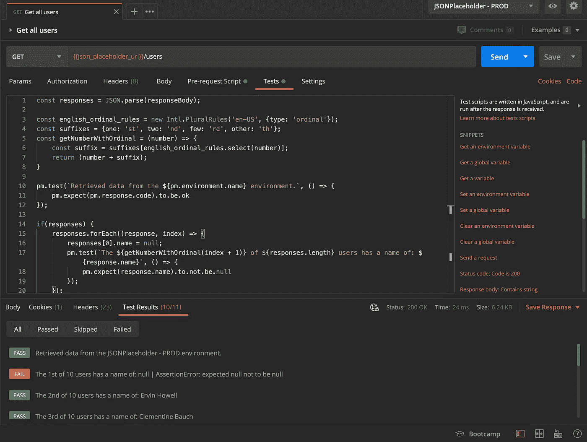

# 附加说明

如果您喜欢这篇文章，并且想查看这个 Postman 集合和环境变量 JSON，可以在这个 [GitHub 库](https://github.com/tengel92/Medium)中找到，以及与我的 Medium 文章相关的所有其他代码。

要了解更多细节，我建议去[邮差学习中心](https://learning.postman.com)看看。