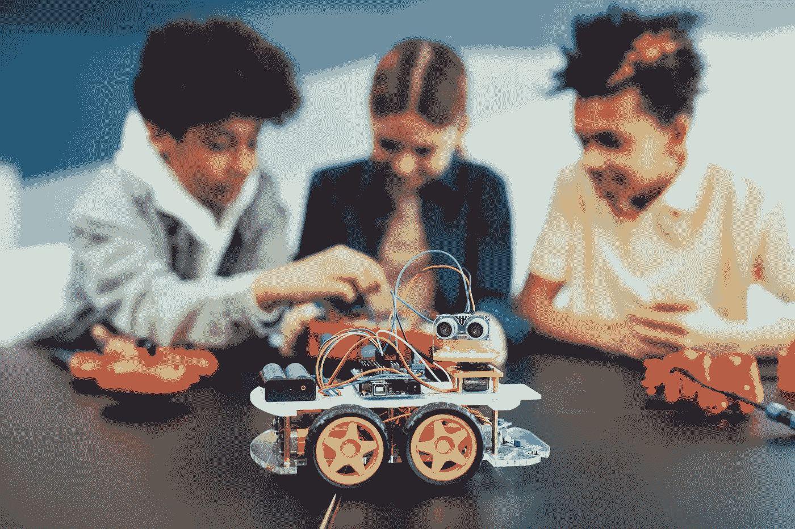
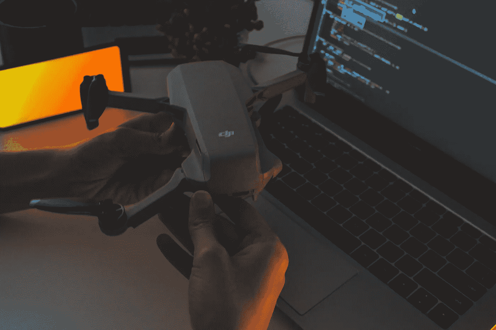

# 成为机器人软件工程师的 7 个简单步骤

> 原文：<https://levelup.gitconnected.com/how-to-become-a-robotics-software-engineer-in-7-simple-steps-b947ad9284a1>

## 从零开始成为机器人软件工程师的一步一步的指南

在 [Unsplash](https://unsplash.com/) 上拍摄的 [ThisisEngineering RAEng](https://unsplash.com/@thisisengineering)

在我年轻的时候，机器人对我来说似乎是超级先进的技术，梦想成为制造它们的人对我来说是不可思议但又不现实的。但是在经历了大学生活后，我意识到建立一个并不难。你所需要的就是**享受过程**，同时**采取正确的步骤**。不要误会我；成为机器人软件工程师不需要学士学位。我从网上资源中学到了大部分知识和技能。

> 我奋斗了几年，才有了清晰的路线图；这就是为什么我想和你分享这个终极指南——如何从零开始成为一名机器人软件工程师？

我相信许多读者都想被聘为机器人软件工程师，但是我们到底要制造什么样的机器人呢？首先，考虑到目的，机器人可以简单地说是一个自 40 年前以来在制造业中广泛使用的机械臂。它可以是自主飞行以执行监控数据收集等任务的无人机，可以是需要高级人工智能的[索菲亚](https://www.hansonrobotics.com/sophia/)等社交机器人，甚至可以是特斯拉和 Waymo 正在发明的自动驾驶汽车。

对于一个机器人软件工程师来说，这个职业机会既刺激又有前途。成为其中一员的学习过程更是其乐融融。让我们踏上成为机器人专家的旅程吧！

# 第一步:数学

照片由 [Lum3n](https://www.pexels.com/@lum3n-44775/) 在[像素](https://www.pexels.com/)上拍摄

机器人需要连续计算才能自主执行任务。所以，数学是开发机器人软件的首要必备技能。在数学方面，你需要学习:

*   **微积分**
*   **线性代数**
*   **统计数据**

微积分主要用于开发导航和地图算法，而线性代数用于人工智能(AI)、计算机视觉和机器人运动学。统计学用于计算机视觉和机器学习。

对于那些在高中或大学期间有良好数学基础的人，你可以跳到第二步。至于其他的，我为你准备了一些资源:

[Coursera:微积分入门](https://www.coursera.org/learn/introduction-to-calculus?irclickid=WaVyKQQmqxyIUs5V1lTlXwefUkDyDpzXYwLpxk0&irgwc=1&utm_medium=partners&utm_source=impact&utm_campaign=2298976&utm_content=b2c)

[可汗学院:代数 1](https://www.khanacademy.org/math/algebra)

[可汗学院:代数 2](https://www.khanacademy.org/math/algebra2)

[Udacity:统计](https://www.udacity.com/course/statistics--st095?irclickid=Weh1HaQs5xyITzy3NCwj6w-jUkDyDpzPYwLpxk0&irgwc=1&utm_source=affiliate&utm_medium=&aff=2298976&utm_term=&utm_campaign=__&utm_content=&adid=786224)

# 第二步:编程语言

照片由[丹尼·梅内塞斯](https://www.pexels.com/@danny-meneses-340146/)在[像素](https://www.pexels.com/)上拍摄

学习编程语言是迈向机器人学的一大步，也是乐趣开始的地方。你需要了解的编程语言主要有:

*   计算机编程语言
*   C++

我推荐你从 Python 开始，因为它对初学者很友好。Python 提供了许多库，允许您原型化机器人算法概念。用于[树莓派](https://www.raspberrypi.org/)、[机器人操作系统(ROS)](https://www.ros.org/) 和 AI。

接下来，你需要学习 C++，这是一种**基本的编程语言**，在业界被广泛使用，主要是因为它的**高性能**和与低级硬件轻松接口的能力。它也是编写 ROS 代码的主要编程语言之一。

最近，一种新的编程语言旨在成为 C++的继承者——[Carbon](https://github.com/carbon-language/carbon-lang)。但是，它仍然需要几年的时间来准备使用，甚至整个行业需要更多的时间来转换它的代码库。所以，跟我一起学 C++。

如果您热衷于掌握一种编程语言，您可以根据兴趣领域选择任意一种，如下所示:

Python:计算机视觉和人工智能

C++: [SLAM](https://www.mathworks.com/discovery/slam.html) ，路径规划，机器人控制&机器人运动学

虽然有些人可能会建议学习 C，但如果你对嵌入式系统中的硬件编程感兴趣，我会推荐你学习 C。

***推荐课程/资源:***

Python: [Coursera:人人编程](https://www.coursera.org/learn/python?irclickid=WaVyKQQmqxyIUs5V1lTlXwefUkDyAv1WYwLpxk0&irgwc=1&utm_medium=partners&utm_source=impact&utm_campaign=259799&utm_content=b2c)

c++:[uda city:c++ nano degree](https://www.udacity.com/course/c-plus-plus-nanodegree--nd213?gclid=CjwKCAjw6MKXBhA5EiwANWLODMasAbTN8DeVxtH9_nD4pVuPrYex15oEb6bhvRZr29MqlrSE079qQhoCYYcQAvD_BwE&utm_campaign=12908932988_c_individuals_30off&utm_campaign=12908932988_c_individuals&utm_keyword=udacity%20c%2B%2B_e&utm_keyword=udacity%20c%2B%2B_e&utm_medium=ads_r&utm_medium=ads_r&utm_source=gsem_brand&utm_source=gsem_brand&utm_term=124509195831&utm_term=124509195831)

Udacity 的这门 C++纳米学位课程结构良好，内容全面。这门课帮助我掌握了高级 C++技能，并帮助我找到了第一份全职工作。唯一的缺点是它很贵。但是，**我强烈推荐**你挑战自己**参加这个课程**，从平台获得助学金(折扣/奖学金)并不难。

# 第三步:Linux

Gabriel Heinzer 在 [Unsplash](https://unsplash.com/) 上拍摄的照片

接下来，你的下一个要素将是 Linux 操作系统。Linux 是机器人的首选操作系统，因为它是开源的、安全的、可定制的。除此之外，ROS 和大多数机器人工具都运行在 Linux 上。

那你该不该学 ROS？我建议**只通过项目**学习 ro。但是为什么呢？这是最好的学习方法，相信我。

***推荐课程:***

[Udacity: Linux 命令行基础知识](https://www.udacity.com/course/linux-command-line-basics--ud595?irclickid=Weh1HaQs5xyITzy3NCwj6w-jUkDyAIVHYwLpxk0&irgwc=1&utm_source=affiliate&utm_medium=&aff=2298976&utm_term=&utm_campaign=__&utm_content=&adid=786224)

# 步骤 4:数据结构和算法

马库斯·斯皮斯克在 [Unsplash](https://unsplash.com/) 上拍摄的照片

作为一名软件工程师，你会经常编写高效的代码。对于要求实时运行的机器人软件来说尤其如此。所以，你需要学习数据结构和算法。这些技能会让你对**有效地应用解决方案**和**评估算法的效率**有所了解。

**推荐课程:**

[Coursera:数据结构和算法专业](https://www.coursera.org/specializations/data-structures-algorithms)

# 第五步:机电一体化

由[凡妮莎·洛林](https://www.pexels.com/@vanessa-loring/)在[像素上拍摄的照片](https://www.pexels.com/)

对于任何想成为机器人专家的人来说，机电一体化是另一个必须学习的技能。它是一个涉及力学、电子学和计算的多学科领域。

这是必不可少的，因为它帮助软件工程师**掌握软件和硬件**之间的关系，并**改善与硬件工程师**的工作体验。

学习机电一体化的最好方法是通过一个小的实践项目。学完下面的在线课程，我建议你为项目买一个 Arduino 板或者一个 Raspberry Pi。

你可以参考[这篇文章](https://www.tomshardware.com/features/raspberry-pi-vs-arduino)来选择适合你的板子。

***推荐课程/资源:***

[**IMU**](https://www.edx.org/course/mechatronics#:~:text=Definition%20%E2%80%93%20What%20is%20an%20IMU,consists%20of%20accelerometers%20and%20gyroscopes.) 和 **GPS** 来定位机器人。因此，您需要熟悉这些模块及其数据。

***推荐课程:***

[乌达城:成为机器人软件工程师](https://www.udacity.com/course/robotics-software-engineer--nd209?irclickid=Weh1HaQs5xyITzy3NCwj6w-jUkDy4DQqWUiCXc0&irgwc=1&utm_source=affiliate&utm_medium=&aff=2298976&utm_term=&utm_campaign=__&utm_content=&adid=786224)

# 规格 3:路径规划和控制

照片由[里卡多](https://www.pexels.com/@riciardus/)在[佩克斯](https://www.pexels.com/)上拍摄

[路径规划](https://fab.cba.mit.edu/classes/865.21/topics/path_planning/robotic.html)是另一个机器人学问题**，寻找一系列有效路径，将机器人从起点移动到目的地**。而导航方面的机器人控制是构建控制器的另一个计算问题，即**遵循路径规划算法生成的路径**。

但是机器人控制不仅仅用于路径跟踪。通常，机器人工程师需要开发一个 PID 控制器来控制机器人的移动速度或其他执行器的运动。我强烈建议你学习一下 [PID 控制器](https://medium.com/@jaems33/understanding-robot-motion-pid-control-8931899c31df)，这种控制器得心应手，简单易懂。

路径规划更注重计算效率，因为机器人在运行时必须不断计算有效路径。你必须学习成熟的算法，如 [A*搜索](https://www.geeksforgeeks.org/a-search-algorithm/)和 [RRT](https://theclassytim.medium.com/robotic-path-planning-rrt-and-rrt-212319121378) 。

***推荐课程/资源:***

[Udacity:成为机器人软件工程师(最后一部)](https://www.udacity.com/course/robotics-software-engineer--nd209?irclickid=Weh1HaQs5xyITzy3NCwj6w-jUkDy4DQqWUiCXc0&irgwc=1&utm_source=affiliate&utm_medium=&aff=2298976&utm_term=&utm_campaign=__&utm_content=&adid=786224)

[Udemy: PID 控制器](https://www.udemy.com/course/pid-control/)

[Github:不同类型的路径规划算法](https://github.com/zhm-real/PathPlanning)

[YouTube:Matlab 自主导航](https://youtube.com/playlist?list=PLn8PRpmsu08rLRGrnF-S6TyGrmcA2X7kg)

Brian Douglas 的这个 YouTube 播放列表对初学者来说相当全面，即使这个主题对大多数人来说很复杂(主要是因为演讲者非常好)。对于想了解机器人导航理论但时间有限的人来说，**你一定要去看看。**

# 规格 4:机器人运动学

由 [Pavel Danilyuk](https://www.pexels.com/@pavel-danilyuk/) 在 [Pexels](https://www.pexels.com/) 拍摄的照片

对于那些喜欢机械臂或机械手的人来说，这条路是为你准备的。你需要学习[机器人运动学](https://robocademy.com/2020/04/21/robot-kinematics-in-a-nutshell/)来为机械臂的运动编程。在机器人运动学方面，你需要研究:

*   正向运动学
*   **逆运动学**
*   **坐标系转换**

您将经常实现反向运动学，因为机器人通常知道所需的位置。因此，您需要应用反向运动学来计算实现末端效应器的指定位置的关节参数。并且，涉及到几十个坐标系变换，这意味着你必须运用你的代数知识，所以要做好心理准备。

***推荐课程:***

[Coursera:机器人运动学](https://www.coursera.org/learn/modernrobotics-course2?ranMID=40328&ranEAID=CfuXE*UyMVw&ranSiteID=CfuXE.UyMVw-dFBufPIzQydlM6AyfOERAQ&siteID=CfuXE.UyMVw-dFBufPIzQydlM6AyfOERAQ&utm_content=10&utm_medium=partners&utm_source=linkshare&utm_campaign=CfuXE*UyMVw&irclickid=zM52CuUj5xyIWy02oJX9Fx1iUkDxRyX3PVXO2Q0&irgwc=1&utm_medium=partners&utm_source=impact&utm_campaign=2298976&utm_content=b2c&irclickid=WaVyKQQmqxyIUs5V1lTlXwefUkDU3JXaWUiCXc0&irgwc=1&utm_medium=partners&utm_source=impact&utm_campaign=2298976&utm_content=b2c)

# 步骤 7:软件开发过程

由 [Austin Distel](https://unsplash.com/@austindistel) 在 [Unsplash](https://unsplash.com/) 上拍摄

最后，每个软件工程师都必须学习软件开发过程。这将教会你理解软件开发的生命周期，从计划到维护软件，最终使你成为团队中令人信服的开发人员。

你需要掌握的最重要的技能是**使用版本控制系统**对于一个新的开发者来说，这是难以置信的事实。几乎每个软件工程师的工作都需要你有这方面的经验。

最受欢迎的是 **Git** 。我相信你们很多人都听说过或者已经在用了。你可以简单地开始在你自己的代码中使用它，或者通过这个[交互图网站](https://learngitbranching.js.org/)学习这个概念。

***推荐课程:***

[Udacity:软件开发流程](http://Software Development Process)

[Udacity:用 Git 进行版本控制](https://www.udacity.com/course/version-control-with-git--ud123)

# 额外:动手项目！！！

照片由[áRPád Czapp](https://unsplash.com/@czapp_arpad)在 [Unsplash](https://unsplash.com/) 上拍摄

如果你已经完成了这 7 个步骤，那么做得很好！现在，是时候开发和建造自己的机器人了！

虽然不一定要做一个项目，但是向你的潜在雇主展示你自己的机器人总是很棒的。谁知道呢，也许有人在 LinkedIn 上看到你的项目后**向你寻求工作机会**。更不用说你会从中学习到大部分有价值的实用技能，包括 **ROS、**。

***推荐课程:***

[Udemy:初学 ROS](https://www.udemy.com/course/ros-essentials/)

这条路肯定不容易走，但是**机会肯定会很有希望**。随着硬件变得更好更便宜，AI 技术变得更先进，更多的公司将投资机器人技术。

你还在等什么，未来的机器人开发者？现在就开始学习，尽快加入我吧！

快乐学习！

# 分级编码

感谢您成为我们社区的一员！在你离开之前:

*   👏为故事鼓掌，跟着作者走👉
*   📰查看[升级编码出版物](https://levelup.gitconnected.com/?utm_source=pub&utm_medium=post)中的更多内容
*   🔔关注我们:[Twitter](https://twitter.com/gitconnected)|[LinkedIn](https://www.linkedin.com/company/gitconnected)|[时事通讯](https://newsletter.levelup.dev)

🚀👉 [**加入升级人才集体，找到一份神奇的工作**](https://jobs.levelup.dev/talent/welcome?referral=true)