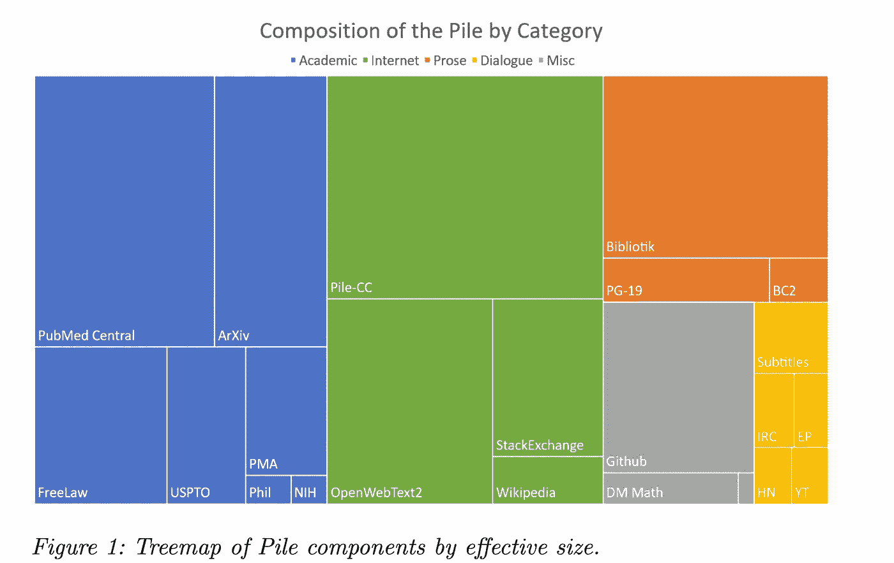
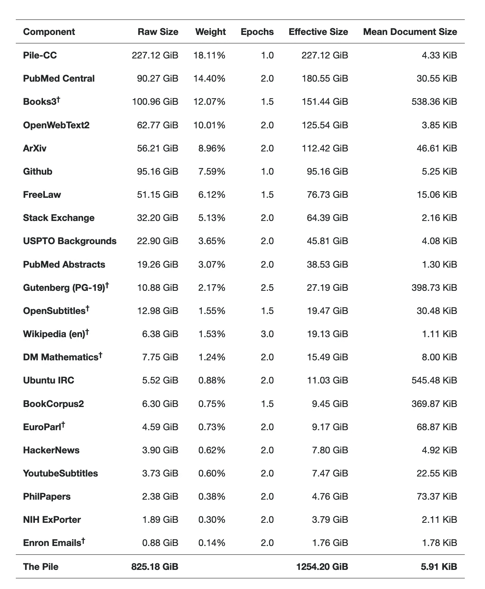
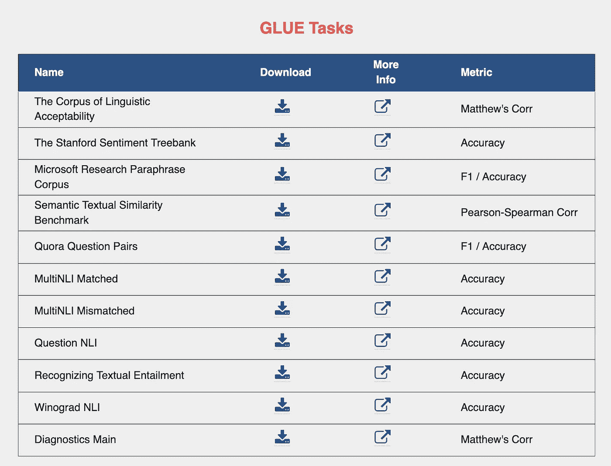
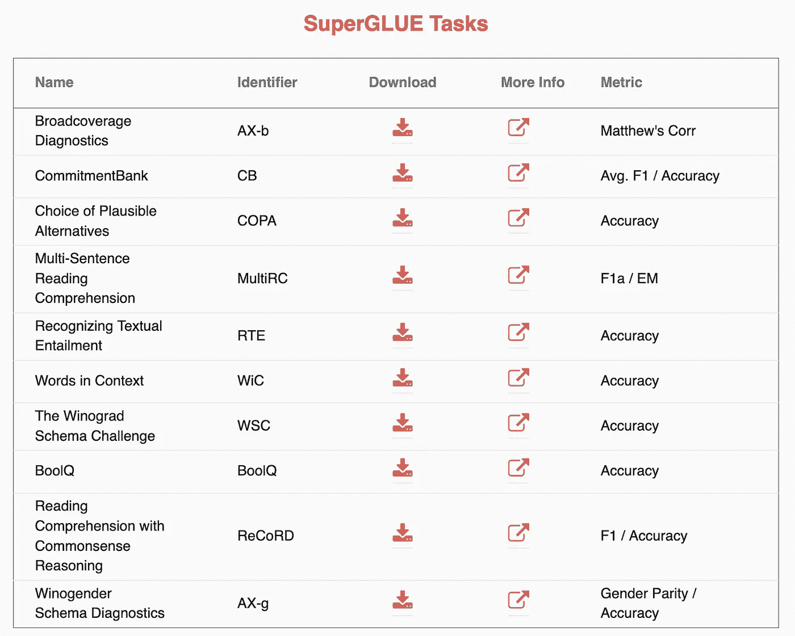
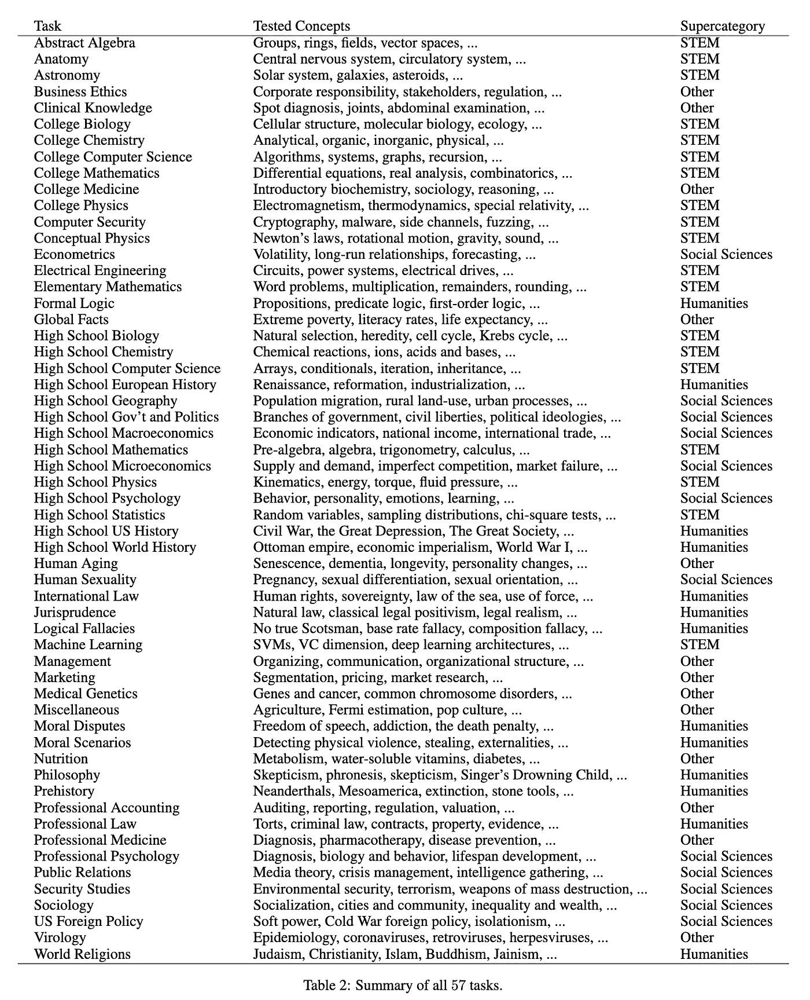
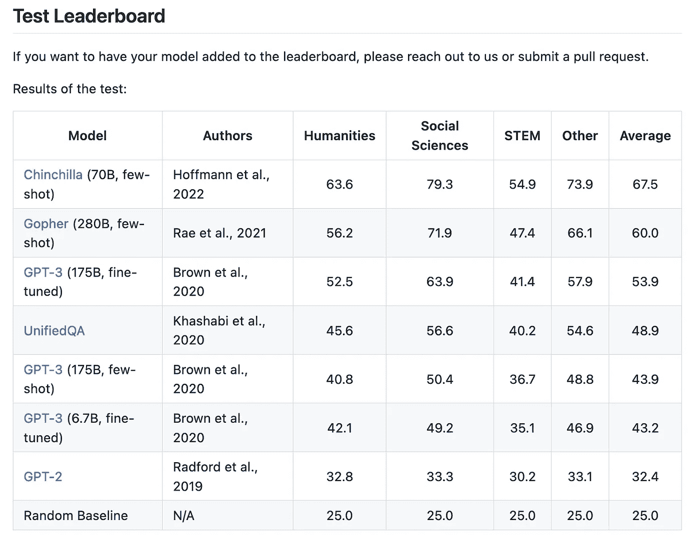
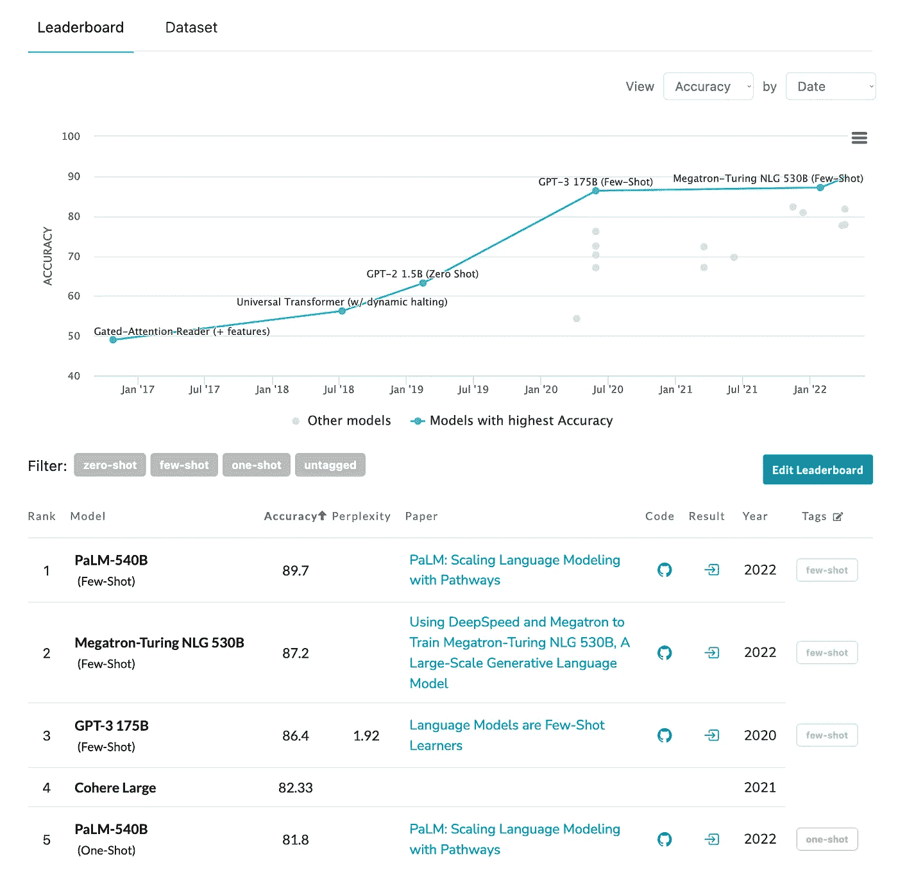
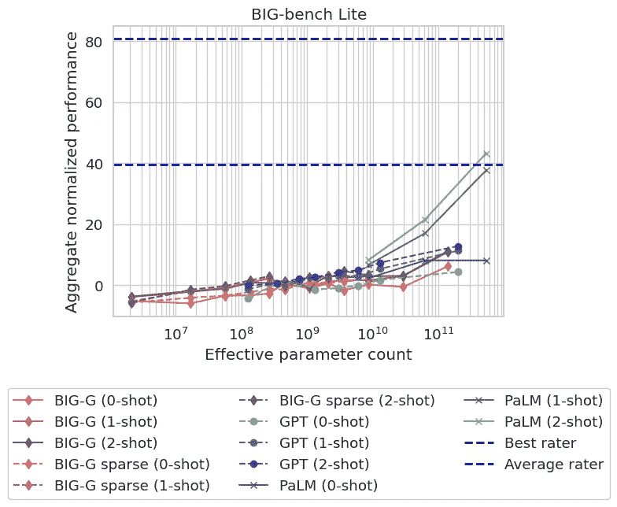
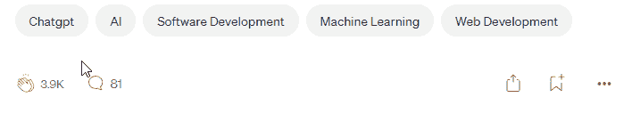

# OpenAI、DeepMind、谷歌、微软评估语言模型

> 原文：<https://levelup.gitconnected.com/how-to-benchmark-language-models-by-openai-deepmind-google-microsoft-783d4307ec50>

Deepmind、OpenAI、谷歌、微软、脸书、亚马逊和所有其他大型公司开发的模型就是这样被评估的。

大型语言模型(LLM)很难进行基准测试。标杆管理是我们评估他们表现的方法。然而，当谈到他们可以执行/协助的任务时，LLM 的保护伞真的很大。查看[拥抱面](https://huggingface.co/models)上的任务。本文是了解最近最常用的基准测试方法及其用途的快捷方式。我计划提出 6 个基准桩，胶水，强力胶，MMLU，LAMBADA，和所有基准的母亲大板凳基准！

来源:中途作者

## 桩基评估基准(2020 年 12 月)

谷歌和华盛顿大学的研究人员在 2021 年的一篇研究论文[中引入了 Pile(语言评估的表现)。Pile 的目标是为 NLP 模型提供全面和一致的评估基准，使研究人员能够比较不同模型在一系列任务上的性能，并评估它们的整体能力。](https://arxiv.org/pdf/2101.00027.pdf)

Pile 由一套任务组成，涵盖了广泛的 NLP 功能，包括机器翻译、摘要、自然语言生成、问题回答等等。每个任务都使用标准评估指标进行评估，例如机器翻译的 BLEU 和摘要的 ROUGE。

**本文的核心贡献是:**

1.  引入 825.18 GiB 英语语言数据集，用于结合 22 种不同来源的语言建模。
2.  引入了 14 个新的语言建模数据集，我们希望研究人员会对此感兴趣。
3.  评估表明，与 CC-100 和 raw Common Crawl 上的训练相比，在这个新数据集上训练的 GPT-2 规模的模型在许多领域都有显著改善。
4.  对该数据集的调查和记录，我们希望能更好地告知研究人员如何使用它，并激励他们对自己的数据进行类似的调查。

斯科特·桑克在 [Unsplash](https://unsplash.com?utm_source=medium&utm_medium=referral) 上拍摄的照片

## [胶水基准](https://arxiv.org/abs/1804.07461)(2018 年 4 月)

[通用语言理解评估(GLUE)基准](https://gluebenchmark.com/)是用于训练、评估和分析自然语言理解系统的资源集合。胶水包括:

*   九个句子或句子对语言理解任务的基准建立在已建立的现有数据集上，并选择覆盖不同范围的数据集大小、文本体裁和难度，
*   一种诊断数据集，旨在针对自然语言中的各种语言现象评估和分析模型性能

GLUE benchmark 的格式是与模型无关的，因此任何能够处理句子和句子对并产生相应预测的系统都有资格参与。选择基准任务，以便支持使用参数共享或其他迁移学习技术跨任务共享信息的模型。GLUE 的最终目标是推动通用和健壮的自然语言理解系统的开发研究。

粘合任务及其度量可以在这里找到

**如何使用胶水？**

要使用 GLUE 评估 LLM，请收集您的系统对九个主要任务和一个辅助任务的预测。

#1 从“任务”部分获取所有任务的数据(MRPC 除外，见下文)。对于辅助任务，您只需要来自“主诊断”的 TSV。每个主要任务都是一个 zip 文件夹，包含一个标准化的训练、开发和(未标记的)测试分割。

#2 使用未标记的测试 TSV 中存在的 id 和标签来为 11 个 TSV 中的每一个生成一个 TSV 预测(对于匹配和不匹配的 MNLI 进行单独的测试分裂)，其中每个 TSV 具有标题，并且每行遵循格式“id [TAB] label”。

#3 确保每个预测 TSV 都根据以下内容命名:

*   语言可接受性语料库:CoLA.tsv
*   斯坦福情感树库:SST-2.tsv
*   微软研究院释义语料库:MRPC.tsv
*   语义文本相似性基准:STS-B.tsv
*   Quora 问题对:QQP.tsv
*   MultiNLI 匹配:MNLI-m.tsv
*   MultiNLI 不匹配:MNLI-mm.tsv
*   问题 NLI: QNLI.tsv
*   识别文本蕴涵:RTE.tsv
*   维诺格拉德·NLI:wnli . tsv
*   诊断:AX.tsv

#4 创建预测 tsv 的 zip 文件，不带任何子文件夹，例如使用“zip -r submission.zip *”。tsv '。

#5 使用“提交”部分上传此 zip 文件，填写用于生成预测的方法的详细信息。

## [强力胶](https://arxiv.org/abs/1905.00537)基准测试(2019 年 5 月)

对于那些觉得胶水不够粘的人，三星研究公司增加了它的味道。超级胶水保留了胶水的困难任务，并在胶水的基础上进行改进。SuperGLUE 提供了一个单一的数字指标，总结了一系列不同任务的进展，但基准测试的性能最近已经超过了非专家人类的水平，这表明进一步研究的空间有限。

要使用 SuperGLUE 评估 LLM，请收集系统对八个主要任务和两个诊断任务的预测(通常应该使用 RTE 分类器)。

#1 从“任务”部分或使用`[jiant](https://jiant.info/)`附带的[下载器脚本](https://github.com/nyu-mll/jiant/blob/master/scripts/download_superglue_data.py)获取所有任务的数据。点击此处阅读更多关于[jint](https://arxiv.org/abs/2003.02249)的信息。

#2 使用未标记测试 JSONL 中存在的 id 和标签，为七个测试文件中的每一个生成一个 JSONL 预测。预测文件的每一行都应该是一个 JSON 条目，带有一个标识示例的“idx”字段和一个包含预测的“label”字段。

#3 对于 MultiRC，遵循数据中的 JSONL 结构，这样每行代表一个单独的上下文段落；确保使用段落 ID、问题 ID 和答案 ID。

#4 确保每个预测 JSONL 都根据以下内容命名:

*   BoolQ: BoolQ.jsonl
*   承诺银行:CB.jsonl
*   COPA: COPA.jsonl
*   MultiRC: MultiRC.jsonl
*   记录:ReCoRD.jsonl
*   RTE: RTE.jsonl
*   上下文中的单词:WiC.jsonl
*   Winograd 架构挑战:WSC.jsonl
*   广泛覆盖诊断:AX-b.jsonl
*   wino gender Diagnostics:AX-g . jsonl

#5 创建预测 JSONLs 的 zip，例如使用“zip -r submission.zip *”。jsonl。zip 可以包含子文件夹，但不应包含嵌套的 zip。

#6 使用“提交”部分上传此 zip 文件，填写用于生成预测的方法的详细信息。

**强力胶包含的任务如下**

## [MMLU 基准](https://arxiv.org/abs/2009.03300)(2020 年 9 月)

大规模多任务语言理解(MMLU)测试涵盖 57 项任务，包括初等数学、美国历史、计算机科学、法律等。为了在这个测试中获得高准确度，模特必须拥有广泛的世界知识和解决问题的能力。

MMLU 的任务范围广泛，包括人文科学、社会科学、科学技术工程和数学(STEM)等。“其他”任务子组包括许多可免费获得的问题以及专业医学任务，这些任务具有需要人类多年学习才能掌握的困难问题。

当前 MMLU 基准中的领导者可以在他们的 [github](https://github.com/hendrycks/test) 页面和附带的研究论文中找到

## [兰巴达阅读理解基准](https://arxiv.org/abs/1606.06031) (2016)

LAMBADA(在广阔领域中用于下一单词预测的语言建模)是用于评估自然语言处理(NLP)模型在下一单词预测任务上的性能的基准数据集。2016 年，谷歌和华盛顿大学的研究人员在一篇[研究论文](https://arxiv.org/abs/1606.06031)中介绍了这一技术。

LAMBADA 数据集由一组去掉了每个句子最后一个单词的句子组成。这是一个叙述性段落的集合，具有共同的特征，即如果人类受试者看到整篇文章，他们能够猜出他们的最后一句话，但如果他们只看到目标单词前面的最后一句话，则不能。任务是根据句子的上下文预测缺失的单词。该数据集旨在测试 NLP 模型理解和生成自然语言的能力，以及捕捉自然语言文本中存在的长期依赖性和上下文信息的能力。然后使用困惑度量来测量模型预测的准确性，困惑度量是模型能够基于句子的上下文预测缺失单词的程度的度量。

目前，PaLM 和 Nvidia 的威震天 NLG 530B 在性能方面领先

来源:[拥抱脸](https://paperswithcode.com/sota/language-modelling-on-lambada)

## 大型工作台协作基准:

所有基准之母于去年发布。它有 200 个任务(完整的列表可以在[这里](https://github.com/google/BIG-bench/blob/main/bigbench/benchmark_tasks/README.md)找到)。big-bench 的论文还没有根据他们的 github 发表，但是已经在 2022 年 6 月[发表](https://arxiv.org/abs/2206.04615)。它有最令人印象深刻的任务清单。big-bench github 页面显示，这些任务是以这样一种方式创建的，即对于新开发人员来说，在 big-bench 上实现基准测试更容易。

下面是基准测试任务的一小部分，以说明其多样性(ref 选自博客 [LessWrong](https://www.lesswrong.com/posts/qjproXBGPQSAF9Hbd/linkpost-the-final-ai-benchmark-big-bench) :

*   对以各种方式编码的 CIFAR10 图像进行分类
*   在国际象棋中找到一步棋导致将死
*   给出 Python 代码的英语描述
*   回答关于低温生物学的问题(用西班牙语)
*   给出简短的犯罪故事，指出罪犯并解释原因
*   衡量语言模型的自我意识
*   请模型的一个实例来教授另一个实例，然后评估质量
*   确定哪种道德选择最符合人类的判断
*   判断两句话中哪一句是讽刺的
*   评估回答 Winograd 模式挑战问题的推理

这大约是所有任务的 **5%** 。而且基准还在增长。令人印象深刻的是，谷歌的 PaLM 模型具有 540B 参数，其评分高于使用 1 次或 2 次训练的最佳评分者。阅读更多关于 PaLM 研究论文的信息

 [## 瞄准万亿参数模型(PaLM):逐页回顾

### 路径:用于 ML 的异步分布式数据流和用路径扩展语言建模

ithinkbot.com](https://ithinkbot.com/aiming-at-a-trillion-parameter-model-palm-page-by-page-review-59e4f21e51e8) 

来源:大板凳 Github [页面](https://github.com/google/BIG-bench/blob/main/bigbench/benchmark_tasks/results/plot_BIG-bench_lite_aggregate.png)

总之，寻找“完美的”基准来评估语言模型在语言实际使用的各个方面的性能的探索仍在进行中。然而，随着各行各业的大公司合作努力的发展，这个时代再令人兴奋不过了。

来支持我🔔 ***拍手*** | ***跟随|*** [***订阅***](https://ithinkbot.com/subscribe) **🔔**

使用我的链接成为会员:[https://ithinkbot.com/membership](https://ithinkbot.com/membership)

检查我的其他作品—

 [## 2022:chat GPT 年，未来如何？

### 看着水晶球

ithinkbot.com](https://ithinkbot.com/2022-year-of-chatgpt-what-is-the-future-979b034efdf9)  [## OpenAI 首次亮相 ChatGPT

### OpenAI 周三发布了一款名为 ChatGPT 的新模型。这个模型被训练成在一个…

pub.towardsai.net](https://pub.towardsai.net/openai-debuts-chatgpt-50dd611278a4)  [## 什么是 GPT-4(什么时候？)

### GPT-4 是一个自然语言处理模型，由 openAI 作为 GPT-3 的继承者开发

pub.towardsai.net](https://pub.towardsai.net/what-is-gpt-4-and-when-9f5073f25a6d)  [## OpenAI，ChatGPT，LLM，AGI:理解语言的悖论

### 探索语言、理解和智力的意义。

pub.towardsai.net](https://pub.towardsai.net/openai-chatgpt-llm-agi-paradox-of-understanding-language-610f0e318df9)