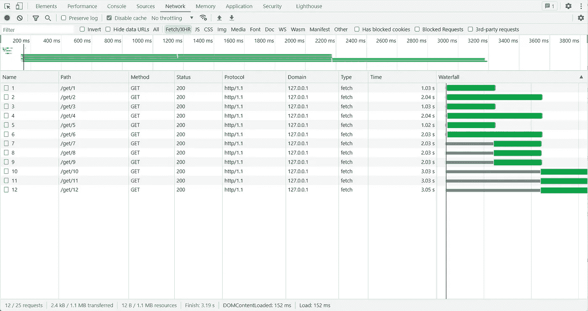

# 如何更好地控制并发承诺的数量

> 原文：<https://levelup.gitconnected.com/how-to-better-control-the-number-of-concurrent-promises-b687afd9add5>

## 这可能非常有用


米歇尔·利奇在 [Unsplash](https://unsplash.com?utm_source=medium&utm_medium=referral) 上拍摄的照片

在某些情况下，我们可能需要控制并发请求的数量。

比如我们在编写下载或者抓取工具的时候，有些网站可能会有并发请求数量的限制。

在浏览器中，来自同一来源的 TCP 连接的最大数量被限制为 6。这意味着，如果同时发送 6 个以上的请求时使用 HTTP1.1，第 7 个请求将等到前一个请求被处理后才开始。

我们可以用下面这个简单的例子来测试一下。首先是客户端代码:

```
void (async () => {
  await Promise.all(
    [...new Array(12)].map((_, i) =>
      fetch(`[http://127.0.0.1:3001/get/${i](http://127.0.0.1:3001/get/${i) + 1}`)
    )
  );
})();
```

接下来是服务的简短代码:

```
router.get('/get/:id', async (ctx) => {
  const order = Number(ctx.params.id);
  if (order % 2 === 0 && order <= 6) {
    await sleep(1000);
  }
  await sleep(1000);
  ctx.body = 1;
});
```

在前 6 个请求中，如果顺序是偶数，则等待 **2s** ，如果不是，则等待 **1s** 。然后在 DevTools 中打开网络，可以得到下图:



查看时间和瀑布列可以看出，这是一个请求并发限制的模型。所以我想实现一个类似的功能，怎么做呢？

我在 Github 上开源了 [p 限制器](https://github.com/islizeqiang/p-limiter)。这里有相同的要点:

上面不到 70 行代码就可以实现这一点，让我们在 StackBlitz 中试试吧！

你可以看到它像预期的那样工作。无需借助任何第三方库，简单的代码模型就是这样。

那么你还有其他的用例吗？欢迎和我交流。

*感谢阅读。如果你喜欢这样的故事，想支持我，请考虑成为* [*中会员*](https://medium.com/@islizeqiang/membership) *。每月 5 美元，你可以无限制地访问媒体内容。如果你通过* [*我的链接*](https://medium.com/@islizeqiang/membership) *报名，我会得到一点佣金。*

你的支持对我来说很重要——谢谢。