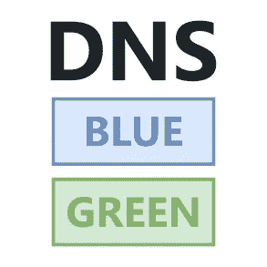
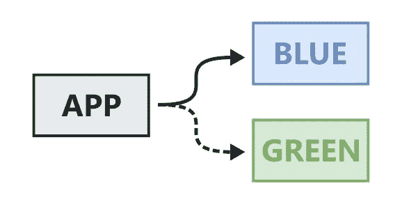
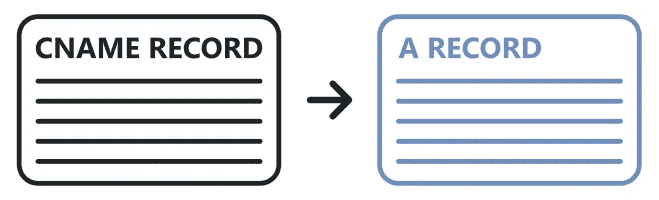
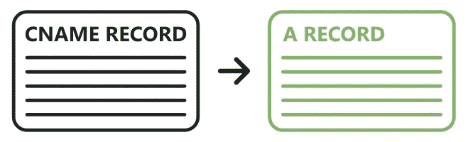

# 如何用 DNS 进行蓝绿色发布

> 原文：<https://levelup.gitconnected.com/how-to-blue-green-release-with-dns-d16f93855645>

域名系统(DNS)是互联网上流量路由的主要方式。它可以用于将流量路由到一个或多个服务器，并且可以被链接起来，以便相同的 URL 可以在不同的时间点指向不同的位置。这就是支持蓝绿色软件部署和发布新版本软件而不停机的原因。



DNS 蓝绿色释放

那么我们如何使用 DNS 来蓝绿我们的软件呢？在这篇文章中，我们将一步一步地经历这个过程。

# 什么是蓝绿部署？

首先我们需要理解蓝绿色是什么意思。蓝绿色部署是调配多个生产环境的过程，以便您可以在切换到新版本之前设置新版本。



DNS 切换

通过运行这两种环境，您可以快速切换到新版本，从而最大限度地减少停机时间，并允许您在需要时切换回以前的版本。这与就地更新不同，就地更新依赖于停止生产环境、更新它并再次启动它。

关于蓝绿部署的更多信息可以在 2010 年 Martin Fowlers 的博客文章中找到。

# 1.使用 A 记录部署我们的软件版本

为了通过 DNS 利用蓝绿色部署，我们首先需要部署我们软件的运行版本。我们可以部署一台或多台主机，并创建指向其 IP 地址的 DNS 记录。这将让我们一致地访问我们的服务，而不需要知道主机的 IP 地址。


打破记录

对于这个 DNS 记录，我们应该使用 A 记录，这是一种将主机名映射到 IP 地址的 DNS 记录。有多种不同用途的 DNS 记录，A 记录是最基本的。每次部署我们都需要一份记录。

最好的方法是在 A 记录中使用一个版本号，并为每个版本部署一组新的基础设施，以实现不可变的基础设施和滚动部署。也有可能只有两个静态环境，分别标记为蓝色和绿色。

# 2.为我们的应用程序创建一个 CNAME DNS 记录

我们需要创建的下一个 DNS 记录是一个 CNAME。CNAME 是从一个主机名到另一个主机名的别名，这意味着它可以用于重定向或为单个服务提供多个名称。我们应该提供一个 CNAME，我们的客户使用它来访问我们的服务，这样我们就可以控制路由。



CNAME 记录到蓝色

该记录不应被版本化，因为每个环境只有一个记录，我们将其用作流量路由位置的查找。以下是初始 CNAME 和记录的一些示例:

```
CNAME Record -> A Record
logging.company.com -> logging-01.company.com
logging.company.com -> 01.logging.company.com
logging.company.com -> logging-blue.company.com
logging.company.com -> blue.logging.company.com
```

# 3.用 A 记录部署我们软件的新版本

我们的系统运行后，客户使用 CNAME 访问我们的服务，我们可以部署新版本的软件。它可以部署在我们当前版本的旁边，一旦部署，我们应该能够通过它自己的 A 记录访问它。


刷新记录

接下来，我们应该运行自动化集成和回归测试，这样我们就可以确信环境正在按预期工作，并且我们可以转移到切换上。确保这些测试不会影响其他部署非常重要，因为它们可能会共享数据库和其他资源。

# 4.更新我们的应用程序 CNAME DNS 记录

要将我们的应用程序切换到新版本，我们只需更新我们的 CNAME 记录以指向新的 A 记录。这应该很快，但根据 DNS 记录的生存时间(TTL ),可能需要一些时间来传播，因为 DNS 根据提供的 TTL 缓存在多个位置。我通常推荐 60 秒作为 DNS TTL 的好标准。



CNAME 记录到绿色

如果出现任何错误，或者我们对新环境不满意，我们可以通过将 CNAME 重定向回旧的 A 记录来恢复。由于过程简单，这应该是快速和容易做到的。

# 5.清除

切换后，我们可能需要通过删除或卸载任何仍在运行的软件来清理之前的环境。这可以立即发生，也可以在一段时间后发生，但应该根据您的具体环境按需进行。

# 摘要

蓝绿色部署对于最小化软件发布的风险和停机时间至关重要，DNS 是实现这一点的主要方式。这个过程有许多变化，但重要的是保持过程简单。让我知道这是否是你发布软件新版本的方式，以及你是否想让我涵盖 DNS 发布的任何其他部分。

如需更多类似内容，请关注或联系我:

*   **推特:** [@BenTorvo](https://twitter.com/BenTorvo)
*   【ben@torvo.com.au】邮箱: [邮箱:](http://torvo.com.au/)
*   **网址:**[torvo.com.au](http://torvo.com.au/)