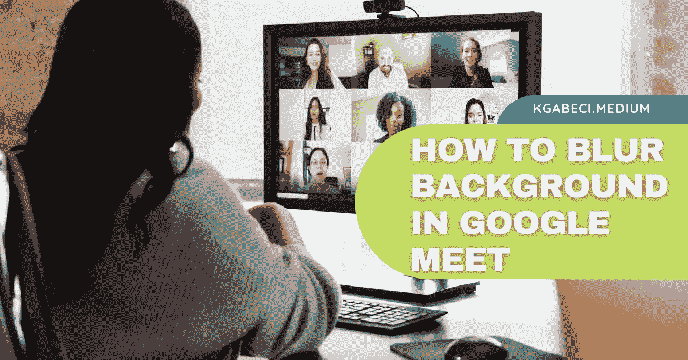
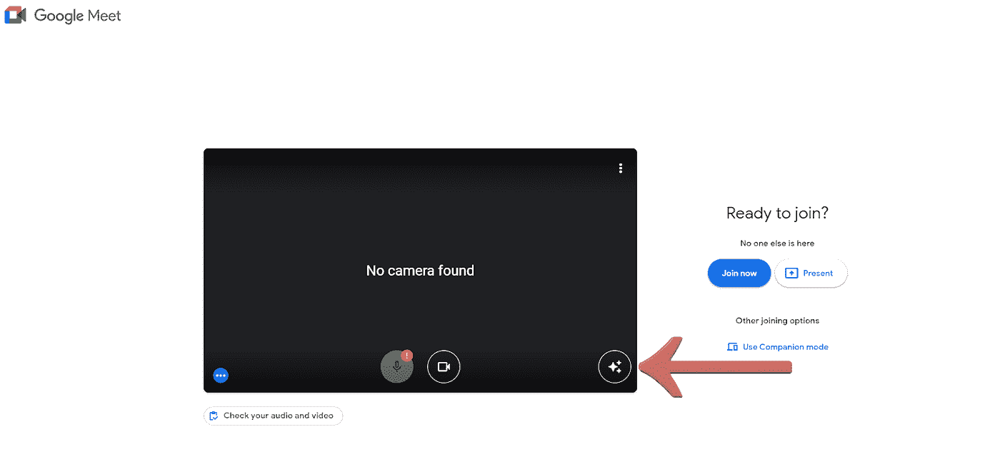
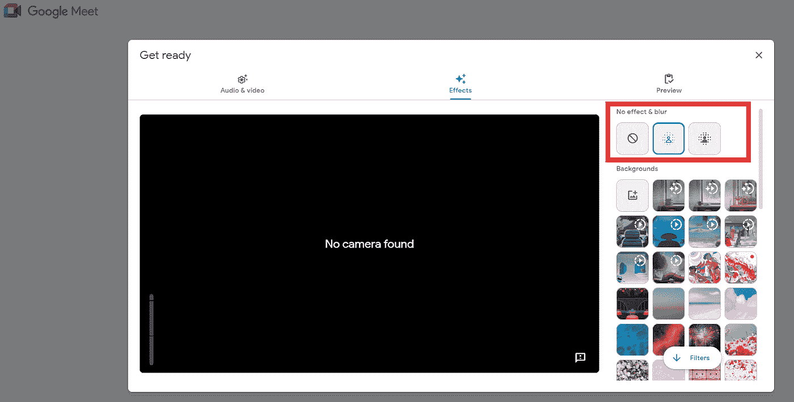
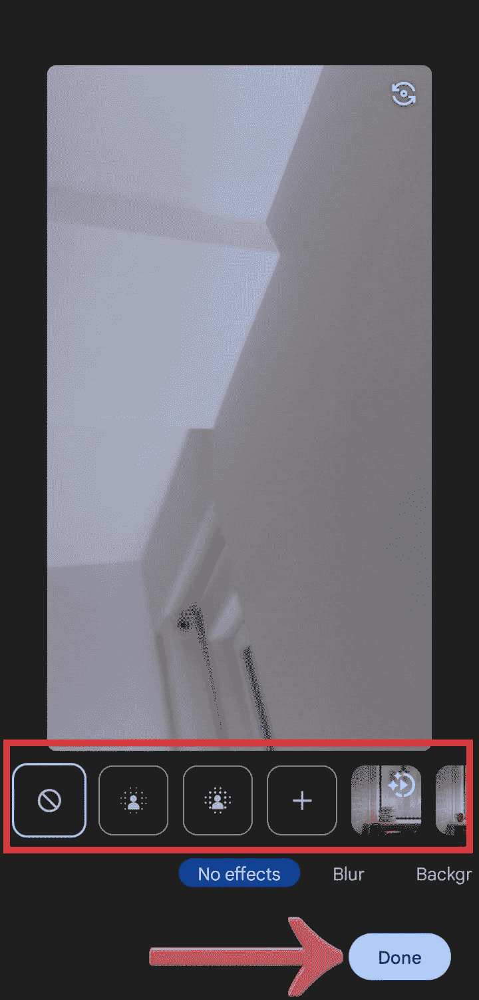
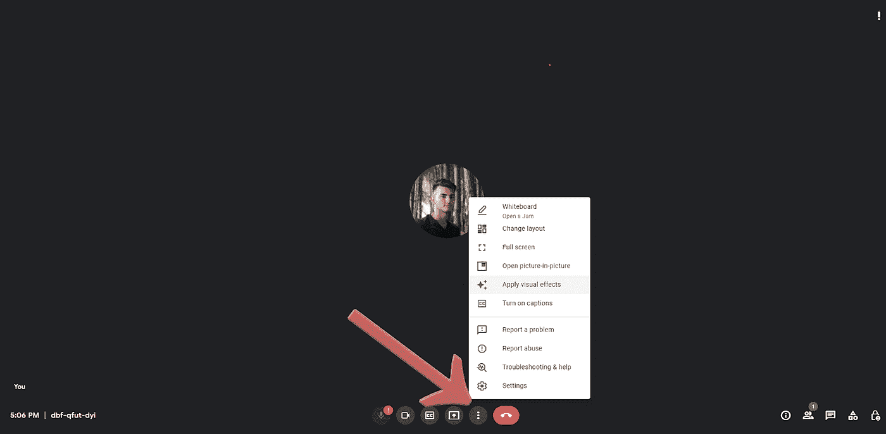
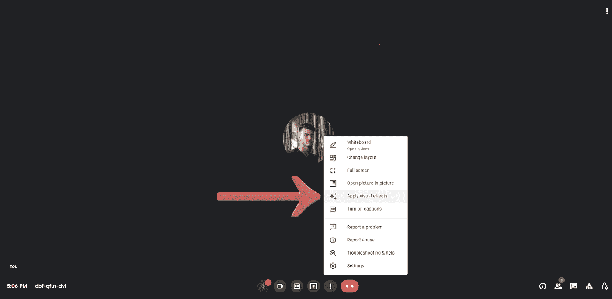
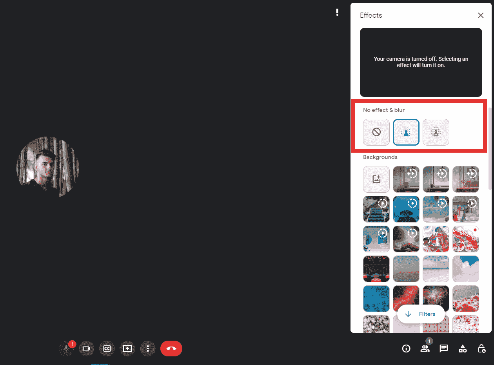
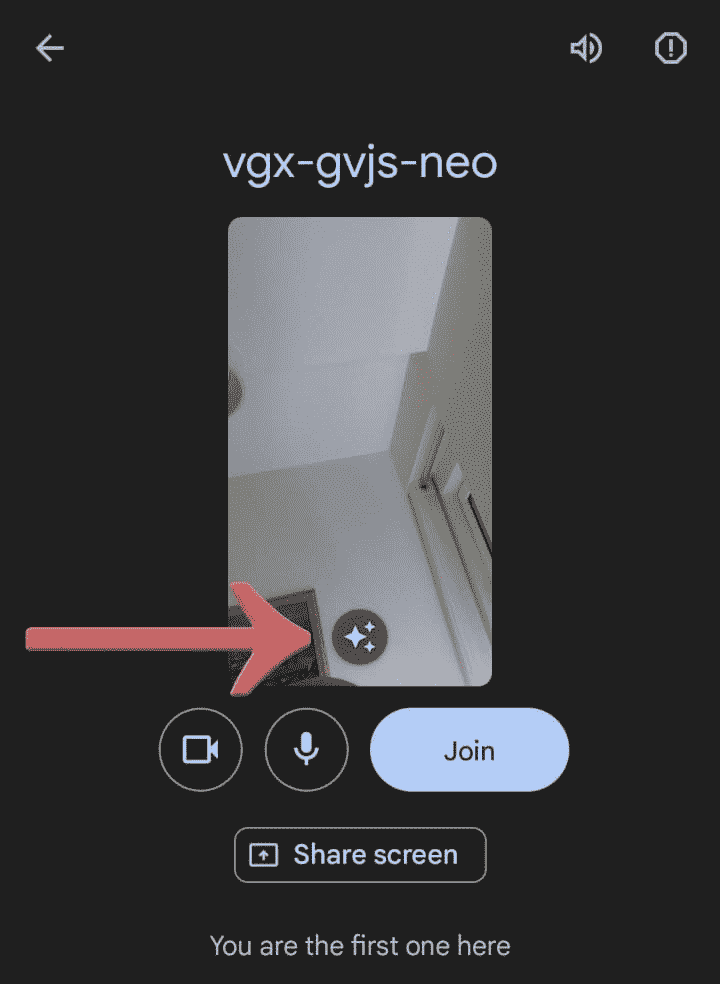

# 如何在 Google Meet 中模糊背景

> 原文：<https://levelup.gitconnected.com/how-to-blur-background-in-google-meet-8c960e43043c>

学习如何在 Google Meet 中模糊背景是这个时代每个人都需要知道的技能。自从《疫情》热播以来，我们都看到了在家工作和与雇主或同事视频通话的巨大转变。

我参加过无数次视频通话，我们需要明白的最重要的一点是，我们在实时视频上处于 ***、*** ，事情随时可能出错。这就是为什么我们需要尽可能地为视频通话做好准备。

如果你想了解更多关于如何在 Google Meet 中模糊背景或添加自定义图像甚至视频的信息，请继续阅读这篇文章。

# 为什么要在 Google Meet 视频通话中模糊背景？

在视频通话中模糊背景有助于我们专注于重要的事情: ***说话的人*** 。参加视频会议时，我想清楚地知道谁在说话，他们在说什么。这意味着，当我在观看视频通话时，我应该能够看到对方，而不会受到周围环境的干扰。

我知道不是每个人都有机会在干净整洁的工作环境中参加视频会议。这就是为什么模糊功能是必不可少的。如果你选择将 google meet 的虚拟背景更改为沙滩的图片，暗示你在制作沙堡的同时工作，这将显示出专业精神，并带来一些天赋或乐趣。

根据谷歌会议视频通话的情况，你可以选择模糊背景或一些有趣的东西；选择权在你！

# 在 Google Meet 视频通话中什么时候应该模糊背景？

在许多情况下，在 Google Meet 视频通话中模糊背景是合适的。以下是几个例子:

**1)** 如果您正在远程工作，并且希望确保您的团队成员不会因房间内走动的其他人而分心。当你在咖啡厅开会时，这是特别需要的，因为那里人很多。

在家工作时，希望确保不要炫耀自己凌乱的房间或身后令人尴尬的东西。这项功能将省去您在加入视频通话前五分钟打扫房间的麻烦。

如果你正在做一个学校演示，你想让所有的注意力都集中在你自己身上而不是周围，这个功能会让你更多地出现在屏幕上。这样，每个人都会只关注你和你要说的话。

这些是我们认为你应该明确模糊视频会议背景的一些最重要的原因。如果你有更多的建议，不要犹豫，在评论区留下它们。

# 如何在视频通话前模糊 Google Meet 中的背景:

需要注意的是，如果您没有登录您的 Google 帐户，并且是一个需要请求才能获准参加视频会议的参与者，您就不能在会议之前更改视觉效果。

# 如何在 PC/Mac、笔记本电脑上模糊 Google Meet 中的背景

我总是喜欢在参加会议之前做好准备，尽可能看起来专业一些；这就是为什么如果我想使用模糊功能，我会在会议开始前使用。要做到这一点，其实很简单；只要按照下面的步骤，你会在会议开始前模糊背景。

当您转到会议链接时，在单击“立即加入”按钮之前，请单击“应用视觉效果”图标。

在那里，你可以选择改变顶部背景的模糊程度，或者改变成谷歌提供的自定义背景。选项包括: ***无虚化*** 、 ***略虚化你的背景*** 、 ***虚化你的背景*** 。

您可以选择通过单击“预览”选项卡来预览该更改的外观，或者您可以简单地关闭对话框，应用效果并加入会议。

# 如何在 iPhone 上模糊 Google Meet 中的背景

当您转到会议链接时，在单击“立即加入”按钮之前，请单击“应用视觉效果”图标。

接下来你需要做的是选择你想要的直播视频的模糊效果。它可以是不模糊、部分模糊或完全背景模糊。做出选择后，单击“完成”按钮并返回参加会议。

# 如何在 Android 上的 Google Meet 中模糊背景

当您转到会议链接时，在单击“立即加入”按钮之前，请单击“应用视觉效果”图标。

接下来，您必须选择要应用到视频源的模糊程度。会议将实时进行，当您结束时，您需要点击“完成”按钮，然后加入会议。

**如何在视频通话过程中模糊 Google Meet 中的背景:**

正如我们在文章前面提到的，会议有时会出乎意料，事情可能会超出我们的控制。不过，我们可以做到的是，我们允许其他人看到我们屏幕后面发生的事情，并且在会议进行到一半时，你可以模糊你的背景。

# 如何在 PC/Mac、笔记本电脑上模糊 Google Meet 中的背景

当您加入会议时，您需要做的第一件事是模糊背景，单击“三个点”按钮。

当你点击它，一个有多个选项的窗口将会打开。你应该点击“应用视觉效果”按钮。

然后新的窗口将会打开，在那里你可以改变你的背景模糊度或添加其他效果。

然后你需要做的就是关上窗户，回到背景模糊的会议上。

# 如何在 iPhone 上模糊 Google Meet 中的背景

当您通过应用程序加入会议时，您需要点击

你的自我观察窗口上的效果按钮。

然后你可以选择三个选项中的一个；*不模糊*、*稍微模糊你的背景、*、*模糊你的背景*。

完成背景自定义后，单击关闭按钮返回视频通话。

## **如何在 Android 上的 Google Meet 中模糊背景**

当你通过应用程序加入会议时，点击你的自我视图窗口上的“应用视觉效果”图标。

选择一个模糊选项或提供的其他视觉效果。

然后你只需要按下关闭按钮，回到视频会议。

# 5 个最佳 Google Meet 视觉效果扩展

## Google Meet 增强套件

使用 Google Meet 增强套件，您可以访问许多增强 Google Meet 视觉效果的功能和设置。这些特征是:进入会议时自动静音麦克风和模糊视频，启用字幕，切换黑暗模式等。

## Google 聚会按钮

有了 Google Meet 的这个扩展，当你在会议期间与与会者分享文件、链接或笔记时，你可以添加一个新的按钮来显示“五彩纸屑”效果。和你的同事一起庆祝一项成就从来没有这么容易和有趣过！

## Google Meet 的视觉效果

顾名思义，这个扩展在视觉效果方面将提供过多的选择。你可以戴上最酷的虚拟太阳镜，或者肩上扛着一只猴子，喝着吸管里的果汁朗姆酒。

## Google Meet 的虚拟背景

与其每天盯着同样的灰色墙纸，为什么不改变它呢？找点乐子。这就是这个延伸给你的生活提供的，一个风景的改变。它完美地工作，并且有一些策划的背景，将增加视频会议的趣味。

## Google Meet 的滤镜、面部交换和贴纸

现在，您可以通过应用 12 种不同过滤器中的一种来改善您的外观，从而轻松创建更好的 Google meeting。这是 Google Meet 的一个有趣的扩展，提供了一些有趣的东西，如人脸过滤器、人脸交换、贴纸等等。

# 常见问题

## 为什么我不能在 Google Meet 中更改我的背景？

如果您需要获得视频电话会议的许可或者没有使用 Google 帐户登录，则不能更改背景图像。

## 为什么我不能在 Google Meet 中添加自定义背景？

这可能有几个原因，但首先，请确保您没有将 Google Workspace 用于教育。未经管理员许可，这些帐户不能更改背景。

## Google Meet 模糊背景不显示？

要接触到视觉效果，有一些要求。在电脑上，需要运行谷歌 Chrome 64 位版本；安卓上，需要三星 Galaxy S9 手机或更高，Pixel 3 或更高；iPhone 上需要 iPhone 8 及以上，iPad 5 代及以上，或者 iOS 12 及以上。

# 结束语

如果你对这篇文章有任何问题或建议，不要犹豫，在评论区留下回复。喜欢你读的东西吗？为什么不关注我的媒体简讯，这样你就不会错过我未来的任何文章了？很简单，点击[这里](https://kgabeci.medium.com/subscribe)，输入你的邮箱地址，按订阅。

你喜欢阅读媒体上的文章吗？考虑成为会员，有很多功能，你将获得所有创作者的内容，每月只需*5 美元*。利用[这个环节](https://kgabeci.medium.com/membership)，你也*帮我出*赚点小提成；点击成为会员，并输入您的信息。