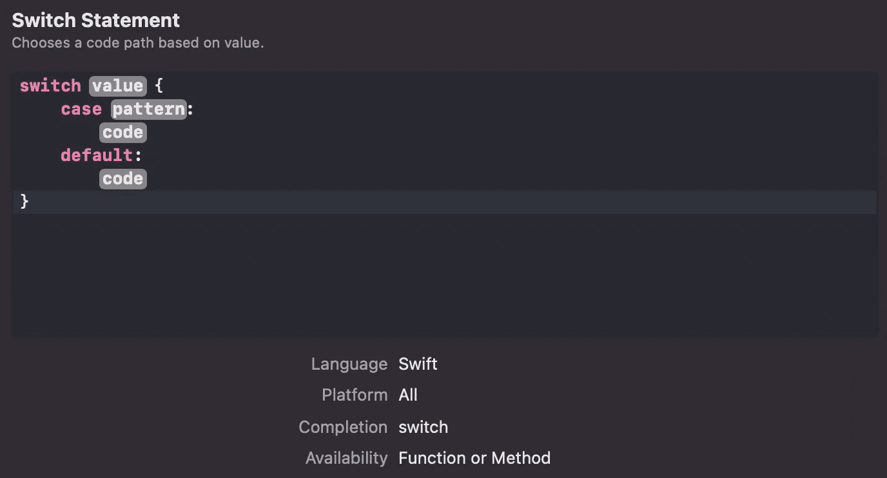
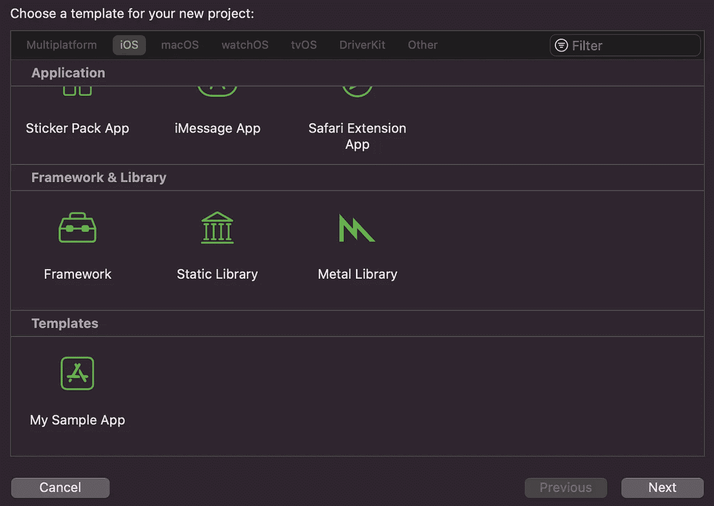
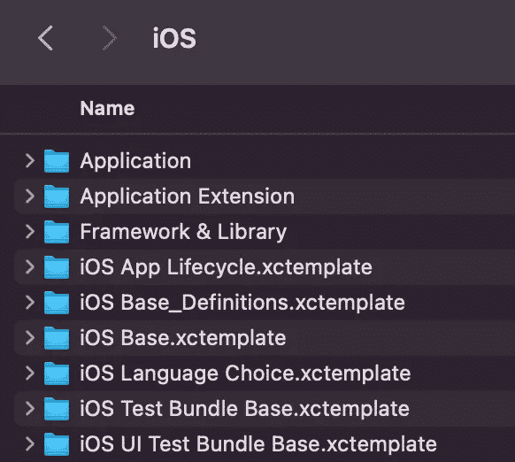
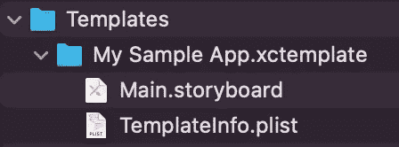
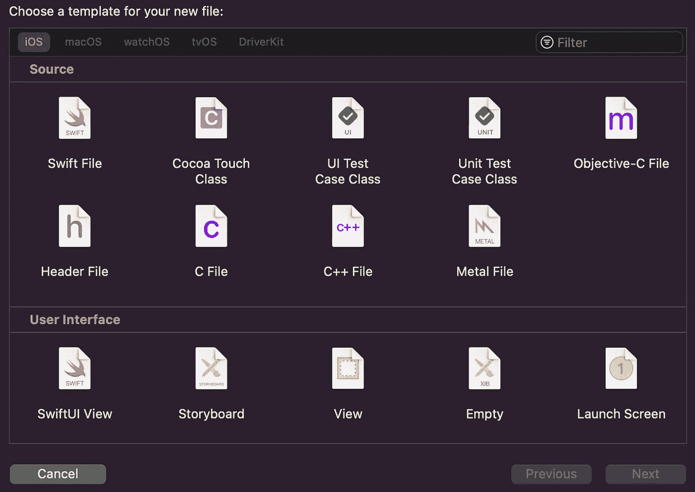
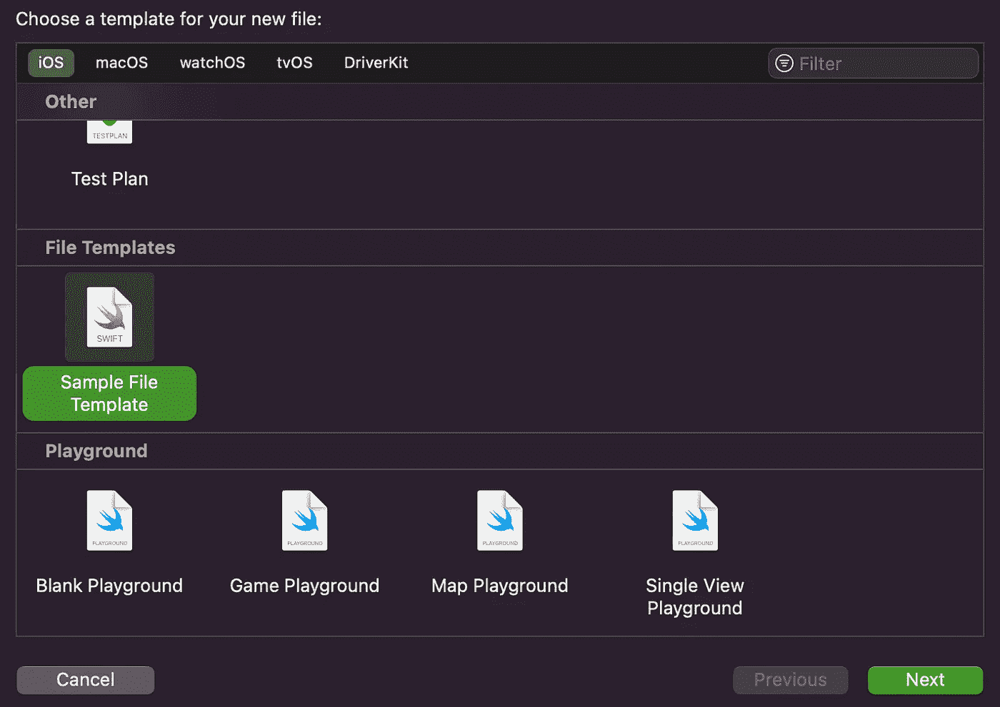

# 如何推进您的 iOS 应用程序开发流程

> 原文：<https://levelup.gitconnected.com/how-to-boost-your-ios-app-development-process-f9dee19a32e7>

克里斯汀·休姆在 [Unsplash](https://unsplash.com?utm_source=medium&utm_medium=referral) 上拍摄的照片

iOS 应用开发是一个诱人的过程。
工作包括以下阶段:

*   研究
*   设计/建筑
*   发展
*   试验
*   部署
*   维护

嗯，虽然这些过程很有趣也很有挑战性，久而久之，你获得的经验越多。工作的某些部分变成了例行公事。我假设您同意这样的观点，即编写常规代码或设计常规解决方案不是我们所热爱的开发的本质。所以，当这样的时刻到来时，我们必须开启极客的本能。是时候将这些工作自动化，并为那些可能对我们至关重要的事情留出更多空间了。

有许多方法可以加快编码速度，例如，掌握调试工具将节省您几天或几个月的时间来解决一些 bug。此外，还有各种各样的工具或技能可以让您的编码工作变得更加轻松。但是今天，我将讨论三个基本但重要的技巧，它们将会使你的编码过程更舒适。
主题包括:

*   **Xcode 快捷键**
*   **代码片段**
*   **Xcode 模板**

如果您不熟悉这些主题，阅读本文后，您将对如何加快编码速度、何时、何地以及如何使用快捷方式、代码片段和模板有一个大致的了解。好吧，让我们先来看看 Xcode 快捷键。

# Xcode 快捷键

花几秒钟时间想一想你最后一次在 Xcode IDE 中使用 Run 按钮是什么时候。如果这不是你在 iOS 开发中的第一步，我希望你不记得你最近什么时候点击了那个按钮，因为有 **⌘ + R** 快捷方式来运行你的项目。然而，如果你还在点击运行按钮，开始你的 iOS 开发的第一步，我有一些[金矿](https://medium.com/@sandroshvili/ios-development-resources-for-newcomers-23ee86d231ff)与你分享。

Xcode 是我们“爱”的 IDE，Xcode 也“爱”我们也就不足为奇了。当一些随机错误出现时，你甚至不到 10 分钟就可以享受你的代码并构建它。这就是我们采取所谓的专业开发人员行动的时候了，复制错误并用谷歌搜索它。打开第一个 StackOverflow 页面，在答案部分(当我说答案部分时，我指的是答案部分！！)我们看到了我们的英雄。手里拿着魔棒的人，还有神奇的三个字——**清理构建文件夹。你回到你的项目，点击神奇的 Shift + ⌘ + K 键，问题就解决了。**

我打算用这两个例子向您展示一些您已经在日常编码中使用的快捷方式。随着时间流逝，你甚至会忘记跑步按钮在哪里。如果你花些时间学习这些捷径，它们有很多。在短短几周内，您将会看到 Xcode 环境的改进和家的感觉。

让我们看看下面的例子，看看显示相同结果的两个 gif 之间的时间差。

**无快捷方式**

**带快捷方式**

你可以用你的**选项键和鼠标指针选择这样的线条。**如你所见，一个简单、基本的快捷键可以让你的编码速度提高 3 到 4 倍。在 Xcode 中有很多快捷方式可以使用，我不打算在本文中一一列举。但是如果你知道它有什么好处，你可以搜索其中的一些。很容易得到它们。从那里，我们可以移动到代码片段。

# 代码片段

代码段是可重用的代码块，可以在不同的项目中使用。片段可以是 ViewController 的基本配置、UI 组件的编程设置或问题的解决方案。它们几乎可以是任何可重复使用并有助于储存的东西。

编写一致的代码是好软件的关键组成部分之一。不幸的是，一致性通常需要在一些项目部分编写样板代码。所以，当我们可以创建可重用的代码片段时，为什么我们要从头开始编写代码呢？

让我们看看 Xcode 中的 Switch 代码片段

如您所见，您可能已经使用了很多次的代码实际上是 Xcode 中内置的代码片段。它使您实现 switch 语句更加容易、舒适和快速。现在，凭借其自动完成的 cases switch 语句，代码片段是一个非常强大的工具。要查看更多代码片段，您可以直接进入 Xcode，打开。swift 文件，使用快捷键 **Shift + ⌘ + L** ，代码片段库打开。您可以在中使用完全相同的快捷方式。xib 和故事板文件到达 UI 库。

好了，我们已经看到了如何搜索一些片段，现在让我们看看如何自己创建一个。
**选择可复用代码- >点击鼠标右键- >创建代码片段..**

在“标题”字段中，输入代码段的标题并在代码中使用。然后，你必须完成它。因此，在完成时，您输入将要键入的文本，这样代码就会自动完成。以防您需要在代码片段中创建占位符。你可以像这样写*<# your placeholder #>*，这样当你使用这个代码片段时，你可以用 Tab 键在占位符之间切换。

# Xcode 模板

你在 Xcode 中创过项目吗？这是一个相当直观的过程。您打开 Xcode，点按“创建新的 Xcode 项目”，选择平台，输入名称，示例项目就已经存在了。对于 UIKit，它包含 AppDelegate、SceneDelegate、ViewController、Main、Assets、LaunchScreen 和 info.plist 文件。那么，当我们还没有一个一个地创造它们的时候，它们是如何在这里结束的呢？答案是，当您从头开始创建一个项目时，它会使用一个项目模板。默认情况下，我们可以轻松地为不同的设备创建项目。

有时我们会在新项目中使用相同的基本修改，因此我们可以基于我们的更改进行构建。例如，我们可能会添加 CoreData 服务、网络或项目创建时您需要做的任何基本工作。在这种情况下，您可以创建项目模板。因此，每当您开始新项目时，您不必从以前的项目中复制项目并在那里进行一些更改。你点击创建一个新项目，你的模板会出现在那里，就像下面的图片。

## 如何创建项目模板？

打开 Finder，点按“前往文件夹”并输入位置—*/Applications/Xcode . app/Contents/Developer/Platforms/iphone OS . platform/Developer/Library/Xcode/Templates/Project Templates/iOS*

在那里你可以看到默认的 iOS 模板，那些是用来在 Xcode 中创建你的项目的模板。如果你想检查 macOS 或 watchOS 的模板或其他任何东西，你可以看看周围的 *Xcode/Templates* 文件夹。

让我们在移动到 iOS 项目模板文件夹后创建一个 iOS 模板项目。你会看到那里制作的不同样品。

在*应用*文件夹中，你会看到 *App.xctemplate，*你可以复制那个基本模板。之后打开 finder，点击进入文件夹，在那个文件夹中输入位置—*/Library/Developer/Xcode/Templates*，可以创建自己的文件夹，粘贴 *App.xctemplate* 在那里。

在这里，我们可以添加一些希望包含在示例项目中的文件。为了让它工作，我们必须修改 *TemplateInfo.plist* 文件中的标识符，并将其设置为某个唯一的值。

恭喜，我们已经完成了项目模板。但是，这并不是结束。您可能不希望总是创建新项目来构建您的基本设置。如果我们需要向现有的应用程序添加一些特定的文件，我们可以创建**文件模板**。

当您在项目中点击 **⌘ + N** 时，它会打开“文件模板”窗口，在这里您可以看到 Xcode 的默认模板。

让我们创建我们的 Swift 文件模板。
首先，我们打开 Finder，点击进入文件夹，输入位置—*/Applications/Xcode . app/Contents/Developer/Library/Xcode/Templates/File Templates/multi platform/Source*有 *Swift File.xctemplate* 文件夹，我们复制一下。然后我们移动到*~/Library/Developer/Xcode/Templates*并在那里创建一个新的文件夹，在这个文件夹中我们粘贴 *Swift File.xctemplate.* 你可以将文件夹名称更改为你想要的名称。打开文件夹，有*。swift* 文件，您可以打开并修改它以获得您的可重用代码。这就是了，你已经创建了你的第一个文件模板，你可以在 Xcode *、*、 **⌘ + N** 滚动查看到结束。

如果你想更深入的了解模板以及如何让模板更高级，你可以搜索一些文章来掌握🚀。

# 结论

在本文中，我们讨论了 Xcode 快捷方式的本质、代码片段的用法以及 Xcode 模板的基础知识。提高这些技能将会大大提高你的工作效率。