# 如何在 40 分钟或更短时间内启动一个 nocode SaaS 平台

> 原文：<https://levelup.gitconnected.com/how-to-bootstrap-a-nocode-saas-platform-in-40-minutes-or-less-3a2c6eb7d4c3>

## *从零到经常性收入的时间比洗衣服的时间还短(Stripe + Webflow)*

由[迈克·彼得鲁奇](https://unsplash.com/@mikepetrucci?utm_source=unsplash&utm_medium=referral&utm_content=creditCopyText)在 [Unsplash](https://unsplash.com/s/photos/shop?utm_source=unsplash&utm_medium=referral&utm_content=creditCopyText) 上拍摄的照片

当我开始构建我的最新项目——一个个性化工作提醒平台时，我发现自己陷入了困境。

我计划通过电子邮件管理产品的交付和支持，所以我不需要一个非常沉重的应用程序。我所需要的只是一个解释产品的登录页面和一个我的客户可以注册的订阅页面。听起来很适合 nocode 工具，对吗？

可惜没有！

Shopify，Webflow，Squarespace 等。是销售 t 恤和订阅盒等实物商品的绝佳工具。他们也很擅长销售数字产品，每个人都可以得到同样的东西，比如时事通讯和电子书。但是，如果你想销售一种数字产品，让每个用户都能得到个性化的东西(比如当他们最喜欢的公司发布新工作时会收到提醒)，那么你就不走运了。

我所需要的只是一个基本的登录页面和一个经常性的账单结账。但是没有一个大的 nocode 工具可以支持这个用例。

幸运的是，有一种简单的方法可以 DIY 一个自举的 SaaS 结账流程。Webflow 的嵌入式代码块和 Stripe 的客户端专用结帐功能助您一臂之力！

如果你想要一个简单的方法来引导你的 SaaS 应用程序，那么继续读下去！

# 要求

要打造自己的 SaaS 平台，你需要三样东西。

1.  一个[条纹](https://stripe.com/)账号(免费就好)，
2.  托管的 [Webflow](https://webflow.com/) 账户(目前起价 15 美元/月)；和
3.  复制和粘贴的能力。

# 构建您的平台

## 条带设置

先从条纹开始。注册一个新帐户并完成您的帐户设置。这包括连接一个银行账户*(你想得到报酬，不是吗？给他们一个公司地址和电话号码。您现在可以使用您的个人信息，并在准备好上线后进行更新。*

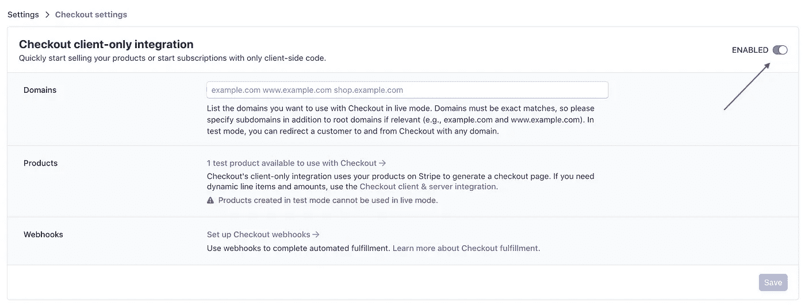

启用仅结帐客户端集成

一旦你的账户被完全激活，使用侧边栏中的链接进入`Settings`页面。在该页面的顶部，您会发现一个`Checkout client-only integration`选项。启用它！这是让我们跳过条带集成通常所需的后端开发的神奇因素。

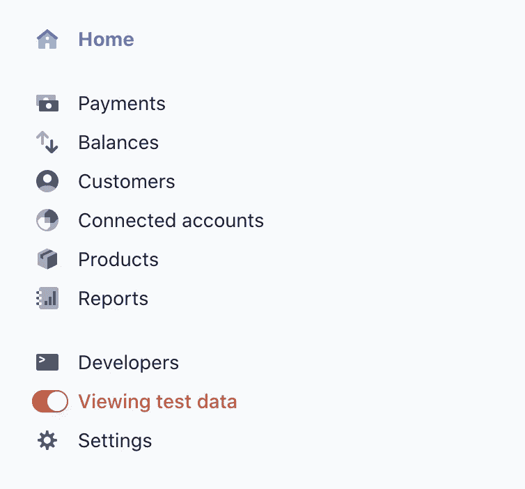

激活测试数据

接下来，打开你的仪表盘，在工具条上寻找`Viewing test data`开关。打开它。您应该会在屏幕顶部看到一个细长的橙色条，上面有一个标签，写着`TEST DATA`。一旦你完成了所有的设置，你将切换到非测试模式。不过就目前而言，安全总比后悔好。

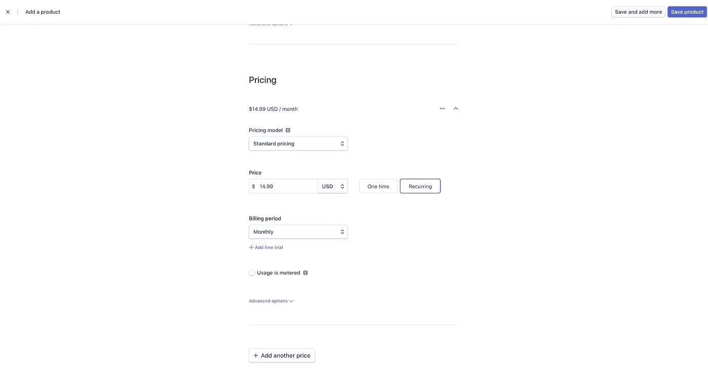

添加新产品和定价

一旦你进入测试模式，点击侧边栏中的`Products`，创建一个新产品。使用您喜欢的任何描述和计费结构。请记住，这是一个测试产品，所以你输入什么并不重要。

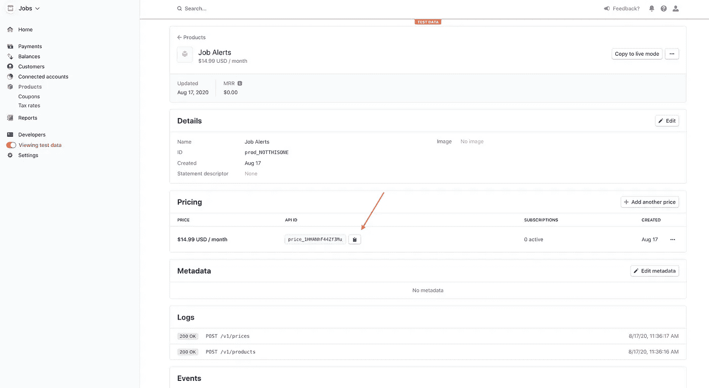

复制定价密钥

现在事情变得更加技术性了。您需要从 Stripe 的界面中找到并复制两个“密钥”。这些就像电脑版的条形码。他们让 Stripe 知道我们是谁，以及他们应该向我们的用户收取什么费用/如何收费。您需要的第一个密钥来自您刚刚创建的产品。要找到它，请返回到`Products`页面，点击您的新产品。寻找`Pricing`标题。你会看到一个叫做`API ID`的东西，看起来有点像`price_123ABc456dEf789`。复制密钥(区分大小写)并将其放在安全的地方。

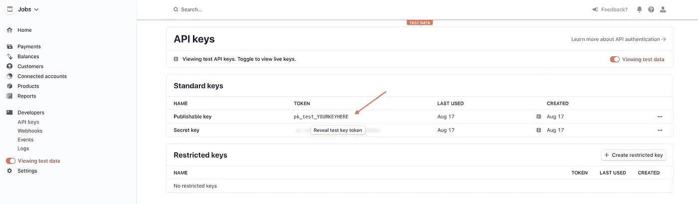

复制可发布密钥

接下来，点击侧边栏中的`Developers`链接。在`Developers`下方会出现一个子菜单，带有一些额外的选项。点击`API Keys`选项。就像您对 price API 键所做的那样，找到`Publishable Key`并复制它。

就是这样！Stripe 已做好业务准备。

## Webflow 设置

如果您还没有帐户，请注册一个新的 Webflow 帐户并创建一个新项目。

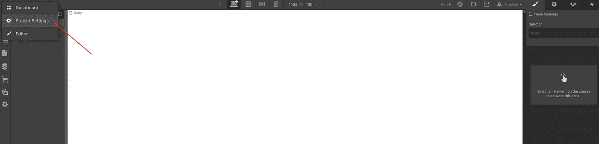

返回项目设置

创建新项目后，您将启动 Webflow 编辑器。在向此页面添加任何内容之前，我们需要退出并配置一些项目范围的设置。点击屏幕左上角的大`W`，进入`Project Settings`。

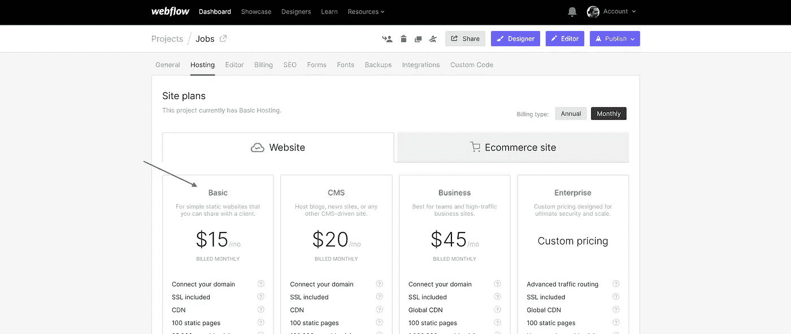

首先，转到`Hosting`选项卡。您需要在 Webflow 应用程序中嵌入一些代码，这在非托管层上是不可能的。选择符合您需求的计划，并完成注册流程。我注册了“基本”计划，每月 15 美元。

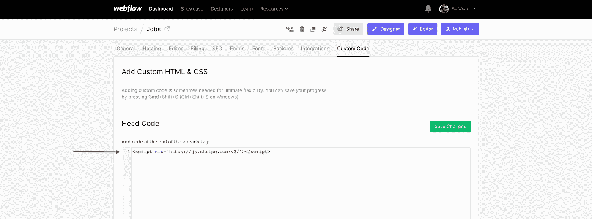

将 Stripe 的 javascript 包添加到您的站点

接下来，转到最右边的`Custom Code`选项卡。在`Head Code`部分添加这段 html 代码。

加载 Stripe 的 javascript 包

这个小脚本将在你的应用程序的每个页面上加载 Stripe 的 javascript 包。这样，我们就可以获得处理您的付款所需的工具。

这就是项目范围的设置。完成后，使用标题中的紫色大按钮返回到应用程序的`Designer`视图。

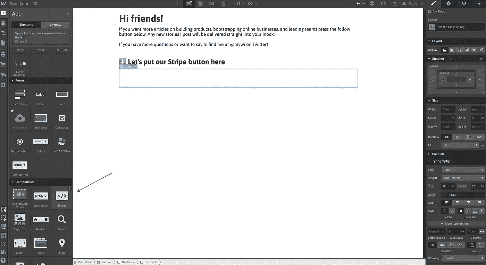

添加新的嵌入代码块

在 designer 视图中，决定新的 Subscribe 按钮的位置。使用`Add Elements`按钮(键盘快捷键`A`)在那里创建一个新的`Embed`元素。还记得我们添加到项目的`Head Code`中的代码片段吗？在后台，它将 Stripe 的 javascript 包加载到我们应用程序的每个页面中。我们所要做的就是放入一小段代码，让我们与它交流。

下面的代码块做了三件事。它…

1.  在页面上创建一个新按钮；
2.  告诉 Stripe 应将成功和取消的付款发送到哪里；和
3.  在那个按钮上设置一个点击监听器。

创建一个新按钮，并观察点击

当用户点击我们新创建的按钮时，代码片段会将他们重定向到 Stripe 服务器上的基本支付表单。

简单！(但你还没有完全完成)

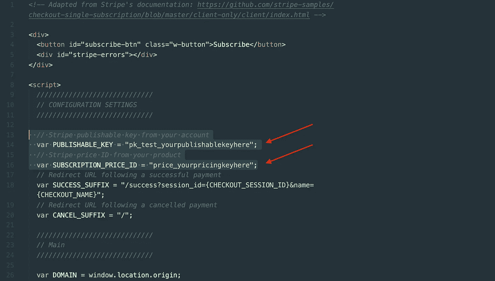

在此添加您的条纹钥匙

在使用该代码之前，您需要告诉 Stripe 要使用什么产品和价格。您可以通过粘贴之前保存的 pricing 和 publishable 键来实现这一点。它们排成行`14`和`16`。

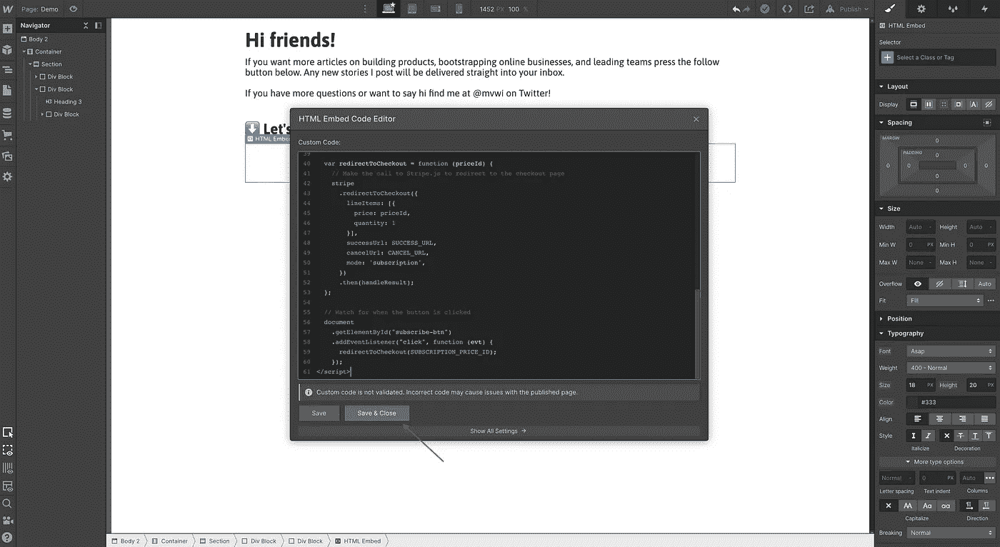

添加(已编辑的)代码块并保存您的更改

现在您的键已经就位，将编辑过的代码块复制到您的嵌入组件中。按下`Save and Close`。全部完成！转到窗口的右上角，单击`Publish`部署您的更改。

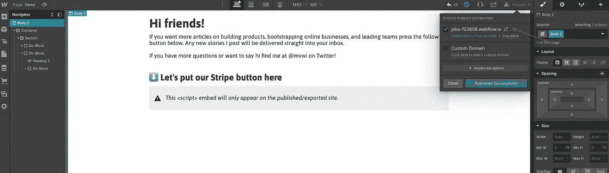

您的临时 URL

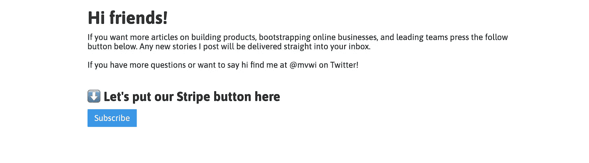

部署的页面

要测试一切是否正常，请访问您的网站并点击全新的订阅按钮。(URL 将出现在`Publish`下拉列表中)该按钮将带您进入测试产品的付款页面。

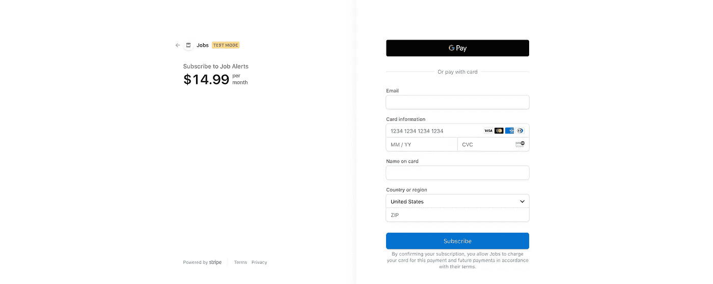

您全新的结账页面！

您可以使用测试信用卡号`4242 4242 4242 4242`和任何其他信息来验证一切正常。测试支付成功后，您将被带回到您添加的代码 blob 的第`18`行中定义的 URL(`/success`除非您更改了它)。

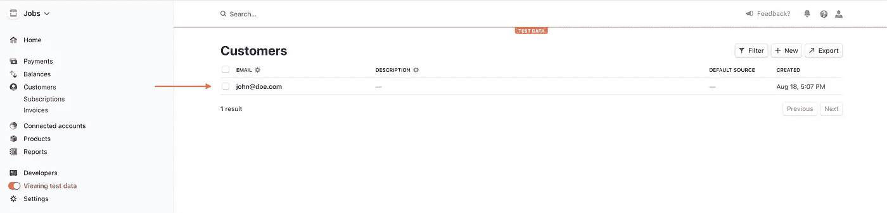

我们的第一个订户！

如果您查看 Stripe 的客户控制面板，您会看到新的测试订阅。

> 注意:如果您在尝试加载`yoursite.com/success`时得到 404 错误，那么您需要在 Webflow 中创建一个`/success`页面。

**恭喜**！你刚刚用(几乎)零代码构建了一个全功能的 SaaS 支付平台！

## 包扎

现在你已经确保所有的管道正确连接，是时候从测试模式切换到处理真正的支付了。返回到 Stripe 并重复与之前相同的步骤—这次关闭测试模式切换。创建一个新产品，复制定价密钥，获取可发布密钥，并替换嵌入代码块中的测试值。

添加您的副本，美化设计，你的业务是小康的比赛！🐎

## 定制和常见问题

> *如何更改按钮文本？*

在`<button id=”subscribe-btn” class=”w-button”>Subscribe</button>`一行，把“订阅”改成你想让按钮说的任何内容。

> 我可以在我的页面上添加多个按钮吗？

是的，稍微编辑一下代码。Javascript 试图通过在页面上搜索具有匹配的`id`字段的元素来找到我们的按钮。当有两个字段具有相同的`id`时，就会混淆。我们可以通过给每个按钮一个唯一的`id`来解决这个问题。当你为第二个按钮嵌入代码时，寻找第`4`和`57`行，并将 id(例如:`”subscribe-btn”`)改为不同的值。例如:`4`行的`id=”new-button”`和`57`行的`.getElementById(“new-button”)`。

> *如何更改成功和取消网址？*

您可以在嵌入代码的第`18`和`20`行编辑重定向 URL。

> *为什么成功 URL 包含* `*“?session_id={CHECKOUT_SESSION_ID}&name={CHECKOUT_NAME}”*` *？*

对于这个例子来说，这并不是绝对必要的，但是拥有这个额外的字段可以让您将信息从 Stripe 传递回您的 Webflow 应用程序。这可以帮助您以比匹配电子邮件更严格的方式将 Stripe 会话与您的用户进行匹配。如果你有兴趣了解更多信息，请在下面的评论或在推特上给我留言，我会写一篇后续文章。

> *我还有一个问题*

太好了！请在下面评论或在 [Twitter](https://twitter.com/mvwi) 上给我发消息。