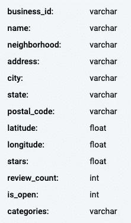

# 如何分解一个“难”的 SQL 面试问题

> 原文：<https://levelup.gitconnected.com/how-to-break-down-a-hard-sql-interview-question-7325d561857b>

其中我一步一步地回答了一个被 StrataScratch 标记为“难”的 Yelp SQL 面试问题


照片由 [LinkedIn 销售解决方案](https://unsplash.com/@linkedinsalesnavigator?utm_source=medium&utm_medium=referral)在 [Unsplash](https://unsplash.com?utm_source=medium&utm_medium=referral) 上拍摄

# 介绍

[StrataScratch](https://www.stratascratch.com/) 是一个练习真实面试问题的平台，这些问题来自 Meta、网飞、微软等公司。在本文中，我将一步一步地回答在线目录和评论出版商 Yelp 的一个 SQL 面试问题。

如果你是一名实践型学习者，你可以注册一个免费账户，然后在这里按照编码步骤[进行操作](https://platform.stratascratch.com/coding/10046-top-5-states-with-5-star-businesses?code_type=3)。请注意，虽然我喜欢 StrataScratch 练习 SQL 问题，但我与该公司没有任何个人或专业联系！

本文假设您对 SQL 基础知识有基本的了解，比如 SELECT、FROM 和 WHERE。最终查询中更多中级函数的文档将在介绍时提供。

# 这个问题

**标题:**拥有 5 家星级企业的前 5 个州

**描述:**查找 5 星商家最多的前 5 个州。输出州名以及五星级企业数量，并按五星级企业数量降序排列订单记录。如果业务数量有关联，则返回所有唯一的状态。如果两个州的结果相同，按字母顺序排序。

**数据模式:**



## 步骤 1:确定可交付成果

也许您可以学习的最重要的 SQL 技能之一是快速解析业务问题的能力，这些问题将最终出现在您的最终 SQL 查询中。在现实世界中，利益相关者很少会告诉你“输出”什么与你的模式完全匹配，但是上面的描述仍然需要被解析并翻译成 SQL。

在我们编写任何 SQL 之前——甚至可能在查看数据模式之前——我们必须确保我们理解所询问的内容。所以用最简单的话来说，Yelp 要求的是什么？

*   州名
*   每个州五星级企业的数量

就是这样。是的，答案必须只包括前 5 个州，记录必须以某种方式排序，但那是交付，而不是可交付的。现在我们知道了我们的可交付结果，我们可以开始编写我们的查询了。

## 步骤 2:想象一个完美的世界

我们知道我们的查询将有一个 SELECT 和 FROM 语句。数据必须来自某个地方(一个表)，即使我们想要那个表中的每个字段，我们仍然必须选择所有的字段(使用*)。

只有一个表，`yelp_business`，所以我们知道数据是从那里来的。我们也知道我们要选择什么，这要感谢我们事先确定了可交付成果。

在这一步，我们将通过想象一个完美的世界来建立基础:

```
SELECT state, num_businesses 
FROM yelp_business;
```

如果您跟随或仔细研究了数据模式，您会知道这是一个“完美的世界”,因为查询会返回一个错误。这是因为*num _ business*不是数据中已经存在的字段。这是我们最终想要的，但它还不存在。我们必须创造它。

## 第三步:分解逻辑

第 1 步和第 2 步至关重要，但第 3 步是概念与执行的结合。从现在开始我们要慢慢来。

*num _ business*有三个逻辑组件:

1.  这是一个计数的东西
2.  这是五星级企业
3.  我们需要按状态统计**(或者更专业地说，在状态级别上汇总)**

这些组件中的每一个都被分解到查询中的不同位置。让我们一个一个地看一下:

1.  对某物的计数。我们可以通过在 SELECT 语句中添加`COUNT(*)`来返回记录的数量
2.  **五星级企业。**每项业务的星级可在*星级*字段中找到。我们可以使用 WHERE 子句:`WHERE stars = 5`只筛选具有五星评级的企业
3.  **按州汇总计数。**要指示 SQL 按状态聚集(或分组)计数，我们只需要一个 GROUP BY 子句:`GROUP BY state`

放在一起，看起来是这样的:

```
SELECT state, COUNT(*) AS num_businesses
FROM yelp_business
WHERE stars = 5
GROUP BY state; 
```

请注意，我将我们的计数别名为*num _ business*。这不仅仅是为了可读性，尽管这本身就是一个足够好的理由；混叠在后面会很重要。

如何决定接下来会发生什么？嗯，这取决于偏好。我喜欢把简单的东西扔掉。在克服了具有挑战性的部分后，很容易忘记小而简单的细节。

描述告诉我们按照五星级企业的数量(*num _ business*)降序排列查询结果，即从最多到最少。它还告诉我们，在出现平局的情况下，结果应该按照*状态*的字母顺序排列。

我们可以在查询的末尾使用 ORDER BY 子句来实现这一点。并且由于*状态*的字母排序只发生在平局的情况下，*num _ business*将出现在*状态:*之前

```
SELECT state, COUNT(*) AS num_businesses
FROM yelp_business
WHERE stars = 5
GROUP BY state
ORDER BY num_businesses DESC, state
```

接下来是棘手的部分。好的一面是，我们已经将许多业务逻辑翻译成了 SQL。我们现在只需要它再做一件事:只返回拥有最多五星级企业的前 5 个州。

这里有一个诱人的陷阱。起初很容易想到:*好吧，简单。因为结果已经根据五星级企业的数量进行了排序，所以我只需添加* `LIMIT 5` *，查询将只返回前 5 个州。*

如果我们运行这个查询，答案将是不正确的。那是因为描述中的这个参数:

> "如果企业数量有关联，则返回所有唯一的状态."

这表明各州之间可能有联系。对此进行调查后，发现第四名有一个三人平手(要查看这一点，请将您的`LIMIT`设置为 6)。当我们将结果限制为仅前 5 条记录时，查询忽略了与第 4 名并列的第 3 个州。

我们如何得到第三种状态？有几种不同的方法。您的决定将再次部分取决于您的偏好，还可能取决于您正在使用的 SQL 语言。(我用的是 MySQL。)

但让我们先从逻辑上思考一下，因为这里更大的挑战是真正理解这个问题。当在现实世界中与利益相关者一起工作时，你会发现他们表达要求的方式和他们真正要求的东西之间有时会有差距。即使在最好的情况下，他们也很可能不知道如何用 SQL 术语来表达——如果他们知道，他们就不必来找你了。

问题是根据**各州在五星级企业数量中的排名**来询问排名靠前的州。因此，我们真正需要的是对各州进行排名的能力，然后根据排名进行过滤。

为此，我将使用 CTE 或公共表表达式。也可以在 FROM 语句中使用子查询来达到同样的效果。

旁注:我认为 cte*对初学者来说听起来更吓人，尽管它们本质上只是将子查询赋给变量的一种方式(通常使代码更容易阅读)。)学习资源也倾向于在 cte 之前教授子查询，这表明后者更难。再次，这归结为一个偏好问题，但是我认为 cte 本质上并不比子查询更困难或更复杂。*

但是为什么我们需要使用这些东西呢？因为如果您仅仅停留在使用 RANK()函数添加排名，您将无法对其进行过滤。让我告诉你我的意思。

```
SELECT state, COUNT(*) AS num_businesses, RANK() OVER(ORDER BY COUNT(*) DESC) AS state_rank
FROM yelp_business
WHERE stars = 5
GROUP BY state
ORDER BY num_businesses DESC, state
```

这个查询确实让我们更进一步，但问题是我不能在 WHERE 语句中添加一个`AND state_rank <= 5`。这是因为 WHERE 语句不识别我们的计算字段——如果我们试图根据*num _ business*进行过滤，它将返回相同的错误。

我们需要做的是“展平”state_rank 字段，以便 WHERE 语句可以对其进行操作。我们可以通过将上面的查询放在 CTE 中来实现这一点。

RANK()和 cte 的内部工作原理各有自己的文章，因此稍微超出了本文的范围。要了解更多信息，请阅读此处的[关于 RANK()和窗口函数的](https://medium.com/towards-data-science/how-to-use-sql-rank-and-dense-rank-functions-7c3ebf84b4e8)，以及此处的[关于 CTEs 的](https://medium.com/towards-data-science/take-your-sql-from-good-to-great-part-1-3ae61539e92a)。

当我们运行以下查询时，SQL 将首先在内存中临时存储 CTE 的结果，允许其余代码对该数据**执行，就像它是数据库**中自己的表一样。

同样，这里的 CTE 最终只不过是上述查询的**结果。它位于下面代码的顶部:**

```
WITH states_with_ranks AS
(SELECT state, COUNT(*) AS num_businesses, RANK() OVER(ORDER BY COUNT(*) DESC) AS state_rank
FROM yelp_business
WHERE stars = 5
GROUP BY state)SELECT state_rank, state, num_businesses
FROM states_with_ranks
WHERE state_rank <= 5
ORDER BY num_businesses DESC, state
;
```

从`WITH`到`GROUP BY state)`之后的一切都是 CTE。它下面的所有内容都是我们的查询。看看我们查询中的 FROM 语句是如何引用 CTE 的名字`states_with_ranks`，而不是`yelp_business`？

CTE 通过将计算结果临时存储在内存中，有效地“展平”了计算字段。然后，我们可以只按名称选择 *state_rank* 和*num _ business*字段。最重要的是，WHERE 语句将它们识别为可以过滤的字段。

如果您无法理解 CTE 部分，但理解子查询是如何工作的，那么查看上面 CTE 的*精确代码*在 FROM 语句内的子查询中的重新定位可能会有所帮助:

```
SELECT state_rank, state, num_businesses
FROM
    (SELECT state, COUNT(*) AS num_businesses, RANK() OVER(ORDER BY COUNT(*) DESC) AS state_rank
    FROM yelp_business
    WHERE stars = 5
    GROUP BY state
    ORDER BY state, num_businesses) AS states_with_ranks
WHERE state_rank <= 5
ORDER BY num_businesses DESC, state
;
```

还要注意，在任何一种情况下，`ORDER BY`子句都被移动到最末尾。这确保了结果被正确排序。


Sebastian Herrmann 在 Unsplash 上拍摄的照片。谢了，塞巴斯蒂安！

# 结论

像其他任何事情一样，将业务逻辑翻译成 SQL 越多，就越擅长。这当然在面试中很有用，但在你获得工作后，这一点无疑更加重要。

有些[认为 SQL 面试应该被淘汰](https://counting.substack.com/p/we-should-phase-the-sql-interview?utm_campaign=Data_Elixir&utm_source=Data_Elixir_390&s=r)，也许他们是对的。但这不太可能很快发生，无论你使用什么语言，学习如何将问题分解成各个组成部分都是一项无价的技能。

有问题吗？请在评论中告诉我。你也可以在 LinkedIn 上和我联系[。](https://www.linkedin.com/in/dakotaleesmith/)

哦，如果你有一个 SQL 面试，祝你好运！