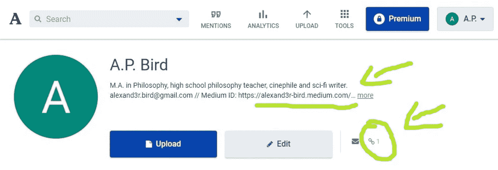
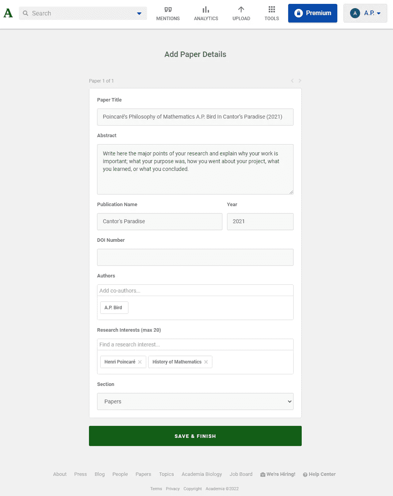
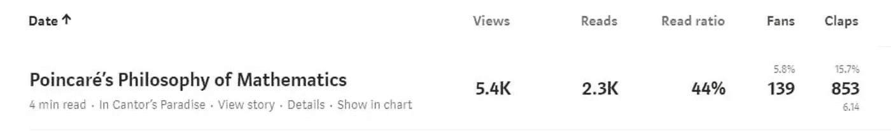

# 如何将你的媒介故事带到 Academia.edu

> 原文：<https://levelup.gitconnected.com/how-to-bring-your-medium-stories-to-academia-edu-7151e8257912>

## 让学者阅读、提及和访问你的媒介故事。

马库斯·温克勒。

## 一些关于 Academia.edu 的有趣事实

Academia.edu 有超过 7100 万的用户，它可以帮助你与广大公众即时分享你的科学研究，你也可以关注你所在领域的其他学术期刊。

互联网上的大多数批评者说 Academia.edu**是一个营利性组织，这可能会导致“付费阅读”行为，但它也是一个开放的学术文章资源库，访问者可以免费阅读，支持开放科学或开放获取运动。**

## **为什么你应该把你的故事放在那里**

**你可以在那里告知你的媒体页面的地址。因此，当你把 7100 万 academia.edu 用户中的一部分带到这里时，你可能会增加你在 Medium 上的读者数量。**

****

**作者写的。**

**通过将你的故事用于更广泛的学术分析，你将增加你的故事的可信度，Medium.com 或任何媒体出版物的可信度。**

## **以下是你上传媒体故事的方法:**

**转到您想要放在 academia.edu 上的媒体报道，并将其下载为 PDF 文件(按下“control p”，选择“另存为 PDF”，选择“布局横向”，转到“更多定义”，然后选择“纸张大小”，并选择“小报”)。**

**在 academia.edu创建您的个人资料后，进入“上传”，如上图所示，然后点击“上传文档”，再点击“选择文件”，上传您创建的 PDF 文件。**

**你可以这样描述你的论文。我的发表在媒体刊物上:康托尔的天堂。**

****

**作者写的。**

## **这是一个很好的机会**

**科学研究正遭受巨大的危机。你可以在《自然》杂志的文章中读到更多关于它的内容:“科学家行为不端”，或者约安尼迪斯极其著名的文章:“为什么大多数发表的研究发现都是假的。”以下是我最近在 Medium 上对这个问题的总结:**

 **[## 科学研究面临着巨大的危机

### 我们该怪谁呢？

alexand3r-bird.medium.com](https://alexand3r-bird.medium.com/thank-you-so-much-for-your-article-c28e0aac4ccd)** 

**科学研究被操纵了。所以，如果你想摆脱任何压力，摆脱腐败和懒惰的研究和出版物，Medium 是一个完美的空间。你肯定可以在这里取得巨大的影响。看看我的一个关于数学哲学的故事的统计数据，这是一个非常冷门的主题，我发表在 Medium 上:**

****

**作者写的。**

**所以，对我来说，很明显，开放存取的地方，像媒体，学术界，和在线百科全书，像斯坦福哲学百科全书，对教育，科学对话，科学研究来说是很棒的，如果你看不到它，你一定是瞎了。**