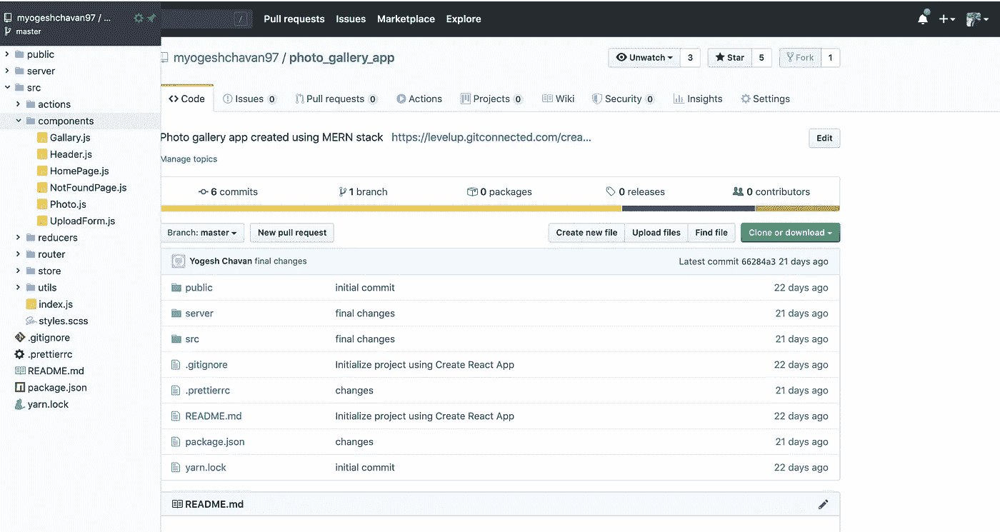
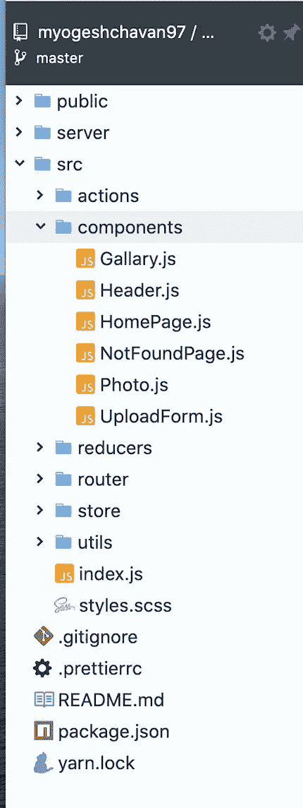
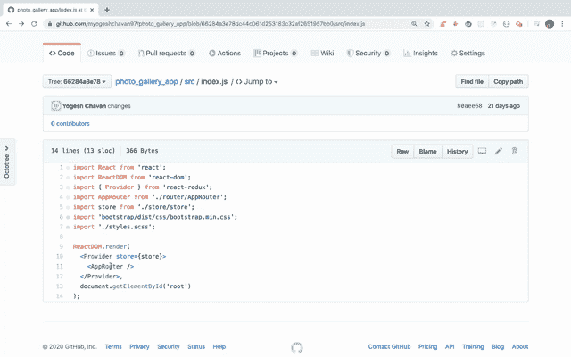

# 如何在 GitHub 上浏览项目文件，就像在 IDE 中浏览一样

> 原文：<https://levelup.gitconnected.com/how-to-browse-project-files-on-github-as-if-you-are-browsing-in-your-ide-1022f153af42>

像专业人士一样浏览 GitHub 上的文件

八叉树

今天我们将看到两个我广泛使用的非常方便的扩展，以及它们如何在使用 GitHub 时非常有用。

## **八棵树**

它允许我们在 GitHub 上浏览项目文件，就像你在你最喜欢的 IDE 中浏览文件一样。

你可以从[这里](https://chrome.google.com/webstore/detail/octotree/bkhaagjahfmjljalopjnoealnfndnagc)开始为 chrome 安装

安装后，当你进入 GitHub 上的任何项目时，你会在左边看到一个`Octotree`按钮，它会打开一个抽屉，让你可以轻松浏览文件

所以现在，不需要来回点击文件夹去 GitHub 库中的任何文件。

## **八接头**

这是另一个有用的扩展，允许我们只需点击文件中的 import 语句就可以快速转到任何文件。

你可以从[这里](https://chrome.google.com/webstore/detail/octolinker/jlmafbaeoofdegohdhinkhilhclaklkp?hl=en)安装 chrome

因此，就像您使用`Control + click`或`Command + click (Mac)`来导航到您的 IDE 中的任何代码一样，您可以通过单击这个扩展来导航，如下所示

> 如果你想直接从 GitHub 运行 GitHub 项目而不用克隆它，可以看看我的[这篇文章](https://medium.com/javascript-in-plain-english/run-any-react-angular-vuejs-project-directly-from-github-repository-48dbe3e07ca0?source=friends_link&sk=3701fd935fc659e0784f1a49df3a0de9)。

今天到此为止。我希望你学到了新东西。

**别忘了订阅我的每周简讯，里面有惊人的技巧、窍门和文章，直接在这里的收件箱里** [**。**](https://yogeshchavan.dev/)