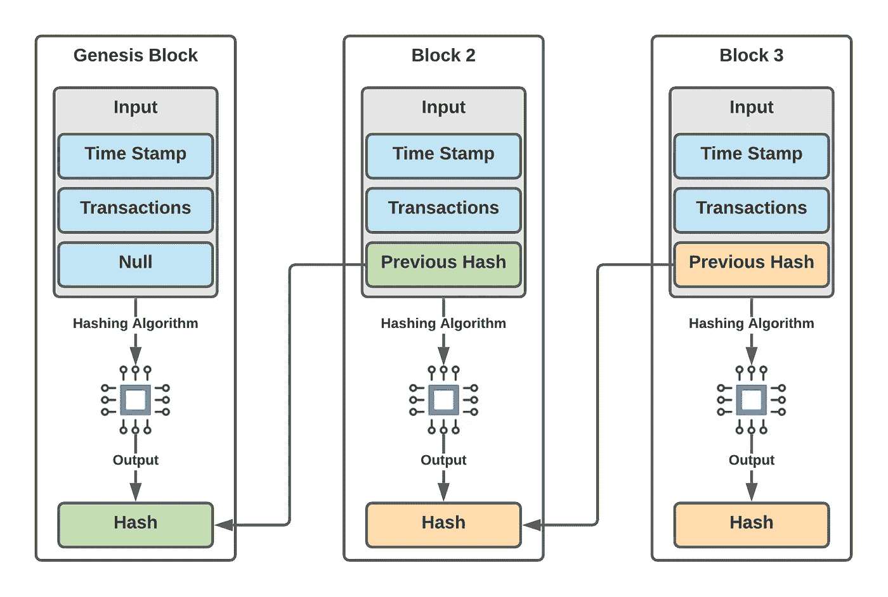

# 如何在 Go 中构建一个基础的区块链

> 原文：<https://levelup.gitconnected.com/how-to-build-a-basic-blockchain-in-go-c5745ea06456>

## 你会惊讶它是多么容易。


从 [Unsplash](https://images.unsplash.com/photo-1545987796-200677ee1011?ixid=MXwxMjA3fDB8MHxwaG90by1wYWdlfHx8fGVufDB8fHw%3D&ixlib=rb-1.2.1&auto=format&fit=crop&w=2700&q=80)

B 锁链技术被一些人认为是自互联网以来最有影响力的发明。虽然公众将区块链解释为投机性加密货币的同义词，但区块链实际上在现代世界有着极其广泛的应用。事实上，**加密货币只是区块链世界的一个小方面，**许多生产中的解决方案都是由私人组织领导的——对于一项意味着去中心化的技术来说，这已经足够讽刺了。

例如，[沃尔玛已经在使用区块链解决供应链管理问题](https://www.computerworld.com/article/3454336/walmart-launches-world-s-largest-blockchain-based-freight-and-payment-network.html)。将区块链与物联网(IoT)技术(如实时温度传感器)相结合，沃尔玛可以为自动开票、发货细节等创建智能合同。如果运输过程中出现错误，或者在任何时间点发现食品污染，**可以通过自动区块链即时追溯事件。**

> *整合了* ***区块链*** *和* ***物联网*** *解决方案，将沃尔玛的发票解决时间从七天大幅缩短至闪电般的* ***2.2 秒。***

随着区块链技术的快速发展，我相信技术领域的专业人士越来越有必要至少了解区块链的基本知识及其技术影响——你永远不知道未来的机会会在哪里出现！

毕竟，实现自己的区块链实际上并不像听起来那么复杂。在本教程中，我们将使用 2021 年最流行的编程语言之一——GoLang 来实现一个基本的区块链。

我们来建吧！

# 了解区块链

区块链是少数几项名副其实的技术之一。我们可以把区块链想象成通过*散列*相互连接的信息块——一种从输入数据生成的加密固定输出。由于每个块都通过散列相互引用，所以不可能在不彻底改变链的其余部分的情况下改变链的任何部分。这给了区块链安全和透明的好处(如果你公开你的区块链)。

继续说，**区块链中的每个块可以包含几乎任何内容的数据。**基本框架将包括每个区块过去交易的所有记录。比特币以类似的方式工作，这就是为什么你可以一直跟踪比特币交易，直到 Satoshi 的第一次加密货币交易。

万一事情还是模糊不清，**我们来看一张图。**下面我们用三个块来创建一个区块链。第一块是创世块。由于前面没有任何内容，因此前面的哈希字段为空。我们仍然使用时间戳属性和初始事务作为哈希算法的输入。这个算法会吐出一大串数字和字母，代表 **genesis 块的哈希值。**



用 LucidChart 做的

转到数据块 2，我们使用原始数据块的哈希作为数据块 2 之前哈希的值。**该操作将 genesis 块与 block 2 链接起来！**接下来，我们将时间戳、交易列表和之前的哈希值作为哈希算法的输入。该算法将给我们一个新的散列值来表示块 2。

我们继续重复这个过程**直到我们想要的次数**，除了块的有效性和存储区块链的能力(比特币的区块链约为 330 GB)之外，没有任何限制。

# 在 Go 中创建一个简单的区块链

创建区块链的第一步是**定义什么是块。** Go 让我们的生活变得容易创建自定义类型，我们可以用下面的代码定义`Block`类型。这里的`Block`结构有四个字段来匹配上面的图表。

下一步是创建 Go 版本的构造函数来**创建新块。**该函数的输入将采用一个字符串数组来表示事务，并采用一个字节数组来表示先前生成的块各自的先前哈希值。下一个要深入研究的是我们接下来要实现的`NewHash()`函数。

`NewHash()`函数将时间、事务列表和以前的散列作为输入参数，同时将一个字节数组返回给**来表示新生成的散列值。**在这个函数中，我们基本上只是将所有的输入混合到一个名为`input`的单字节数组中。我们使用`append()`函数通过将`time`转换为以`...`为后缀的`string`来将`time`参数附加到`prevHash`，以便将`time`切片附加到`prevHash`切片。

然后，我们循环遍历`transactions`并将每个单独的`transaction`添加到`input`数据块中。有趣的语法`string(rune(transaction))...`只是 Go 中把`transactions`的每个元素转换成可以附加到`input`的片段的一种方式。这是在输入垃圾，所以如果你真的想的话，就开始吧。

最后，我们使用 Go 中的`crypto`包调用`sha256.Sum256()`，并将`input`作为其参数。这将为我们所有的数据输入提供一个新的散列表示。我们返回`hash[:]`,返回时使用`[:]`语法将`hash`分割成适当的长度。很抱歉掩盖了细节，但我们在这里是为了建立一个区块链，而不是理解围棋的打字和切片方法。

这就是我们开始连接区块链所需要的一切。当然，我们希望在程序中看到某种输出，以便在打印时可以使用一些辅助方法:

太棒了。现在剩下的就是创建新的事务、块和散列。我们可以在我们的 main 方法中这样做。我们定义了一个字符串数组来记录区块链中的事务。还要注意我们如何将一个空字节数组传递给`NewBlock()`来生成我们的第一个块`genesisBlock`。

为了创建新的块，我们将前一个块的哈希值连同其相应的事务历史一起传递给`NewBlock()`。如果您想在一个地方看到整个程序，这里是:

如果我们运行这个程序，我们将得到以下输出:

```
$ go run example.go 
--- First Block ---
        time: 2021-04-05 15:12:18.813294 -0600 MDT m=+0.000074939
        prevHash: 
        Hash: 43ec51c50d2b9565f221155a29d8b72307247b08eaf6731cca
        Transactions:
                0: "Izzy sent Will 50 bitcoin"
                1: "Will sent Izzy 30 bitcoin"
--- Second Block ---
        time: 2021-04-05 15:12:18.813477 -0600 MDT m=+0.000257244
        prevHash: 43ec51c50d2b9565f221155a29d8b72307247b08eaf6731cca
        Hash: fcce5323a35cb67b45fe75866582db00fd32baeb92aac448c7
        Transactions:
                0: "John sent Izzy 30 bitcoin"
--- Third Block ---
        time: 2021-04-05 15:12:18.813488 -0600 MDT m=+0.000269168
        prevHash: fcce5323a35cb67b45fe75866582db00fd32baeb92aac448c7
        Hash: fc1d3eee286970d85812b47c3a5bf016ae8c1de4f86b8ace972ffa
        Transactions:
                0: "Will sent Izzy 45 bitcoin"
                1: "Izzy sent Will 10 bitcoin"
```

> 这很粗糙，但是这些是创建你自己的区块链的基础！如果您要更改任何块中的一条信息，那么您将获得结果散列的 ***完全不同的值。*** *自己试试吧！*

当然，如果你想要任何真正有用的东西，还有很多额外的工作要做。这个程序的下一步将包括我们的区块链的**验证**以及实际创建和验证事务的**机制。**

有趣的是，添加令牌化或加密货币行为比创建一个简单的区块链要困难得多。然而，随着区块链科技继续**在全球范围内寻找新的使用案例，基本原理保持不变。**

我希望你喜欢阅读这篇文章，并能够学到一些新的东西。很明显，这个例子中有太多东西需要补充，但是如果有什么东西引起了你的注意，或者如果你想在以后的文章中更详细地讨论这些主题，我鼓励你在下面留下评论。感谢阅读！