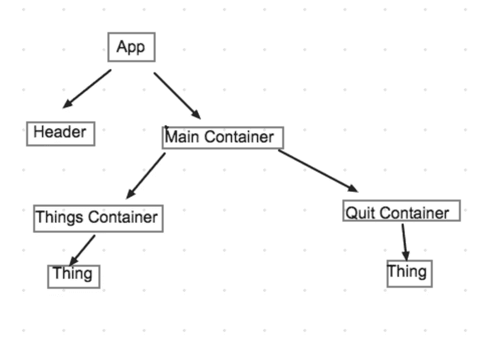
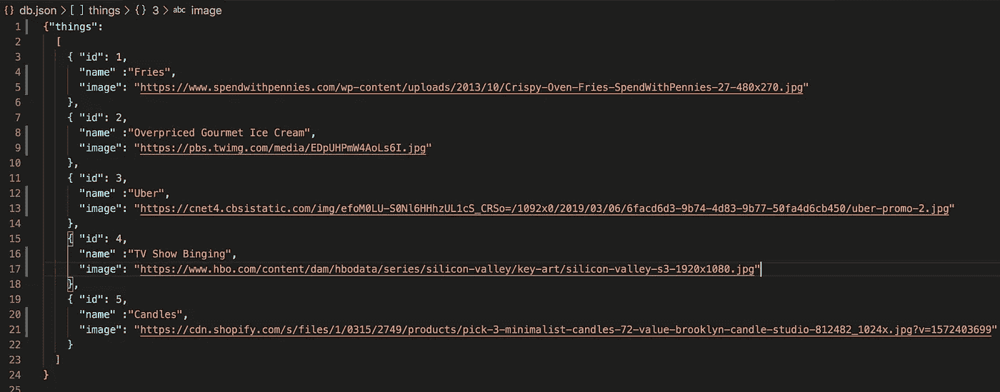
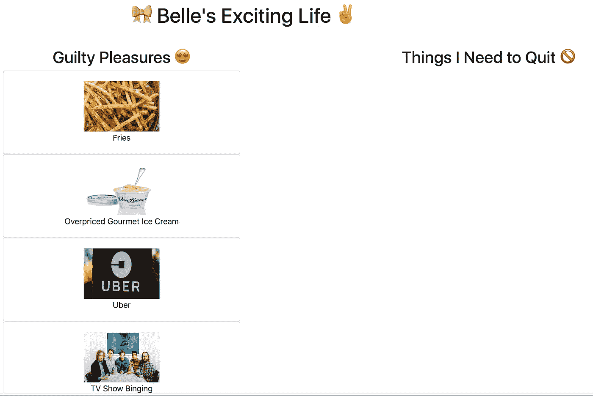

# 如何构建一个基本的(但很酷的)React 应用程序

> 原文：<https://levelup.gitconnected.com/how-to-build-a-basic-but-cool-react-app-c674788c91ab>

似乎 JavaScript 已经好得不能再好了，它的库 React 改变了 web 开发游戏。React 负责 MVC 结构中的“V”(模型-视图-控制器，供非技术人员使用)。React 使构建用户界面变得更加容易。React 最好的一点是它使用了 JSX 语法，允许我们用 JavaScript 编写 HTML 元素并直接操作 DOM。这意味着没有了”。innerHTML”、“appendChild()”或“createElement()”。

在这篇博客中，我将带你了解如何创建一个基本的 React 应用程序。我想把我的罪恶快乐列一个清单，并把它们加到另一个叫做“我应该戒掉的事情”的清单上。因为你知道，快过年了；是时候开始思考这些决议了。

在我们开始编码之前，我们需要画出我们的组件树。React 有“组件”,可以是类，也可以是函数。功能组件，也称为表示组件，接收属性，没有状态。类组件有状态，也接收属性。这两种类型的组件都呈现 HTML 元素。

下面是组件树。App 是以 Header 和 Main Container 组件作为其子元素的父 most 元素。主容器是应用程序的下一个“顶层”组件，这将是大多数道具被传递和定义的地方。主容器有事物容器和退出容器作为其子容器。事物容器将保存我喜欢的“事物”,而退出容器将保存我需要退出的“事物”。两个容器都有“Thing”组件作为其子组件。



首先，在您的终端中键入以下内容:

```
npx create-react-app thingsListApp
cd thingsListApp
```

在 src 文件夹中，创建两个文件夹:1)组件 2)容器。在 components 文件夹中，添加以下文件 1) Header.js 2) Thing.js，在 containers 文件夹中，添加 1)main container . js 2)things container . js 3)quit container。

我将创建一个 db.json 文件来为应用程序创建数据。它应该是这样的:



接下来，在您的终端中输入这 3 行代码

```
npm install -g json-serverjson-server --watch db.jsonnpm start
```

前两行运行 json-server，这样我们可以从 db.json 文件中检索数据。npm start 打开 React 应用程序。

在每个组件和容器文件(包括 App.js)中，第一行代码应该是

```
import React, { Component } from 'react'
```

我们从 React 库导入。在 App.js 中，代码应该如下所示:

```
import React, { Component } from 'react';import Header from './components/Header'import MainContainer from './containers/MainContainer' class App extends Component { render() { return ( <div> <Header/> <MainContainer/> </div> ); }}export default App;
```

> 提示:我们总是导入组件的子组件。如果组件没有子组件，我们只从“react”导入 react 或从“React”导入 React，{ Component }。

我们需要写“export default ”,这样我们就可以在其他文件中调用这个组件。我们还在这里呈现了头部和主容器组件。接下来让我们填写 Header 组件。

在 Header.js 中，代码如下所示:

```
import React, { Component } from 'react';class Header extends Component { render() { return ( <header> <h1 style={{"font-color":"magenta"}} className="text-center">🎀 Belle's Exciting Life ✌️</h1> </header> ); }}export default Header;
```

如你所见，我们在 render 方法下使用了 HTML 元素！

接下来，让我们看看主容器。主容器应该导入所有这些内容:

```
import React, { Component } from 'react';import ThingsContainer from './ThingsContainer'import QuitContainer from './QuitContainer'
```

它也应该容纳国家。现在的状态包括 things 和 quitList，它们都是空数组。

```
class MainContainer extends Component {state = { things: [], quitList: []}
```

现在让我们使用名为“componentDidMount”的方法来获取数据。

```
componentDidMount(){ fetch("http://localhost:3000/things") .then(res => res.json()) .then(thingsData => this.setState({ things: thingsData }))}
```

this.setState 更改状态。

```
render() { return ( <div className="row"> <div className="col-8"> <ThingsContainer things={this.state.things}/> </div> <div className="col-4"> <QuitContainer quitList={this.state.quitList} </div>
    </div>
  )
}export default MainContainer;
```

“things”作为道具从 ThingsContainer 组件中传递下来。Props 允许组件是动态的，这是我们传递信息给组件的方式。道具“东西”等于状态中的“东西”数组。类似地，对于 QuitContainer，它有“quitList”属性，该属性等于状态中的 quitList 数组。

接下来，让我们看看 ThingsContainer。代码应该如下所示:

```
import React, { Component } from 'react';import Thing from '../components/Thing'class ThingsContainer extends Component { render() { return ( <div> <h2>Guilty Pleasures 😍</h2> { this.props.things.map(thing => <Thing thing={thing} key={thing.id} />) } </div> ); }}export default ThingsContainer;
```

这里，我们映射到“things”数组，并将每个“thing”对象转换成一个 Thing 组件的实例。每个事物组件都有关键的道具，也就是 id 和一个完整的“事物”对象。

接下来，让我们去 QuitContainer。代码应该如下所示:

```
import React, { Component } from 'react';import Thing from '../components/Thing' class QuitContainer extends Component { render() { return ( <div> <h2>Things I Need to Quit 🚫</h2> { this.props.quitList.map((thing, index) => <Thing thing={thing} key={`${thing.name}-${index}`} />) } </div> ); }}export default QuitContainer;
```

“关键”的道具具有索引值，因为这考虑了多次选择某个项目的问题。为了区分相同的项目，我们可以使用它们的索引号。

现在让我们来看看事物组件。代码显示为:

```
import React from 'react'const Thing = (props) => ( <div> <div className="card" onClick={ () =>      props.handleClick(props.thing)}> <div className="card-body"> </img> <p className="card-text"> {`${props.thing.name}`}          </p> </div> </div> </div>);export default Thing
```

让我们看看我们的应用程序，看看它目前的样子！



硅谷是一场精彩的演出。薯条和范莱文冰淇淋是我最喜欢的食物。优步，因为 MTA 可能是一个噩梦。

漂亮！一切都如我们所愿。现在，我们应该转移到应用程序的功能。我希望能够点击罪恶快乐列表中的一个项目，它应该添加到退出列表中。我还想通过点击从退出列表中删除一个项目。

让我们回到我们的 MainContainer 组件，并将这段代码添加到 componentDidMount()下。

```
addThing = (thing) => { this.setState((prevState) => { return { quitList: [thing, ...prevState.quitList] } })}removeThing = (thing) => { let index = this.state.quitList.indexOf(thing) let copyQuitList = [...this.state.quitList] copyQuitList.splice(index,1) this.setState({ quitList: copyQuitList })}
```

addThing 方法说明了一个“Thing”对象将被添加到 quitList 数组中。setState 接受第一个参数为当前状态(prevState)的函数，返回值将更新状态。

removeThing 方法显示一个“Thing”对象将从 quitList 数组中删除。我们在这里使用 spread 操作符([…this.state.quitList])来表示当前状态。我们在当前状态下调用 splice 方法来移除我们刚刚单击的项目。

让我们在 MainContainer 文件中为 ThingsContainer 和 QuitContainer 组件添加另一个道具。

```
<ThingsContainer things={this.state.things} addThing={this.addThing}/><QuitContainer quitList={this.state.quitList}removeThing={this.removeThing}/>
```

回到 ThingsContainer 文件，让我们将 addThing 函数放入 Thing 组件。

```
this.props.things.map(thing =><Thing thing={thing}key={thing.id}handleClick={this.props.addThing}/>)
```

最后，让我们将 removeThing 函数放入 QuitContainer 文件中的 Thing 组件。

```
this.props.quitList.map((thing, index) =><Thing thing={thing}key={`${thing.name}-${index}`}handleClick={this.props.removeThing} />
```

就是这样！关键时刻到了。让我们最后看看我们的应用程序是如何运行的。

太好了！一切正常！为我们一起成功打造 React app 干杯！