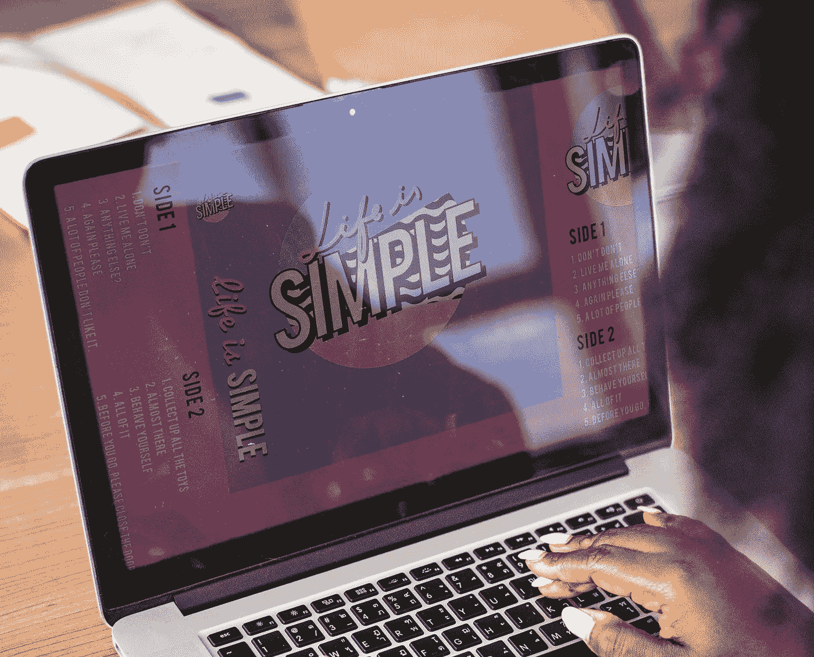
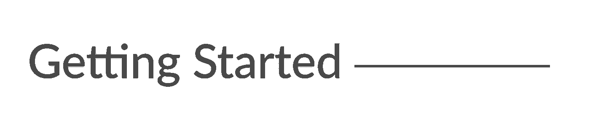
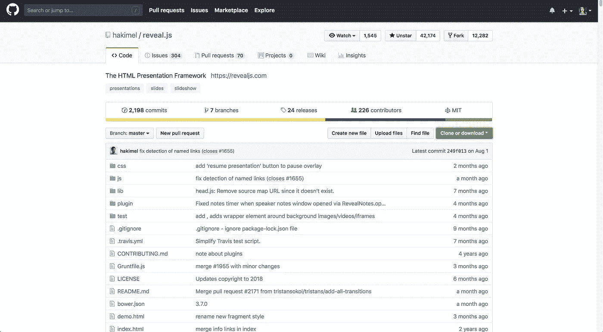
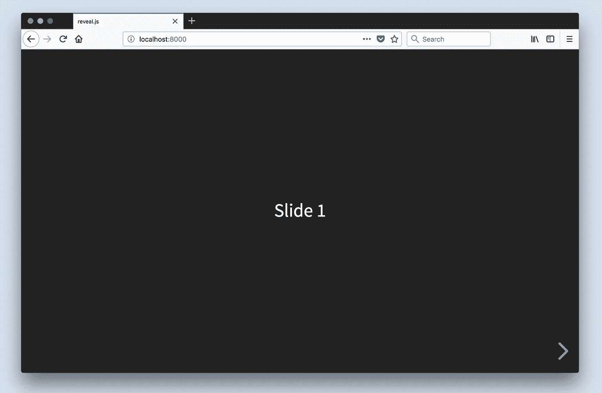
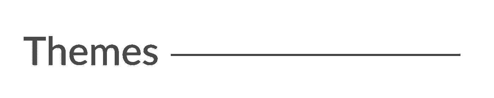
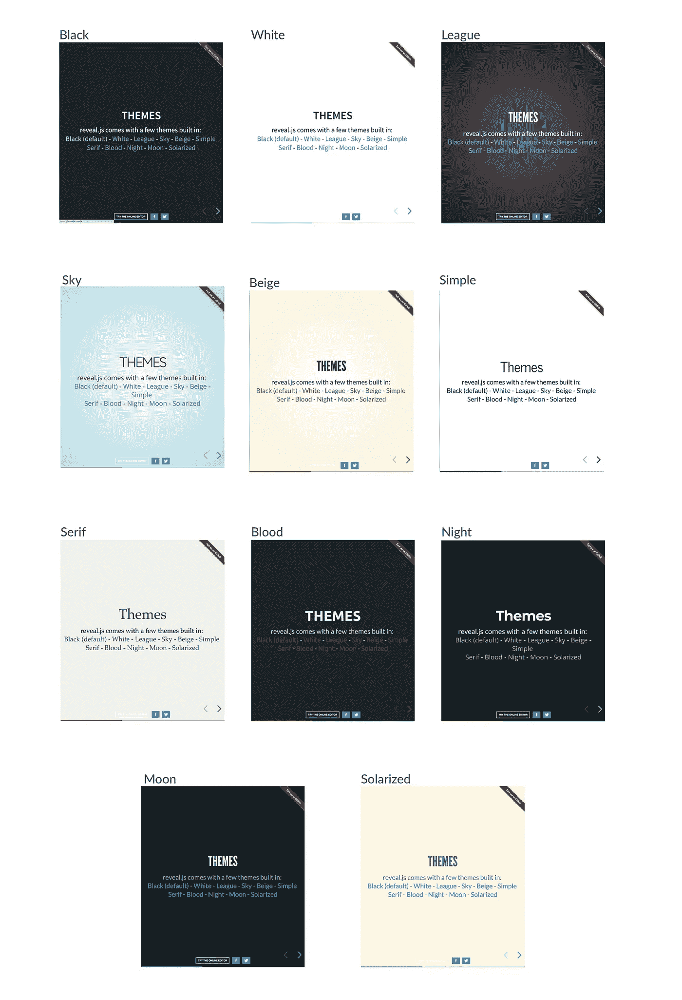
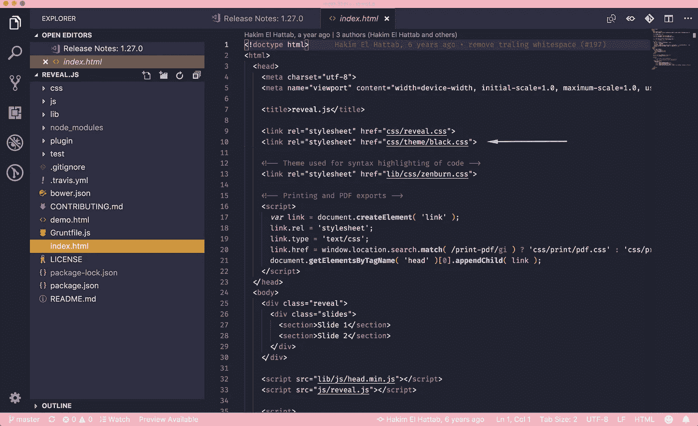
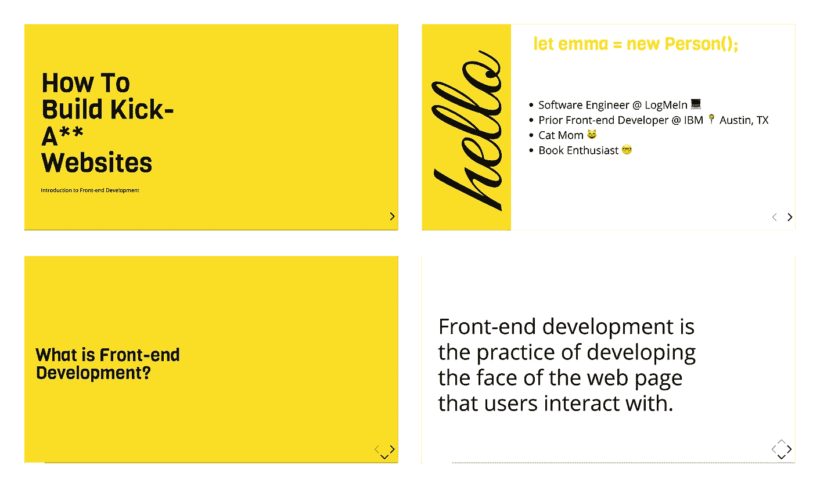
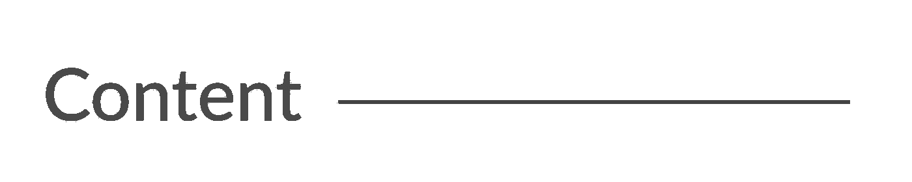

# 如何使用 HTML、CSS 和 JavaScript 构建吸引人的演示文稿

> 原文：<https://levelup.gitconnected.com/how-to-build-a-captivating-presentation-using-html-css-javascript-a1dd0e3f1096>



构建漂亮的演示文稿很难。通常你会被 Keynote 或 PowerPoint 所困，而这些模板又极其有限和普通。不再是了。

今天，我们将学习如何使用 HTML、CSS 和 JavaScript 创建令人惊叹的动画演示。

如果你是 web 开发的初学者，不要担心！本教程将很容易跟上。所以让我们直接滑进去吧！



我们将使用一个很棒的框架，叫做 [Reveal.js](https://revealjs.com/#/) 。它为创建有趣和可定制的演示提供了强大的功能。

1.  转到[reveal . js 存储库](https://github.com/hakimel/reveal.js)并克隆项目(您也可以将它分支到您的 GitHub 名称空间)。



2.将目录切换到新克隆的文件夹中，并运行`npm install`来下载包依赖项。然后运行`npm start`运行项目。



`index.html`文件保存了幻灯片的所有标记。这是使用 Reveal.js 的缺点之一；所有内容都将放在这个 HTML 文件中。



# **内置主题**

Reveal 包括 11 个内置主题供您选择:



## 改变主题

1.  打开`index.html`
2.  更改 CSS 导入以反映您想要使用的主题



**主题文件有:**

*   米色. css
*   black.css
*   blood.css
*   league.css
*   月亮. css
*   night.css
*   serif.css
*   简单. css
*   sky.css
*   solarized.css 化. css
*   white.cs

# 自定义主题

创建自定义主题非常容易。今天，我将使用我的自定义主题，来自我的演讲[“如何建立一个超级网站:前端开发介绍”](https://ejbostian.github.io/how-to-become-a-web-developer/)

这是我的自定义幻灯片的样子:



## **创建自定义主题**

1.  在你的 ide 中打开`css/theme/src`。这包含了所有的 Sass 文件(。scss)。这些文件将使用 [Grunt](https://gruntjs.com/) (一个 JavaScript 任务运行器)传输到 CSS。如果你更喜欢写 CSS，那就在`css/theme`中创建 CSS 文件。
2.  创建一个新的`.scss`文件。我会叫我的`custom.scss`。您可能需要停止您的本地主机并运行`npm run build`来将您的 Sass 代码转换成 CSS。
3.  在`index.html`文件中，将`<head>`标签中的 CSS 主题导入改为使用新创建的样式表的名称。分机将是`.css`，而不是`.scss`。
4.  接下来，我为所有我想使用的不同样式创建了变量。你可以在[谷歌字体](https://fonts.google.com/)上找到自定义字体。一旦字体下载完毕，请务必将字体的网址添加到`index.html`文件中。

以下是我选择使用的变量:

*   **标题字体:** [Viga](https://fonts.google.com/specimen/Viga)
*   **内容字体:** [打开 Sans](https://fonts.google.com/specimen/Open+Sans)
*   **代码字体:** [快递新](https://fonts.google.com/?query=Courier+New)
*   **草书字体:** [心情激荡](https://fonts.google.com/specimen/Great+Vibes)
*   **黄色:** #F9DC24

5.向自定义 Sass 文件添加一个`.reveal`类。这将包装所有的样式，以确保我们的自定义主题覆盖任何默认值。然后，添加您的自定义样式！

不幸的是，由于时间的限制，我承认我在 CSS 中使用了相当多的 `*!important*` *覆盖。这是可怕的做法，我不推荐。reveal.css 文件有非常具体的 css 样式，所以如果我有更多的时间，我应该返回并确保我的类名更加具体*[](https://developer.mozilla.org/en-US/docs/Web/CSS/Specificity)**，这样我就可以删除* `*!importants*` *。**

## *混音和设置*

*Reveal.js 还带有混音和设置，您可以在自定义主题中利用它们。*

*要使用混音和设置，只需将文件导入到您的自定义主题中:*

```
*@import "../template/mixins";@import "../template/settings";*
```

***Mixins***

*您可以使用垂直渐变、水平渐变或径向渐变混合来创建整洁的视觉效果。*

*你所要做的就是传入所需的参数(颜色值),瞧，你得到了一个渐变！*

***设置** 在设置文件中，你会发现有用的变量，比如标题大小、默认字体和颜色等等！*

**

# *元素*

*添加新内容的结构是:*

```
*.reveal > .slides > section*
```

*`<section>`元素代表一张幻灯片。根据您的内容需要，添加任意多个部分。*

## ***垂直滑动***

*要创建垂直幻灯片，只需嵌套节。*

# *过渡*

*有几种不同的幻灯片过渡供您选择:*

*   *没有人*
*   *乏味的*
*   *幻灯片*
*   *凸面的*
*   *凹面*
*   *一款云视频会议软件*

*要使用它们，在包含幻灯片数据的`<section>`中添加一个`data-transition="{name}"`。*

# *碎片*

*片段对于突出幻灯片上的特定信息非常有用。[这里的](https://revealjs.com/#/fragments)就是一个例子。*

*要使用片段，向元素添加一个`class="fragment {type-of-fragment}"`。*

*片段的类型可以是:*

*   *生长*
*   *收缩*
*   *消失*
*   *渐强*
*   *淡入然后淡出*
*   *淡入然后半淡出*
*   *高亮-当前-蓝色*
*   *突出显示-红色*
*   *高亮-绿色*
*   *突出显示-蓝色*

*此外，您还可以向元素添加索引，以指示它们应突出显示或显示的顺序。您可以使用`data-fragment-index={index}`属性来表示这一点。*

*reveal.js 有更多的特性，您可以利用它们来构建一个漂亮的演示文稿，但这些是让我开始的主要内容。*

*要了解如何格式化幻灯片的更多信息，请查看 [reveal.js 教程](https://revealjs.com/#/10)。*

*我演示的所有代码都可以在 GitHub 上看到。随便偷我的主题！*