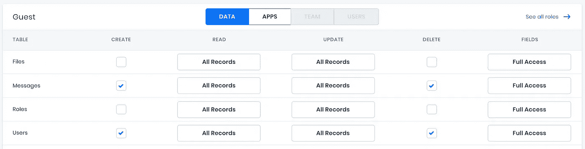

# 如何在 20 分钟内搭建一个聊天室 App

> 原文：<https://levelup.gitconnected.com/how-to-build-a-chat-room-app-in-20-minutes-82411791a36c>

## 利用 GraphQL、VueJS 和现代软件开发工具的力量构建一个聊天室应用程序。


我父亲喜欢提醒我，作为 20 世纪 70 年代的一名计算机工程师，“在编码变得很酷之前，他是一名程序员。”有一两次，他甚至拿出了老式的 Fortran 和 COBOL 脚本。读完那段代码后，我很自信地说今天的编码绝对是**更酷的**！

现代计算机语言和开发框架的一个显著特点是它们允许开发人员编写的代码要少得多。通过利用高级语言以及许多可用的 API、开源包和付费服务，应用程序——甚至是具有复杂需求的应用程序——可以以令人难以置信的速度构建。

在软件开发的进化中概念化这一点的一个有用的比较是看一下构造。从前，建造任何房子都是从砍倒自己的树开始的。然而，标准材料、工具和最佳实践的发展使项目完成得更快，结构更容易，并减轻工人的低级任务。‍

> 如果要建造一座摩天大楼，你必须自己开采钢铁，那将会有多少座摩天大楼？

仍然年轻和工作的工程师不得不砍树来开始他们的职业生涯。也就是说，过去十年前所未有的创新已经导致软件业像建筑业一样走向成熟。‍

简而言之，今天的开发人员现在拥有标准的工具、材料和最佳实践，可以更快地完成项目，稳定地运行应用程序，并将开发人员从较低级别的任务中解放出来。

# 聊天室教程概述

让我们在几分钟内完成一些传统上需要几天或几周的事情；好消息，这不是一个待办事项的应用程序！我们将构建一个公共聊天室应用程序，它使用 WebSockets 来实现实时消息传递。

WebSockets】在所有现代浏览器中都得到了本地支持。然而，*我们的目标是强调我们能为这项工作带来哪些工具，而不是在这项工作的基础上构建工具*。本着这种精神，我们将使用以下技术。‍

*   [8base](https://www.8base.com/platform) —一个托管的 GraphQL API
*   [VueJS](https://vuejs.org/) —一个前端的 JavaScript framework‍

starter 项目和完整的自述文件可以在 [this GitHub repo](https://github.com/8base/Chat-application-using-GraphQL-Subscriptions-and-Vue) 中找到。如果你只想查看完成的应用程序，检查`public-chat-room`分支。

此外，下面的视频遍历教程，并解释了更大的背景下的每一步。

使用 GraphQL 和 VueJS 构建一个公共聊天室教程

也就是说，让我们开始吧！

# 1.项目设置

克隆 starter 项目并移动到群聊目录中。您是使用`yarn`还是`npm`来安装项目依赖项取决于您自己。无论哪种方式，我们都需要安装在`package.json`文件中声明的所有 NPM 软件包。

```
# Clone project
git clone [https://github.com/8base/Chat-application-using-GraphQL-Subscriptions-and-Vue.git](https://github.com/8base/Chat-application-using-GraphQL-Subscriptions-and-Vue.git) group-chat# Move into directory
cd group-chat# Install dependencies
yarn
```

为了与 GraphQL API 通信，我们必须设置 3 个环境变量。用下面的命令在项目的根目录下创建一个`.env.local`文件。初始化后，Vue 应用程序将自动设置我们添加到该文件中的环境变量。‍

```
echo ‘VUE_APP_8BASE_WORKSPACE_ID=<YOUR_8BASE_WORKSPACE_ID>
VUE_APP_8BASE_API_ENDPOINT=https://api.8base.com
VUE_APP_8BASE_WS_ENDPOINT=wss://ws.8base.com’ \
> .env.local
```

`VUE_APP_8BASE_API_ENDPOINT`和`VUE_APP_8BASE_WS_ENDPOINT`值总是相同的。我们需要更新的值是`VUE_APP_8BASE_WORKSPACE_ID`。

‍If:您有一个 8base 工作空间，您想在本教程中使用它，继续使用工作空间 ID 更新您的`.env.local`文件。否则，通过完成 [8base 快速入门](https://docs.8base.com/docs/getting-started/quick-start)的步骤 1 & 2 检索工作区 ID。

# 2.导入数据库模式

我们现在需要调配后端。在这个回购的根目录下，你应该可以找到一个`chat-schema.json`文件。要将其导入工作区，我们只需安装并验证 8base 命令行，然后导入模式文件。

```
# Install 8base CLI
yarn global add 8base-cli# Authenticate CLI
8base login# Configure project and select workspace
8base configure# Import the schema to our workspace
8base import -f chat-schema.json -w <YOUR_8BASE_WORKSPACE_ID>
```

# 3.设置 API 权限

最后一个后端任务是启用对 GraphQL API 的公共访问。

在 8base 控制台中，导航至`App Services > Roles > Guest`。将为*消息*和*用户*设置的权限更新为**选中**或*所有记录*(如下图所示)。

Guest 角色定义了向 API 发出未经身份验证的请求的用户可以做什么。



8 控制台中的基本权限编辑器

# 4.编写 GraphQL 查询

此时，我们将定义并写出我们的聊天组件所需的所有 GraphQL 查询。这将帮助我们理解我们将通过 API 读取、创建和监听(通过 WebSockets)什么数据。

下面的代码应该放在`src/utils/graphql.js`文件中。阅读每个导出常量上面的注释，了解每个查询正在完成什么。

```
/* gql converts the query strings into graphQL documents */
import gql from "graphql-tag";/* 1\. Fetch all online chat Users and last 10 messages */
export const InitialChatData = gql`
  {
    usersList {
      items {
        id
        email
      }
    }
    messagesList(last: 10) {
      items {
        content
        createdAt
        author {
          id
          email
        }
      }
    }
  }
`;/* 2\. Create new chat users and assign them the Guest role */
export const CreateUser = gql`
  mutation($email: String!) {
    userCreate(data: { 
      email: $email,
      roles: { 
        connect: { name: "Guest" } 
      } 
    }) {
      id
    }
  }
`;/* 3\. Delete a chat user */
export const DeleteUser = gql`
  mutation($id: ID!) {
    userDelete(data: { id: $id, force: true }) {
      success
    }
  }
`;/* 4\. Listen for when chat users are created or deleted */
export const UsersSubscription = gql`
  subscription {
    Users(filter: { mutation_in: [create, delete] }) {
      mutation
      node {
        id
        email
      }
    }
  }
`;/* 5\. Create new chat messages and connect it to it's author */
export const CreateMessage = gql`
  mutation($id: ID!, $content: String!) {
    messageCreate(
      data: { content: $content, author: { connect: { id: $id } } }
    ) {
      id
    }
  }
`;/* 6\. Listen for when chat messages are created. */
export const MessagesSubscription = gql`
  subscription {
    Messages(filter: { mutation_in: create }) {
      node {
        content
        createdAt
        author {
          id
          email
        }
      }
    }
  }
`;
```

# 5.创建阿波罗和订阅客户端

随着 GraphQL 查询的编写，是时候设置我们的 API 模块了。

首先，让我们使用`ApolloClient`及其所需的缺省值来处理 API 客户机。对于`createHttpLink`,我们提供完全成形的工作空间端点。这个代码属于`src/utils/api.js`。

```
import { ApolloClient } from "apollo-boost";
import { createHttpLink } from "apollo-link-http";
import { InMemoryCache } from "apollo-cache-inmemory";const { VUE_APP_8BASE_API_ENDPOINT, VUE_APP_8BASE_WORKSPACE_ID } = process.env;export default new ApolloClient({
  link: createHttpLink({
    uri: `${VUE_APP_8BASE_API_ENDPOINT}/${VUE_APP_8BASE_WORKSPACE_ID}`,
  }),
  cache: new InMemoryCache(),
});/**
 * Note: To learn more about the options available when configuring
 * ApolloClient, please reference their documentation.
 */
```

接下来，让我们使用`subscriptions-transport-ws`和`isomorphic-ws`来处理订阅客户端。这个脚本比上一个稍长，所以请花点时间通读代码注释！‍

我们正在使用我们的 WebSockets 端点和`connectionParams`中的`workspaceId`初始化`SubscriptionClient`。然后我们在默认导出上定义的两个方法中使用那个`subscriptionClient`;`subscribe()`和`close()`。

`subscribe`允许我们创建带有数据和错误回调的新订阅。关闭方法是我们在离开聊天室时可以用来关闭连接的方法。

```
import WebSocket from "isomorphic-ws";
import { SubscriptionClient } from "subscriptions-transport-ws";const { VUE_APP_8BASE_WS_ENDPOINT, VUE_APP_8BASE_WORKSPACE_ID } = process.env;/**
 * Create the subscription client using the relevant environment
 * variables and default options
 */
const subscriptionClient = new SubscriptionClient(
  VUE_APP_8BASE_WS_ENDPOINT,
  {
    reconnect: true,
    connectionParams: {
      /**
       * WorkspaceID MUST be set or the Websocket Endpoint 
       * wont be able to map the request to the appropriate
       * workspace
       */
      workspaceId: VUE_APP_8BASE_WORKSPACE_ID
    }
  },
  /**
   * Constructor for W3C compliant WebSocket implementation. 
   * Use this when your environment does not have a built-in 
   * native WebSocket (for example, with NodeJS client)
   */
  WebSocket
);export default {
  /**
   * Accepts the subscription query, any variables and the
   * callback handlers 'data' and 'error'
   */
  subscribe: (query, options) => {
    const { variables, data, error } = options; /**
     * Runs the new subscription request.
     */
    const result = subscriptionClient.request({
      query,
      variables
    }); /**
     * The unsubscribe function can be used to close a specific
     * subscription as opposed to ALL subscriptions be maintained
     * by the subscriptionClient
     */
    const { unsubscribe } = result.subscribe({
      /**
       * Whenever an event is received, the result is passed
       * to the developer specified data callback.
       */
      next(result) {
        if (typeof data === "function") {
          data(result);
        }
      }, /**
       * Whenever an error is received, the error is passed
       * to the developer specified error callback.
       */
      error(e) {
        if (typeof error === "function") {
          error(e);
        }
      }
    }); return unsubscribe;
  }, /**
   * Closes subscriptionClient's connection.
   */
  close: () => {
    subscriptionClient.close();
  }
};/** 
 * Note: To learn more about the SubscriptionClient and 
 * its options, please reference their documentation 
 */
```

# 6.编写 Vue 组件

至此，我们已经拥有了构建公共聊天室所需的一切！剩下的就是写出一个单独的`GroupChat.vue`组件。

用`yarn serve`启动组件，让我们继续。

***警告:情人眼里出西施……正因为如此，只添加了使组件实用所需的最少样式。***

## Vue 组件脚本

首先，我们需要导入我们的模块、简单样式和 GraphQL 查询。所有这些工件都存在于我们的`src/utils`目录中。

在`GroupChat.vue`中的开始`\<script\>`标签后插入以下导入语句。‍

```
*/* API modules */*
import Api from "./utils/api";
import Wss from "./utils/wss";

*/* graphQL operations */*
import {
 InitialChatData,
 CreateUser,
 DeleteUser,
 UsersSubscription,
 CreateMessage,
 MessagesSubscription,
} from "./utils/graphql";
‍
*/* Styles */*
import "../assets/styles.css";
```

## Vue 组件数据

我们可以在组件的数据函数中定义我们想要的数据属性。我们需要的只是一种存储聊天用户、消息、“当前”用户是谁以及任何尚未发送的消息的方法。这些属性可以像这样添加:

```
*/* imports ... */*

export default {
 name: "GroupChat",
‍
 data: () => ({
   messages: [],
   newMessage: "",
   me: { email: "" },
   users: [],
 }),
};
```

## Vue 生命周期挂钩

我们的生命周期钩子在 Vue 组件“生命”的不同时刻执行。例如，当它被装载或更新时。在我们的例子中，我们只关心组件何时被创建以及`beforeDestroy`。在这些时候，我们想要打开聊天订阅或关闭聊天订阅。

```
/* imports ... */export default {
  /* other properties ... */ /**
   * Lifecycle hook executed when the component is created.
   */
  created() {
    /**
     * Create Subscription that triggers event when user is 
     * created or deleted
     */
    Wss.subscribe(UsersSubscription, {
      data: this.handleUser
    }); /**
     * Create Subscription that triggers event when 
     * message is created
     */
    Wss.subscribe(MessagesSubscription, {
      data: this.addMessage
    }); /**
     * Fetch initial chat data (Users and last 10 Messages)
     */
    Api.query({
      query: InitialChatData
    }).then(({ data }) => {
      this.users = data.usersList.items;
      this.messages = data.messagesList.items;
    }); /**
     * Callback executed on page refresh to close chat
     */
    window.onbeforeunload = this.closeChat;
  }, /**
   * Lifecycle hook executed before the component is destroyed.
   */
  beforeDestroy() {
    this.closeChat();
  }
};
```

## Vue 组件方法

我们必须添加特定的方法来处理每个 API 调用/响应(`createMessage`、`addMessage`、`closeChat`等)。).这些都将存储在组件的方法对象中。

值得注意的一点是，大多数突变不会等待或处理响应。这是因为我们有订阅运行，监听那些突变。成功运行后，由订阅处理事件数据。

这些方法中的大多数都是不言自明的。无论如何，请阅读下面代码中的注释。

```
*/* imports ... */*

export default {
 */* other properties ... */*
‍
 methods: {
   */***
 ** Create the new user using a submitted email address.*
 **/*
   createUser() {
     Api.mutate({
       mutation: CreateUser,
       variables: {
         email: this.me.email,
       },
     });
   }, */***
 ** Delete a user by their ID.*
 **/*
   deleteUser() {
     Api.mutate({
       mutation: DeleteUser,
       variables: { id: this.me.id },
     });
   }, */***
 ** Our users subscription listing to both the create 
    * and update events, and therefore we need to choose 
    * the appropriate method to handle the response based 
    * on the mutation type.*
 ***
 ** Here, we have an object that looks up the mutation 
    * type by name, returns it and executes the function 
    * while passing the event node.*
 **/*
   handleUser({
     data: {
       Users: { mutation, node },
     },
   }) {
     ({
       create: this.addUser,
       delete: this.removeUser,
     }[mutation](node));
   }, */***
 ** Adds a new user to users array, first checking 
    * whether the user being added is the current user.*
 **/*
   addUser(user) {
     if (this.me.email === user.email) {
       this.me = user;
     }
     this.users.push(user);
   }, */***
 ** Removes user from the users array by ID.*
 **/*
   removeUser(user) {
     this.users = this.users.filter(
       (p) => p.id != user.id
     );
   }, */* Create a new message */*
   createMessage() {
     Api.mutate({
       mutation: CreateMessage,
       variables: {
         id: this.me.id,
         content: this.newMessage,
       },
     }).then(() => (this.newMessage = ""));
   }, */***
 ** Our messages subscription only listens to the 
    * create event. Therefore, all we need to do is 
    * push it into our messages array.*
 **/*
   addMessage({
     data: {
       Messages: { node },
     },
   }) {
     this.messages.push(node);
   }, */***
 ** We'll want to close our subscriptions and 
    * delete the user. This method can be*
 ** called in our beforeDestroy lifecycle hook and 
    * any other relevantly placed callback.*
 **/*
   closeChat () {
     */* Close subscriptions before exit */*
     Wss.close()

     */* Delete participant */*
     this.deleteUser();

     */* Set me to default */*
     this.me = { me: { email: '' } }
   }
 },
‍
 */* lifecycle hooks ... */*
}
```

## Vue 组件模板

最后但同样重要的是，我们有我们的组件`\<template\>`。

‍There 有数以千计的关于如何构建漂亮 ui 的教程。这不是那些教程中的一个。

以下模板符合群聊应用的最低要求。真的要靠你进去把它做漂亮。也就是说，让我们快速浏览一下我们在这里实现的关键标记。‍

一如既往，请阅读内联代码注释。

```
<template>
 <div id="app"> *<!--*
 *Only if the current user has an ID (has been created) 
     should the chat view be rendered. Otherwise, a sign 
     up for is shown.*
 *-->*
   <div v-if="me.id" class="chat">
     <div class="header"> *<!--*
 *Since we're using subscriptions that run in real-time, 
         our number of user currently online will 
         dynamically adjust.*
 *-->*
       {{ users.length }} Online Users
       *<!--*
 *A user can leave the chat by executing the*
 *closeChat function.*
 *-->*
       <button @click="closeChat">Leave Chat</button>
     </div> *<!--*
 *For every message that we're storing in the messages array,*
 *we'll render out in a div. Additionally, if the 
       messages participant id matches the current user 
       id, we'll assign it the me class.*
 *-->*
     <div
       :key="index"
       v-for="(msg, index) in messages"
       :class="['msg', { me: msg.participant.id === me.id }]"
     >
       <p>{{ msg.content }}</p>
       <small>
          <strong>{{ msg.participant.email }}</strong>
          {{ msg.createdAt}}
       </small>
     </div> *<!--*
 *Our message input is bound to the newMessage data property.*
 *-->*
     <div class="input">
       <input
         type="text"
         placeholder="Say something..."
         v-model="newMessage"
       /> *<!--*
 *When the user clicks the send button, we run 
         the createMessage function.*
 *-->*
       <button @click="createMessage">Send</button>
     </div>
   </div> *<!--*
 *The sign up flow simply asks the user to enter an email 
     address. Once the input is blurred, the createUser 
     method is executed.*
 *-->*
   <div v-else class="signup">
     <label for="email">Sign up to chat!</label>
     <br />
     <input
       type="text"
       v-model="me.email"
       placeholder="What's your email?"
       @blur="createUser"
       required
     />
   </div>
 </div>
</template>
```

信不信由你，现在整个公共聊天室都建好了。如果您在本地主机网络(`yarn serve`)上打开它，您将能够开始发送和接收信息。但是，要证明是真的群聊，打开几个窗口，看对话流程！

# 7.总结和测试

在本教程中，我们探索了如何利用现代开发工具让我们在几分钟内构建真实世界的应用程序。

希望您还学习了如何初始化`ApolloClient`和`SubscriptionClient`以有效地执行 GraphQL 查询、变异和对 8base 工作空间的订阅，以及一些关于 VueJS 的知识。‍

无论您是在开发网页/手机游戏、消息和通知应用程序，还是有实时数据需求的其他项目，订阅都是一个非常好的工具。我们在这里仅仅触及了表面！

8base 平台允许开发人员使用 JavaScript 和 GraphQL 构建令人惊叹的云应用。了解更多关于[*8 基础平台*](https://www.8base.com/platform) *。*

*原载于* [*8base 的博客*](https://www.8base.com/blog) *。*