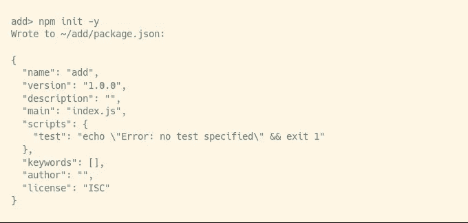

# 如何构建 CLI NPM 包

> 原文：<https://levelup.gitconnected.com/how-to-build-a-cli-npm-package-3ba98d6f9d4e>

Paul Esch-Laurent 在 [Unsplash](https://unsplash.com?utm_source=medium&utm_medium=referral) 上拍摄的照片

你安装的一些包是为了在你的代码中使用一个库，你安装的其他包是为了在终端中得到一些命令，比如`yarn`或者格式化你的代码，比如`prettier`。在本文中，我们将构建一个包命令行程序，它返回两个参数的和。

# 创建基本包

让我们从创建包开始

创建一个文件`index.js`,包含:

现在我们有了一个软件包，它有一个将两个数相加的功能，我们可以这样安装和使用它:

# 创建 CLI 脚本

我们需要用我们的命令代码创建一个新文件`cli.js`。将该文件命名为“cli”或放入一个名称中带有“cli”的文件夹是一种很好的做法。

我们剧本的第一行叫做“舍邦”。它是一种帮助基于 UNIX 的系统运行我们的脚本的机制。

在基于 UNIX 的系统中，shell 脚本不需要扩展名(扩展名是点号后面的内容，就像`index.js`中的`js`)。所以系统不能使用文件名来判断脚本是用什么语言写的。为了解决这个问题，我们使用惯例，用一个注释行开始脚本，注释行是能够运行我们脚本的程序的路径。在我们的例子中，Node 将运行我们的脚本。

UNIX 系统中大多数 shell 脚本语言使用`#`字符来表示行注释。JavaScript 实际上使用`*//*`作为行注释，但是 node 为了与 shebang 约定兼容，如果第一行以`#`开头，就会忽略它。

我们本来可以写下节点可执行文件的完整路径，但是我们提供了`env`程序的路径，并将`node`作为参数传递。这是常见的做法，因为在 UNIX 系统中，有时程序安装在不同的位置，但通常程序`env`在同一路径。您将一个程序名传递给`env`，它将返回该程序的正确路径。

接下来，我们导入 add 函数，并用来自终端的参数调用它。它们总是以字符串的形式出现，所以我们必须将它们转换成数字，前两个参数总是节点的路径和脚本的路径(在我们的例子中是`cli.js`)。

现在，在`package.json` *，*中，我们必须让 NPM 了解我们的 CLI 脚本。

我们也可以传递一个对象，而不是 CLI 脚本的路径。如果我们传递一个对象，这个对象的每个键都是一个新的命令，这个值应该是运行这个命令的脚本的路径。由于我们没有传递对象，所以我们的命令名就是我们的包名`add`。

# 尝试我们的新包装

我们的包基本做好了，我们来模拟一下有人安装我们的包，看看有没有效果。

在这里，我只是转到一个不同的文件夹，开始一个新项目，并将我们的添加包的路径传递给`npm install`。

这是一种在本地运行 CLI 脚本的简单方法，无需全局安装。我们还可以在`package.json`中访问我们的 CLI 脚本。

# 使用纱线提高可用性

现在我们的命令行界面非常粗糙。例如:

我们可以改进我们的命令行界面，使用包 [yargs](http://yargs.js.org/) 。

在我们的`cli.js`文件中我们可以做到:

函数`coarseNumber`将一个字符串转换成一个数字，但是如果这个字符串不是一个有效的数字，就会抛出一个错误。

`builder`函数描述了`yargs`的两个参数。我们有两个数字，你按顺序传递它们。使用我们之前的函数将它们转换成数字。

当所有参数都 ok 时，调用`handler`函数。

最后一行我们使用了一个默认命令来使用位置参数，如果没有它，我们就必须像传递标志(-x 1)一样传递参数。第二个参数是我们命令的描述(我们没有任何描述)，我们传递我们的构建器和处理函数，然后调用 parse 来解析命令行中的参数。

现在我们可以重新安装软件包并测试它。

我们得到了命令行脚本的详细描述和一些默认标志，如 version 和 help，更不用说用描述性错误消息对参数进行的非常有用的检查了。

# 结论

我希望你用这些文字来创造一些不错的 NPM 包，让我在评论中知道你创造了什么。

## 对所学知识的总结

1.  创建简单的包
2.  向包中添加 CLI 脚本
3.  事情
4.  测试包
5.  在本地运行软件包 CLI 脚本
6.  改进与 yargs 的接口

 [## 学习 Node.js -最佳 Node.js 教程(2019) | gitconnected

### 前 34 个 Node.js 教程-免费学习 Node.js。课程由开发人员提交和投票，使您能够…

gitconnected.com](https://gitconnected.com/learn/node-js)