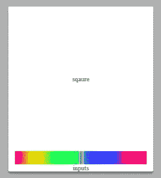
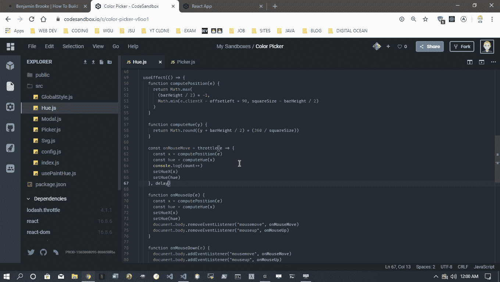
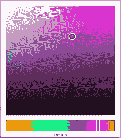

# 如何使用 React 构建颜色选择器

> 原文：<https://levelup.gitconnected.com/how-to-build-a-color-picker-5fbacc54f16c>

当我开始学习 JavaScript T4 时，制作一个颜色选择器是我尝试的第一个项目。如果我没记错的话，他们完全令人厌恶。最近，我的最新项目[调色板伙伴](https://benjaminadk.netlify.com/posts/how-to-build-a-color-picker/)需要一个简单的颜色选择器。本文将逐步介绍这一过程。

本文的目标读者可能有一些使用 *React* 的经验，但绝不需要专业能力。我将尽力保持一个缓慢的进度，并解释组件组合背后的思想以及各个部分是如何配合的。

如果您最终喜欢这篇文章，请查看续集[https://Benjamin Brooke . me/posts/using-local-storage-to-persist-data/](https://benjaminadk.netlify.com/posts/using-local-storage-to-persist-data/)，我们在其中添加了使用本地存储将颜色保存到调色板的功能。

# 入门指南

首先用 *React* 模板创建一个新的[代码沙箱](https://codesandbox.io/)。这是一个免费的服务，有一个现实的文件结构，能够以一种超级简单的方式添加依赖关系。本教程将使用[样式的组件](https://www.styled-components.com)，因此安装它并删除`.css`文件及其`import`语句。如果你不熟悉*风格的组件*不用害怕，90%都只是 *CSS* 。为了简单起见，所有文件都将放在`src`目录中。这里是一些基本的启动代码。

## 索引. js

```
import React from 'react'
import ReactDOM from 'react-dom'
import styled from 'styled-components'
import Picker from './Picker'
import { GlobalStyle } from './GlobalStyle'

const AppWrapper = styled.div`
  height: 100vh;
  display: grid;
  align-items: center;
  justify-items: center;
`

function App() {
  return (
    <>
      <GlobalStyle />
      <AppWrapper>
        <Picker />
      </AppWrapper>
    </>
  )
}

const rootElement = document.getElementById('root')
ReactDOM.render(<App />, rootElement)
```

## GlobalStyle.js

```
import React from 'react'
import { createGlobalStyle } from 'styled-components'

export const GlobalStyle = createGlobalStyle`
html {
  box-sizing: border-box;
  font-size: 10px;
}
body {
  font-family: monospace;
  font-weight: bold;
  margin: 0;
}
*, *:before, *:after {
  box-sizing: inherit;
}
`
```

## Picker.js

```
import React, { useState, useRef, useEffect } from 'react'
import styled from 'styled-components'

export const PickerWrapper = styled.div`
  .swatch {
    width: 100px;
    height: 50px;
    background: ${p => p.color};
  }
`

const Picker = () => {
  const [color, setColor] = useState('#000000')

  return (
    <>
      <PickerWrapper color={color}>
        <div className='swatch' />
      </PickerWrapper>
    </>
  )
}

export default Picker
```

这个样板文件应该会在屏幕中间产生一个黑色的矩形。目标是让颜色选择器在这个矩形被点击时出现，并根据用户输入动态设置它的背景颜色。首先需要的是某种容器来容纳颜色选择器，它的行为就像一个*模态*，当矩形被点击时打开，并且能够通过按钮或点击*选择器*外的屏幕来关闭。

# 情态的

## Modal.js

```
import React from 'react'
import styled, { keyframes } from 'styled-components'

const zoom = keyframes`
  from {
    transform: scale(0) translate(-50%, -50%);
  }
  to {
    transform: scale(1) translate(-50%, -50%);
  }
`

export const Backdrop = styled.div`
  position: fixed;
  z-index: 1;
  top: 0;
  bottom: 0;
  left: 0;
  right: 0;
  display: ${p => (p.show ? 'block' : 'none')};
  background: rgba(0, 0, 0, 0.3);
`

export const ModalWrapper = styled.div`
  position: fixed;
  top: 50%;
  left: 50%;
  z-index: 2;
  transform: translate(-50%, -50%);
  transform-origin: left top;
  max-width: 100%;
  height: auto;
  display: ${p => (p.show ? 'block' : 'none')};
  animation: ${zoom} 0.2s;
`
const Modal = ({ modal, show, onClose, children }) => {
  return (
    <>
      <Backdrop show={show} onClick={onClose} />
      <ModalWrapper ref={modal} show={show}>
        {children}
      </ModalWrapper>
    </>
  )
}

export default Modal
```

模态组件通过将背景和内部容器分层来工作。使用`z-index`属性将背景固定在模态的后面。这允许背景监听点击并关闭整个组件，而前景可以被点击而不触发关闭。看起来滑稽的括号`<></>`是*反应的简写。片段化*并允许组件返回兄弟元素。`show`道具是由*拾取器*传下来的`Boolean`来控制`display`风格。当`show`为`false`时，风格设置为`display: none`。*样式组件*还带有一个`keyframes`辅助函数，当*拾取器*出现时，该函数与`transform: scale()`一起使用以给出缩放效果。`children` prop 在 *React* 中的所有组件上都可用，并允许*模态*成为可重用的包装器组件。最后，`modal`支柱是一个`ref`,稍后将在定位计算中使用。

顺便提一下，这个基本的*模式*可以用于任何东西——注册、表单、图像、视频等等。诀窍是 50%的定位和转换，自动将内容居中。调整动画风格，变换原点和宽度以适应特定的使用情况。此外，将`show`的值设置为 true 以加快开发速度。这将消除每次更新时点击样本的烦人步骤。

## Picker.js

```
const Picker = () => {
  const [show, setShow] = useState(false)
  const [color, setColor] = useState("#000000")

  const modal = useRef(null)

  return (
    <>
      <PickerWrapper color={color}>
        <div className="swatch" onClick={() => setShow(true)} />
        <Modal modal={modal} show={show} onClose={() => setShow(false)}>
          <div>😎</div>
        </Modal>
      </PickerWrapper>
    </>
  )
}
```

确保`import`模态组件进入拾取器。用`useState`创建`show`和`setShow`，用`useRef`创建`modal`。现在单击矩形将打开模式和😎应该会出现。`<div>😎</div>`成为上一步引用的`children`道具。

# 配置

在继续之前，创建一个`config.js`文件来保存一些常量。

## 配置文件

```
export default {
  squareSize: 200,
  barSize: 20,
  crossSize: 15,
  inputSize: 40,
  delay: 150
}
```

`squareSize`将是*饱和度* / *亮度*正方形的宽度和高度。`barSize`是*色相*组件的高度，也是*手柄*的宽度和高度(用户拖动此项设置色相)。`crossSize`是将用在*方块*上的可拖动图标的宽度和高度。`inputSize`是一行输入的高度。`delay`值将与`lodash.throttle`一起使用，后者应作为依赖项添加。该组件将实现各种可以不断触发的鼠标事件监听器，这可能会降低应用程序的速度。回调函数将被节流，因此它们只能每`delay`秒执行一次。现在理解一切并不重要，因为随着本文的进行，这些碎片将会组合在一起。

# 顺化(越南城市)

这种颜色选择器可以整合各种颜色格式，但目前 [HSL](https://en.wikipedia.org/wiki/HSL_and_HSV) 或*色调、饱和度、亮度*最适合用户输入。*色调*组件是一个矩形条，显示从 0 到 360 度的全部色调。



*色调*栏本身实际上是一个 *HTML 画布*元素。当*拾取器*加载时，自定义*反应*钩用于绘制 360 度颜色。一个到底层 *DOM* 节点的`ref`被传递给钩子，这样就可以调用`Canvas.getContext()`。钩子使用`ctx.createLinearGradient()`和`for`循环为渐变添加必要的颜色停止。使用 *HSL* 颜色格式使这个过程变得容易。自定义挂钩不是必需的，但它确实可以分离关注点。

## usePaintHue.js

```
import React, { useEffect } from 'react'
import config from './config'

const { squareSize, barSize } = config

const usePaintHue = canvas => {
  useEffect(() => {
    const ctx = canvas.current.getContext('2d')
    ctx.rect(0, 0, squareSize, barSize)

    const gradient = ctx.createLinearGradient(0, 0, squareSize, 0)
    for (let i = 0; i <= 360; i += 30) {
      gradient.addColorStop(i / 360, `hsl(${i}, 100%, 50%)`)
    }
    ctx.fillStyle = gradient
    ctx.fill()
  }, [canvas])
}

export default usePaintHue
```

*拾取器*将记录更多受*色调*影响的状态。`hue`值将是 0 到 360 之间的一个数字，`hueX`是手柄的位置，`offsetLeft/offsetTop`将来自`modal` ref 并帮助计算。注意当*模态*打开时`useEffect`吊钩正在计算偏移量。它还为`resize`事件附加了一个事件监听器。这些偏移量是*模态*和它最近的父体之间的距离，所以当窗口尺寸改变时，这些值也会改变。这种变化会渗透到头寸计算中，因此需要加以考虑。最后，添加另一个钩子来观察`hue`值的变化。当`hue`改变时，可以使用模板字符串更新`color`状态。

## Picker.js

```
import React, { useState, useRef, useEffect } from 'react'
import styled from 'styled-components'
import Modal from './Modal'
import Hue from './Hue'
import config from './config'

const { squareSize, barSize } = config

export const PickerWrapper = styled.div`
  user-select: none;
  .swatch {
    width: 100px;
    height: 50px;
    background: ${p => p.color};
  }
`

export const PickerOuter = styled.div`
  width: ${squareSize + 20}px;
  display: grid;
  border-radius: 2px;
  background: #ffffff;
  box-shadow: 0 3px 3px rgba(0, 0, 0, 0.3);
`

export const PickerInner = styled.div`
  display: grid;
  grid-template-rows: ${squareSize + 20}px 20px 1fr;
  align-items: center;
  justify-items: center;
`

const Picker = () => {
  const [show, setShow] = useState(true)
  const [hue, setHue] = useState(180)
  const [hueX, setHueX] = useState(() => squareSize / 2 - barSize / 2)
  const [offsetTop, setOffsetTop] = useState(0)
  const [offsetLeft, setOffsetLeft] = useState(0)
  const [color, setColor] = useState(`hsla(180, 100%, 50%, 1)`)

  const modal = useRef(null)

  useEffect(() => {
    function setOffsets() {
      setOffsetTop(modal.current.offsetTop)
      setOffsetLeft(modal.current.offsetLeft)
    }
    if (show) {
      setOffsets()
      window.addEventListener('resize', setOffsets)
    } else {
      window.removeEventListener('resize', setOffsets)
    }

    return () => {
      window.removeEventListener('resize', setOffsets)
    }
  }, [show])

  useEffect(() => {
    setColor(`hsla(${hue}, 100%, 50%, 1)`)
  }, [hue])

  return (
    <>
      <PickerWrapper color={color}>
        <div className='swatch' onClick={() => setShow(true)} />
        <Modal modal={modal} show={show} onClose={() => setShow(false)}>
          <PickerOuter>
            <PickerInner>
              <div>sqaure</div>
              <Hue hueX={hueX} offsetLeft={offsetLeft} setHueX={setHueX} setHue={setHue} />
              <div>inputs</div>
            </PickerInner>
          </PickerOuter>
        </Modal>
      </PickerWrapper>
    </>
  )
}

export default Picker
```

在色调部分有相当多的东西在进行。有一个包装器容纳*画布*和*手柄*组件。ref 用于用 *usePaintHue* 挂钩给*画布*上色。*句柄*使用绝对定位，特别是`left`属性来确定其位置。该组件应用事件侦听器循环。一切都是由`mousedown`事件引发的。这触发了另外两个事件监听器的分配，一个用于`mouseup`，另一个用于`mousemove`。这个想法是只在适当的时候监听需要的事件。换句话说，当鼠标被按下并移动时，用户正在移动*手柄*。

`mousemove`事件监听器连接到`document.body`元素，因为当拖动这样的句柄时，用户不太可能停留在*选择器*的范围内。事件处理器通过`lodash.throttle`节流，所以它只能每`delay`秒触发一次。尝试改变`delay`和记录`x`(`computePosition`功能的结果)。正如您将看到的，节流会产生很大的不同。当*方形*组件被构建时，由于画布重画增加了处理器负载，这将变得更加重要。



如果有些计算看起来令人困惑，那是因为它们确实如此。使用`barSize`是因为它也是与*手柄*的宽度和高度相同的值。在这种情况下，*手柄*的宽度是计算`left`位置的一部分。让我们浏览一下触发`mousemove`事件处理程序时发生的步骤。

1.  事件对象被传递给`computePosition`
2.  `Math.max`用于确保返回的最小值是*手柄*或`(barSize / -2)`宽度的负一半。这是当`hue`为 0 时的`left`值。为了使 UI 在`hue`为 0 时看起来合适，半个*手柄*应该悬挂在*外壳*的左侧。这是必需的，因为该函数使用的是页面上的 x 光标位置`e.clientX`。还有其他选择——比如将`mousemove`监听器应用到其他元素，但是我发现这种设置提供了最好的用户体验。
3.  从`Math.min`产生的值确保返回的值不会大于*手柄*悬挂在*套筒*右端的一半。`squareSize - barSize / 2`的值代表这个最大值。
4.  当*手柄*位于*套筒*两端之间的任何位置时，表达式`e.clientX - offsetLeft + squareSize / 2 - barSize / 2`用于计算`left`。
5.  `hueX`值用于插补`hue`。表达式`x + barSize / 2`获取*手柄*的中心值。记住`x`是基于*手柄*左边缘的`left`位置。360°与*套筒*宽度的简单比值乘以`x`计算出`hue`。

## 色相. js

```
import React, { useRef, useEffect } from 'react'
import styled from 'styled-components'
import throttle from 'lodash.throttle'
import Svg from './Svg'
import usePaintHue from './usePaintHue'
import config from './config'

const { squareSize, barSize, delay } = config

export const HueWrapper = styled.div`
  position: relative;
  width: ${squareSize + 'px'};
  height: ${barSize + 'px'};
  cursor: ew-resize;
`

export const Canvas = styled.canvas.attrs(p => ({
  width: squareSize,
  height: barSize
}))``

export const Handle = styled.div.attrs(p => ({
  style: {
    left: p.left + 'px',
    transition: p.animate ? 'top .75s ease-out' : '0s'
  }
}))`
  position: absolute;
  top: 0px;
  display: flex;
  align-items: center;
  justify-content: space-between;
  width: ${barSize}px;
  height: ${barSize}px;
  pointer-events: none;
  svg {
    width: 100%;
    height: 100%;
  }
`

const Hue = ({ hueX, offsetLeft, setHueX, setHue }) => {
  const bar = useRef(null)
  const canvas = useRef(null)

  usePaintHue(canvas)

  useEffect(() => {
    function computePosition(e) {
      return Math.max(
        barSize / -2,
        Math.min(e.clientX - offsetLeft + squareSize / 2 - barSize / 2, squareSize - barSize / 2)
      )
    }

    function computeHue(x) {
      return Math.round((x + barSize / 2) * (360 / squareSize))
    }

    const onMouseMove = throttle(e => {
      const x = computePosition(e)
      const hue = computeHue(x)

      setHueX(x)
      setHue(hue)
    }, delay)

    function onMouseUp(e) {
      const x = computePosition(e)
      const hue = computeHue(x)
      setHueX(x)
      setHue(hue)
      document.body.removeEventListener('mousemove', onMouseMove)
      document.body.removeEventListener('mouseup', onMouseUp)
    }

    function onMouseDown(e) {
      document.body.addEventListener('mousemove', onMouseMove)
      document.body.addEventListener('mouseup', onMouseUp)
    }

    const barRef = bar.current
    barRef.addEventListener('mousedown', onMouseDown)

    return () => {
      barRef.removeEventListener('mousedown', onMouseDown)
      document.body.removeEventListener('mousemove', onMouseMove)
      document.body.removeEventListener('mouseup', onMouseUp)
    }
  }, [offsetLeft, setHue, setHueX])

  return (
    <HueWrapper ref={bar}>
      <Handle left={hueX}>
        <Svg name='handle' />
      </Handle>
      <Canvas ref={canvas} />
    </HueWrapper>
  )
}

export default Hue
```

# 挽救（saving 的简写）

*色调*组件有一个手柄，它实际上是我用[方形 Svg](https://boxy-svg.com/) 制作的 *Svg* 。关于我的 *Svg* 工作流程的更多信息，请查看[没有艺术能力的 Svg 图标](http://benjaminadk.netlify.com/posts/svg-icons-with-no-artistic-ability/)。目前这个项目只需要几个 Svg 图标。只需导入 *Svg* 组件，并传递一个与`switch`语句中的字符串匹配的`name`属性。

## SVG . j

```
import React from 'react'

const Svg = ({ name, ...rest }) => {
  const getPath = p => {
    switch (p) {
      case 'check':
        return (
          <>
            <path d='M2.2326 30.1008l3.7139-5.9333L23.072 34.8882l19.2522-30.41 5.914 3.744-23.001 36.3315-5.914-3.744.0037-.0067z' />
          </>
        )
      case 'cross':
        return (
          <>
            <path
              d='M34.3656 3.0593000000000004A24.084 24.084 0 1 0 15.166 47.2354 24.084 24.084 0 1 0 34.3656 3.0593zM32.0123 8.474a18.18 18.18 0 0 1-14.493 33.3467A18.18 18.18 0 0 1 32.0123 8.474z'
              fill='#dfdfdf'
            />
            <path
              d='M36.7852 11.4797A18.168 18.168 0 1 0 12.8026 38.777a18.168 18.168 0 1 0 23.9826-27.2973zM33.6263 15.0752a13.382 13.382 0 0 1-17.6649 20.1063 13.382 13.382 0 0 1 17.6649-20.1063z'
              fill='#363636'
            />
          </>
        )
      case 'handle':
        return (
          <>
            <path d='M34.736998 0v49.921h-5.578V0zm-16.737 49.921V0h5.578v49.921z' fill='#dfdfdf' />
            <path fill='#363636' d='M31.371873.078V50h-2.316V.078zM23.470873 0v49.922h-2.316V0z' />
          </>
        )

      default:
        throw new Error('must provide a name prop to Svg')
    }
  }

  return (
    <svg viewBox='0 0 50 50' xmlns='http://www.w3.org/2000/svg' {...rest}>
      {getPath(name)}
    </svg>
  )
}

export default Svg
```

# 平方

如果说*的色调*令人困惑，那么*的方形*会更糟糕！*方块*用于找到颜色的*饱和度*和*亮度*。*正方形*存在于二维空间中，而不是在一维空间中工作。*方块*会根据当前的`hue`改变颜色，用户可以拖动十字准线来选择他们想要的颜色。



再次使用一个定制的钩子来填充*正方形*。不像*色调*绘画挂钩那样只在页面加载时触发，这个挂钩会在每次`hue`改变时触发。这就是为什么节流很重要。每秒重新绘制*方块* 100 次是不必要的，而且会降低应用程序的速度。

绘画过程从简单地用当前的`hue`填充画布开始。下一步是从左到右添加白色到透明的线性渐变。最后一步从上到下添加一个透明到黑色的线性渐变。光标下方的颜色最终是所选的颜色。

## usePaintSquare.js

```
import React, { useEffect } from 'react'
import config from './config'

const { squareSize } = config

const usePaintSquare = (canvas, hue) => {
  useEffect(() => {
    const ctx = canvas.current.getContext('2d')
    ctx.fillStyle = `hsl(${hue}, 100%, 50%)`
    ctx.fillRect(0, 0, squareSize, squareSize)
    const gradientWhite = ctx.createLinearGradient(0, 0, squareSize, 0)
    gradientWhite.addColorStop(0, `rgba(255, 255, 255, 1)`)
    gradientWhite.addColorStop(1, `rgba(255, 255, 255, 0)`)
    ctx.fillStyle = gradientWhite
    ctx.fillRect(0, 0, squareSize, squareSize)
    const gradientBlack = ctx.createLinearGradient(0, 0, 0, squareSize)
    gradientBlack.addColorStop(0, `rgba(0, 0, 0, 0)`)
    gradientBlack.addColorStop(1, `rgba(0, 0, 0, 1)`)
    ctx.fillStyle = gradientBlack
    ctx.fillRect(0, 0, squareSize, squareSize)
  }, [canvas, hue])
}

export default usePaintSquare
```

现在我们需要一种方法将光标在*正方形*中的位置转换为*饱和度*和*亮度*值。关于*画布*的酷的部分是我们可以使用`imageData`来获得任何像素的颜色。不那么酷的部分是，这个数据是在 *RGB* 格式，我们正在使用 *HSL* 。这意味着在我们继续之前，我们需要一个转换函数。理解这个函数并不重要，但知道它的签名才重要。`convertRGBtoHSL`函数接受一个表示颜色的红、绿、蓝值的整数数组，并将返回一个表示颜色的色调、饱和度和亮度的整数数组。简单的🤓！

## 实用工具

```
export const convertRGBtoHSL = rgb => {
  const r = rgb[0] / 255
  const g = rgb[1] / 255
  const b = rgb[2] / 255
  const min = Math.min(r, g, b)
  const max = Math.max(r, g, b)
  const delta = max - min
  let h
  let s

  if (max === min) {
    h = 0
  } else if (r === max) {
    h = (g - b) / delta
  } else if (g === max) {
    h = 2 + (b - r) / delta
  } else if (b === max) {
    h = 4 + (r - g) / delta
  }

  h = Math.min(h * 60, 360)

  if (h < 0) {
    h += 360
  }

  const l = (min + max) / 2

  if (max === min) {
    s = 0
  } else if (l <= 0.5) {
    s = delta / (max + min)
  } else {
    s = delta / (2 - max - min)
  }

  return [Math.round(h), Math.round(s * 100), Math.round(l * 100)]
}
```

有了基础，就可以实现*方形*组件。 *Square* 的工作方式与 *Hue* 类似，但是计算其句柄的`left`和`top`值的位置，在这种情况下称为 *Cross* 只是为了减少命名约定的混乱。额外的步骤发生在计算位置之后。`x`和`y`值是*十字*的位置，作为`[x, y]`存储在`sqaureXY`状态变量中。`x1`和`y1`是位于*十字*中心的像素坐标，与`ctx.getImageData`一起使用，以获得该像素的 *RGB* 值。通过转换函数输入 *RGB* 值，并返回 *HSL* 值。色调已知，`s`和`l`组合成`square`状态，称为`[s, l]`。

## 广场. js

```
import React, { useRef, useEffect } from 'react'
import styled from 'styled-components'
import throttle from 'lodash.throttle'
import { convertRGBtoHSL } from './utils'
import Svg from './Svg'
import usePaintSquare from './usePaintSquare'
import config from './config'

const { squareSize, crossSize, delay } = config

export const SquareWrapper = styled.div`
  position: relative;
  width: ${squareSize + 'px'};
  height: ${squareSize + 'px'};
  cursor: crosshair;
  box-shadow: 0 1px 2px rgba(0, 0, 0, 0.3);
`

export const Canvas = styled.canvas.attrs(p => ({
  width: squareSize,
  height: squareSize
}))``

export const Cross = styled.div.attrs(p => ({
  style: {
    top: p.top + 'px',
    left: p.left + 'px',
    width: crossSize + 'px',
    height: crossSize + 'px',
    transition: p.animate ? 'top .25s ease-out, left .25s ease-out' : '0s'
  }
}))`
  position: absolute;
  display: grid;
  justify-items: center;
  align-items: center;
  svg {
    width: 100%;
    height: 100%;
  }
`

const Square = ({ hue, squareXY, setSquare, offsetTop, offsetLeft, setSquareXY }) => {
  const square = useRef(null)
  const canvas = useRef(null)

  usePaintSquare(canvas, hue)

  useEffect(() => {
    const canvasRef = canvas.current
    const ctx = canvasRef.getContext('2d')

    function computePosition(e) {
      const x = Math.max(
        crossSize / -2,
        Math.min(
          e.clientX - offsetLeft + squareSize / 2 - crossSize / 2,
          squareSize - crossSize / 2
        )
      )
      const y = Math.max(
        crossSize / -2,
        Math.min(e.clientY - offsetTop + squareSize / 2 + crossSize / 2, squareSize - crossSize / 2)
      )

      return [x, y]
    }

    function changeColor(e) {
      const [x, y] = computePosition(e)
      const x1 = Math.min(x + crossSize / 2, squareSize - 1)
      const y1 = Math.min(y + crossSize / 2, squareSize - 1)
      const [r, g, b] = ctx.getImageData(x1, y1, 1, 1).data
      const [h, s, l] = convertRGBtoHSL([r, g, b])
      setSquare([s, l])
      setSquareXY([x, y])
    }

    const onMouseMove = throttle(e => {
      changeColor(e)
    }, delay)

    function onMouseUp(e) {
      changeColor(e)
      document.body.removeEventListener('mousemove', onMouseMove)
      document.body.removeEventListener('mouseup', onMouseUp)
    }

    function onMouseDown(e) {
      document.body.addEventListener('mousemove', onMouseMove)
      document.body.addEventListener('mouseup', onMouseUp)
    }

    canvasRef.addEventListener('mousedown', onMouseDown)

    return () => {
      canvasRef.removeEventListener('mousedown', onMouseDown)
    }
  }, [offsetTop, offsetLeft, setSquare, setSquareXY])

  return (
    <SquareWrapper ref={square}>
      <Cross top={squareXY[1]} left={squareXY[0]}>
        <Svg name='cross' />
      </Cross>
      <Canvas ref={canvas} />
    </SquareWrapper>
  )
}

export default Square
```

有了来自*方块*的数值在手，*拾取器*组件可以输出一个完整的 *HSL* 颜色。我调整了一些到初始状态，这样*拾取器*从`hsla(180, 100%, 50%, 1)`开始。更新`color`的`useEffect`钩子现在监听`square`值的变化。

## Picker.js

```
import React, { useState, useRef, useEffect } from 'react'
import styled from 'styled-components'
import Modal from './Modal'
import Hue from './Hue'
import Square from './Square'
import config from './config'

const { squareSize, barSize, crossSize } = config

export const PickerWrapper = styled.div`
  user-select: none;
  .swatch {
    width: 100px;
    height: 50px;
    background: ${p => p.color};
  }
`

export const PickerOuter = styled.div`
  width: ${squareSize + 20}px;
  display: grid;
  border-radius: 2px;
  background: #ffffff;
`

export const PickerInner = styled.div`
  display: grid;
  grid-template-rows: ${squareSize + 20}px 20px 1fr;
  align-items: center;
  justify-items: center;
`

const Picker = () => {
  const [show, setShow] = useState(true)
  const [hue, setHue] = useState(180)
  const [hueX, setHueX] = useState(() => squareSize / 2 - barSize / 2)
  const [square, setSquare] = useState([100, 50])
  const [squareXY, setSquareXY] = useState(() => [squareSize - crossSize / 2, crossSize / -2])
  const [offsetTop, setOffsetTop] = useState(0)
  const [offsetLeft, setOffsetLeft] = useState(0)
  const [color, setColor] = useState(`hsla(180, 100%, 50%, 1)`)

  const modal = useRef(null)

  useEffect(() => {
    function setOffsets() {
      setOffsetTop(modal.current.offsetTop)
      setOffsetLeft(modal.current.offsetLeft)
    }
    if (show) {
      setOffsets()
      window.addEventListener('resize', setOffsets)
    } else {
      window.removeEventListener('resize', setOffsets)
    }

    return () => {
      window.removeEventListener('resize', setOffsets)
    }
  }, [show])

  useEffect(() => {
    setColor(`hsla(${hue}, ${square[0]}%, ${square[1]}%, 1)`)
  }, [hue, square])

  return (
    <>
      <PickerWrapper color={color}>
        <div className='swatch' onClick={() => setShow(true)} />
        <Modal modal={modal} show={show} onClose={() => setShow(false)}>
          <PickerOuter>
            <PickerInner>
              <Square
                hue={hue}
                squareXY={squareXY}
                offsetTop={offsetTop}
                offsetLeft={offsetLeft}
                setSquare={setSquare}
                setSquareXY={setSquareXY}
              />
              <Hue hueX={hueX} offsetLeft={offsetLeft} setHueX={setHueX} setHue={setHue} />
              <div>inputs</div>
            </PickerInner>
          </PickerOuter>
        </Modal>
      </PickerWrapper>
    </>
  )
}

export default Picker
```

# 投入

各种各样的输入可以添加到这个颜色选择器中，以接收用户数据。对于这种实现，我们将为*色调*、*饱和度*和*亮度*提供单个输入。即使输入类型是*数字*，我们也将使用文本输入。我不喜欢默认的箭头。*输入*组件接收一个`value`以及`min`、`max`和`defaultValue`。当用户输入进来时，它被检查以确保它是一个数字。如果数值超出了`min` / `max`界限，则自动返回到`defaultValue`。如果输入为空，一个`onBlur`事件处理程序起到类似的作用。

## 输入. js

```
import React, { useRef } from 'react'
import styled from 'styled-components'

export const InputWrapper = styled.div`
  display: flex;
  align-items: center;
  user-select: none;
  label {
    font-size: 11px;
    margin-right: 5px;
  }
  input {
    width: 40px;
    text-align: center;
    border: 1px solid #ddd;
    outline: 0;
    font-family: monospace;
    font-size: 10px;
    padding: 4px 4px;
    user-select: none;
    &:focus {
      background: #fafafa;
    }
    &::selection {
      background: #ddd;
    }
  }
`

const Input = ({ label, value, max, min, defaultValue, setValue }) => {
  const input = useRef(null)

  function onBlur(e) {
    if (e.target.value === '') {
      setValue(defaultValue)
    } else if (e.target.value < min) {
      setValue(min)
    }
  }

  function onChange(e) {
    const isDigit = /^\d\*\$/
    var newValue
    if (isDigit.test(e.target.value)) {
      if (Number(e.target.value) > max) {
        newValue = max
      } else {
        newValue = Number(e.target.value)
      }
    } else {
      newValue = defaultValue
    }
    setValue(newValue)
  }

  return (
    <InputWrapper>
      <label>{label}</label>
      <input ref={input} value={value} onChange={onChange} onBlur={onBlur} autoFocus={false} />
    </InputWrapper>
  )
}

export default Input
```

需要新的功能来设置*手柄*和*十字*的位置。您可能已经注意到一些组件中基于`animate`道具的一些样式逻辑。本质上，当使用*输入*时，*手柄*和*十字*将动画显示到它们的新位置。当用户拖动时`animate`将为假。`animate`道具和`setAnimate`必须传给*色相*和*方*。只需将`setAnimate(false)`添加到`mousedown`事件处理程序中。在*输入*周围还需要一个包装器。

感谢阅读！这篇文章比我最初打算的要长得多，而且只涉及了基础知识。如果你能走到这一步，恭喜你自己。我希望这足以让你走上正轨。仍然有许多额外的功能可以添加，以增强这个颜色选择器。以下是一些想法:

*   添加一个调色板，让用户保存颜色— `localStorage`也许
*   添加色板以在拾色器中显示选定的颜色
*   添加确认按钮
*   以 *HSL* 、 *RGB* 、 *HEX* 或其他格式添加颜色字符串的显示
*   为其他颜色格式添加输入
*   添加一个可以接受 3 或 6 位十六进制代码的解析器
*   添加 alpha 条来设定颜色的不透明度

查看本文续集[https://Benjamin Brooke . me/posts/using-local-storage-to-persist-data/](https://benjaminadk.netlify.com/posts/using-local-storage-to-persist-data/)

*原载于 2019 年 8 月 13 日*[*https://benjaminadk.netlify.com*](https://benjaminadk.netlify.com/posts/how-to-build-a-color-picker/)*。*

[](https://gitconnected.com/learn/react) [## 学习 React -最佳 React 教程(2019) | gitconnected

### React 是一个现代 JavaScript 库，前端 web 开发人员使用它来构建用户界面(UI)。它用于…

gitconnected.com](https://gitconnected.com/learn/react)