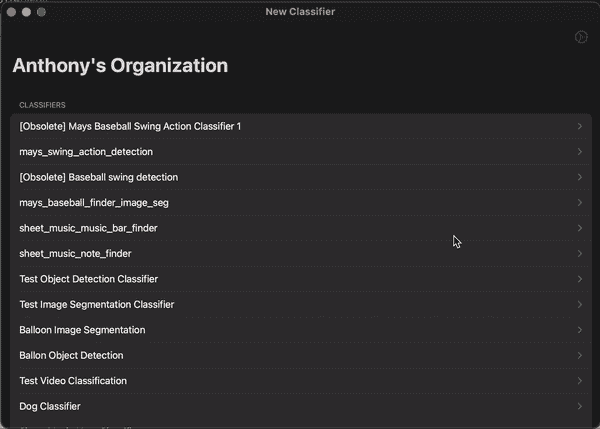

# 如何建立 CreateML 图像分类模型

> 原文：<https://levelup.gitconnected.com/how-to-build-a-createml-image-classification-model-f7aac478174b>

最近，我开发的越来越多的应用程序包含了某种机器学习元素。在这篇文章中，我将探索如何管理 CreateML 图像分类的数据，标记数据，然后执行训练。

# 技术背景

如果你不知道的话，我将快速浏览一下我将在本指南中使用的技术！

*   Create ML:苹果用于构建与 MLKit 兼容的机器学习模型的工具。你需要做的就是安装 XCode，然后在旁边打开 Create ML。
*   ML Annotator:我做的一个免费工具，允许你管理机器学习数据并输出多种格式。可以在[https://apps.apple.com/us/app/ml-annotator/id1594943438](https://apps.apple.com/us/app/ml-annotator/id1594943438)下载。

# 步骤 1:配置您的分类器

在 ML 注释器中，第一步是创建您的分类器。这将是一个“图像分类”分类器。重要的是选择你想要处理的所有不同类型的标签。对于完全不符合你的模式的事情，保留一个“负面”或者“其他”的标签是很重要的。

# 第二步:获取数据

任何机器学习项目的第一步都是收集你可以用来创建的输入数据。找到一些图像文件，然后将它们上传到 ML 注释器，如下所示:

> ML Annotator 还有一个有用的特性，您可以创建一个对象检测或图像分割分类器，然后将找到的项目框导出到图像分类分类器。这样，您可以从不同类型的分类器中选择“子”项目进行分类。

# 步骤 3:下载格式化的数据集

现在，我们需要下载格式化的数据。同样，我们使用 ML 注释器来完成这项工作。您应该以 Create ML 格式创建数据集。

# **步骤 4:使用 Create ML 进行训练**

> 注意:ML 注释器也有使用 Create ML 内置的指令。转到“下载模型生成器脚本”项，您可以为您的分类器下载自定义指令。

这里的最后一步是实际训练你的模型。你需要做的第一件事是从 XCode 开发者工具菜单打开 Create ML。

从那里，按下，选择`Image Classification`。从你下载的数据的`training`文件夹中选择你的`Training Data`。`Validation Data`应该会自动从`Training Data`中分离出来。最后，设置您的`Testing Data`并点击播放按钮进行训练。

等待一段时间，你应该得到一个模型，可以区分你的图像类别。

# 摘要

感谢您的阅读！如果你对这篇文章或 ML 注释者有任何反馈，请联系我们。