# 如何使用 AWS intensive 构建自定义文本分类模型

> 原文：<https://levelup.gitconnected.com/how-to-build-a-custom-text-classification-model-with-aws-comprehend-576b077a3a87>

## 关于如何使用 AWS intensive 构建和部署定制分类模型的演练教程


帕特里克·托马索在 [Unsplash](https://unsplash.com?utm_source=medium&utm_medium=referral) 上的照片

[](https://jorgepit-14189.medium.com/membership) [## 用我的推荐链接加入媒体-乔治皮皮斯

### 阅读乔治·皮皮斯(以及媒体上成千上万的其他作家)的每一个故事。您的会员费直接支持…

jorgepit-14189.medium.com](https://jorgepit-14189.medium.com/membership) 

在本教程中，我们将向您展示如何使用 AWS intensive 构建自定义文本分类模型。对于这个项目，我们将使用由 **UCI 机器学习库**获得的[垃圾短信收集数据集](https://archive.ics.uci.edu/ml/machine-learning-databases/00228/smsspamcollection.zip)。请注意，我们已经用 0 替换了 HAM 类，用 0 替换了 SPAM 类，但这不是必需的。

# 训练模型

为了使用 intensive 训练自定义分类模型，您需要登录 AWS 控制台，然后转到 intensive 服务，最后选择“自定义分类”。

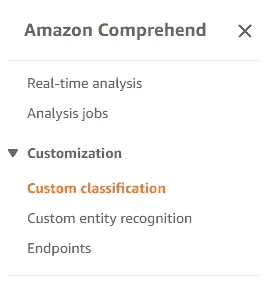

然后你点击“**创建新模型**”，你定义你的模型的名称。

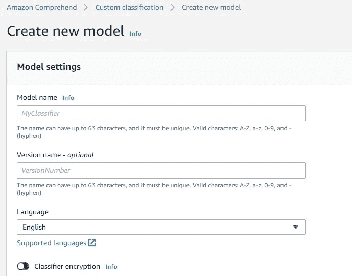

对于“数据规范”，我们选择“分类器模式”和“CSV 文件”格式。**请注意，您的数据不应包含标题**。最后，我们添加数据的 S3 存储桶位置，对于测试数据集，我们选择“Autosplit”。

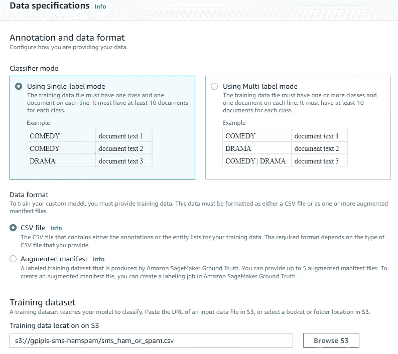

对于输出数据，我们通过向 bucket 添加一个文件夹来选择一个新位置。

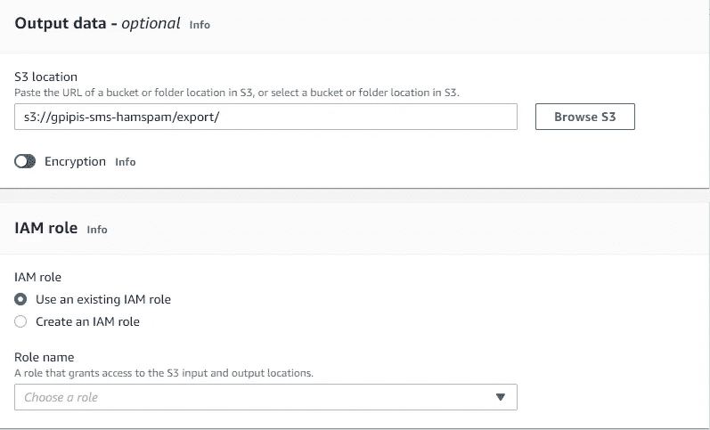

然后，选择 IAM 角色，并单击右下角的“创建”按钮。

# 受过训练的模型

该模型需要大约 40 分钟来训练，当然，这也取决于你的数据量。一旦模型被训练，我们可以在“分类器模型”下找到它。

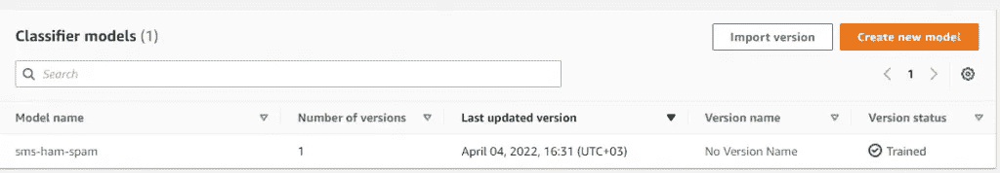

当我们点击“**垃圾短信**时，我们可以找到一些统计数据。

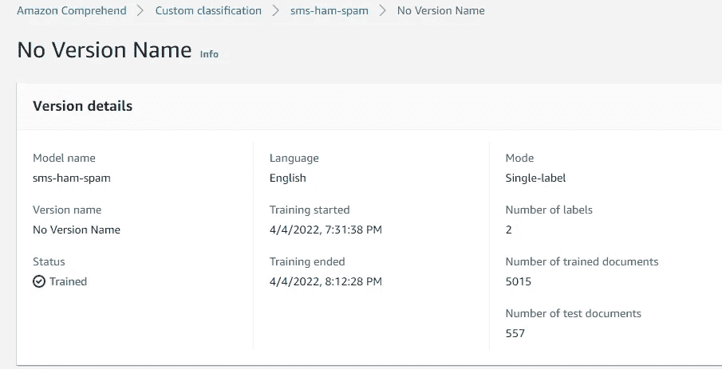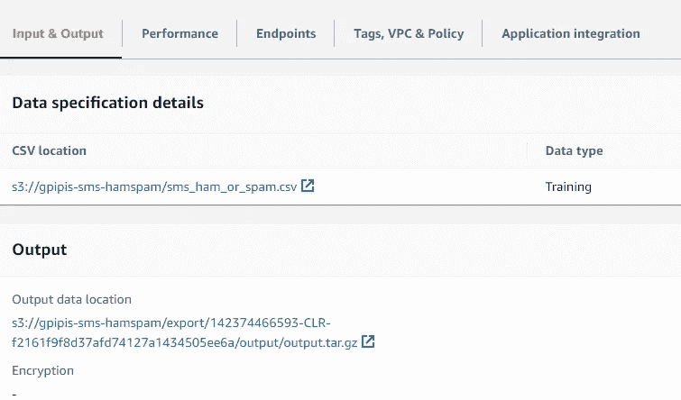

正如我们所看到的，该模型做得非常好(高准确度、精确度、召回率、F1 分数)

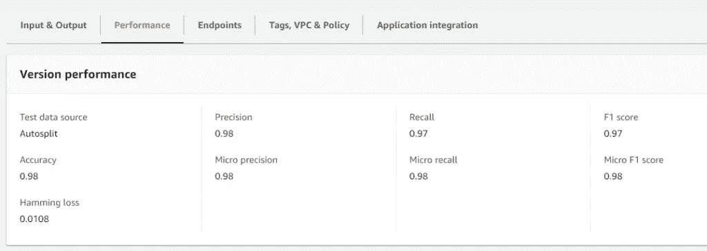

最后，在我们设置的获取模型输出的 S3 桶下，我们可以在测试数据集上找到模型的“混淆矩阵”。

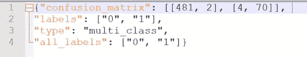

# 实时分析

对于“实时分析”,我们需要创建一个端点。因此，我们转到“**端点**”选项卡，并选择“**创建端点**

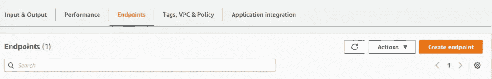

然后，我们定义“端点名称”,对于 IU 的数量，我们选择 1。一旦您遵循这些步骤，端点将被创建，并且可以在“端点”处找到。

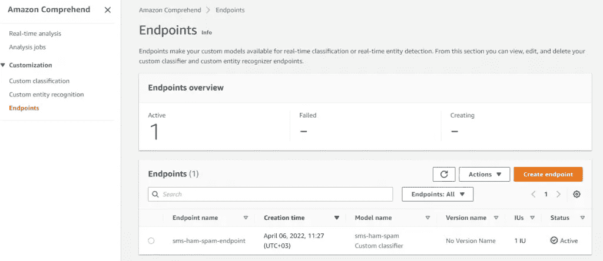

现在我们已经为“实时分析”做好了准备。转到“Real Analysis”部分，选择“Custom”并输入端点的名称。最后，在输入文本中输入您想要获得预测的文本。

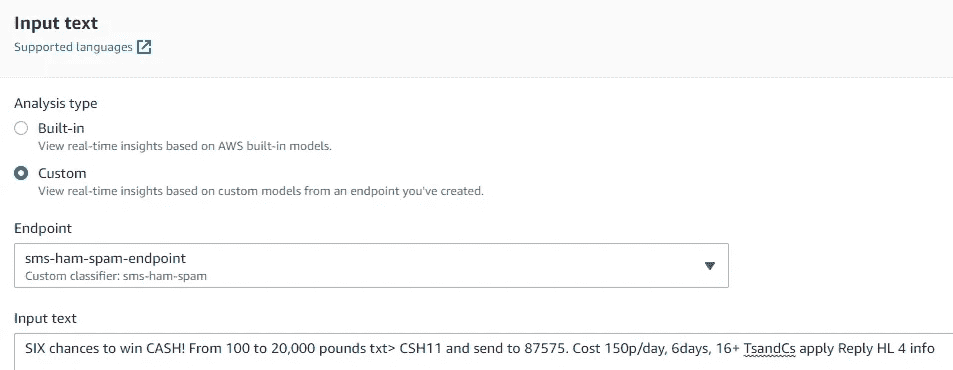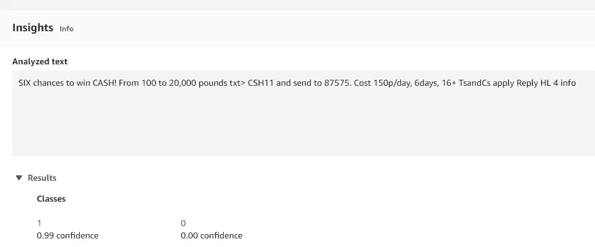

如我们所见，我们输入的示例看起来是一个 99%可信的“垃圾邮件”。

# 使用面向 Python 的 SDK 进行实时分析

我们可以使用 Python SDK 以及 AWS CLI 来调用定制模型。让我们看看如何使用 Boto3 来实现它。首先，您需要复制端点的 ARN。

> 哈哈，你总是那么有说服力。

```
**import** boto3endpoint **=** 'arn:aws:comprehend:region:account-id:document-classifier-endpoint/sms-ham-spam-endpoint'session **=** boto3.session.Session(profile_name**=**'sandbox')client **=** session.client('comprehend')mytxt **=** "Lol your always so convincing."response **=** client.classify_document(Text**=**mytxt, EndpointArn**=**endpoint)response
```

**输出**

```
{'Classes': [{'Name': '0', 'Score': 0.9999861717224121},
  {'Name': '1', 'Score': 1.3849913557351101e-05}],
 'ResponseMetadata': {'RequestId': 'f8c7d94a-a23c-4fc0-9cf5-7229f1387fb6',
  'HTTPStatusCode': 200,
  'HTTPHeaders': {'x-amzn-requestid': 'f8c7d94a-a23c-4fc0-9cf5-7229f1387fb6',
   'content-type': 'application/x-amz-json-1.1',
   'content-length': '96',
   'date': 'Wed, 06 Apr 2022 13:14:41 GMT'},
  'RetryAttempts': 0}}
```

要使用自定义模型(AWS CLI)运行实时分析，您可以运行:

```
aws comprehend classify-document \
    --endpoint-arn arn:aws:comprehend:region:account-id:document-classifier-endpoint/sms-ham-spam-endpoint \
    --text 'Lol your always so convincing.'
```

上面的例子是为 Unix、Linux 和 macOS 格式化的。对于 Windows，将每行末尾的反斜杠()Unix 继续字符替换为插入符号(^).

# 不要忘记删除端点

请注意，只要终端在运行，您就会被收费。所以，一旦你完成了，不要忘记删除它。

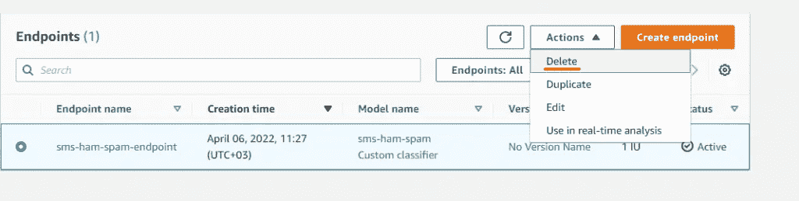

最初由[预测黑客](https://predictivehacks.com/how-to-build-a-custom-text-classification-model-with-aws-comprehend/)发布