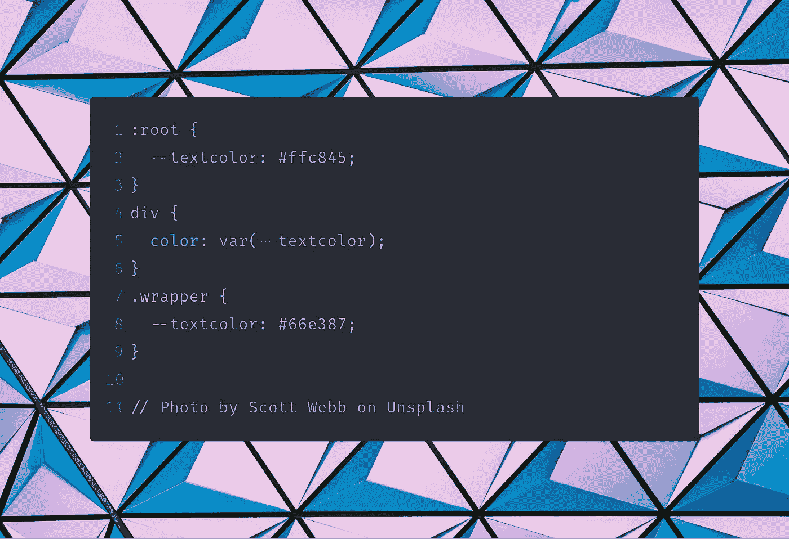

# 如何用 CSS 变量构建一个黑暗模式切换器

> 原文：<https://levelup.gitconnected.com/how-to-build-a-dark-mode-switcher-with-css-variables-ccb13f7441a0>

## 用 CSS 变量、JavaScript 和 TypeScript 构建一个黑暗模式切换器

斯科特·韦伯在 Unsplash 上拍摄的照片

回到 CSS 没有变量的日子，我并不怀念。但当萨斯/SCSS 公司带来变数时，这就变成了另一个故事。

自从我在 Sass 中使用变量以来，这让我清楚地认识到这是非常有用的。但是我等 CSS 这个功能等了这么久。

幸运的是，我们生活在一个所有浏览器都实现了 CSS 变量的时代🙌！在这篇文章中，我将教你 CSS 变量。我们将它与 TypeScript/JavaScript 结合起来，构建一个很酷的黑暗模式切换器。

这是超级简单的，因为为什么要把它变得比需要的更复杂呢？我将在 TypeScript 和 JavaScript 中添加所有代码示例。我选择添加 TypeScript，因为这在将来的工具箱中会变得更加重要。

# 1.深入研究 CSS 变量

让我们从 CSS 变量开始。打开你的 CSS 文件，像这样创建它们。

## 根

如果你在`:root {...}`中定义你的 CSS 变量`—-textcolor`，它将在你的整个 CSS 中可用。

但是我们想用这个变量给我们的`h1`添加颜色。我们通过使用 CSS 中的`var()`函数来实现。无论你在哪里应用`var(...)`，颜色都会被应用到你给予它的属性上。

## 类别、元素或 ID

例如，如果您在类、元素或 ID 上定义了该变量，它将只在该范围内可用。

因此，如果我们将`.class-name`应用到带有该类的`div`上，那么颜色将会改变。

在示例中，带有`class-name`的`div`将是绿色，另一个将是默认的黑色。

## 覆盖 CSS 变量

这意味着您可以根据上下文覆盖 CSS 变量的颜色。

现在我们把根的默认颜色设为黄色，但是在`class-name`中我们使用了绿色。这意味着我们可以根据上下文覆盖 CSS 变量。

# 2.用 JavaScript 改变 CSS 变量

既然我们已经根据上下文改变了 CSS 变量，我们需要检查如何用 JavaScript 改变它。

## 获取 CSS 变量值根

当你在根中声明一个 CSS 变量时，我们必须通过`documentElement`来获取它的值。通过对`style`对象使用`getPropertyValue`方法，我们可以访问 CSS 变量。

## 获取 CSS 变量值上下文

在类、ID 或元素的上下文中声明 CSS 变量。然后使用`document.querySelector()`得到元素。通过对`style`对象使用方法`getPropertyValue`，我们可以访问 CSS 变量。

## 更改根目录中的 CSS 变量

想要改变根中 CSS 变量的值，使用`setProperty`方法。

## 在上下文中更改 CSS 变量

想要改变上下文中 CSS 变量的值(类、ID 或元素)，使用`setProperty`方法。

## 例子

最后，我创建了一个在根或上下文中切换 CSS 变量的例子。您可以将该值重置回正常，以通过`null`而不是颜色值。

# 3.创建一个黑暗模式切换器

现在我们知道了 CSS 变量的行为。无论是改变元素的上下文还是用 JavaScript 改变它们。是时候创建黑暗模式切换器了🌓。

## 配色方案

让我们定义我们的配色方案。我使用了[uiGradients.com](https://uigradients.com/)来获得漂亮的渐变背景。浅色变量在`:root`中定义，深色变量在`.darmode`类中定义。

## 在正文上应用背景

为了应用背景渐变，我们使用了`background`属性上的变量。

HTML 看起来会像这样。

## 切换配色方案

为了切换黑暗和光明模式，我们通过主体上的 JavaScript 更改类名。在这种情况下，不需要通过 JavaScript 更改变量。

**打字稿**

**JavaScript**

这里你可以看到我使用了`classList.toggle`在“亮模式”和“暗模式”之间切换类名。接下来，我们根据主体的类别更改按钮中的文本。

*就这么简单*🤗

查看示例，了解它是如何工作的。

# 结论

我们结合 JavaScript 和 TypeScript 学习了 CSS 变量！现在是你在项目中使用它的时候了。让我知道你用它做了什么！

如果你喜欢这个教程或者有任何问题，请在评论中告诉我。

想获得一些为程序员创作内容的小技巧，[请告诉我](https://mailchi.mp/239d4f7b0d9d/programming-content-creator)。

# 阅读更多

 [## 在 JavaScript 战争中，你站错了队

### 没有人会赢！

medium.com](https://medium.com/undefined-developer/you-picked-the-wrong-side-of-the-javascript-war-583e64fe9c74)  [## 初学者打字稿

### 从头开始学习 TypeScript 的实用方法

levelup.gitconnected.com](/typescript-for-beginners-97b568d3e110)  [## 软件开发中灵活性、可读性和可伸缩性之间的细微差别

### 你的策略是什么？

medium.com](https://medium.com/better-programming/the-thin-line-between-flexibility-readability-and-scalability-in-software-development-35c6dd32deb6)  [## 在平板电脑或手机上开始编程的 3 个工具

### 编码不仅仅发生在你的台式机或笔记本电脑上

medium.com](https://medium.com/better-programming/3-tools-to-start-programming-on-a-tablet-or-mobile-phone-9dd89fc89f69)