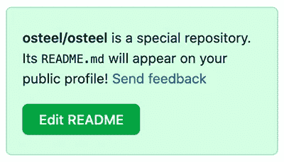
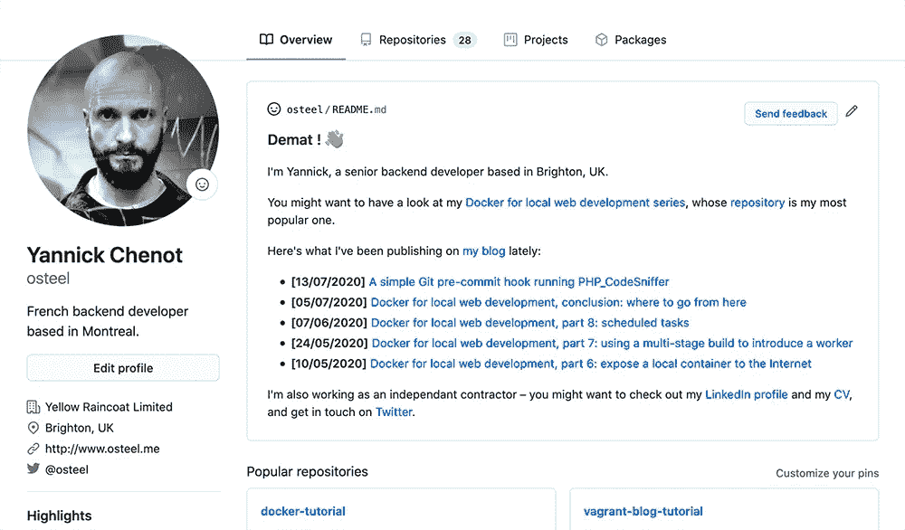

# 如何用 GitHub 动作和 PHP 构建动态 GitHub 配置文件

> 原文：<https://levelup.gitconnected.com/how-to-build-a-dynamic-github-profile-with-github-actions-and-php-5fbaf23cbf4f>

去年，GitHub 悄悄地发布了一个功能，很快引起了社区的注意——个人资料阅读


马修·施瓦茨在 [Unsplash](https://unsplash.com?utm_source=medium&utm_medium=referral) 上的照片

[概要文件自述文件](https://docs.github.com/en/free-pro-team@latest/github/setting-up-and-managing-your-github-profile/managing-your-profile-readme)是 GitHub 概要文件的一个全局`README`文件，您可以通过创建一个名称与您的 GitHub 用户名相同的公共存储库来设置它。例如，由于我的用户名是`osteel`，我创建了`osteel/osteel` [存储库](https://github.com/osteel/osteel)。

当您添加自己的内容时，应该会出现一个像这样的小框:



一旦创建了存储库，添加一个带有简短描述的`README`文件，解释你有多棒，你的 GitHub 个人资料页面将默认显示其内容:



简洁明了。

当我为了寻找灵感而浏览示例时，我偶然发现了西蒙·威廉森的版本，其中包含一些动态内容，如最近的工作和博客文章。他在一篇博客文章[中解释了他如何使用 GitHub 动作](https://simonwillison.net/2020/Jul/10/self-updating-profile-readme/)[和 Python 的组合来实现这一点，我决定用 PHP 做类似的事情。](https://github.com/features/actions)

# 占位符

首先要做的是在`README`文件中创建一个占位符，动态内容将放在那里。因为我想自动插入我博客的最新出版物，所以我使用了以下标签:

```
<!-- posts --><!-- /posts -->
```

你可能认识这种格式；由于 Markdown 文件也支持 HTML，我使用了一些 HTML 评论标签来确保它们不会出现在我的个人资料页面上。

# PHP 脚本

不记得上次写一些没有框架的 PHP 是什么时候了；结果，我不得不做一个[快速搜索](https://www.frobiovox.com/posts/2016/08/16/basic-hello-world-with-composer-and-php.html)来开始一个基本的 PHP 脚本和一些 Composer 依赖项。

事实证明这很简单！第一步是使用以下命令初始化项目:

```
$ composer init
```

从那里，我安装了一个轻量级库[来解析我博客的](https://github.com/dg/rss-php) [RSS 提要](https://tech.osteel.me/feeds/rss.xml):

```
$ composer require dg/rss-php
```

然后我在项目的根目录下添加了一个`posts.php`文件，内容如下:

这里没有什么太复杂的——顶部需要 Composer 的 *autoload* ,允许我加载 RSS 解析器来生成 Markdown 格式的博客文章列表。

然后将`README`文件的现有内容加载到`$content` 变量中，并将 Markdown 字符串插入到带有`preg_replace`的`<!-- posts -->`和`<!-- /posts -->`标签之间。

最后，使用`file_put_contents`函数，用新内容替换文件的全部内容。

# GitHub 行动

[GitHub Actions](https://github.com/features/actions) 是 GitHub 最近新增的功能，允许开发人员自动化各种 CI/CD 任务，比如运行测试套件或部署 web 服务。

它们必须在项目根目录下的`.github/workflows`文件夹中使用 YAML 格式定义，并包含它们要执行的步骤列表。

这是我的，我命名为`posts.yml`:

还是那句话，没什么太复杂的。我们首先给动作起一个名字，然后定义触发它的事件列表——将一些代码推送到存储库，从界面手动触发(`workflow_dispatch`)，或者像 cron 作业一样定期触发(这里是每天午夜)。

然后，我们指出该操作应该在 Ubuntu 映像上运行，它将:

*   克隆存储库；
*   [安装 PHP 7.4](https://github.com/shivammathur/setup-php)；
*   安装编写器依赖项；
*   运行 PHP 脚本；
*   [提交并推送变更](https://github.com/stefanzweifel/git-auto-commit-action)，如果有的话。

就是这样！我的 GitHub 档案现在会在我每次发表新文章时自动更新。

# 结论

这是一个旨在探索 GitHub 动作的快速实验，我希望将来会越来越多地使用它。以一种程序化的方式再次将 PHP 作为一种简单的脚本语言也很有趣。

为了使这篇文章简短，我主动省略了一些东西——关于实现细节，请参考[资源库](https://github.com/osteel/osteel)。

*这个故事最初发表于*[*tech . osteel . me*](https://tech.osteel.me/posts/dynamic-github-profile-readme-with-github-actions-and-php)*。*

# 资源

*   [管理您的个人资料自述文件](https://docs.github.com/en/free-pro-team@latest/github/setting-up-and-managing-your-github-profile/managing-your-profile-readme)
*   [GitHub 动作](https://github.com/features/actions)
*   [本文的知识库](https://github.com/osteel/osteel)
*   [GitHub 动作:结账 V2](https://github.com/actions/checkout)
*   [GitHub 动作:设置 PHP](https://github.com/shivammathur/setup-php)
*   GitHub 动作:Git 自动提交