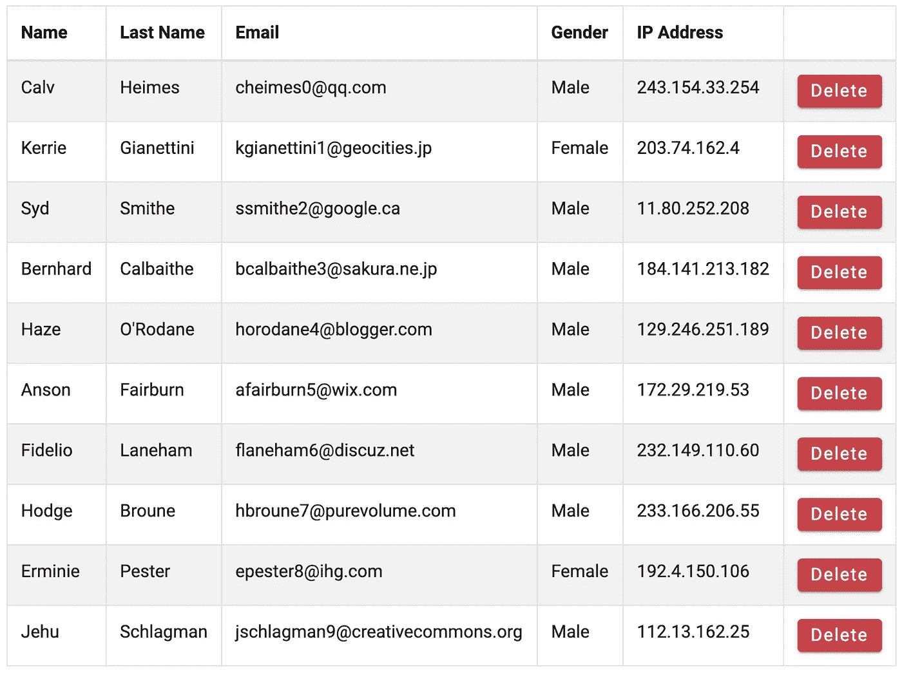
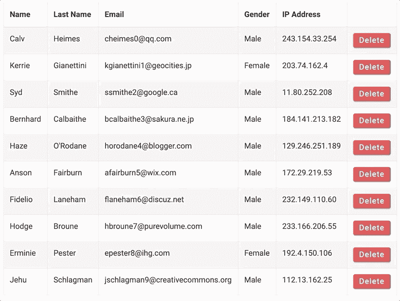
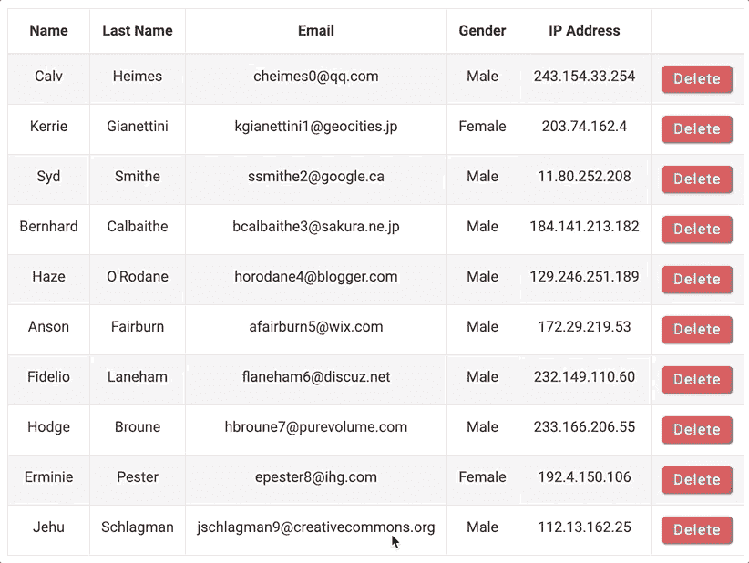
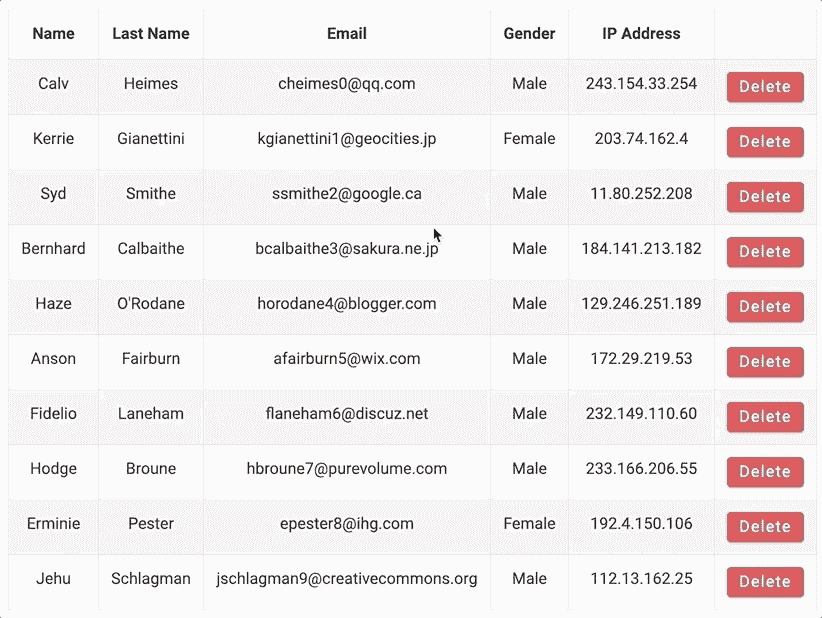

# 如何使用钩子和上下文 API 在 React.js 中构建一个通用的、可重用的、类似同步的确认对话框

> 原文：<https://levelup.gitconnected.com/how-to-build-a-generic-reusable-synchronous-like-confirmation-dialog-in-react-js-71e32dfa495c>

# 序言

我玩 JavaScript 已经有一段时间了，几乎浏览了所有主要的库/框架，vanilla-JS、jQuery、Angular、Backbone、Ember、React、Vue 等等。

有一点我可以肯定，当我试图在 JavaScript 中实现“**同步流**”时，它一直困扰着我，尤其是当我试图在其上添加一些 UI 时。

现在，我知道你在想什么，什么**同步**和 JavaScript 有什么关系？这样想难道不是错的吗？你是对的，嗯，在某种程度上…

让我们看一个非常简单的例子，执行`XHR`从服务器获取数据，这是显而易见的，每个 JavaScript 新手都知道它是如何进行的；

1.  你异步地做一些事情
2.  您添加回拨
3.  你*等一下*
4.  当回调被调用时，您继续

然后我们学会了使用`**Promises**`，这是一种更简单的方法，可以让我们避免臭名昭著的“**地狱回调”**(真的吗？)

但是，我们仍然像以前一样等待回应，即使这样会更方便一点。

然后…

我们学会了使用`**Async/Await**`

**O-M-G** ，刚刚发生了什么？！

**JavaScript** 变得同步了吗？

当然不是，在没有深入了解`**Async/Await**`到底是怎么回事的情况下，这看起来很有希望，给人一种同步流的感觉，所以让我们看看我将如何根据我的需要来处理它。

# 挑战

首先，对于我的问题，我到底想实现什么。让我们看看下面的例子

我有一个人的列表，可以选择删除任何项目，点击删除键可以从列表中删除一个人。
我想向用户显示一个确认对话框，询问类似这样的问题

> “你确定…？”

只有这样，完成删除以避免任何错误，这听起来并不复杂，这有什么大不了的？

嗯，我想打开对话框，并以一段代码的形式获得响应，类似于我们可以用这里描述的[本地确认 API 做的事情。](https://developer.mozilla.org/en-US/docs/Web/API/Window/confirm)

但是这个对话框看起来就像你在访问恶意网站时经常看到的对话框，说你刚刚赢得了 1，000，000，000 美元，来吧…

我可以做得更好。

# 构建应用程序

我使用 [react-bootstrap](https://react-bootstrap.github.io/) 用于所有的样式和现成的组件，如 Table、Modal 等，以及最新版本的 [React.js](https://reactjs.org/)

我使用了一个功能组件，在`**useState**` hook 中填充了一个静态人员列表。
通过一个简单的映射，我将数组的每个元素转换成一个表行，并附加 click listener 来移除元素，没什么特别的。

这样，点击删除按钮将立即删除元素并重新填充列表。

# 添加简单的确认对话框

好的，所以我在我的桌子旁边添加了一个反应引导`**Modal**`和另一个`**useState**`钩子来保持它的可见性状态。

现在点击删除按钮将显示确认对话框，在里面我显示了两个按钮，一个用于批准，另一个用于取消，现在，两个按钮都将隐藏它。

# 确认后完成删除操作

所以如果你考虑一下，在我的确认对话框中点击 **Ok** 按钮应该做几件事，首先，它需要隐藏对话框，其次，它需要删除我点击的表格行中的元素，为此我需要保存另一条信息

这里需要注意的是，首先，我使用了`**useRef**`钩子来存储我想要删除的元素，显然还有其他的方法，但是这个钩子可以和其他钩子一起流畅地工作，并且在重新呈现组件和显示正确的数据时有一些性能上的好处。

这似乎工作得很好，事实上这就是我开始的地方；

起初，它是足够好的，但是

*   我必须将对话框导入到我想要使用的每个组件中
*   对话流程是显示对话和等待响应的两步，我不喜欢这样
*   我发现这个对话框与操作本身耦合得很好，删除、编辑、批准等等。

随着我的项目变得越来越大，有了更多的组件和我必须展示对话框的地方(真正的快乐:)，我必须想出一些更好、更通用和可重用的东西...

如果我能够封装整个确认对话框逻辑并在任何地方重用，会怎么样呢？如果你想一想，每个操作组件(删除、编辑、批准)都需要使用相同的确认对话框，但使用不同的消息，而操作本身的消费者只需要添加一个点击监听器。

让我们看看如何…

# 解决方案

首先，我需要把所有东西分开，而不是使用一个普通的按钮(或者 react-bootstrap 按钮),我要用一个组件来包装它，以暗示这个按钮的功能，在我的例子中是`**DeleteButton**`,但可以是我喜欢的任何名称

然后在我的主人员表中，我可以这样使用它

c

这将让我在将动作转发给调用者之前拦截点击；

理想情况下，当用户点击 **Ok** 或 **Cancel** 来决定是否将点击动作转发给正在使用这个`**DeleteButton**`的用户时，`**handleOnClick**`函数应该以某种方式调出确认对话框并得到通知。

如果这是可能的，那么每个使用 my `**DeleteButton**`的组件都将能够把它当作一个**“截取的类似按钮”**，并让它自己运行要求用户确认的逻辑。

不可知的操作本身，纯粹的关注点分离，听起来不错。

# 添加保存确认对话框的全局位置

现在，因为我希望我的应用程序中的每个组件都有这个很酷的功能，所以我还需要将我的对话框实现移到其他地方。

这听起来像是`**Context**`和`**ContextProvider**`的工作

上下文将让任何组件显示确认对话框

好吧，这是怎么回事？需要注意的几件事

*   我正在使用 React 的 **createContext** API 创建一个新的上下文。
*   我正在创建一个新的组件来使用我的上下文中的`**Provider**`，这是一个非常有用的模式；这也是我将要实现确认对话框的地方，因此你可以在第 4 行看到`**useState**`钩子来显示它的可见性状态。
*   暴露单一功能`**showConfirmation**`

`**showConfirmation**`函数将负责两件事

1.  更改模态可见性状态并显示它
2.  使用`**useRef**`钩子创建、存储并返回一个新的`**Promise**`(这是真正的魔法所在)，以便它可以在以后被调用。

因此，当我的上下文函数`**showConfirmation**`被调用时，我将显示对话框并返回一个承诺，当用户单击对话框动作时，该承诺将被解析( **OK/CANCEL** )。

现在，从理论上讲，我可以修改我的`**DeleteButton**`点击处理程序，使之类似于

我将能够在同一行代码中显示确认对话框并得到它的响应！

为了让它真正发挥作用，我要做两件事

1.  让任何组件消耗我的对话上下文。
    为此，我在我的`**Context**`定义(同一个文件)旁边添加了一个导出声明，这是 React 中使用上下文的一个非常有用的模式，调用者将永远不需要知道/导入我的`**ContextDefinition**`对象，而只需要调用`**useConfirmationModalContext**`并得到它。
2.  为了让`**useContext**`工作，我需要用我的`**ContextProvider**`包装我的整个应用程序，这样任何子组件都可以使用它。

最后，在`**DeleteButton**`内部我可以导入我的`**modalContext**`并使用它，就是这样！

# 结论

在这个故事中，我试图展示如何结合一堆技术来实现预期的行为。

显示一个对话框非常简单，甚至可以创建一个上下文来显示它，但是使用`**Async/Await**`让我能够以某种同步流的方式构建它，现在我可以显示我的对话框并在同一行上期待响应，这让我可以利用我的开发经验。

当然，我假设在某一时刻只有一个对话框打开，这符合我的需要。

下一步是用更多的细节来丰富它，比如传递一个对话框标题和消息来定制它。

希望你和我一样喜欢它:)

# 存储库链接

你可以在下面的 github 链接中找到完整的代码库和一个工作示例:[https://github . com/royeeshemesh/confirmation-dialog-react-hooks](https://github.com/royeeshemesh/confirmation-dialog-react-hooks)