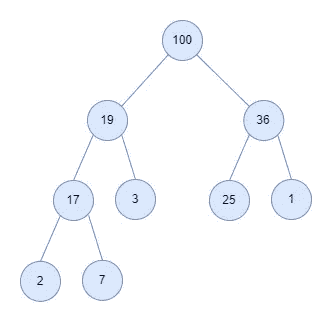
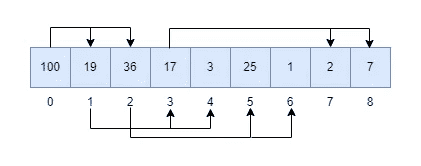
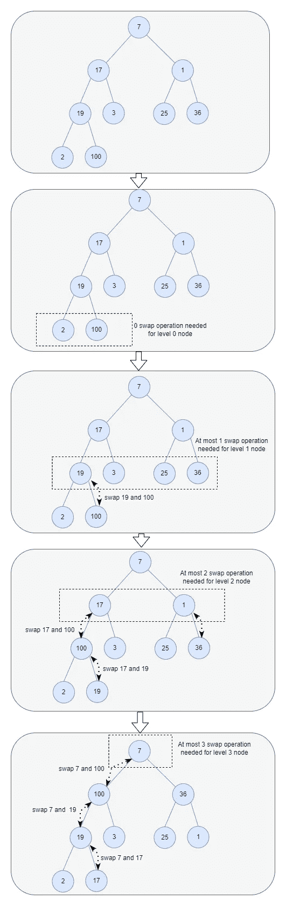
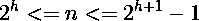
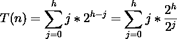
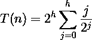
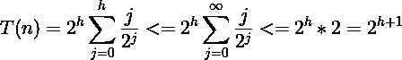
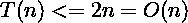

# 如何在线性时间复杂度下建立堆

> 原文：<https://levelup.gitconnected.com/how-to-build-a-heap-in-linear-time-complexity-c923466c6fbd>

# 背景

在本文中，我将重点讨论`data structure and algorithms`(在我看来，软件工程师最重要的技能之一)这个话题。有一天我遇到了一个[问题](https://stackoverflow.com/questions/9755721/how-can-building-a-heap-be-on-time-complexity)是这样的:*构建一个堆怎么可能是 O(n)时间复杂度？*这个问题让我困惑了一段时间，我就此做了一些调查和研究。本文将分享我在此过程中所学到的东西，包括以下几点:

*   什么是堆数据结构？堆的行为如何？
*   C 编程中如何实现一个完整的堆？
*   如何进行堆构建的时间复杂度分析？

# 堆的基础

在我们深入到实现和时间复杂度分析之前，让我们先了解一下`heap`。

作为一种数据结构，`heap`是很久以前为 heapsort 排序算法创建的。除了堆排序之外，`heaps`还被用于许多著名的算法中，例如用于寻找最短路径的 [Dijkstra 算法](https://en.wikipedia.org/wiki/Dijkstra%27s_algorithm)。从本质上来说，*堆是当您希望能够非常快速地访问最大值或最小值元素时想要使用的数据结构。*

在计算机科学中，`heap`是一种专门的基于树的数据结构。一个`heap`的常见实现是*二进制堆*，其中的树是一个*二叉树*。

因此`heap`可以被定义为一棵二叉树，但是有两个额外的属性(这就是为什么我们说它是一棵特化的树):

*   **形状属性**:二叉堆是一棵*完整的*二叉树。那么什么是*完全*二叉树呢？这是树的所有级别，除了可能最后一级(最深的)被完全填充，并且如果树的最后一级不完整，则该级的节点从左到右被填充。完全二叉树是二叉树的一种，详细的，你可以参考这个[文档](https://en.wikipedia.org/wiki/Binary_tree#Types_of_binary_trees)来了解更多。
*   **堆属性**:每个节点中存储的关键字要么大于等于(max-heaps)要么小于等于(min-heaps)该节点子节点中的关键字。

下图显示了基于树表示的二进制最大堆:

`heap`是一个强大的数据结构；因为您可以插入一个元素，并从最小堆或最大堆中提取(移除)最小或最大的元素，只需要 **O(log N)** 时间。这就是为什么我们说如果你想快速访问最大或最小元素，你应该求助于`heaps`。在下一节中，我将通过在 C 编程中实现一个堆来研究堆是如何工作的。

注意:堆与另一种叫做`[priority queue](https://en.wikipedia.org/wiki/Priority_queue)`的数据结构密切相关。`priority queue`可以用多种方式实现，但是`heap`是一种最有效的实现方式，事实上，优先级队列通常被称为“堆”，不管它们是如何实现的。

# 堆的实现

由于堆的`shape property`，我们通常将其实现为数组，如下所示:

*   数组中的每个元素代表堆的一个节点。
*   父/子关系可以由数组中元素的索引来定义。给定索引`i`处的一个节点，左边的子节点在索引`2*i + 1`处，右边的子节点在索引`2*i + 2`处，其父节点在索引`⌊(i-1)/2⌋` ( `⌊⌋`表示 Floor 操作)。

基于上面的模型，让我们开始实现我们的堆。正如我们提到的，有两种类型的堆:最小堆和最大堆，在本文中，我将研究`max-heap`。max-heap 和 min-heap 之间的区别是微不足道的，您可以在理解本文之后尝试写出 min-heap。

完整的代码实现在这个 Github [repo](https://github.com/baoqger/max-heap-in-c) 里面。

首先，让我们在头文件中定义 max-heap 的接口如下:

我们将 max-heap 定义为`struct _maxheap`，并将其实现隐藏在头文件中。并通过一个处理程序(它是一个指针)`maxheap`在接口中公开这个结构。这种技术在 C 程序中被称为`[opaque type](https://stackoverflow.com/questions/2301454/what-defines-an-opaque-type-in-c-and-when-are-they-necessary-and-or-useful)`。`Opaque type`模拟 OOP 编程的封装概念。以便类型的内部细节可以更改，而使用它的代码不必更改。具体实现如下:

max-heap 元素存储在`array`字段中。数组的容量被定义为字段`max_size`，数组中的当前元素数为`cur_size`。

接下来，我们一个一个的来看一下接口(大部分接口都很简单，所以我就不做过多的解释了)。第一个是`maxheap_create`，通过为其分配内存来构造`maxheap`的实例。

max-heap 的初始容量设置为 64，当需要向堆中插入更多元素时，我们可以动态地扩大容量:

这是一个内部 API，所以我们将其定义为一个`[static](https://www.tutorialspoint.com/static-functions-in-c)`函数，将访问范围限制在它的对象文件上。

当程序不再使用 max-heap 数据时，我们可以如下销毁它:

不要忘记通过调用`free`来释放分配的内存。

接下来，让我们处理困难但有趣的部分:在 **O(log N)** time 中插入一个元素。解决方案如下:

*   将元素添加到数组的末尾。(数组的结尾对应于树的底层最左边的空白区域)。
*   将添加的元素与其父元素进行比较；如果它们的顺序正确(在 max-heap 中，parent 应该大于或等于 child，对吗？)，停。
*   如果没有，将元素与其父元素交换，并返回到上面的步骤，直到到达树的顶部(树的顶部对应于数组中的第一个元素)。

向数组末端添加元素的第一步首先符合 **shape 属性**。然后**堆属性**通过遍历堆来恢复。递归遍历和交换过程称为`heapify-up`。这可以用下面的伪代码来说明:

实现过程如下:

`heapify-up`中所需的操作数量取决于新元素必须上升多少级才能满足堆属性。所以最坏情况下的时间复杂度应该是二进制堆的高度，也就是 **log N** 。并且通过使用`cur_size`作为索引，可以用常数时间将一个新元素追加到数组的末尾。因此，插入操作的总时间复杂度应该是 **O(log N)** 。

类似地，接下来，让我们继续工作:从堆中提取根，同时在 **O(log N)** 时间内保留堆属性。解决方案如下:

*   用末尾的元素替换数组的第一个元素。然后删除最后一个元素。
*   将新根与其子根进行比较；如果顺序正确，就停下来。
*   否则，将该元素与其子元素交换，并重复上述步骤。

这种类似的向下遍历和交换过程被称为`heapify-down`。`heapify-down`比`heapify-up`稍微复杂一点，因为父元素需要与 max 堆中的*较大的*子元素交换。实现过程如下:

基于`heapify-up`的分析，同样，提取的时间复杂度也是 **O(log n)** 。

下一节，让我们回到本文开头提出的问题。

# 构建堆的时间复杂度

构建一个堆的时间复杂度是多少？我想到的第一个答案是 **O(n log n)** 。由于插入一个元素的时间复杂度为 *O(log n)* ，对于 n 个元素，插入重复 n 次，所以时间复杂度为 *O(n log n)* 。对吗？

我们可以使用另一种最佳解决方案来构建堆，而不是重复插入每个元素。内容如下:

*   任意将 n 个元素放入数组，以尊重**形状属性**。
*   从最低层开始向上移动，像在`heapify-down`过程中一样向下筛选每个子树的根，直到**堆属性**被恢复。

下图说明了这一过程:

该算法可以如下实现:

接下来，我们来分析一下上面这个过程的时间复杂度。假设堆中有 *n* 个元素，堆的高度为 *h* (上图中的堆，高度为 3)。那么我们应该有如下关系:

当最后一级只有一个节点时，则 n = 2ʰ.并且当树的最后一级被完全填满时，则 n = 2ʰ⁺ -1

并且从底层开始为级别 *0* (根节点为级别 *h* )，在级别 *j* 中，最多有 2ʰ⁻ʲ节点。并且每个节点最多进行 *j* 次交换操作。所以在 j 级中，运算的总数是 j×2ʰ⁻ʲ.

因此，构建堆的总运行时间与以下各项成正比:

如果我们去掉 2ʰ项，那么我们得到:

我们知道，∑j/2ʲ是一个收敛于 2 的级数(详细内容，可以参考本 [wiki](https://en.wikipedia.org/wiki/Series_(mathematics)) )。

本[维基](https://en.wikipedia.org/wiki/Series_(mathematics)))。

利用这一点，我们可以:

基于条件 2ʰ <= n <=2ʰ⁺ -1，所以我们有:

现在我们证明了建立一个堆是一个线性操作。

# 摘要

在本文中，我们研究了什么是`Heap`，并通过实现它来理解它的行为(`heapify-up`和`heapify-down`)。更重要的是，我们分析了建立一个堆的时间复杂度，并证明了它是一个线性操作。