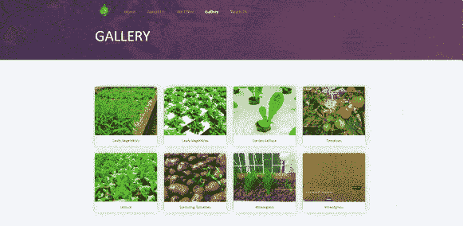

# 如何构建一个 JavaScript 库

> 原文：<https://levelup.gitconnected.com/how-to-build-a-javascript-library-6b7161315f3d>

*最初发布于*[*https://faisalrashid . tech/blogs/How-to-build-a-JavaScript-Library*](https://faisalrashid.tech/blogs/How-to-build-a-JavaScript-Library)

如果你是一名开发人员，几乎可以肯定你使用过代码库。简而言之，代码库是您可以在程序中使用的可重用代码的集合。

像我们大多数人一样，我知道如何将库插入到我的程序中并使用它们，但每次我浏览那个特定库的实际源代码时，我都会感到害怕。然后我开始学习香草 JS，这一切看起来不再那么可怕。Vanilla JS 是不使用任何外部库编写的普通 JavaScript 代码。

在构建用于创建网站的 JavaScript 库时，在尝试实际构建之前，学习使用普通 JS 进行 DOM 操作是很重要的。它之所以重要，是因为你不会有任何依赖，你的库对你的用户来说就是一个简单的即插即用。您可能熟悉使用 jQuery 的 DOM 操作，但是这将创建对 jQuery 的依赖，并且您的库将无法在不包含对 jQuery 库的引用的网页上运行。

如果你熟悉 jQuery，并且想学习更多关于使用 Vanilla JS 的 DOM 操作，你可以在这里阅读更多相关内容。

说了这么多，让我们从头开始创建一个 JavaScript 库。

我们将建立一个图像灯箱。lightbox 是一个库，用于通过用图像填充页面和削弱背景来查看网页上的图像。这是我们要建造的。



如果你想跳到前面去看代码，你可以在这里找到 GitHub 库[。](https://github.com/FaisalST32/fs-lightbox)

当构建一个 JavaScript 库时，你需要记住一些事情。
你的代码不应该干扰用户编写的现有代码。为此，我们将把所有代码封装在一个函数对象中。

```
function FsLightbox() {
   // all the code goes here 
}
```

我们在本教程中编写的所有代码都将在那个函数体中编写。这将负责封装。

我们现在必须创建一个列表，列出用户可以访问并且对用户有用的所有方法。在这个库中，我们有四个这样的方法

**。呈现()**，**。接下来()**，**。prev()** 和**。hideLightbox()**

因此， **FsLightbox** 对象将拥有这四个公共成员。所谓公共成员，我们指的是所有那些带有 **this** 关键字的方法和属性。

首先，我们将存储一个对对象上下文的引用，因为使用**这个**关键字在 JavaScript 中会变得混乱。

```
let _this = this;
```

这将消除所有的混乱，让我们毫无顾虑地使用对象上下文。

解决了这个问题，让我们回顾一下让 lightbox 工作的策略。

*   用户将通过向那些 **img** 标签添加特定的类来指定将使用 lightbox 的图像。因此，每次 DOM 加载时，我们将能够捕获这些图像并将它们的引用保存在一个数组中。
*   之后，我们将为每个图像添加一个 click listener，以确保每次用户单击该图像时，它都会显示在 lightbox 中。我们将利用 JavaScript 和 CSS 来实现这一点。
*   我们还需要为**前一个图像，下一个图像**和一个按钮**关闭**灯箱的导航控件。我们将这些控件与它们各自的点击监听器连接起来。
*   我们还将显示一些元信息，如**图像计数器**和**标题**(我们将从 **Alt 文本**中获取)

正如你可能已经意识到的，我们将要创建的 JavaScript 库将使用大量的 CSS，因此，我们也将包含一个 CSS 文件。

说够了，我们来写点代码吧。首先，我们需要跟踪一些数据，因此，我们将声明一些变量，这些变量在我们的小函数中是可用的。这些将是:

```
let imagesArray = []; // Array containing the reference of all the images that have the specified class (fs-lightbox)
    let currentImage; // Image being displayed currently in the lightbox
    let isLightbox = false; // Boolean to tell you whether the image is being displayed in the lightbox or not
```

在这之后，我们将编写我们的第一个公共方法，**。渲染()。**在这里我们将初始化的是“全局”变量，并得到一个存储在数组中的所有图像的引用。需要运行这个方法来实际初始化我们的 Lightbox。代码如下:

```
this.render= () => {
            imagesArray= [];
            currentImage=null;
            isLightbox=false;document.querySelectorAll('img.fs-lightbox').forEach((img_el, index) => {
                imagesArray.push(img_el);
                img_el.setAttribute("data-lightbox-index", index);
                img_el.addEventListener('click', () => {
                    _this.lightbox(img_el);
                });
             }); addKeyListeners();
        }
```

正如所见，我们在这里使用了函数 **addKeyListeners()** 。该方法用于挂接 **Next、Prev** 和 **Close Lightbox 的所有键盘动作。**我们稍后再谈。我们在这里添加的事件监听器是 **_this.lightbox()** 。这个方法将负责在 lightbox 中实际显示图像。这是它的实现。

```
this.lightbox = _el => {
       this.hideLightbox();
       currentImage = _el;
       isLightbox = true;
       var overlay = document.createElement('div');
       overlay.classList.add('lightbox-overlay');
       var imageContainer = document.createElement('div');
       imageContainer.classList.add('lightbox-image');
       var image = document.createElement('img');
       image.src = _el.src;
       imageContainer.appendChild(image);
       document.querySelector('body').appendChild(overlay);
       document.querySelector('body').appendChild(imageContainer);
       prepareControls(_el);
   }
```

如 **render()** 方法所示，该方法期望图像元素 **_el** 作为方法参数。这将是对需要在 lightbox 中显示的 **img** 元素的引用。如果我们进一步分析这个方法，我们会发现，如果它已经显示了其他图像，我们首先 **hideLightbox()** 。然后，我们将图像的引用保存在全局变量 **currentImage** 中，并将 **isLightbox** 变量更改为 true。然后真正的 DOM 操作就开始了。

我们使用 **createElement** 方法创建覆盖 div **覆盖**，并添加类 **lightbox-image** 到其中。我们创建的 CSS 文件将包含覆盖所需的所有 CSS，如位置和背景色。我不会深入研究这些代码，因为这不是本文的重点。话虽如此，这里有一个片段详细说明了这一点:

```
.lightbox-overlay {
   position: fixed;
   top: 0;
   left: 0;
   width: 100vw;
   height: 100vh;
   background-color: rgba(0,0,0,0.7);
   z-index: 10000;
}
```

一旦我们创建了覆盖，我们需要为实际的图像创建一个容器。 **imageContainer** 变量将包含相同的内容。该变量将是对我们创建的 div 的引用，然后我们将创建一个 img 元素 **image** 并将其附加到同一个 div。使用提供的 **_el** 函数参数，我们将获得点击图像的 **src** ，并将**图像**元素的 **src** 设置为相同的值。然后，我们将这些新创建的元素，**覆盖图**和**图像容器**添加到 DOM 中。就是这样！现在，每当用户单击添加了 **fs-lightbox** 类的图像时，就会触发 **lightbox()** 方法，图像就会显示在 lightbox 中。

这是大部分的艰苦工作。现在轮到波兰人了。这只是我们让我们的图书馆更加方便用户。这在创建库时非常重要。永远站在用户的角度思考问题。对用户来说越方便，接收效果就越好。

那么，让我们开始吧。记住，在这篇文章的前面，我提到了用户可以使用的所有四个公共方法。我们刚刚实现了这四种方法之一— **render()** 。我们需要实现其余的— **next()、prev()** 和 **hideLightbox()** 。

这将在 **prepareControls()** 方法中完成。你可以在 **lightbox()** 方法中看到我们正在调用这个方法。该方法将负责呈现 UI 元素，即用于上述操作的按钮，以及为它们附加 click listeners。下面是实现。

```
function prepareControls(imgElement) {
       let controls = document.createElement('div');
       controls.innerHTML += controlsHtml;
       document.querySelector('body').appendChild(controls.querySelector('.lightbox-controls'));
       let imgIndex = getCurrentImageIndex();
       if (imgIndex > 0) {
           document.querySelector(".lb-prev").addEventListener('click', () => {
               _this.prev();
           })
       }
       else {
           document.querySelector(".lb-prev").classList.add(['lb-disabled'])
       }
       if (imgIndex < _this.imagesArray.length - 1)
             document.querySelector(".lb-next").addEventListener('click', () => {
               _this.next();
           })
       }
       else {
           document.querySelector(".lb-next").classList.add(['lb-disabled'])
       }
       document.querySelector('.lb-close').addEventListener('click', () => {
           _this.hideLightbox();
       })
       showCounter();
   }
```

正如我所说的，创建控件并用 click listeners 将它们连接起来就是这里所做的一切。处理程序 **this.next()** 和 **this.prev()** 实现如下:

```
this.next = () => {
       let imgIndex = getCurrentImageIndex();
       if (imgIndex === _this.imagesArray.length - 1)
           return;
       _this.lightbox(_this.imagesArray[getCurrentImageIndex() + 1]);
   }this.prev = () => {
       let imgIndex = getCurrentImageIndex();
       if (imgIndex === 0)
           return;
       _this.lightbox(_this.imagesArray[getCurrentImageIndex() - 1]);
   }this.hideLightbox = () => {
       let overlay = document.querySelector('.lightbox-overlay');
       let image = document.querySelector('.lightbox-image');
       let controls = document.querySelector('.lightbox-controls');
       if (overlay)
           document.querySelector('body').removeChild(overlay);
       if (image)
           document.querySelector('body').removeChild(image);
       if (controls)
           document.querySelector('body').removeChild(controls);
       this.isLightbox = false;
   };
```

**。next()** 从数组 **imagesArray** 中获取下一幅图像，并将其传递给**。lightbox()** 方法与**类似。prev()** 方法。 **hideLightbox()** 从 DOM 中移除显示的图像。

我们还剩下两个东西——**显示元信息**和**绑定键盘快捷键。**

我们会为此写两个方法， **addKeyListeners()** 和 **showCounter()** (名字选择不好，应该是 **showMetaInformation)** ，下面是实现。一旦你经历过，就很容易理解了。

```
function showCounter() {
       let imgIndex = getCurrentImageIndex();
       let counter = document.createElement("span");
       let counter_Html = `<br/>${imgIndex + 1} of ${_this.imagesArray.length}`;
       if(_this.currentImage.alt){
           counter_Html += ` - ${_this.currentImage.alt}`;
       }
       counter.innerHTML = counter_Html;
       document.querySelector('.lightbox-image').appendChild(counter);
   }function addKeyListeners() {
       document.removeEventListener('keydown', bindKeys);
       document.addEventListener('keydown', bindKeys);
   }function bindKeys(e) {
       // left arrow key
       if (e.keyCode === 37 && _this.isLightbox) {
           _this.prev();
           return;
       }
       // right arrow key
       else if (e.keyCode === 39 && _this.isLightbox) {
           _this.next();
           return;
       }
       // escape key
       else if (e.keyCode === 27 && _this.isLightbox) {
           _this.hideLightbox();
           return;
       }
   }
}
```

这就是我们要在函数体中写的所有代码。我们现在需要初始化它。这将通过调用**来完成。我们创建的 render()** 方法。记住，它是负责初始化所有东西的方法。我们可以在函数体之外这样做:

```
var fsLightbox = new FsLightbox;
fsLightbox.render();
```

现在用户必须参考**。js** 以及**。css** 文件，他们将使用该库启动并运行。

大概就是这样。还有一些更小的函数我在这里没有提到，比如 **getCurrentImageIndex()** 等，因为这些对于理解工作流并不重要。你仍然可以在 [Github Repo 中查看这些。](https://github.com/FaisalST32/fs-lightbox)

既然我们已经完成了库的构建，我们需要了解如何发布它以便其他用户可以使用它。对此我们有很多选择。我们可以使用 **GitHub** 、 **npm** 等来托管我们的库。永远记住要包含一个小的自述文件，详细说明库的用法。您可以在相同的 Github Repo 中找到示例。要了解更多关于发布库的信息，请继续关注这个博客。我很快会写一篇关于它的文章。

*TL；DR；要创建一个 JavaScript 库，你需要记住封装代码，使它不会干扰用户代码，使它简单易用，并尽量确保它没有任何依赖性。你照着这些做，你会没事的。*

[](https://skilled.dev) [## 编写面试问题

### 掌握编码面试的过程

技术开发](https://skilled.dev)