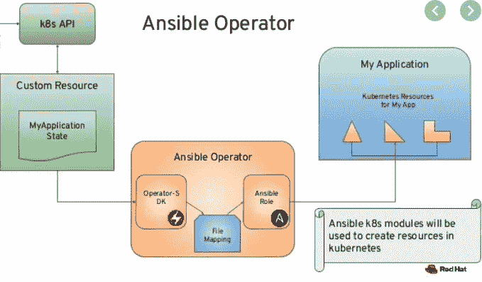
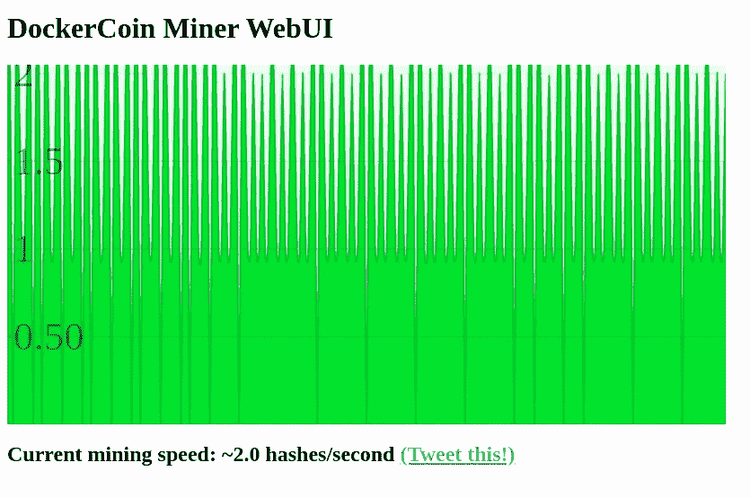

# 如何使用 Ansible 和 Operator SDK 构建 K8S 运算符

> 原文：<https://levelup.gitconnected.com/how-to-build-a-k8s-operator-using-ansible-and-operator-sdk-8f98226abfbe>


今天我将与你们分享如何使用 Ansible 实现“真实世界”操作符的信息。我们先来了解一下什么是运营商。操作符是 Kubernetes 的软件扩展，它允许我们创建定制资源来管理应用程序及其资源。通过操作符，我们可以创建一个抽象的、高层的对象，它将引用 Kubernetes 的目标，并以自动化的方式创建那些资源。操作员将充当该对象创建的监听器。

除了这个对象(又名自定义资源，CR)之外，我们还将创建一个 CRD(又名自定义资源定义)，它将成为 CR 的模板。例如，要在 Kubernetes 上创建 ELK 堆栈，我们必须为 pod、这些 pod 的服务、PV、PVC、routs 等创建清单。为了简化在我们的 K8S 集群上部署这样一个 ELK 堆栈的过程，我们可以创建一个 CR，它将被称为例如`elk_stack`，并且将具有自己的属性(属性将被存储在 CRD 中)，例如 num_elastic_nodes、num_kibana_nodes、num_logstash_instances 等。

创建此 CR 时，运营商将根据最终用户的规格自动做出反应并创建所需的资源。最终，最终用户将拥有一个可以运行的、功能性的 ELK 堆栈供使用。

做完这个简短的介绍后，让我们来谈谈我们为这个演示准备了什么。在这个演示中，我们将使用这个项目，它使用五个用不同编程语言(Ruby、Python、Node)编写的简单微服务。我们将构建一个对我们创建的每个 CR 做出反应的操作符。CR 是一个集群，将所有这五个微服务聚集到一个对象中。创建 CR 时，运营商将在幕后创建部署、服务、路由等。最终，我们将得到一个使用 CR 及其属性创建的`dockercoins`集群。如果你想一想，在现实世界中，我们可以使用任何我们拥有的应用程序，并使用操作符实现一些逻辑。这个逻辑将执行第一天的操作(如初始部署)和第二天的操作(如迁移、扩展等)，我们所要做的就是使用正确的清单。

让我们简单介绍一下`dockercoins`微服务架构，以便更好地了解动态变化:

*   rng 服务—生成随机字节的书面 web 服务
*   哈希服务—计算发布数据哈希的 web 服务
*   使用 rng 和 hasher 的工作服务后台进程
*   WebUI 服务—查看进度的 web 界面
*   Redis 服务—存储进度信息

worker 服务获取由 rng 服务生成的字节，使用 hasher 服务对它们进行散列，并将进度信息写入 Redis。WebUI 服务然后从 Redis 中提取信息，并在屏幕上呈现一个漂亮的散列/分钟图表。

让我们从演示开始吧！

# 先决条件

*   一个正在运行的 Openshift 集群(我的是 4.3.8)
*   可执行操作符-SDK 二进制文件(v0.16.0)

让我们在 Openshift 中创建一个新项目，在其中部署 dockercoins 集群:

```
$ oc new-project dockercoins
```

现在，我们将使用 operator-SDK 命令生成 dockercoins-operator 清单，然后更改目录上下文:

```
$ operator-sdk new dockercoins --type=ansible --api-version=dockercoins.example.com/v1alpha1 --kind=Dockercoins && cd dockercoins
```

该命令将创建一个文件夹，其中包含我们构建操作符所需的所有文件。接下来，我们将从 Ansible Galaxy 中提取 dockercoins ansible 角色:

```
$ ansible-galaxy install shonpaz123.dockercoins -p ./roles
$ rm -rf roles/dockercoins
$ mv roles/shonpaz123.dockercoins roles/dockercoins
```

默认情况下，操作员 SDK 将创建一个名为 shonpaz123.dockercoins 的角色，因此要使用 watchers 中指定的相同角色。YAML 文件，我们将删除由操作员 SDK 创建的角色，并将安装的角色重命名为`dockercoins`。

# 关于码头工人的职责

在这个演示中，我们将使用可变角色来构建操作员的逻辑。每次最终用户创建一个 CR 时，操作员都会查看一下观察器。YAML 文件(以了解应该执行哪个角色),并将触发 ansible-runner 调用所需的剧本。在这些行动手册中，我们可以使用所有可实现的目标，如 Jinja 模板、默认变量、任务等。在我们的情况下，主要的。YAML 剧本调用其他剧本来创建所需的 Kubernetes 资源。这些剧本使用 Jinja 模板来呈现变量和创建所需的资源。让我们快速看一下实现:

```
$ cat roles/dockercoins/tasks/main.yml
---
- name: start redis deployment to "{{ state }}"
  k8s:
   state: "{{ state }}"
   definition: "{{ lookup('template', 'redis-deployment.yaml.j2') | from_yaml }}"
   namespace: "{{ meta.namespace }}"
```

这个例子说明了。由 ansible-runner 调用的 YAML 剧本使用 K8S ansible 模块与我们的 Openshift 集群进行交互。此任务在 templates 目录中查找 Jinja 模板，该模板如下所示:

```
$ cat roles/dockercoins/templates/redis-deployment.yaml.j2 

kind: Deployment
apiVersion: apps/v1
metadata:
  name: redis
spec:
  replicas: {{ redis_replicas|default(size) }}
  selector:
    matchLabels:    
      app: redis
  template:    
    metadata:
      labels:  
        app: redis
    spec:
      containers:
        - name: redis
          image: redis
          ports:
            - containerPort: 6379
              protocol: TCP
```

如您所见，这看起来像是创建 Redis 部署的常规 Kubernetes 部署，这正是我们在创建 CR 之后将创建的内容。我们还可以指定将通过 CR spec 部分传输的 ansi ble extra-var(例如 redis_replicas ),行动手册会将这些 var 呈现到行动手册中。我们稍后会看到这是如何发生的。总而言之，基本架构是:



在我们对事情的工作原理有了更多的了解之后，让我们继续演示。我们要做的下一件事是创建将用作 CR 模板的 CRD:

```
$ oc create -f deploy/crds/dockercoins.example.com_dockercoins_crd.yaml
```

现在我们可以建立我们的运营商形象了:

```
$ sudo operator-sdk build shonpaz123/dockercoins-operator:v0.0.1  

INFO[0000] Building OCI image shonpaz123/dockercoins-operator:v0.0.1 
Sending build context to Docker daemon  63.49kB
Step 1/5 : FROM quay.io/operator-framework/ansible-operator:v0.16.0
 ---> 19ba5006a265
Step 2/5 : COPY requirements.yml ${HOME}/requirements.yml
 ---> Using cache
 ---> 1374cf30e0a8
Step 3/5 : RUN ansible-galaxy collection install -r ${HOME}/requirements.yml  && chmod -R ug+rwx ${HOME}/.ansible
 ---> Using cache
 ---> b0b4385a4b17
Step 4/5 : COPY watches.yaml ${HOME}/watches.yaml
 ---> Using cache
 ---> 80f801af37eb
Step 5/5 : COPY roles/ ${HOME}/roles/
 ---> 79199b06bc4b
Successfully built 79199b06bc4b
Successfully tagged shonpaz123/dockercoins-operator:v0.0.1
INFO[0000] Operator build complete.
```

我们已经使用 operator-SDK 命令构建了包含标记的操作符容器映像，现在我们可以将它推送到容器注册中心(在我们的例子中，是 Docker Hub)。请注意，对于断开连接的容器注册中心，您需要添加一些额外的配置(添加 pull secrets 并将它们链接到正确的服务帐户)。
来推图:

```
$ sudo docker push shonpaz123/dockercoins-operator:v0.0.1
```

推送成功后，我们需要替换操作员部署中的操作员映像名称:

```
$ sed -i  "s|\"REPLACE_IMAGE\"|shonpaz123/dockercoins-operator:v0.0.1|g" deploy/operator.yaml
```

该命令将正确的映像名称提交到操作员的部署 YAML 中。让我们继续创建 RBAC 角色、服务帐户和安全约束:

```
$ oc create -f deploy/service_account.yaml
$ oc create -f deploy/role.yaml
$ oc create -f deploy/role_binding.yaml
$ oc adm policy add-role-to-user admin system:serviceaccount:dockercoins:dockercoins
$ oc adm policy add-scc-to-user anyuid -z default
```

这些清单至关重要，我们需要它们来允许 operator-SDK 创建的用户与我们的 Openshift 集群进行交互。现在我们可以部署我们的操作员了:

```
$ oc create -f deploy/operator.yaml
```

现在让我们来看看这些豆荚:

```
$ oc get pods

NAME                           READY   STATUS        RESTARTS   AGE
dockercoins-84446678bc-6zpkq   1/1     Running       0          8m
```

因此，我们看到我们的操作员正在运行，并在创建 CR 之前等待 CR 创建。让我们看一下 CR 清单:

```
$ cat deploy/crds/dockercoins.example.com_v1alpha1_dockercoins_cr.yaml  

apiVersion: dockercoins.example.com/v1alpha1
kind: Dockercoins
metadata:
  name: example-dockercoins
spec:
  # Add fields here
  size: 3
```

因此，我们的默认 CR 看起来像这样，让我们稍微改变一下，以了解我们如何使用 ansible extra-vars 来创建更大的灵活性。在之前的演示中，我们看到在 Jinja 模板中有一个变量定义`{{ redis_replicas|default(size) }}`,这个定义表示如果我们定义了 redis_replicas 变量，我们可以使用它，如果没有，我们将从目录中的默认变量中获取它。var 和 defaults 目录中都没有`redis_replicas`变量。这就是为什么我们将使用 CR 的 spec 部分将这些变量呈现给 ansible。CR 应该是这样的:

```
apiVersion: dockercoins.example.com/v1alpha1
kind: Dockercoins
metadata:
  name: dockercoins-cluster
spec:
  # Add fields here
  redis_replicas: 2
  worker_replicas: 2 
  webui_replicas: 4
```

如您所见，我们已经使用了创建`dockercoins`集群的属性，并且我们可以控制哪些变量可以在我们的角色中进行更改。这个 CR 将创建一个集群，其中我们对 hasher 和 rng 服务使用默认大小(3 ),但是其余的服务将使用下面的 CR 获得它们的副本大小。现在我们可以创建 CR 并查看这些变量是否成功地呈现给 ansible-runner:

```
$ oc create -f deploy/crds/dockercoins.example.com_v1alpha1_dockercoins_cr.yaml
```

让我们来看看豆荚:

```
$ oc get pods 

NAME                           READY   STATUS    RESTARTS   AGE
dockercoins-84446678bc-6zpkq   1/1     Running   0          105m
hasher-7fb454b674-plbz9        1/1     Running   0          17s
hasher-7fb454b674-qj2xf        1/1     Running   0          17s
hasher-7fb454b674-snlwp        1/1     Running   0          17s
redis-8687bfc768-xcddq         1/1     Running   0          20s
redis-8687bfc768-zgcvg         1/1     Running   0          20s
rng-58c7d9748-tcrfx            1/1     Running   0          14s
rng-58c7d9748-w78sl            1/1     Running   0          14s
rng-58c7d9748-xk7kl            1/1     Running   0          14s
webui-5c7654c5bc-cvtq4         1/1     Running   0          9s
webui-5c7654c5bc-f2k5w         1/1     Running   0          9s
webui-5c7654c5bc-ppz52         1/1     Running   0          9s
webui-5c7654c5bc-tmb8j         1/1     Running   0          9s
worker-746686b79d-9gq8t        1/1     Running   0          10s
worker-746686b79d-bnsm6        1/1     Running   0          10s
```

```
$ oc get pods | grep -v "NAME" | grep -v "dockercoins" | awk '{print $1}' | awk -F "-" '{print $1}' | uniq -c  

      3 hasher
      2 redis
      3 rng
      4 webui
      2 worker
```

如您所见，对于指定的副本，我们有指定的数量，但是对于那些没有指定的副本，ansible 使用默认的大小。让我们缩小 WebUI 服务并应用配置:

```
apiVersion: dockercoins.example.com/v1alpha1
kind: Dockercoins
metadata:
  name: dockercoins-cluster
spec:
  # Add fields here
  redis_replicas: 2
  worker_replicas: 2 
  webui_replicas: 2
```

```
$ oc apply -f deploy/crds/dockercoins.example.com_v1alpha1_dockercoins_cr.yaml
```

我们看到有 2 个副本处于终止状态，这意味着服务已经缩减:

```
$ oc get pods          

NAME                           READY   STATUS        RESTARTS   AGE
dockercoins-84446678bc-6zpkq   1/1     Running       0          111m
hasher-7fb454b674-plbz9        1/1     Running       0          6m28s
hasher-7fb454b674-qj2xf        1/1     Running       0          6m28s
hasher-7fb454b674-snlwp        1/1     Running       0          6m28s
redis-8687bfc768-xcddq         1/1     Running       0          6m31s
redis-8687bfc768-zgcvg         1/1     Running       0          6m31s
rng-58c7d9748-tcrfx            1/1     Running       0          6m25s
rng-58c7d9748-w78sl            1/1     Running       0          6m25s
rng-58c7d9748-xk7kl            1/1     Running       0          6m25s
webui-5c7654c5bc-cvtq4         1/1     Terminating   0          6m20s
webui-5c7654c5bc-f2k5w         1/1     Running       0          6m20s
webui-5c7654c5bc-ppz52         1/1     Terminating   0          6m20s
webui-5c7654c5bc-tmb8j         1/1     Running       0          6m20s
worker-746686b79d-9gq8t        1/1     Running       0          6m21s
worker-746686b79d-bnsm6        1/1     Running       0          6m21s
```

让我们验证一下:

```
$ oc get pods | grep -v "NAME" | grep -v "dockercoins" | awk '{print $1}' | awk -F "-" '{print $1}' | uniq -c

      3 hasher
      2 redis
      3 rng
      2 webui
      2 worker
```

您可以使用`oc get svc`来确保所有服务都按预期创建，让我们看看为 WebUI 创建的路由，看看我们是否能看到 WebUI 图:

```
$ oc get routeNAME    HOST/PORT                            PATH   SERVICES   PORT   TERMINATION   WILDCARD
webui   webui-dockercoins.apps-crc.testing          webui      80                   None
```

现在让我们访问`webui-dockercoins.apps-crc.testing`,看看我们是否得到了图表:



我们成功了！

# 结论

因此，我们看到了如何创建一个能够监听我们 CR 作品的运营商。这种开发方法在处理 K8S/Openshift 时变得非常流行，允许开发人员使用 K8S 资源和众所周知的缩写。希望你喜欢这个演示，感谢阅读:)