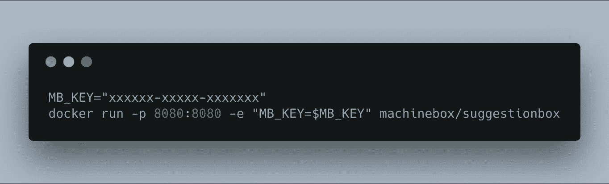
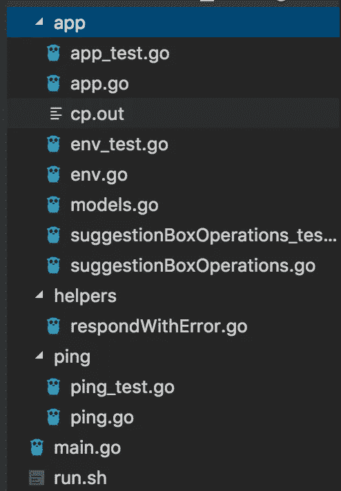
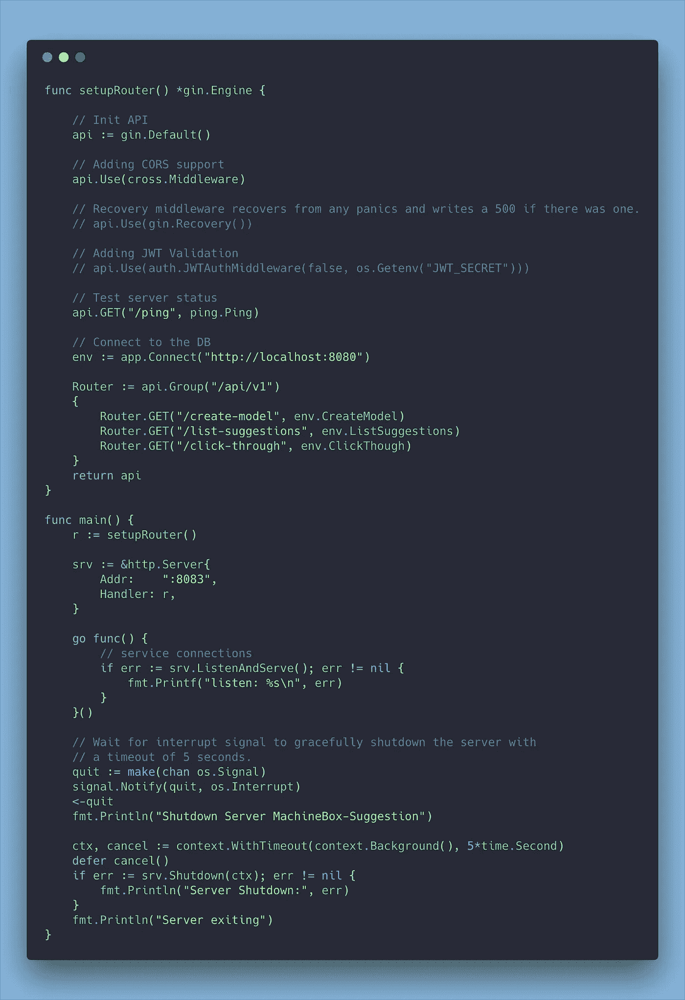
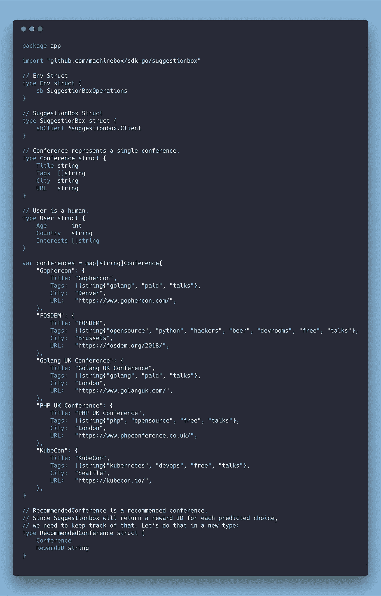
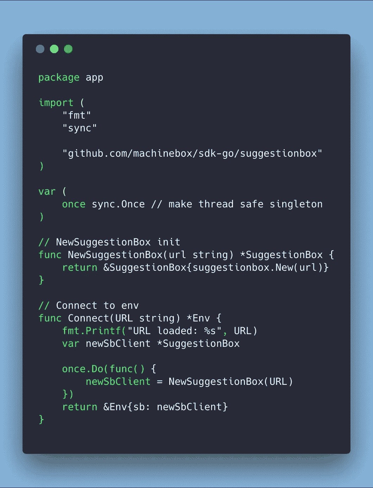
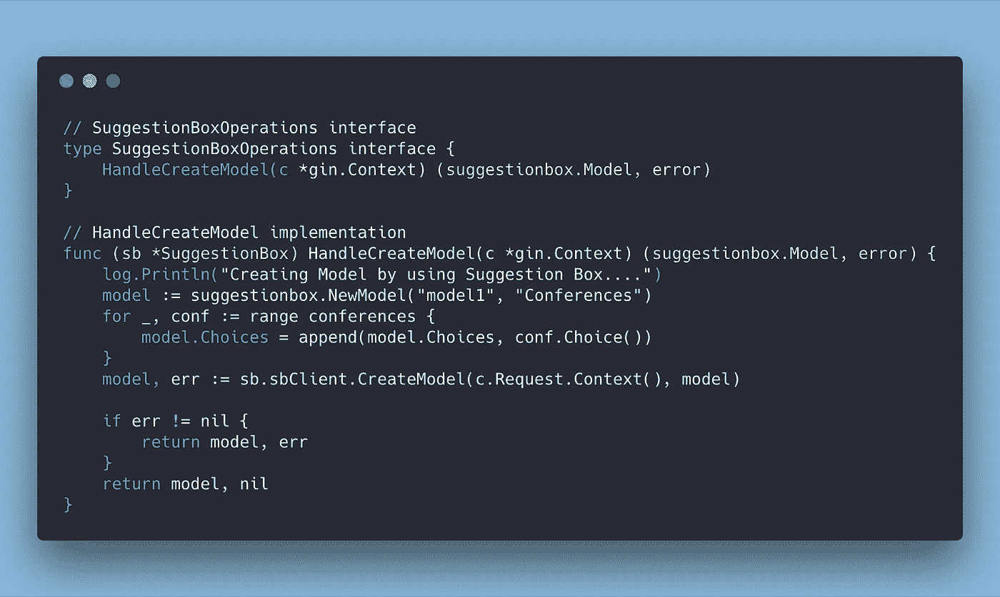
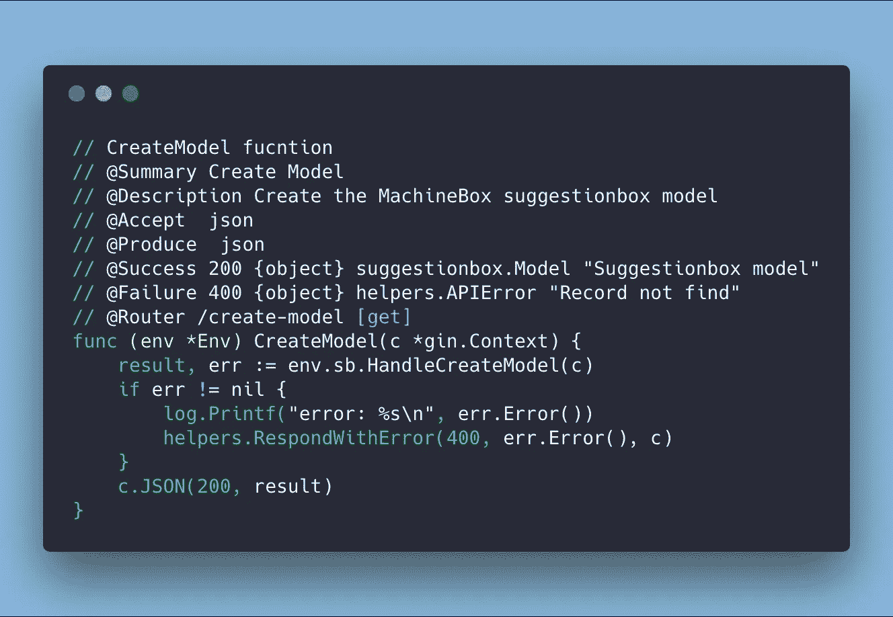
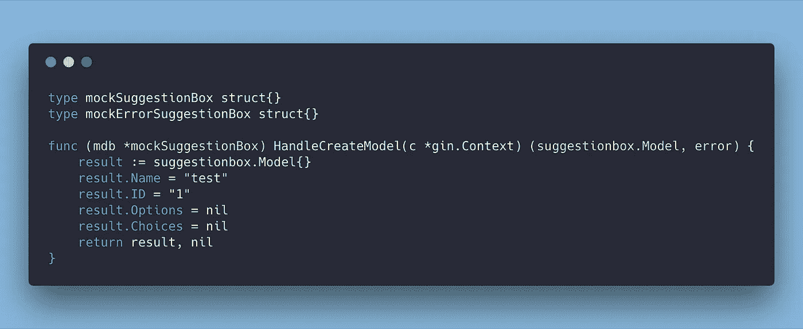
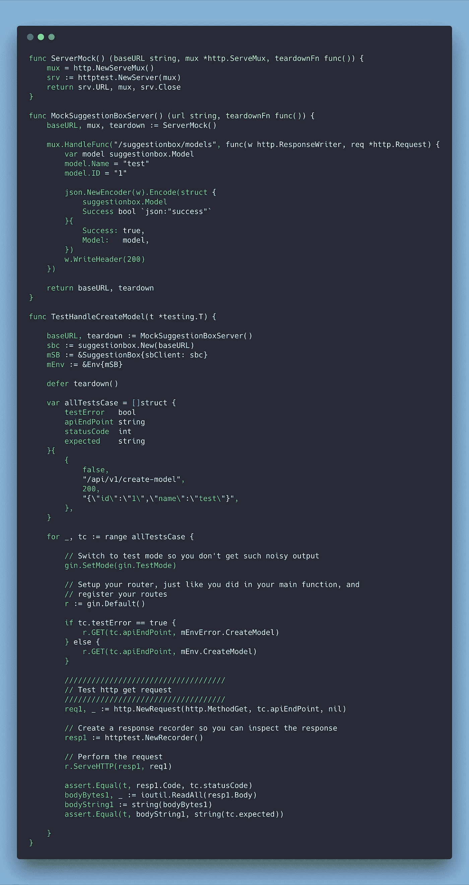
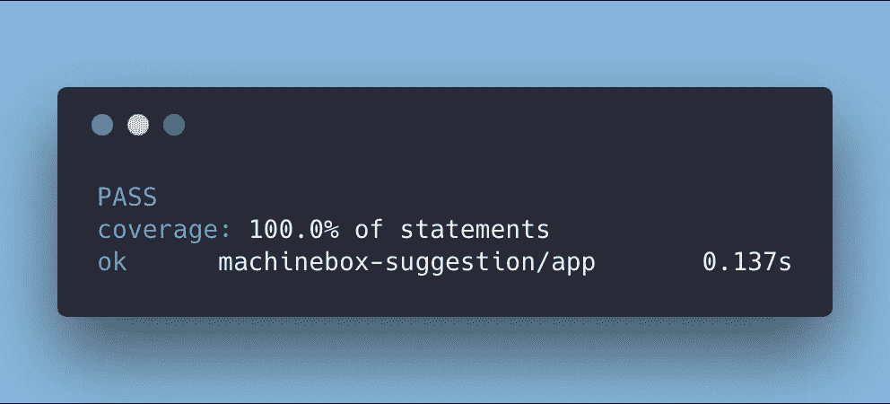

# 如何使用 Go 构建 100%单元测试覆盖率的 MachineBox.io API

> 原文：<https://levelup.gitconnected.com/how-to-build-a-machinebox-io-api-with-100-unit-testing-coverage-by-using-go-b9acbbb3e05>

我真的很喜欢 MachineBox.io 背后的想法，如果你不知道什么是 MachineBox，我推荐你读一读这篇由[机器盒子网站](https://medium.com/u/f25c357b8e4c#utm_source=blog&utm_medium=mat&utm_campaign=suggestcon)获得免费 MB_KEY。

*   准备好 run.sh，这将帮助你在一秒钟内启动 Machine Box 容器。

祝贺您，您的 MachineBox 建议 Box 环境已经准备就绪。:)

# 开始编码前

我要用杜松子酒([https://github.com/gin-gonic/gin](https://github.com/gin-gonic/gin))作为开胃菜。正如我的标题所提到的，我的目标是对我的应用程序进行 100%的单元测试。

> 我相信正确的代码结构可以帮助你的代码易于扩展和维护。

下面是我的代码结构:



这种结构的整个想法是保持应用程序的简单，通常只对一个特殊的需求做出响应，如数据库连接、Kafka pubsub 等，这是我构建微服务时的标准结构。

# 让我们开始，给我看看你的代码

1.  建立路由



使用 Gin-main . go 构建路由

2.让我们建立模型

> 你不知道你的数据，你不知道你想要解决的问题

因此，通过准备模型，你将更清楚如何组织你的代码，以及你将处理什么数据结构。



models.go

3.Go 接口总是帮助你单元测试更容易。

有些文章对此解释得很好。特别本作者[Nathan LeClaire](https://medium.com/u/f60b32d7ef37?source=post_page-----b9acbbb3e05--------------------------------)([https://nathanleclaire . com/blog/2015/10/10/10/interfaces-and-composition-for-effective-unit-testing-in-golang/](https://nathanleclaire.com/blog/2015/10/10/interfaces-and-composition-for-effective-unit-testing-in-golang/))



准备 Env — env.go



快照—接口实现

4.现在回到应用程序



snapshot-app . go 用于创建模型函数

# 单元测试的时间

> 测试你的代码和一开始写代码一样重要。为代码编写测试是确保质量和提高可靠性的好方法。



快照— app_test.go



snapshot-suggestionbox operations _ test . go

运行测试。

```
cd app
go test -coverprofile cp.out && go tool cover -html=cp.out
```



# 结论

编写 Go 代码很有趣。但是必须记住你的应用程序是如何扩展和易于维护的。因为我在银行和零售行业的运营背景，让我一直保持那个方向。感谢那些伟大的围棋大师，我可以继续向他们学习。