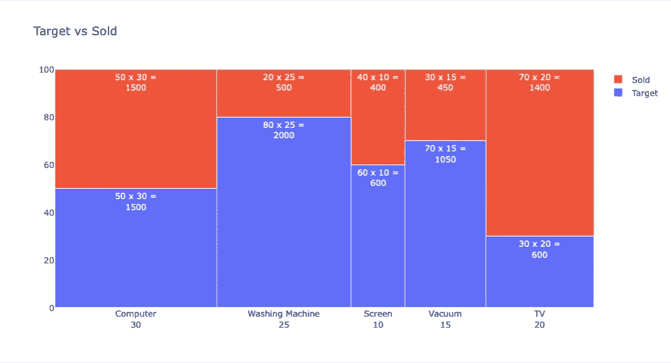

# 如何用 Python 构建 Marimekko 图表

> 原文：<https://levelup.gitconnected.com/how-to-build-a-marimekko-chart-in-python-7b26faf47889>

## 让我们创建一个 Marimekko 图表来可视化我们的数据

Marimekko 图表是一种二维堆叠条形图。我们在 y 轴上将分类数据分割为百分比，在 x 轴上有一个额外的数字维度。

这个名字来自芬兰纺织服装品牌 [Marimekko](https://en.wikipedia.org/wiki/Marimekko) 。

## 密码

我将使用 Plotly 库创建一个 Marimekko 图表。



Marimekko 图表。图片由作者提供。

## 说明

我有一个带有设备类型的标签列表。*宽度*数组用于 x 轴。在本例中，它们表示针对相应的设备类型销售了多少不同的型号。*数据*变量是一个字典，分别包含销售目标和实现情况。

```
labels = ["Computer","Washing Machine","Screen","Vacuum","TV"]
widths = np.array([30,25,10,15,20])data = {
    "Target": [50,80,60,70,30],
    "Sold": [50,20,40,30,70]
}
```

在 *add_trace* 方法中， *texttemplate* 决定了块中的文本。在我们的例子中，面积是百分比和宽度的乘积。

```
texttemplate="%{y} x %{width} =<br>%{customdata[1]}",
```

我们可以定义当鼠标悬停在每个数据块上时将显示什么。

```
hovertemplate="<br>".join([
            "Device: %{customdata[0]}",
            "Total Products: %{width}",
            "Percentage%: %{y}",
            "Area: %{customdata[1]}",
        ])
```

感谢阅读。如果您有任何问题或意见，请随时写信给我！

## 阅读更多内容…

[](https://python.plainenglish.io/create-a-network-graph-in-python-8829e0ec6741) [## 用 Python 创建网络图

### Python 中网络图的实现

python .平原英语. io](https://python.plainenglish.io/create-a-network-graph-in-python-8829e0ec6741) [](https://towardsdev.com/bar-charts-in-python-matplotlib-seaborn-pyplot-11469069a401) [## Python 中的条形图(Matplotlib、Seaborn、Plotly)

### 使用 3 个最流行的库创建条形图。

towardsdev.com](https://towardsdev.com/bar-charts-in-python-matplotlib-seaborn-pyplot-11469069a401) [](https://towardsdev.com/density-charts-in-python-seaborn-plotly-b330626be0a0) [## Python 中的密度图表(Seaborn，Plotly)

### 密度图在 Python 中的实现

towardsdev.com](https://towardsdev.com/density-charts-in-python-seaborn-plotly-b330626be0a0) 

## 参考

[https://en.wikipedia.org/wiki/Mosaic_plot](https://en.wikipedia.org/wiki/Mosaic_plot)

[https://en.wikipedia.org/wiki/Marimekko](https://en.wikipedia.org/wiki/Marimekko)

# 分级编码

感谢您成为我们社区的一员！更多内容见[升级编码出版物](https://levelup.gitconnected.com/)。
跟随:[推特](https://twitter.com/gitconnected)，[领英](https://www.linkedin.com/company/gitconnected)，[通迅](https://newsletter.levelup.dev/)
**升一级正在转型理工大招聘➡️** [**加入我们的人才集体**](https://jobs.levelup.dev/talent/welcome?referral=true)